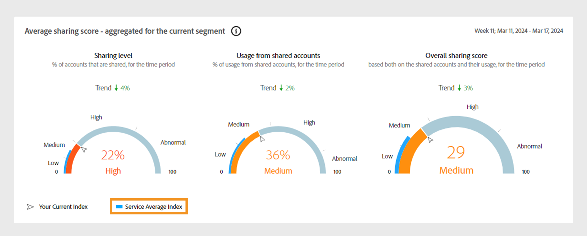
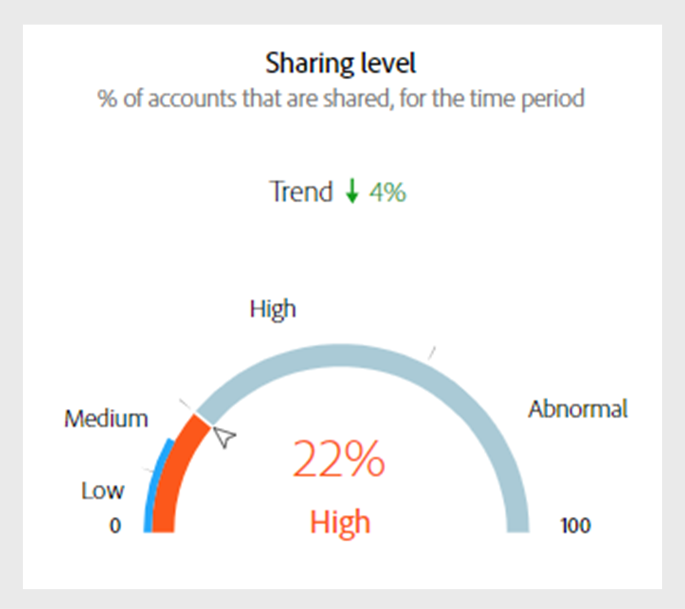
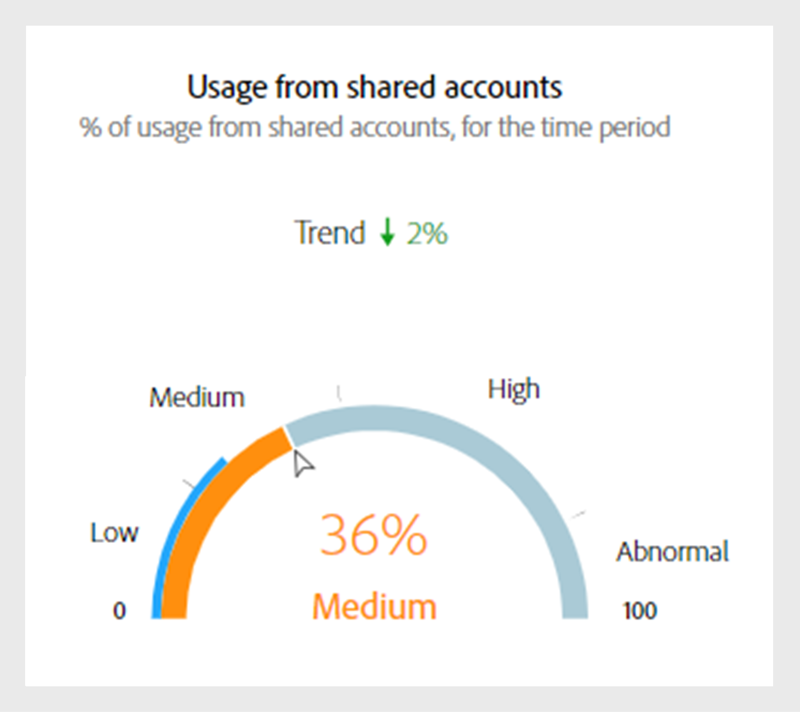
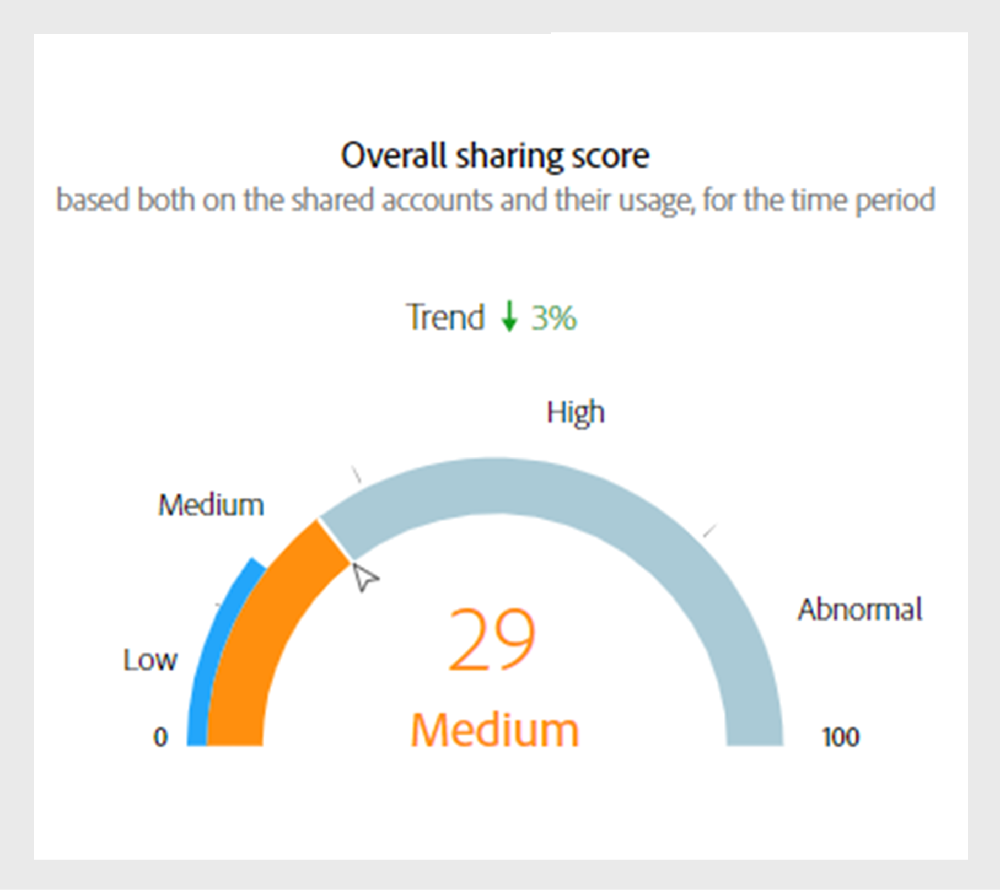
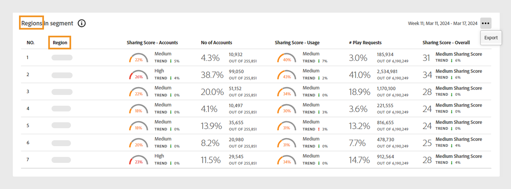
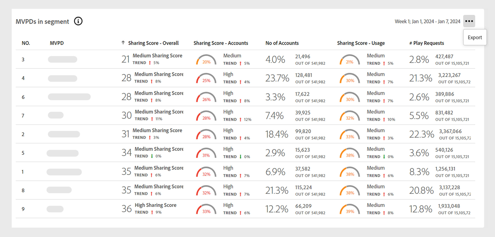
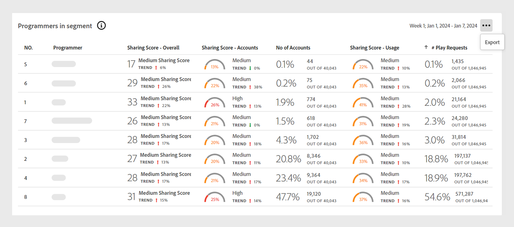
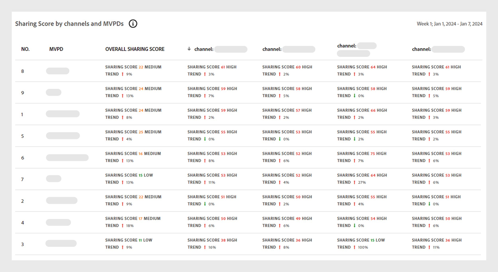

# 儀表板上的資料面板 {#data-panels}

選取區段和時間間隔後，儀表板會顯示各種資料面板、表格和圖形，以反映所選區段內共用活動的高階檢視。

下表概述不同[版本](/help/accountiq/versions-aiq.md)的Account IQ中資料面板的可用性和差異：

| 資料面板 | D2C服務 | TVE程式設計師 | TVE MVPD |
|---|---|---|---|
| [目前區段彙總的平均共用分數](#aggregated-sharing) | 可用且一致 | 可用且一致 | 可用且一致 |
| 區段[&#128279;](#video-categories-segment)中的視訊類別 | 可微幅調整 | 可微幅調整 | 可微幅調整 |
| [依據管道和MVPD的共用分數](#sharin-score-by-channels-and-mvpds) | 無法使用 | 可用 | 無法使用 |
| [帳戶共用機率](#accounts-sharing-probability) | 可用且一致 | 可用且一致 | 可用且一致 |
| [共用機率層級的帳戶數目和使用量](#number-of-accounts-usage-sharing-probability) | 可用且一致 | 可用且一致 | 可用且一致 |

## 目前區段彙總的平均共用分數 {#aggregated-sharing}

「平均共用分數」面板提供最上層讀數，以總結帳戶和串流數量方面共用的數量和影響。

這些量度可協助您瞭解訂閱者共用認證的數量（從低、中、高到異常），以帳戶和消費為測量基準。

*目前區段的平均共用分數面板彙總*

>[!NOTE]
>
> 目前區段&#x200B;**彙總的**&#x200B;平均共用分數中的藍色指標，與TV Everywhere相比，用於D2C服務的用途不同。 對於D2C服務，它代表如前一個影像所示的&#x200B;**服務平均索引**。 如果您以程式設計師或MVPD的身份登入，此標籤會變更為&#x200B;**產業平均索引**。

以下量度是「平均共用分數」面板的元件。

### 共用層級 {#sharing-level}

共用層次量測計會顯示所選時間間隔內定義區段內所有共用訂戶帳戶的百分比。

此百分比是根據針對區段中的每個帳戶所計算的平均共用機率來計算。 此計算包括在所選時間間隔內已串流至少一次的帳戶。

趨勢指標顯示測量結果值相對於上一個時間間隔的百分比變化。

{width="350" align="left"}

*共用層級*

### 來自共用帳戶的使用情況 {#usage-from-shared-accounts}

此量規會指出已定義區段和期間之所有訂閱者帳戶中，共用帳戶的使用百分比。 這些範圍稱為低、Medium、高和異常，是根據業界平均值。

趨勢指標，可描述共用帳戶的使用量與上一個時間間隔相比上升或下降。

{width="350" align="left"}

*共用帳戶的使用狀況*

### 整體共用分數 {#overall-sharing-score}

整體共用分數是共用分數的組合，包括「共用層級」和「來自共用帳戶的使用情況」。

它提供的分數會反映共用的整體影響。 其用途類似於信用分數，以單一數字彙總共用層級。 但在此情況下，分數越高表示共用層級越高。

{width="350" align="left"}

*整體共用分數*

## 區段中的影片類別 {#video-categories-segment}

您可以選取欄標題，以排序所有Account IQ版本中的資料。

+++D2C服務：區段中的區域

當您以D2C服務登入時，區段&#x200B;**表格中的**&#x200B;區域會提供目前區段中[視訊類別](/help/accountiq/product-concepts.md#video-category-def)不同彙總共用分數的比較檢視。

*依區段中的地區共用分數*

>[!NOTE]
>
> 上一張影像中顯示的[視訊類別](product-concepts.md#video-category-def) （例如區段中的&#x200B;**區域**）只是一個範例。 登入Account IQ時，此面板會顯示貴公司的特定影片類別。

選取[匯出&#x200B;**&#x200B;**]將資料下載為.csv檔。 瞭解[如何匯出資料面板報告](/help/accountiq/export-reports.md)。

+++

+++程式設計師：區段中的MVPD

當您以程式設計師身分登入時，區段&#x200B;**表格中的** MVPD會提供目前區段中MVPD不同彙總共用分數的比較檢視。

選取[匯出&#x200B;**&#x200B;**]將資料下載為.csv檔。 瞭解[如何匯出資料面板報告](/help/accountiq/export-reports.md)。

+++

+++MVPDs：區段中的程式設計師

當您以MVPD身分登入時，區段&#x200B;**表格中的**&#x200B;程式設計師會針對目前區段中的程式設計師提供不同彙總共用分數的比較檢視。

選取欄標題以排序資料。

*由程式設計師在區段*&#x200B;分享分數

選取[匯出&#x200B;**&#x200B;**]將資料下載為.csv檔。 瞭解[如何匯出資料面板報告](/help/accountiq/export-reports.md)。

+++

## 依管道和MVPD分享分數  {#sharin-score-by-channels-and-mvpds}

當您以「程式設計人員」身分登入時，此表格會提供目前區段中MVPD之所選管道之共用分數的比較檢視。

選取欄標題以排序資料。

*依管道和MVPD共用分數*

## 帳戶共用機率 {#accounts-sharing-probability}

此圖表將帳戶劃分成共用機率五分位數的範圍，範圍從極低(0-20%)到極高(80-100%)。 深入瞭解[帳戶共用機率](#accounts-sharing-probability)的範圍。

>[!NOTE]
>
>長條圖使用對數刻度。

*不同共用機率範圍內的訂閱者帳號數目和百分比*

## 透過共用機率層級的帳戶和使用數量 {#number-of-accounts-usage-sharing-probability}

此面板提供表格檢視的帳戶，這些帳戶已分割為共用機率五分位數的範圍，範圍從極低(0-20%)到極高(80-100%)，每個五分位數的關聯使用方式來自共用帳戶。 深入瞭解[帳戶共用機率](#accounts-sharing-probability)的範圍。

*落入各種機率範圍的帳戶、趨勢和使用方式數目*

選取[匯出&#x200B;**&#x200B;**]將資料下載為.csv檔。 瞭解[如何匯出資料面板報告](/help/accountiq/export-reports.md)。
