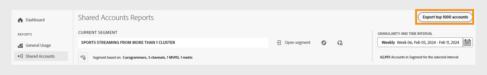
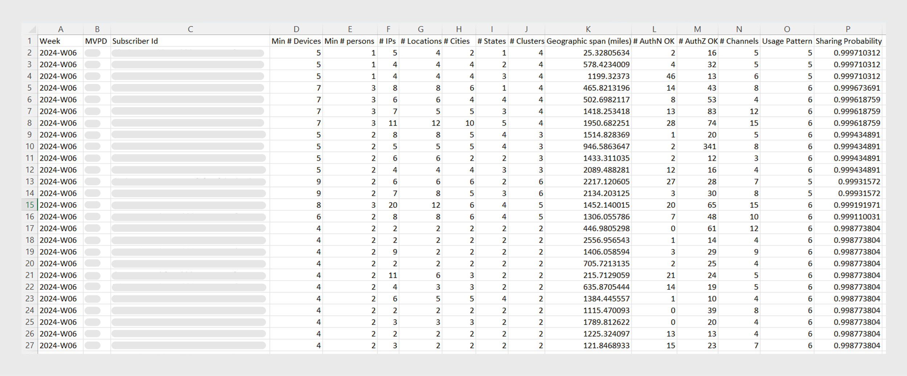

# 匯出共用分數較高的帳戶的資訊 {#export-account-info-high-score}

[!UICONTROL Account IQ] 可讓您根據前1000個訂閱者帳戶的帳戶共用詳細資訊 [共用機率](/help/accountiq/product-concepts.md#account-sharing-probability-def). 您可以匯出目前帳戶的共用資訊 [區段](/help/accountiq/product-concepts.md#segment-def) 和 [指定的時間間隔](/help/accountiq/product-concepts.md#time-interval-def) 於 [共用帳戶報表](/help/accountiq/shared-acc-reports.md) 頁面。

請依照下列步驟，匯出特定節段之訂戶科目的科目共用資訊。

1. 使用您的憑證登入。
1. 導覽至 **共用帳戶** 標籤下的 **報表** 區段。
1. 從區段和時間間隔面板中選取所需的區段和時間間隔。 瞭解 [如何選取區段和時間間隔](segments-timeinterval.md).

   如有需要，請參閱 [建立區段](work-with-segments.md#create-new-segment) 或 [編輯區段](work-with-segments.md#edit-segment).

1. 選取 **[!UICONTROL Export top 1000 accounts]** 位於區段和時間間隔面板的右上角。

   

   *選取匯出前1000個帳戶選項*

檔案會自動以.csv格式下載至您的本機電腦。

此檔案包含前1000個帳戶的資料，其根據為目前區段中訂閱者帳戶的共用機率，依遞減順序排列。

以下是匯出的.csv檔案範例。

*以.csv檔案匯出資料*

## 匯出報告中的欄 {#columns-in-export}

**周/月**

此日期內選取的周或月 **[!UICONTROL Granularity and Time Interval]** 區段選取器中的選項。

**MVPD**

如果您是程式設計人員，欄會顯示帳戶訂閱的經銷商。

>[!NOTE]
>
> 此 **MVPD** 欄只適用於所有的電視版本。

**訂閱者ID**

特定帳戶的唯一識別碼。

**裝置數下限**

使用者主動串流內容的最小裝置數量。

>[!NOTE]
>
>串流內容的實際裝置數大於為特定帳戶指定的最小裝置數。

**人員最小數量**

使用這些裝置主動串流內容的個人最小數量。

>[!NOTE]
>
>串流內容的個人實際人數大於指派給特定帳戶的最小人數。

**[!UICONTROL # IPs]**

從中對內容進行串流的IP位址數量。

**[!UICONTROL # Locations]**

內容串流來源的位置數（根據郵遞區號）。

**[!UICONTROL # Cities]**

已發生串流活動的城市數。

**[!UICONTROL # States]**

串流活動發生的狀態數。

**[!UICONTROL # Clusters]**

不同數量 [叢集](/help/accountiq/product-concepts.md#cluster-def) 已進行串流的位置。

**[!UICONTROL Geographic span (miles)]**

和帳戶相關聯的串流位置之間的最大距離。

**[!UICONTROL # AuthN OK]**

使用者在指定期間使用該帳戶登入的次數。

>[!NOTE]
>
> 有些D2C服務可能看不到 **[!UICONTROL # AuthN OK]** 資料，因為它可能未包含在其公司的資料中。

**[!UICONTROL # AuthZ OK]**

MVPD授權資料流或授予該帳戶內容存取權的次數。

>[!NOTE]
>
>**[!UICONTROL # AuthZ OK]** 不適用於D2C服務。

>[!NOTE]
>
>對於所有的電視節目， **[!UICONTROL # AuthZ OK]** 與以下專案的數量相關： **[#播放要求](/help/accountiq/product-concepts.md##play-requests-def)**. 「 」將一律小於 **[!UICONTROL # Play Requests]** 因為Adobe通常會從MVPD快取授權約24小時。

**[!UICONTROL # Play Requests]**

指定時段內發生的實際串流數目。

>[!NOTE]
>
>此 [#播放要求](/help/accountiq/product-concepts.md##play-requests-def) TV Everywhere MVPD版本中無法使用欄。

**[!UICONTROL # Channels]**

帳戶在指定期間內觀看的管道總數。

>[!NOTE]
>
> D2C服務 **[!UICONTROL # Channels]** 相當於 **[!UICONTROL # Video categories]**.

>[!NOTE]
>
>對於隨處可見的電視，其中包含可能不屬於登入程式設計師的頻道。 此帳戶號碼包含您在指定期間存取的頻道和其他頻道。

**使用模式**

這些欄中的值會作為識別碼，對應至我們用來分類所有使用者帳戶的14個模式之一。

<table>
    <tbody>
      <tr>
        <th style="width:10%">ID</th>
        <th style="width:30%">使用模式</th>
      </tr>
      <tr>
        <td>1</td>
        <td>一般使用者</td>
      </tr>
      <tr>
        <td>2</td>
        <td>旅行者或通勤者</td>
      </tr>
      <tr>
        <td>3</td>
        <td>大家庭</td>
      </tr>
      <tr>
        <td>4</td>
        <td>親朋好友</td>
      </tr>
      </tr>
         <td>5和8</td>
         <td>社交群組共用</td>
      </tr>
      </tr>
         <td>6</td>
         <td>一大群朋友</td>
      </tr>
      </tr>
         <td>7</td>
         <td>同時串流</td>
      </tr>
      </tr>
         <td>9</td>
         <td>社群共用</td>
      </tr>
      </tr>
         <td>10和11</td>
         <td>不確定的行為</td>
      </tr>
      </tr>
         <td>12</td>
         <td>小型家庭</td>
      </tr>
      </tr>
         <td>13</td>
         <td>第二個首頁 </td>
      </tr>
      </tr>
         <td>14</td>
         <td>使用方式異常</td>
      </tr>
    </tbody>
  </table>

*使用模式匯出的.csv對應中的使用模式識別碼*

**共用機率**

特定帳戶共用其認證的可能性。

>[!NOTE]
>
> 所選區段中所有科目的平均共用機率用於計算 [共用層級](/help/accountiq/data-panels.md#sharing-level) 的 [平均共用分數](/help/accountiq/data-panels.md#aggregated-sharing).
