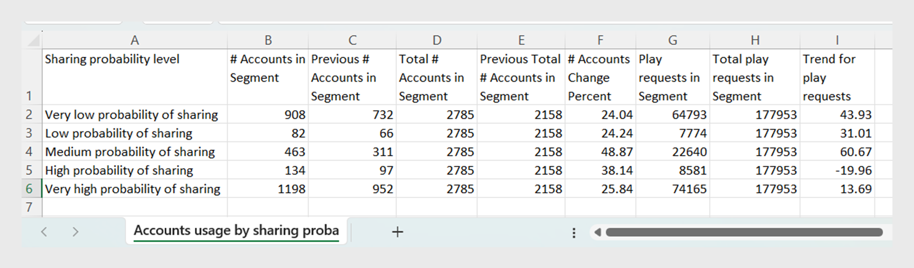

# 匯出資料面板報告 {#export-reports}

中的儀表板 [!UICONTROL Account IQ] 顯示表格與圖形，用以分析所選區段中訂戶帳戶的證明資料共用統計資料。 除了檢視共用模式、評分和帳戶使用量度之外，您也可以從這些表格匯出報表。

您可以匯出下列資料面板報表：

* [區段中的影片類別](data-panels.md#video-categories-segment)
* [透過共用機率層級的帳戶和使用數量](data-panels.md#number-of-accounts-usage-sharing-probability)

請依照步驟匯出特定區段的資料面板報表。

1. 使用您的憑證登入。
1. 從區段和時間間隔面板中選取所需的區段和時間間隔。 檢視 [區段和時間間隔](segments-timeinterval.md#segment-selection) 以取得詳細資訊。

   如有需要，請參閱 [建立區段](work-with-segments.md#create-new-segment) 或 [編輯區段](work-with-segments.md#edit-segment).

1. 導覽至您要匯出的資料面板。

   例如，請考慮 **透過共用機率層級的帳戶和使用數量** 面板，如下所示。

   {align="left"}

   *匯出共用機率層級的帳戶數目與使用狀況*

1. 選取 **[!UICONTROL Export]** 位於資料面板的右上角。

檔案會自動下載到您的本機電腦。 系統會將機率層級共用為.csv，以儲存帳戶數量和使用情況的資料。

以下是匯出的.csv檔案範例。 檔案由顯示在所選資料面板上的欄組成。

{align="left"}

*匯出的報告*
