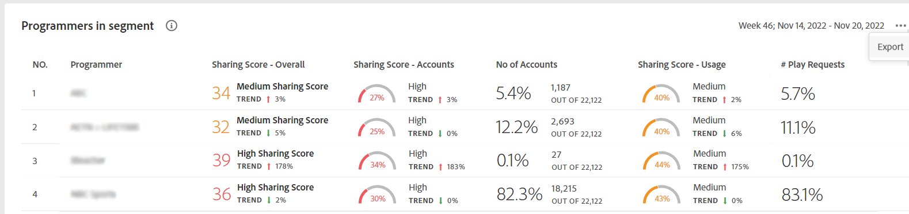

# 匯出MVPD和選定程式設計員的量度 {#export-metric}

中的儀表板 [!UICONTROL Account IQ] 顯示所選區段中訂戶帳戶之證明資料共用統計資料的表格與圖形。 除了檢視共用模式與分數之外，您也可以從這些表格匯出所選區段中MVPD與管道之訂閱者的帳戶使用量度與共用分數。

若要匯出MVPD和選取的程式設計人員的測量結果，在您以授權MVPD使用者身分登入後：

1. 請依照中的步驟定義所需的區段 [如何定義區段及選取時間範圍](/help/accountiq/howto-select-segment-timeframe.md) 評估來源： [區段和時間範圍](/help/accountiq/segments-timeframe.md) 面板。

1. 移至下列其中一個面板：

   * [!UICONTROL Programmers in segment]
     

   * [!UICONTROL Number of accounts and usage by sharing probability level]

     

1. 選取 **[!UICONTROL Export]** 面板右上角可用的選項。

資料會匯出為CSV格式，而檔案則會下載到您裝置上的本機。 您可以使用所需的CSV檢視器和編輯器來開啟匯出的報表。

* 區段中的程式設計師

  

* 透過共用機率層級的帳戶和使用數量

  
