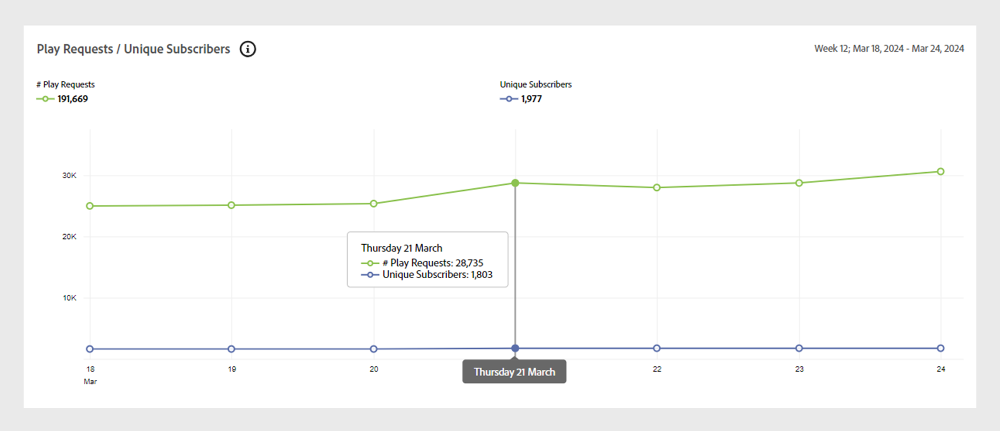
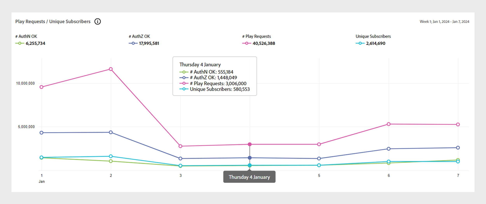
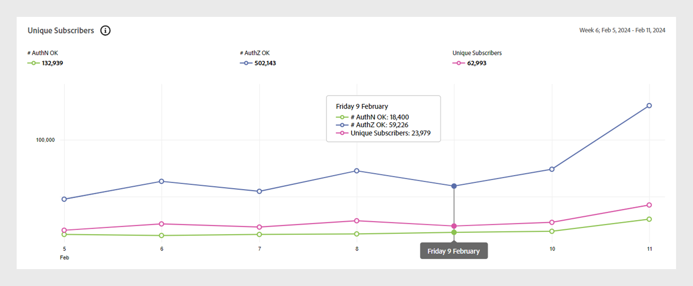
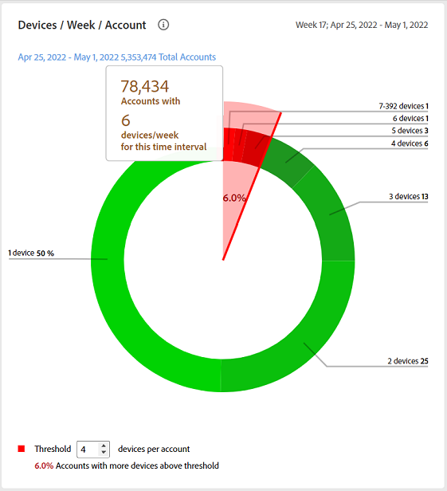

# [!UICONTROL General usage]個報告 {#general-usage-reports}

[!UICONTROL Account IQ]報告是基本的分析工具，可讓您深入分析資料，以隔離[同類群組](/help/accountiq/product-concepts.md#segmet-def)、識別異常，並建置對您帳戶特性的瞭解。

[!UICONTROL General usage]報表頁面提供工具，可根據使用中的帳戶裝置數、偵測到的IP及其各自的郵遞區號來分割子群組量度。

這些報表都是根據從[區段和時間間隔](/help/accountiq/segments-timeinterval.md)面板中選取的目前區段。 您可以在[快照概述 — 帳戶超過臨界值](#snapshot-overview)面板中指定（裝置數目、IP數目和郵遞區號數目）臨界值，以微調您的選取範圍並進一步縮小選取範圍。

## 播放請求和不重複訂閱者 {#playreq-uniquesubs}

這裡的折線圖可讓您檢視一段時間內值的變化，例如所定義區段在選定時間間隔內的「播放要求」和「不重複訂閱者」。

+++ D2C服務：播放要求/不重複訂閱者

D2C服務的&#x200B;*播放要求/不重複訂閱者*

+++

+++程式設計師：播放要求/不重複訂閱者

*程式設計師的播放要求/不重複訂閱者*

+++

+++MVPDs：不重複訂閱者

MVPD的&#x200B;*不重複訂閱者*

+++

 

X軸代表以目前間隔為基礎的時間，而Y軸代表該期間的基本訂戶活動測量結果。 折線圖可協助您視覺化及比較目前區段中訂閱者的活動。 根據Account IQ的版本，這些量度包括：

* **AuthN OK**：成功的驗證數目。 深入瞭解[AuthN OK](/help/accountiq/product-concepts.md#authn-ok-def)。

* **AuthZ OK**：成功的授權數目。 深入瞭解[AuthZ OK](/help/accountiq/product-concepts.md#authz-ok-def)。

* **播放要求**：播放要求數目。 深入瞭解[播放要求](/help/accountiq/product-concepts.md#play-requests-def)。

* **不重複訂閱者**：成功的不重複訂閱者數目。 深入瞭解[不重複訂閱者](/help/accountiq/product-concepts.md#unique-subscriber-def)。

>[!NOTE]
>
>量度的可用性會因Account IQ的版本而異。

## 快照概述 — 帳戶超過臨界值 {#snapshot-overview}

使用此額外的篩選器微調您的分析和報告，以設定各種使用臨界值。 選取區段後，您也可以使用下列篩選器來進一步分析訂閱者行為：

* 裝置數量臨界值

* IP數量臨界值

* 郵遞區號數量臨界值

當您根據選取的臨界值](#account-segments-basedon-segments)面板更新[帳戶區段中的臨界值時，您將在下列位置檢視效果：

* [每個帳戶的每週（或每月）裝置](#devices-week-account)

* [每個帳戶的每週（或每月）位置](#locations-week-account)

* [每個帳戶每週（或每月）的IP](#ip-week-account)

* [科目節段的歷史檢視](#account-segment-historical-view)

>[!NOTE]
>
>每個臨界值都會設定為預設值4。 也就是說，「一般使用方式」頁面會針對使用超過四個裝置的訂閱者顯示分析，這些裝置使用來自四個以上不同IP位址、*和*&#x200B;四個以上不同郵遞區號的內容。

### 以選取的臨界值為基準的科目節段 {#account-segments-basedon-segments}

以選取的臨界值為基礎的&#x200B;**帳戶區段**&#x200B;面板提供您設定裝置數、IP數和郵遞區號數臨界值（介於1到10之間）的選項。

圖表顯示以下內容：

* 訂閱者帳戶的絕對數量。

* 在區段中，使用臨界值所指定之郵遞區號數目中裝置數目、IP數目以及總訂戶帳戶中的百分比。

## 每個帳戶的每週（或每月）裝置 {#devices-week-account}

此長條圖提供訂閱者如何使用其裝置存取內容方面的使用行為分析。

X軸繪製帳戶數，Y軸繪製裝置數。 它會根據您為每個帳戶設定之裝置數的臨界值，標籤一週期間內使用特定數量裝置之內容的訂閱者帳戶的絕對數量。

當游標停留在橫條上（取決於裝置的數量）時，會出現一個標籤，提供一週內使用這些裝置串流頻道內容的訂閱者帳戶數量（以及區段中的訂閱者帳戶總數百分比）的相關資訊。

此圖表也標籤下列專案：

* 紅線表示您設定的臨界值。

* 綠色線條，標示訂閱者帳戶每週（或每月）使用的不同裝置平均數目。

環形圖提供設定臨界值以上之目前區段中，帳戶使用之裝置的替代檢視表。

## 每個帳戶的每週（或每月）位置 {#locations-week-account}

類似於每個帳戶](#devices-week-account)每週（或每月） [個裝置的量度，每個帳戶的每週（或每月）位置量度可讓您從不同位置分析訂閱者帳戶的使用情況。 X軸繪製「帳戶數」，Y軸繪製「位置數」。

設定好位置數量的臨界值後，您就可以使用圖表來識別下列專案：

* 一週內從（特定） x個位置消費內容的訂閱者人數（和百分比）。

* 從超過臨界值的位置檢視內容的總訂閱者帳戶百分比。

* 比較每週平均值（帳戶的不同位置數量）與臨界值。

## 每個帳戶每週（或每月）的IP {#ip-week-account}

類似於每個帳戶&#x200B;**每週**&#x200B;個位置數的量度，每個帳戶每週&#x200B;**個IP數目**&#x200B;量度可讓您評估目前區段的串流來源的變更量。

x軸會繪製「帳戶數」，y軸會繪製「IP數」。

定義區段並設定IP數目的臨界值後，您就可以使用圖表來識別下列專案：

* 一週內使用特定數量IP之內容的訂閱者數量（和百分比）。

* 從超過臨界值的IP位址檢視內容的總訂閱者帳戶百分比。

* 比較每週平均值（帳戶的不同IP數量）與臨界值。

## 科目節段 — 歷史檢視表 {#account-segment-historical-view}

「歷史檢視」長條圖可協助您比較不同時間間隔的使用狀況測量結果。 此外，它也會集體繪製各種使用量度，例如每個帳戶](#devices-week-account)每週（或每月）的[個裝置、每個帳戶](#locations-week-account)每週（或每月）的[個位置，以及每個帳戶](#ip-week-account)每週（或每月）的[個IP。

* x軸繪製時間間隔，y軸繪制訂戶帳戶、裝置、位置和IP的數目。

* 橙色長條代表不同時間間隔中的區段。

* 折線圖會根據臨界值，繪製時間間隔內每個帳戶](#devices-week-account)每週（或每月）的[裝置、每個帳戶](#locations-week-account)每週（或每月）的[位置，以及每個帳戶](#ip-week-account)每週（或每月）的[IP值的變更。

* 藍色長條表示在某個時間間隔內整個產業中的作用中訂閱者總數。

* 您可以選取特定的圖例，它們可以協助您縮放圖形。

