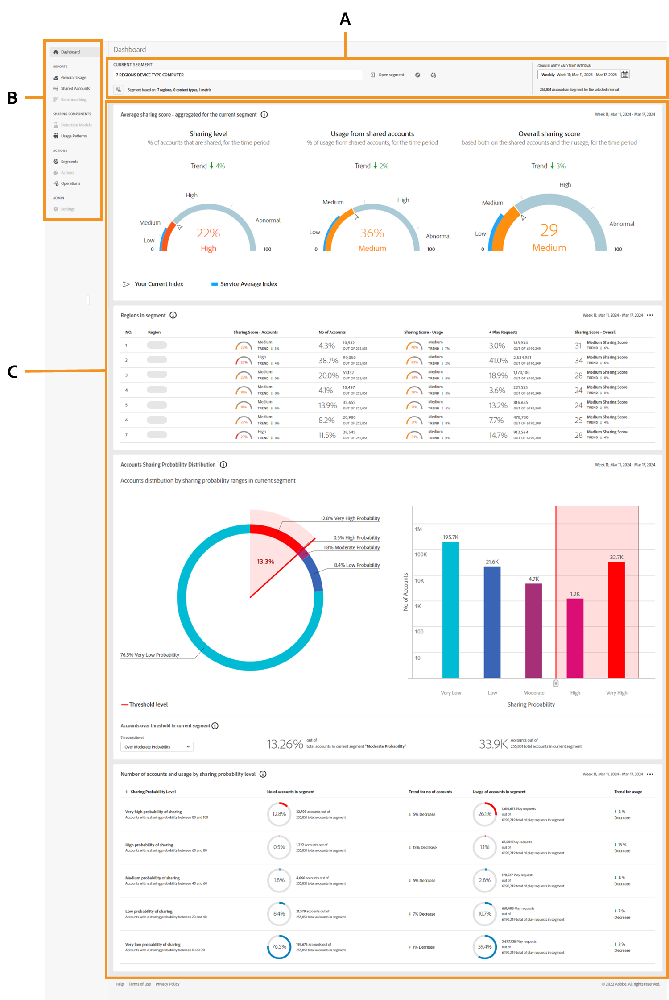
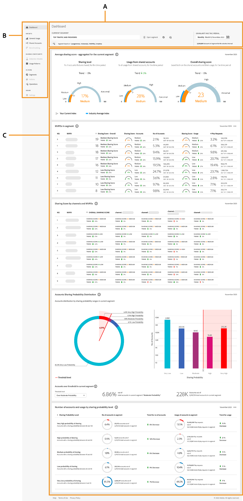
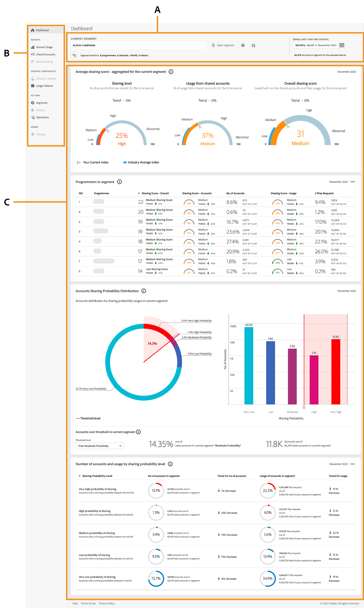

# 控制面板簡介 {#introduction-dashboard}

控制面板會摘要並彙總圖表與報表集合中的資料，這些圖表與報表旨在提供帳戶共用範圍與影響的概觀。 它提供包含[!UICONTROL Account IQ]的主要報告和量度的單一頁面。

>[!NOTE]
>
>D2C服務、程式設計人員和MVPD儀表板上的大多數資料面板都是相同的。 不過，某些資料面板可能因每個版本而有所不同。

+++D2C服務：儀表板

適用於D2C服務的Account IQ {align="left"}

D2C服務的&#x200B;*儀表板*

**A.**&#x200B;區段和時間間隔面板&#x200B;**B.**&#x200B;頁面導覽&#x200B;**C.**&#x200B;資料面板

+++

+++程式設計師：控制面板

程式設計師的Account IQ {align="left"}

程式設計師的&#x200B;*儀表板*

**A.**&#x200B;區段和時間間隔面板&#x200B;**B.**&#x200B;頁面導覽&#x200B;**C.**&#x200B;資料面板

+++

+++MVPDs：控制面板

MVPD的儀表板與程式設計人員的儀表板稍有不同。

MVPD的[!UICONTROL Account IQ]的{align="left"}

MVPD的&#x200B;*儀表板*

**A.**&#x200B;區段和時間間隔面板&#x200B;**B.**&#x200B;頁面導覽&#x200B;**C.**&#x200B;資料面板

+++

D2C服務、程式設計人員和MVPD的控制面板包括：

* **區段和時間間隔面板**：此面板可讓您選取區段和時間間隔，以產生帳戶共用報表，並提供所選區段的摘要。 如需詳細資訊，請檢視[區段和時間間隔](/help/accountiq/segments-timeinterval.md)。

* **頁面導覽**：這些標籤可讓您導覽並探索Account IQ的各種區段和頁面。

* **資料面板**：面板會透過表格和圖形來顯示帳戶共用報表，並提供直接將報表匯出至本機裝置的選項。 檢視[資料面板](/help/accountiq/data-panels.md)和[匯出資料面板報告](/help/accountiq/export-reports.md)以取得詳細資訊。
