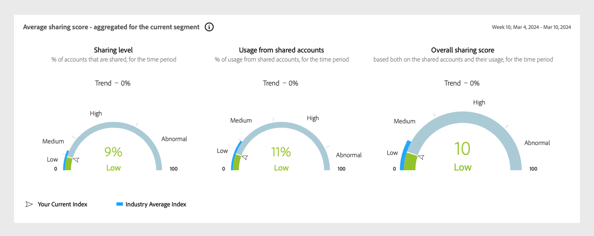

# 適用於各處電視程式設計師的隔離模式MVPD {#isolation-mode-tve}

>[!IMPORTANT]
>
> 隔離模式MVPD限制僅適用於TV Everywhere程式設計師。

在隔離模式中，MVPD （例如Xfinity）會根據訂閱者與特定程式設計人員的互動，一致地識別跨裝置的訂閱者。 在標準模式中，MVPD會一致地識別跨裝置的訂閱者，無論相關程式設計師為何。

範例如下：

*隔離模式MVPD識別四個不同的訂閱者，而不是兩個*

* 如果隔離模式MVPD的訂閱者B （例如Xfinity）使用相同裝置存取由兩個不同程式設計師提供的內容，則MVPD會將不同的識別碼與兩個不同的存取嘗試建立關聯。 似乎有兩個不同的訂閱者存取程式設計師的內容（圖中的L和M）。

* 對於標準MVPD，如果訂閱者B存取由兩個不同程式設計師提供的內容，則MVPD將會為兩個存取嘗試關聯單一存取識別碼。

* 隔離模式中的MVPD （例如Xfinity）無法一致地識別訂閱者，即使訂閱者跨不同的程式設計人員使用相同的裝置亦然。

為了防止由於存取不同的程式設計人員而將單一訂閱者計為多個訂閱者而造成資料扭曲，隔離模式會將有關程式設計人員的報告活動限製為僅針對其應用程式。

例如，程式設計師L只能根據身分W和Y的活動檢視資料，而忽略上一個影像中的身分X和Z。

>[!IMPORTANT]
>
> 缺點是，由於與L以外的任何程式設計人員的活動，程式設計人員L無法分享所收集到的關於訂閱者A和B的資訊。

在隔離模式中，共用分數和相關量度只會從從所選程式設計師和管道的應用程式串流的裝置活動進行計算。 系統會從目前所選管道上的串流開始計算共用分數和機率。

當選取的區段包含隔離模式MVPD時，系統會自動以隔離模式運作，當從不同程式設計人員串流時，MVPD會將單一訂閱者識別為多個訂閱者。 這些區段的所有圖形和圖表都會反映此行為變更的結果。

>[!IMPORTANT]
>
> 隔離模式中的行為與標準模式不相容，隔離模式MVPD不能與其他MVPD混合，反之亦然。

若要建立以隔離模式分析的區段，請將隔離模式MVPD （例如&#x200B;**Xfinity**）拖曳至區段定義的MVPD區段。

>[!NOTE]
>
> 因為隔離模式MVPD不能與其他MVPD混合，所以區段定義的MVPD區段不允許將另一個MVPD拖曳到那裡。

隔離模式中的&#x200B;*Xfinity選項*

>[!IMPORTANT]
>
> 在針對所有程式設計師的應用程式串流進行測量時，帳戶共用更為相關。 當處於隔離模式時，預期較低的&#x200B;**共用分數**&#x200B;以及量度中的一些變數。

*在隔離模式下共用機率量測計*

上述儀表盤顯示所有帳戶中只有9%已共用，而且其中只有11%的內容被使用。 由於分數自然會較低，隔離模式中的結果應與標準模式中的結果有不同的解譯。
