# 作業 {#operations-tab-next-steps}

當您使用[!DNL Account IQ]分析來分析訂閱者的使用模式，並識別所選區段的密碼共用執行個體後，您就可以透過[!DNL Account IQ]中稱為作業的重點程式採取目標動作。

**操作**&#x200B;可讓您有效地追蹤和管理帳戶群組的認證共用，以減少密碼共用並增強重要訂閱者的體驗。

您可以將動作套用至定義的[區段](/help/accountiq/product-concepts.md#segment-def)，以處理特定[時間間隔](/help/accountiq/product-concepts.md#time-interval-def)內的密碼共用問題，並排程作業在未來日期執行。 這些動作包括限制以最小化密碼共用，或簡化非共用帳戶的限制。

使用操作時，您不僅可以指定動作及其範圍，還可以評估其結果。

透過評估結果，您可以調整策略以最佳化效果，無論透過轉換借款人、減少認證共用還是減少流失。

您可以透過操作執行各種功能：

* [檢視作業報表](#operation-reports)
* [建立新作業](#create-new-operation)
* [停止操作](#stop-operation)

## 檢視作業報表 {#operation-reports}

您可以透過作業報告來檢閱作業的效果。 若要檢視作業報告，請選取Account IQ應用程式左側面板中&#x200B;**動作**&#x200B;下的&#x200B;**作業**&#x200B;標籤。 此時會顯示系統中可用的操作清單。 您可以表格格式存取每個作業的關鍵詳細資訊。 詳細資料包括：

* 作業的名稱
* 目前狀態（例如，已排程、執行中、已結束、錯誤或已停止）
* 進度完成百分比
* 套用作業的目標對象或區段
* 為作業選取的動作型別
* 作業的開始日期
* 作業的結束日期
* 建立作業的日期
* 作業的上次修改日期

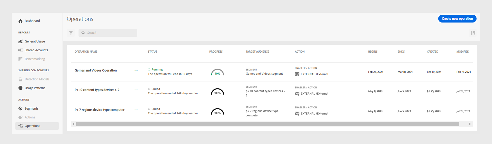

*Account IQ中現有作業的清單與詳細資料*

從作業清單中選取所需的&#x200B;**作業名稱**。 系統會顯示下列報表：

### 作業績效 {#operation-performance}

作業績效提供最上線讀出，摘要說明作業[評估期間](/help/accountiq/product-concepts.md#evaluation-period-def)區段中受影響的帳戶數目、作業進度以及帳戶的整體共用分數。

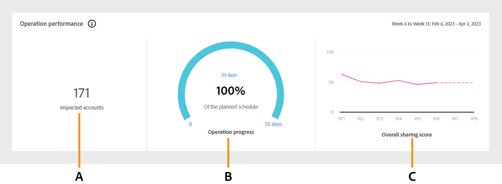

*操作效能報告*

**A.**&#x200B;受影響的帳戶&#x200B;**B.**&#x200B;作業進度&#x200B;**C.**&#x200B;整體共用分數

#### 受影響的帳戶 {#impacted-accounts}

此數字顯示受作業評估期間所執行動作影響的訂戶帳號計數。

#### 作業進度 {#operation-progress}

此量測計顯示超出計畫排程的天數與作業完成百分比。

#### 整體共用分數 {#overall-sharing-score}

此線圖代表[整體共用分數](/help/accountiq/data-panels.md#overall-sharing-score)，包括作業評估期間每週共用帳戶的共用層級和使用情況。

### 作業影響：節段中的科目 {#impact-accounts}

此報表會顯示為棧疊的欄點陣圖，以說明作業隨著時間而產生的影響。

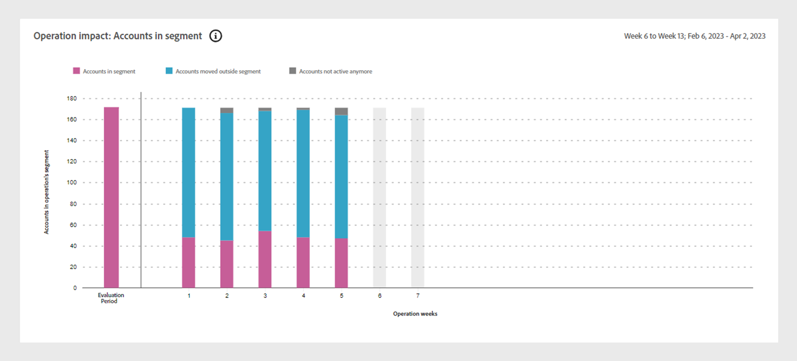

*作業會影響區段圖表中的帳戶*

x軸代表作業的[評估期間](/help/accountiq/product-concepts.md#evaluation-period-def)，而y軸則代表作業區段中的帳戶狀態。 圖形中的每一個長條都會分成三種顏色：

* 粉紅色代表符合此作業中所使用之區段條件的帳戶數。

* 藍色代表在作業的[評估期間](/help/accountiq/product-concepts.md#evaluation-period-def)的每週或每月中，原本在區段中但不符合區段條件的作用中帳戶數。

* 灰色代表評估期間處於非使用中狀態的帳戶。

>[!NOTE]
>
>第一個粉色列代表評估期間開始時符合作業節段條件的科目數目。

此圖表會說明隨著時間推移帳戶行為相對於原始條件的變化（例如，共用機率超過90且使用5部以上的裝置變為非使用中）。

### 作業影響：共用帳戶量度 {#impact-shared-accounts}

共用帳戶量度提供作業的[評估期間](/help/accountiq/product-concepts.md#evaluation-period-def)作業區段中訂閱者帳戶共用層級和播放要求的概述。

#### 共用層級 {#share-level}

此線圖代表作業評估期間每週的[共用層級](/help/accountiq/data-panels.md#sharing-level)。

{width="550" align="left"}

*共用層級線圖*

#### 播放要求數目 {#play-requests}

此線條圖代表作業評估期間每週的[播放要求](/help/accountiq/general-usage-reports.md#playreq-uniquesubs)。

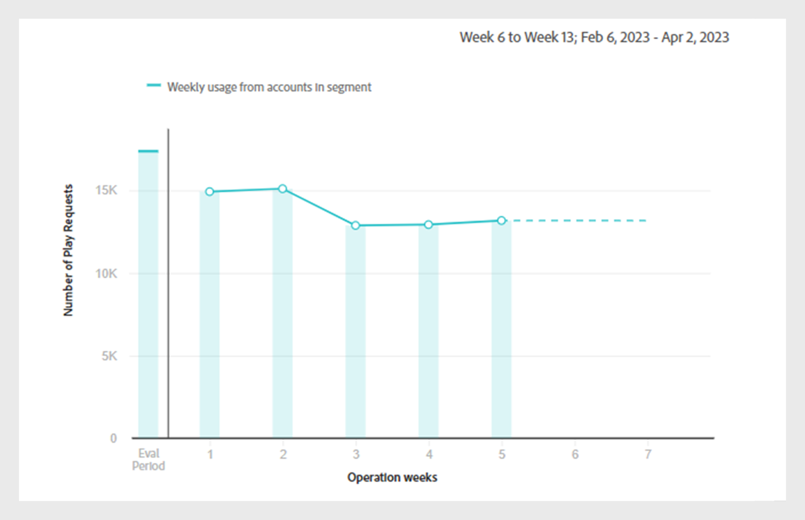{width="550" align="left"}

*播放要求數折線圖*

### 作業影響：一般使用量度 {#impact-general-usage}

一般使用量度提供作業[評估期間](/help/accountiq/product-concepts.md#evaluation-period-def)作業區段內平均裝置、IP和位置數目的概觀。

#### 裝置數 {#devices}

此線圖代表作業評估期間每週平均[部裝置](/help/accountiq/general-usage-reports.md#devices-week-account)。

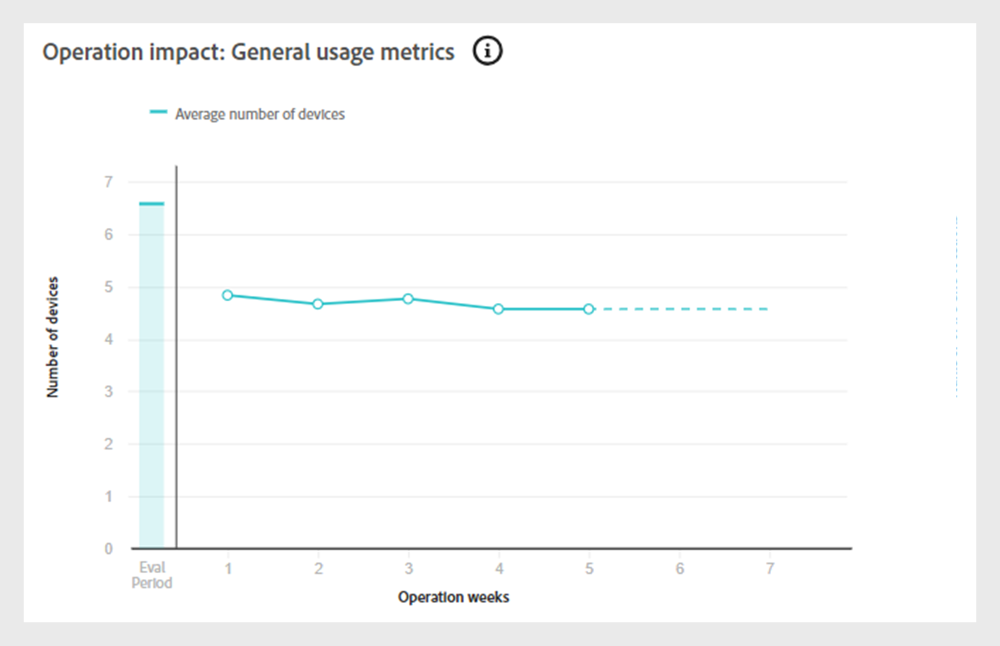{width="550" align="left"}

*裝置數折線圖*

#### IP和位置數量 {#IPs-locations}

此線條圖代表作業評估期間每週平均[個IP數目](/help/accountiq/general-usage-reports.md#ip-week-account)和[個位置](/help/accountiq/general-usage-reports.md#locations-week-account)。

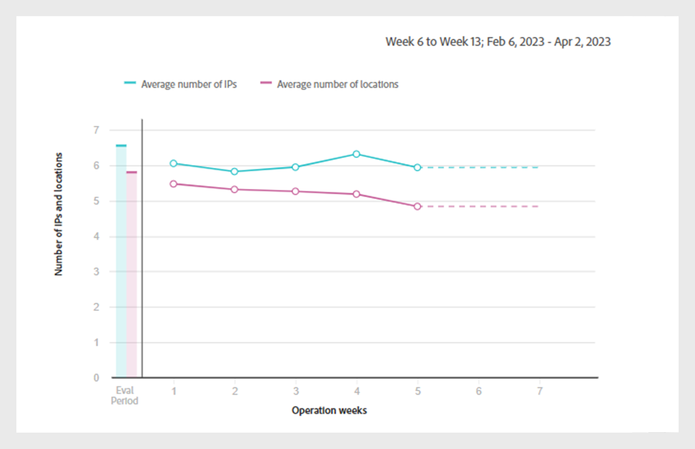{width="550" align="left"}

*IP數目和位置折線圖*

若要關閉報告並返回主要&#x200B;**作業**&#x200B;頁面，請選取左側面板中&#x200B;**動作**&#x200B;下的&#x200B;**作業**&#x200B;標籤。

## 建立新作業 {#create-new-operation}

當您移至左側面板中&#x200B;**動作**&#x200B;下的&#x200B;**作業**&#x200B;索引標籤時，請選取&#x200B;**作業**&#x200B;頁面頂端的&#x200B;**建立新作業**。

若要建立新作業，請遵循下列各節中的指示：

* [作業詳細資料](#operation-details)
* [區段](#segment)
* [動作](#action)
* [排程](#schedule)

### 作業詳細資料 {#operation-details}

在此區段中，在&#x200B;**作業名稱**&#x200B;中輸入作業的名稱。

>[!TIP]
>
>說明在&#x200B;**作業名稱**&#x200B;中作業的用途或動作的性質，以便快速識別。 **新增說明和標籤**&#x200B;的選項將在未來版本中提供。

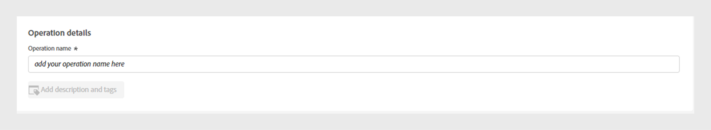

*新增作業名稱*

### 區段 {#segment}

在此區段中，按一下&#x200B;**選取區段**&#x200B;並選擇您要使用此作業的區段。 瞭解[如何選取區段](/help/accountiq/segments-timeinterval.md#segment-selection)。

選取區段後，請使用 圖示可檢視詳細的區段摘要。 深入瞭解[區段摘要](segments-timeinterval.md#segment-summary)。

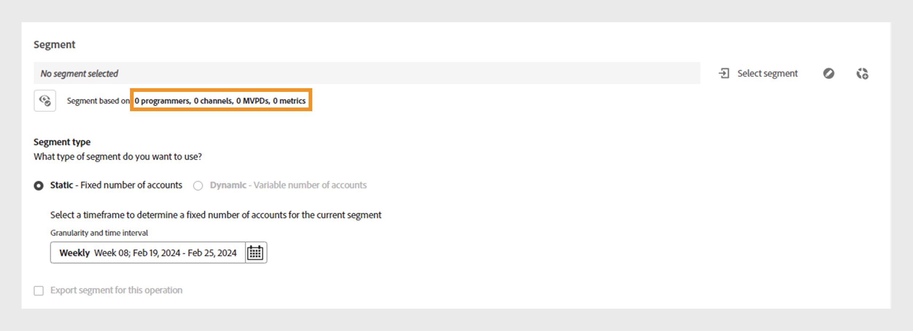

*選取區段和時間間隔*

>[!NOTE]
>
>上一個影像中顯示的[視訊類別](product-concepts.md#video-category-def)，例如&#x200B;**MVPD**、**程式設計人員**&#x200B;和&#x200B;**頻道**，代表在Account IQ的TV Everywhere版本中使用的標籤。 如果您以D2C服務身分登入，這些標籤會顯示您公司的特定視訊類別。

如有需要，請使用 圖示可編輯選取的區段或  圖示以建立新區段。 如需詳細資訊，請參閱[建立新區段](work-with-segments.md#create-new-segment)或[編輯區段](work-with-segments.md#edit-segment)的說明。

>[!IMPORTANT]
>
>目前預設會選取名為&#x200B;**[!UICONTROL Fixed number of accounts]**&#x200B;的&#x200B;**區段型別**。 選取&#x200B;**[!UICONTROL Variable number of accounts]**&#x200B;的選項將在即將發行的版本中提供。

選取&#x200B;**詳細程度和時間間隔**&#x200B;以監視特定期間的作業。 深入瞭解[如何選取詳細程度和時間間隔](/help/accountiq/segments-timeinterval.md#granularity-timeinterval)。

### 動作 {#action}

在此區段中，從下拉式功能表中選擇您要在選取的區段上執行的&#x200B;**動作**。

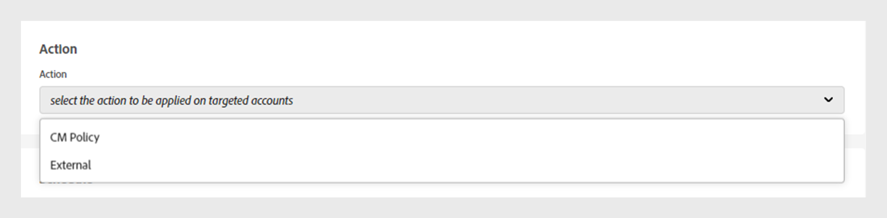

*選取動作型別*

有兩個可用選項：

* 選取與Account IQ整合之並行監視系統的&#x200B;**CM原則**。

* 選取&#x200B;**外部動作**&#x200B;以建立及處理Account IQ外部且未與Account IQ系統整合的工作流程。

>[!NOTE]
>
>外部動作不一定會和密碼共用直接相關，但仍會影響其效能，例如啟動新季節。

### 排程 {#schedule}

在此區段中，從日期選擇器選取&#x200B;**開始日期**&#x200B;和&#x200B;**結束日期**，以設定作業的啟動。

>[!IMPORTANT]
>
>目前，預設啟用&#x200B;**開始日期**&#x200B;和&#x200B;**結束日期**&#x200B;設定為&#x200B;**日期**。 在即將發行的版本中，將會提供選擇&#x200B;**當符合條件時**&#x200B;和&#x200B;**手動**&#x200B;的選項。

>[!NOTE]
>
>確保開始日期和結束日期都符合&#x200B;**步驟4**&#x200B;中選取的評估粒度。

* 如果您已選擇按周彙總粒度，請選取以周為單位的開始和結束日期（例如，第10週）。
* 如果您已選擇按月彙總粒度，請選取以月為單位的開始和結束日期。

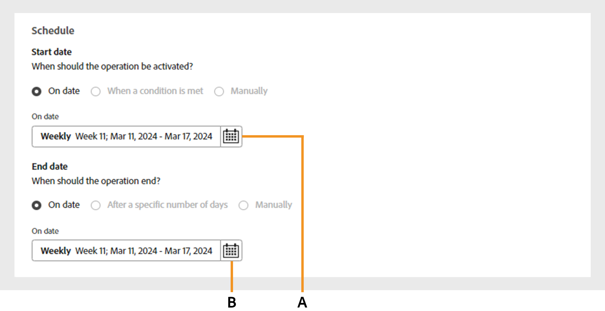

*從日期選擇器選取開始日期和結束日期*

**A.**&#x200B;開始日期選擇器&#x200B;**B.**&#x200B;結束日期選擇器

>[!NOTE]
>
>**開始日期**&#x200B;必須晚於評估期間與目前日期，而&#x200B;**結束日期**&#x200B;必須晚於開始日期與目前日期，才能排程及執行未來期間的作業。

選取&#x200B;**作業**&#x200B;頁面頂端的&#x200B;**儲存作業**&#x200B;以處理新作業。

## 停止操作 {#stop-operation}

您只能停止目前處於&#x200B;**執行中**&#x200B;狀態的作業。 若要停止現有作業，請遵循下列步驟：

1. 導覽至Account IQ應用程式左側導覽中&#x200B;**動作**&#x200B;下的&#x200B;**作業**&#x200B;標籤。
1. 選取您要停止之作業的&#x200B;**選項**&#x200B;功能表。

   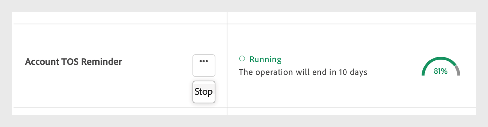

   *選取[選項]功能表以停止作業*

1. 選取&#x200B;**停止**。

