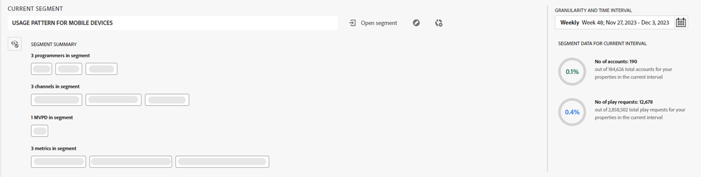

# 訂閱者區段和時間間隔 {#cohorts-segments}

登入Account IQ時，頂部的區段啟動器面板可讓您指定訂閱者 [區段](/help/accountiq/product-concepts.md#segment-segmet-def). 這有助於在檢視關於訂閱者分享行為和模式的報表時篩選結果。 已選取屬性中名為「所有科目」的預設區段，且您在區段啟動器中會看到下列選項：

{width="800" align="left"}

*圖：具有摺疊區段摘要的區段啟動器*

**A** 目前選取的區段名稱 
**B** 時間間隔和詳細程度選擇器 
**C** 區段摘要已摺疊 
**D** 展開區段摘要的選項 
**E** 區段資料（以一段期間區段中的訂閱者帳戶數為單位） 
**F** 開啟區段清單選項 
**G** 編輯區段選項 
**H** 建立新區段選項 

## 區段選取 {#segment-selection}

若為程式設計師或MVPD使用者，請瀏覽至 **開啟區段** 選項。 從清單中選擇區段，然後選取 **開啟區段** 以檢視帳戶共用報表。

使用 **眼睛** 圖示可檢視詳細的區段摘要，顯示訂戶帳號數目以及訂戶在所選時間間隔內提出的播放要求的資訊。

+++程式設計師/MVPD的區段選取面板

 {width="800" align="left"}

*圖：程式設計師/MVPD的區段面板*

+++

區段摘要可用來定義下列引數：

**[!UICONTROL Programmers in segment]**

**[!UICONTROL Channels in segment]**

**[!UICONTROL MVPD in segment]**

**[!UICONTROL Metrics in segment]**

<!-- The definitions of these parameters will be defined in the glossary article-->

## [!UICONTROL Granularity and time interval] {#granularity-timeinterval}

此 **[!UICONTROL Granularity and time interval]** 選取器可讓您指定每週/每月彙總的日期和持續時間，以觀察訂閱者帳戶共用行為。 時間間隔的預設選取範圍為本週，但您可以使用影像中顯示的選項來修改持續時間。

![[!UICONTROL Granularity and timeinterval]](assets/granularity-timeinterval-weekwise.png){width="350" align="left"}

*圖：詳細程度和時間間隔對話方塊*

**A** 從日期選擇器中挑選日期 
**B** 選取向左箭頭以向後移動 
**C** 選取向右箭頭以往前移 
**D** 依周/月選取詳細程度 
**E** 選取的時間間隔 

套用這些控制項，您可以將問題陳述式定義為「在10月份觀看頻道X、Y和Z的MVPD A訂閱者」。

