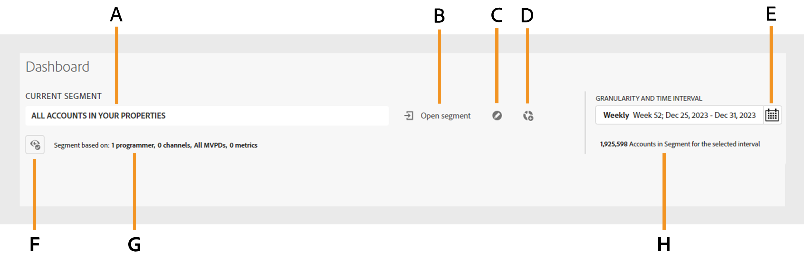
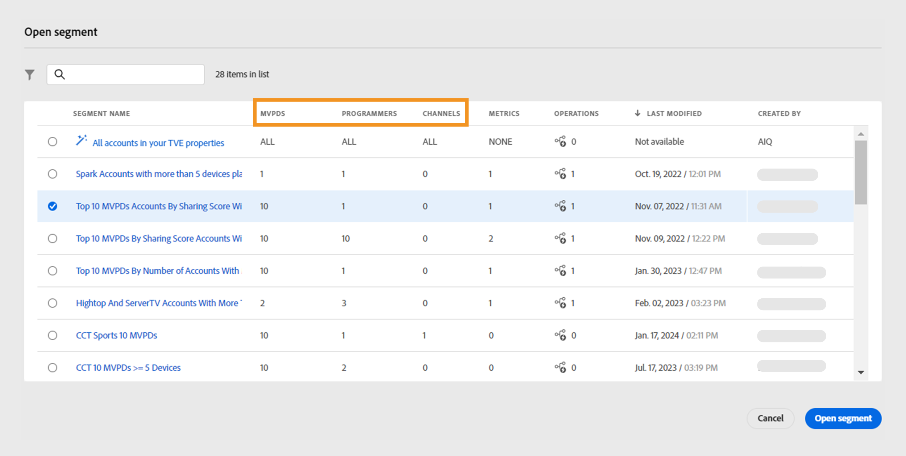
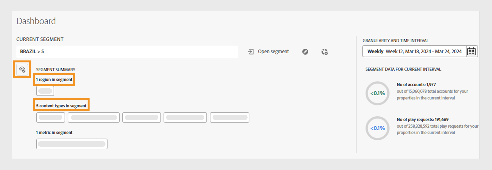

# 區段和時間間隔 {#segment-timeinterval}

登入Account IQ時，位於控制面板上方的區段和時間間隔面板可讓您定義訂閱者 [區段](product-concepts.md#segmet-def). 此面板有助於篩選結果並顯示訂閱者共用行為和模式的報告。 名為的區段 **您屬性中的所有帳戶** 目前預設為選取，您可以在其中檢視下列選項：

{align="left"}

*具有摺疊區段摘要的區段和時間間隔面板*

**答：** 目前選取的區段名稱 **B.** 開啟區段清單 **C.** 編輯區段 **D.** 建立新區段 **E.** 詳細程度和時間間隔選擇器 **F.** 圖示可展開區段摘要 **G.** 收合的區段摘要 **高。** 所選間隔的節段中的科目數

>[!NOTE]
>
> 收合的區段摘要會顯示 [影片類別](product-concepts.md#video-category-def) 用於電視版Account IQ。 如果您以D2C服務身分登入，這些標籤會顯示您公司的特定視訊類別。

深入瞭解 [如何建立](work-with-segments.md#create-new-segment) 和 [管理區段](work-with-segments.md#manage-segment) 從 **區段** 標籤。

## 區段選取 {#segment-selection}

若要選取特定區段，請遵循下列步驟：

1. 導覽至 **[!UICONTROL Open segment]** 區段和時間間隔面板中的選項。
1. 選取 **區段名稱** 您要檢視其帳戶共用報表的帳戶。

   {align="left"}

   *選取區段名稱*

   >[!NOTE]
   >
   > 上一個影像中顯示的視訊類別，例如 **MVPDs**， **程式設計師**、和 **頻道** 代表用於電視版Account IQ的標籤。 如果您以D2C服務身分登入，這些標籤會顯示您公司的特定視訊類別。

1. 選取 **[!UICONTROL Open segment]**.

## 詳細程度和時間間隔選擇 {#granularity-timeinterval}

此 **詳細程度和時間間隔** 選取器可讓您指定每週/每月彙總的日期和持續時間，以觀察訂閱者共用行為。 預設選擇為本週。

{align="left"}

*詳細程度和時間間隔對話方塊*

**答：** 詳細程度和時間間隔選擇器 **B.** 前往下個月/周的向右箭號 **C.** 可依周/月選擇詳細程度的選項 **D.** 目前選取的時間間隔 **E.** 前往前一個月/周的向左箭頭

您可以使用以下步驟修改持續時間：

1. 選取 **[!UICONTROL Granularity and Time Interval]** 從日期選擇器。

1. 選取 **[!UICONTROL Week]** 或 **[!UICONTROL Month]** 從 **[!UICONTROL Aggregate By]** 用於設定評估粒度的選項。

1. 選取詳細程度後，您就可以使用向前或向後箭頭來瀏覽時間範圍。

1. 選取要評估的特定時段。

1. 選取 **[!UICONTROL Apply]** 以確保您的選取生效。

這可讓您將問題陳述定義為「在12月選擇當週觀看頻道X、Y和Z的MVPD A訂閱者」。

## 區段摘要 {#segment-summary}

D2C服務和所有地方的電視的區段摘要都類似。 每個帳戶IQ版本的影片類別將會不同。

選取  圖示以檢視詳細的區段摘要。 它也會顯示所選時段內訂閱者帳戶的數目及其播放要求的資訊。

+++ D2C服務

{align="left"}

*D2C服務的區段摘要*

>[!NOTE]
>
>此 [視訊類別](product-concepts.md#video-category-def) 顯示於前一個影像，例如 **區域** 和 **內容型別** 在區段中，只是範例。 當您登入Account IQ時，這些標籤會顯示您公司的特定影片類別。

此 **區段摘要** 包含下列定義區段的條件：

**[地區和內容型別](product-concepts.md#video-category-def) 在區段中** 請參閱與視訊串流關聯的中繼資料標籤，這些串流由帳戶共用報表中表示的共用帳戶監看。

**[量度](product-concepts.md#metric) 在區段中** 請參閱訂閱者必須符合的屬性或條件，才能在帳戶共用報表中識別。

+++

+++ 到處都是電視

{align="left"}

*程式設計師/MVPD的區段摘要*

此 **區段摘要** 包含下列定義區段的條件：

**[程式設計師](product-concepts.md#programmer-def) 在區段中**  請參考內容提供者，其影片串流由帳戶共用報表中表示的共用帳戶監看。

**[頻道](product-concepts.md#channel-def) 在區段中** 指其視訊資料流由帳戶共用報表中表示的共用帳戶觀看的頻道。

**[MVPDs](product-concepts.md#mvpd-def) 在區段中** 指與訂閱者相關聯的多視訊節目分銷商，以便在帳戶共用報表中識別。

**[量度](product-concepts.md#metric) 在區段中** 請參閱訂閱者必須符合的屬性或條件，才能在帳戶共用報表中識別。

+++
