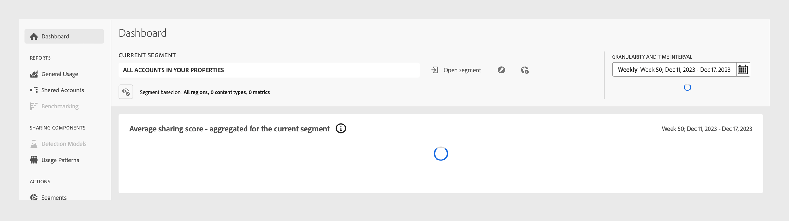

# Account IQ問題的疑難排解 {#troubleshoot}

如果您在載入資料和圖表時發生延遲、匯出報表時遇到困難，或遇到任何與量度或圖表相關的問題，請繼續閱讀，以取得快速的疑難排解協助。

* 如果頁面或個別面板載入時間過長，請嘗試重新整理頁面。 若為目前版本，視目前區段而定，頁面載入最多可能需要一分鐘。

  

* 如果您在重新整理後仍看不到任何資料或圖表，請登出帳戶IQ，然後重新登入。

* 如果上述的疑難排解方法都沒有幫助，或者您有其他與資料相關的問題或無法匯出統計資料，請傳送電子郵件至「 」以聯絡Adobe支援 <tve-support@adobe.com>.
