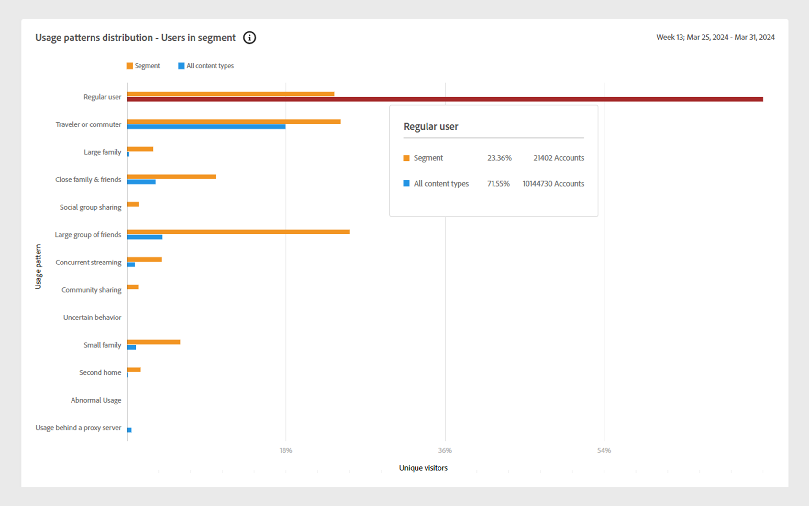
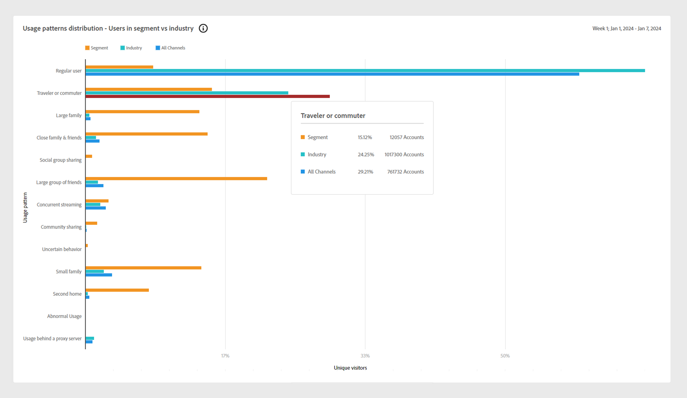
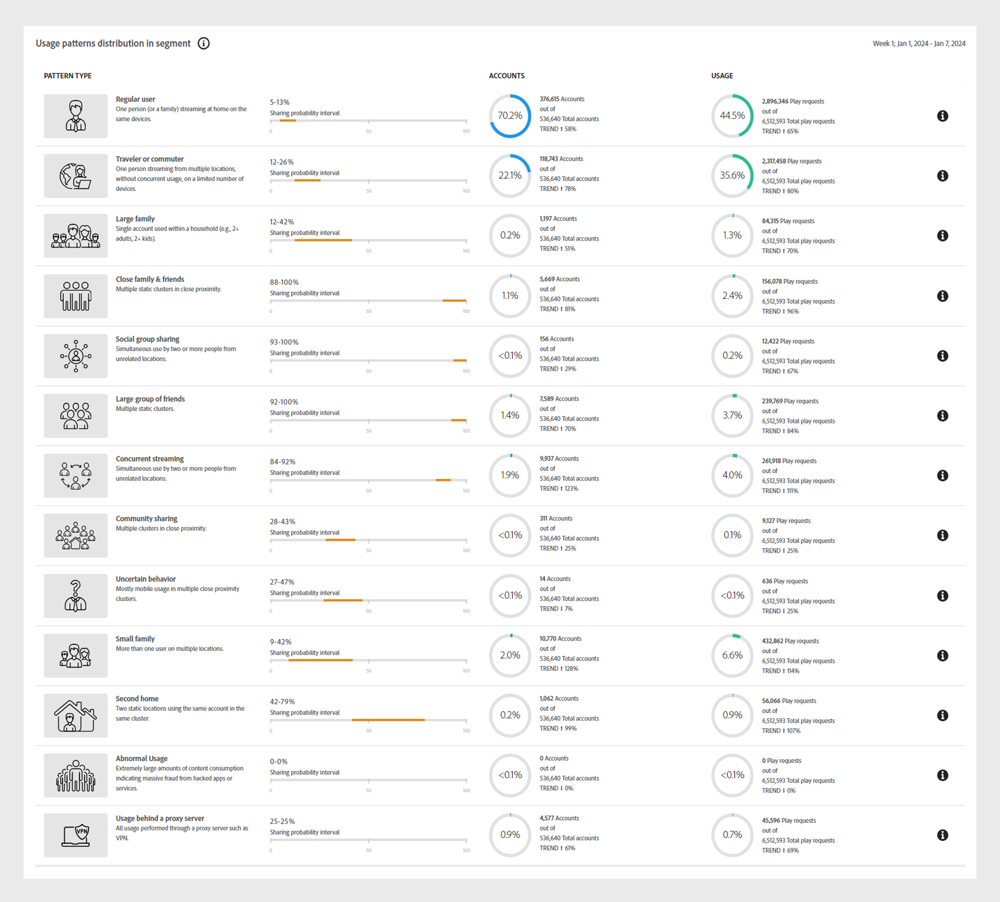
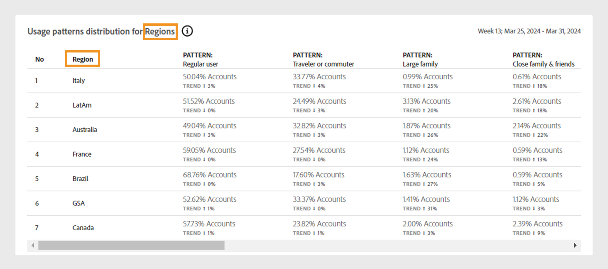
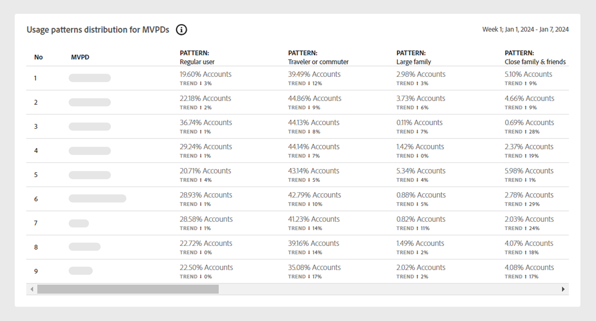
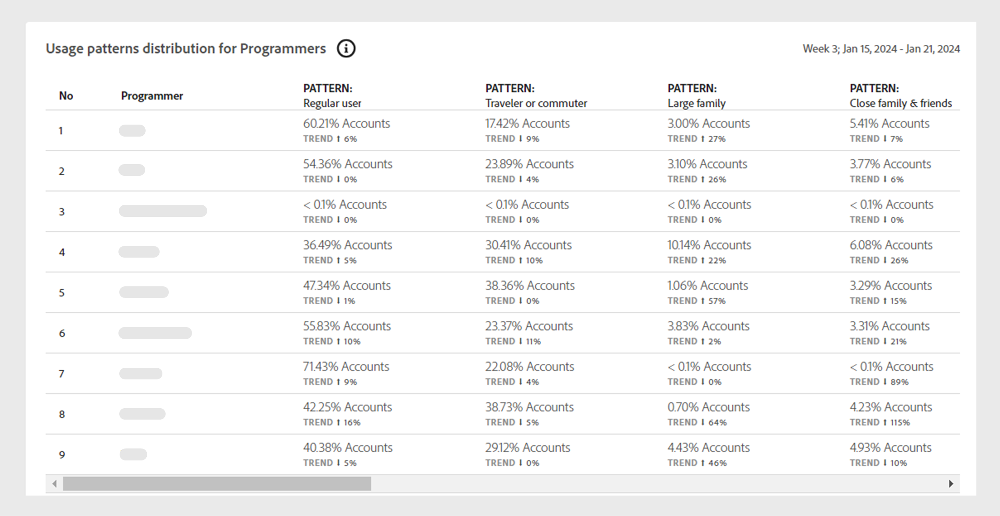

# 使用模式 {#usage-patterns}

帳戶IQ會根據使用者的社交行為，將訂閱者帳戶的使用者分類為不同類別，例如旅行者或通勤者、大型家庭和社群分享。 此 **使用模式** 頁面會顯示這些使用者型別的數個不同分析和報表。 例如， **使用模式分佈** 報表會比較目前區段與所有帳戶的使用行為。

如同應用程式中的其他頁面，此處的分析和報表也是以中定義的目前區段為基礎。 [區段面板](/help/accountiq/segments-timeinterval.md).

## 使用模式分佈 {#usage-pattern-dis}

叢集橫條圖可描述每個社交行為或使用模式的訂閱者數目和百分比。

+++D2C服務：使用模式分佈 — 區段中的使用者

下方的叢集長條圖會比較目前區段與包含所有科目的區段的使用模式分佈。

*使用模式分佈 — 區段中的使用者*

+++

+++隨時隨地播放電視：使用模式分佈 — 區段與產業中的使用者

除了將目前區段中的每個使用模式與整個產業進行比較，也會將它們與包含您所有帳戶的區段進行比較。

*使用模式分佈 — 區段中的使用者與產業*

+++

## 區段中的使用模式分佈 {#usage-pattern-dis-segment}

此 **[!UICONTROL Usage patterns distribution in segment]** 面板會針對每個使用者模式列出下列資訊：

* 個別帳戶所屬的共用機率範圍。
* 該模式中的帳戶數目和百分比。
* 該類別中訂閱者在播放要求方面的整體和使用百分比。

*區段中的使用模式分佈*

例如，在上述視覺效果中：

* 在定義的區段中，一般使用者（只有單一位置具有有限裝置數量的一對少數人）的帳戶共用機率介於5%到13%之間。

* 70.2% (376,615)的訂閱者帳戶總數(536,640)為一般使用者。

* 44.5% (2,896,346)的播放請求總數(6,512,593)是由一般使用者發出。

## 視訊類別的使用模式分佈 {#usage-pattern-dis-video-categories}

+++D2C服務：區域的使用模式分佈

此 **[!UICONTROL Usage pattern distribution]** 此表格提供各類別的使用模式比較 [視訊類別](product-concepts.md##video-category-def) 在目前區段中。

*區域的使用模式分佈*

>[!NOTE]
>
>上一個影像中顯示的視訊類別，例如 **地區** 只是個範例。 當您登入Account IQ時，標籤會顯示您公司的特定影片類別。

+++

+++程式設計師： MVPD的使用模式分佈

此 **[!UICONTROL Usage pattern distribution]** 此表格提供目前區段中MVPD的使用模式分佈比較。

*程式設計師的使用模式分佈*

+++

+++MVPD：程式設計師的使用模式分佈

此 **[!UICONTROL Usage pattern distribution]** 此表格提供目前區段中程式設計師或管道的使用模式分佈比較。

*MVPD的使用模式分佈*

+++
