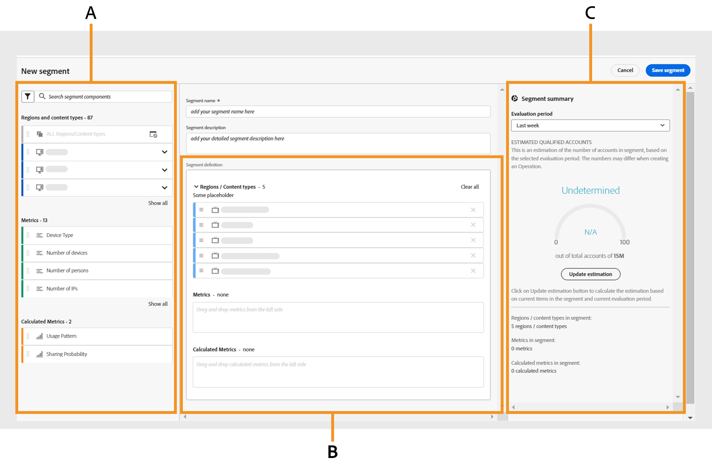
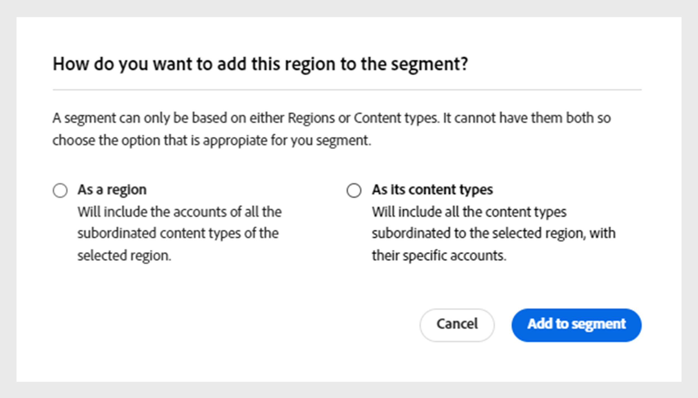
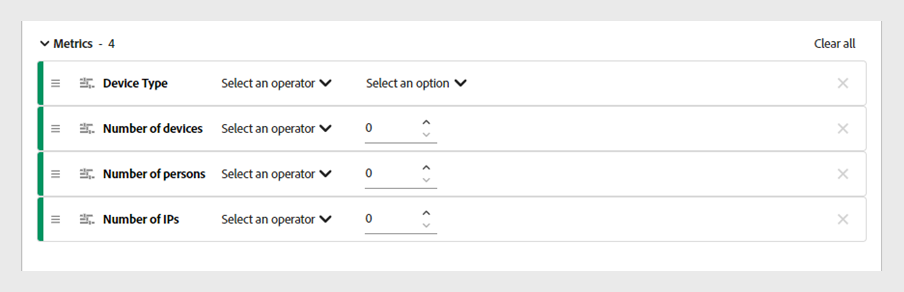
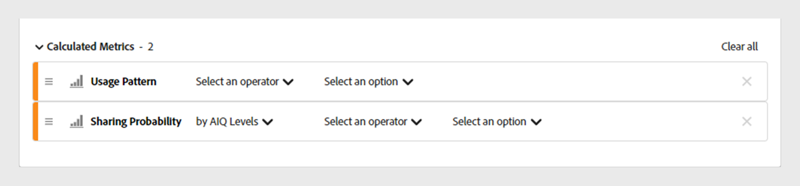
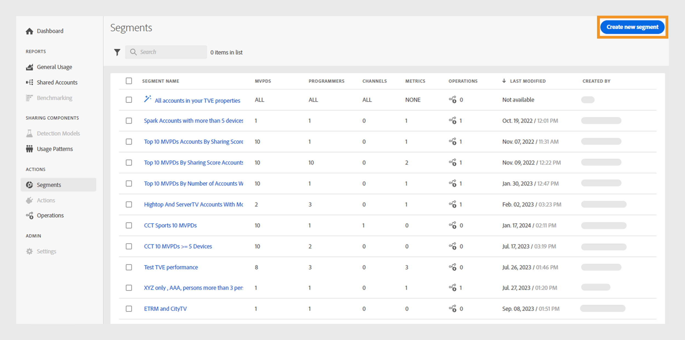
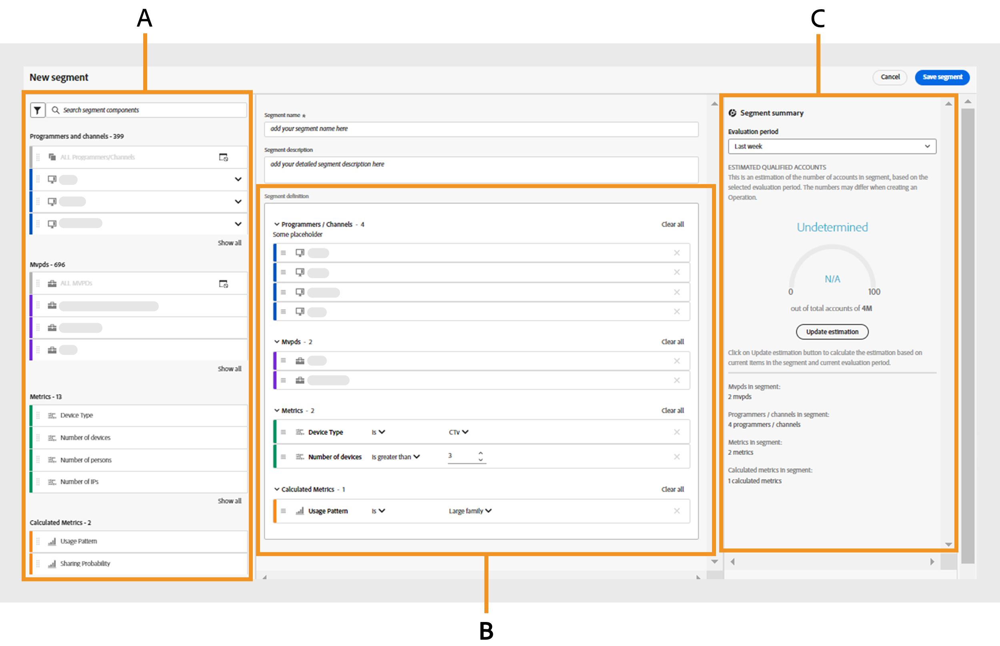
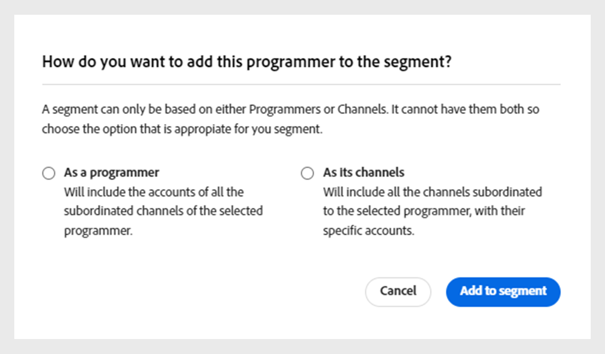
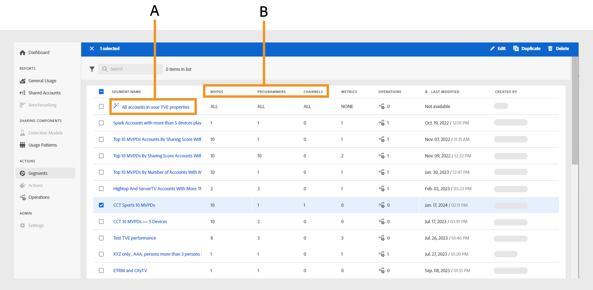
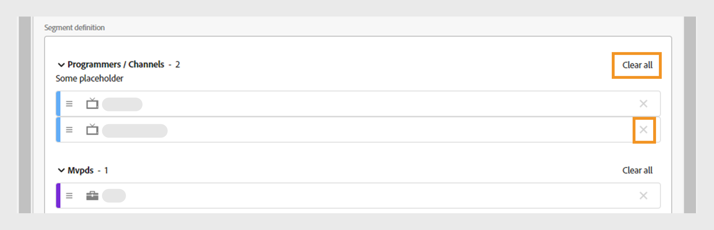
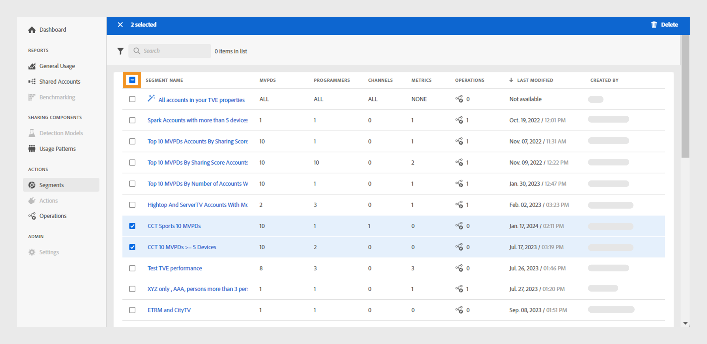

# 使用區段 {#work-with-segments}

[區段](product-concepts.md#segmet-def) 是訂閱者帳戶的集合，可讓您在使用者定義的條件下分析認證共用。 您可以使用區段來檢查不同的訂戶帳號集，並在表格和圖形中產生對應的資料報表。 帳戶IQ中有兩種型別的區段：

1. **預設區段**： **您屬性中的所有帳戶** 是系統中現成可用的區段，包含未套用特定條件的所有作用中訂閱者帳戶。

   >[!NOTE]
   >
   >使用預設區段可能會阻止顯示某些表格，例如 [區段中的影片類別](data-panels.md#video-categories-segment)， [依管道和MVPD分享分數](data-panels.md#sharin-score-by-channels-and-mvpds)、和 [視訊類別的使用模式分佈](usage-patterns.md#usage-pattern-dis-video-categories). 這些表格一次最多只能容納和顯示20列的資料。 其餘的表格、圖表和報表對於預設和自訂區段而言是相同的。

1. **自訂區段**：這些是量身打造的區段，可讓您從特定類別（例如D2C內容型別、程式設計人員、管道和MVPD）將訂閱者帳戶分組，以在使用者定義的條件下分析憑證共用。 進一步瞭解如何 [建立自訂區段](#create-new-segment).

   >[!IMPORTANT]
   >
   >本指南中說明的所有程式都是以自訂區段為基礎的。 不過，預設和自訂區段的概念保持不變。

當您前往 **動作** 並選取 **[!UICONTROL Segments]** 標籤，則會顯示系統中可用區段的清單。 區段頁面可讓您以表格格式快速評估每個區段的關鍵詳細資訊。 詳細資訊包括區段名稱、數量 [視訊類別](product-concepts.md#video-category-def)，量度， [操作](product-concepts.md#operation-def) 使用目前區段、上次修改的日期和時間，以及區段建立者的名稱。

您可以對區段執行下列功能：

* [建立新區段](#create-new-segment)
* [管理區段](#manage-segments)

## 建立新區段 {#create-new-segment}

D2C服務與TV Everywhere建立新區段的程式類似。 每個帳戶IQ版本的影片類別將會不同。

+++D2C服務

若要建立區段並分析訂閱者的共用行為，請選取 **[!UICONTROL Create new segment]** 位於右上角。

*選取建立新區段*

>[!NOTE]
>
>上一個影像中顯示的視訊類別，例如 **地區** 和 **內容型別** 只是範例。 當您登入Account IQ時，這些標籤會顯示您公司的特定影片類別。

它會開啟 **新區段** 頁面，包含下列元素：

*新區段頁面*

**答：** 區段元件 **B.** 區段定義 **C.** 區段摘要

* **區段元件**：詳細目錄 [視訊類別](product-concepts.md##video-category-def) 和用於定義區段的計算量度。

  >[!NOTE]
  >
  >使用 **[!UICONTROL Show all]** 以展開區段元件清單。 若要快速尋找元件，請搜尋其名稱，位置為 **搜尋區段元件** 而不需捲動整個清單。

* **區段定義**：您可拖放各種區段元件以建立區段的畫布。

* **區段摘要**：根據區段定義中的元件來估計合格科目的摘要，並提供評估期間區段的簡短概觀。

執行以下步驟來建立區段：

1. 在中輸入區段的名稱 **區段名稱** 會在區段清單中及選取區段期間顯示。
1. 在中輸入區段的詳細說明 **區段說明**.
1. 例如，拖曳 **地區和內容型別** 從左側面板的區段元件拖放至 **地區/內容型別** 區段在 **區段定義**.

   >[!NOTE]
   >
   >您可以根據地區或內容型別建立區段。 從下拉式選單中檢視區域的關聯內容型別。

   如果您從新增 **內容型別** 在 **地區/內容型別** 區段，您只能新增內容型別作為後續元件。

   如果您從新增 **地區** 在 **地區/內容型別** 區段，會顯示決定對話方塊。

   {width="550" align="left"}

   *將區段元件新增為區域或其內容型別對話方塊*

   根據與區域相關聯的內容型別，決定您要比較特定區域或區段。

   選取 **[!UICONTROL As a region]** 將區域新增至 **地區/內容型別** 區段。

   選取 **[!UICONTROL As its content types]** 以新增區域的內容型別。

1. 拖曳 **量度** 從左側面板的區段元件拖放至 **量度** 區段在 **區段定義**.

   

   *選取運運算元並指派新增量度的值*

   在區段定義中新增量度後，從中選擇運運算元 **[!UICONTROL Select an operator]** 下拉式選單並使用指派值 **[!UICONTROL Select an option]**.

   使用向上箭頭增加和向下箭頭減少來調整特定量度的值。

1. 拖曳 **計算量度** 從左側面板的區段元件拖放至 **計算量度** 區段在 **區段定義**.

   

   *選取運運算元並為新增的計算量度指派值*

   在區段定義中新增計算量度後， **[!UICONTROL Select an operator]** ，並使用指派值 **[!UICONTROL Select an option]**.

   >[!NOTE]
   >
   >您放置在區段定義下的所有量度和計算量度，都會隨附適當的運運算元，以將值指派給個別量度和計算量度。

1. 請檢閱以下檔案中的區段詳細資訊： **區段摘要** 以決定您要在整個區段內實施的變更。
1. 選取 **[!UICONTROL Last week]** 或 **[!UICONTROL Last month]** 從 **評估期間** 下拉式功能表來預估過去一週或當月的摘要值。
1. 選取 **[!UICONTROL Update estimation]** 根據所選評估期間，計算目前區段中預估的合格科目數目。
1. 選取 **[!UICONTROL Save segment]**.

您建立的區段現在可於區段清單中使用。

+++

+++隨處可見TV

若要建立區段並分析訂閱者的共用行為，請選取 **[!UICONTROL Create new segment]** 位於右上角。

*選取建立新區段*

它會開啟 **新區段** 頁面，包含下列元素：

*新區段頁面*

**答：** 區段元件 **B.** 區段定義 **C.** 區段摘要

* **區段元件**：用來定義區段的程式設計師和頻道、MVPD、量度和計算量度的詳細目錄。

  >[!NOTE]
  >
  >使用 **[!UICONTROL Show all]** 以展開區段元件清單。 若要快速尋找元件，請搜尋其名稱，位置為 **搜尋區段元件** 而不需捲動整個清單。

* **區段定義**：您可拖放各種區段元件以建立區段的畫布。

* **區段摘要**：根據區段定義中的元件來估計合格科目的摘要，並提供評估期間區段的簡短概觀。

執行以下步驟來建立區段：

1. 在中輸入區段的名稱 **區段名稱** 會在區段清單中及選取區段期間顯示。
1. 在中輸入區段的詳細說明 **區段說明**.
1. 拖曳 **程式設計師和管道** 從左側面板的區段元件拖放至 **程式設計師/管道** 區段在 **區段定義**.

   >[!NOTE]
   >
   >您可以根據程式設計師或管道建立區段。 從下拉式選單中檢視與程式設計師相關聯的管道。

   如果您從新增 **頻道** 在 **程式設計師/管道** 部分，您只能新增管道作為後續元件。

   如果您從新增 **程式設計師** 在 **程式設計師/管道** 區段，會顯示決定對話方塊。

   {width="550" align="left"}

   *將區段元件新增為程式設計師或其管道對話方塊*

   決定您要根據與程式設計師相關聯的管道來比較特定程式設計師或區段。

   選取 **[!UICONTROL As a programmer]** 將程式設計師新增至 **程式設計師/管道** 區段。

   選取 **[!UICONTROL As its channels]** 以新增程式設計師的所有管道。

1. 拖曳 **MVPDs** 從左側面板的區段元件拖放至 **MVPDs** 區段在 **區段定義**.

   >[!NOTE]
   >
   >當您以程式設計師身分登入時，名為的MVPD **xfinity** 在「 」中顯示為獨立選項 **MVPDs** 區段。 您無法將其與任何其他MVPD結合。

1. 拖曳 **量度** 從左側面板的區段元件拖放至 **量度** 區段在 **區段定義**.

   

   *選取運運算元並指派新增量度的值*

   在區段定義中新增量度後，從中選擇運運算元 **[!UICONTROL Select an operator]** 下拉式選單並使用指派值 **[!UICONTROL Select an option]**.

   使用向上箭頭增加和向下箭頭減少來調整特定量度的值。

1. 拖曳 **計算量度** 從左側面板的區段元件拖放至 **計算量度** 區段在 **區段定義**.

   

   *選取運運算元並為新增的計算量度指派值*

   在區段定義中新增計算量度後， **[!UICONTROL Select an operator]** ，並使用指派值 **[!UICONTROL Select an option]**.

   >[!NOTE]
   >
   >您放置在區段定義下的所有量度和計算量度，都會隨附適當的運運算元，以將值指派給個別量度和計算量度。

1. 請檢閱以下檔案中的區段詳細資訊： **區段摘要** 以決定您要在整個區段內實施的變更。
1. 選取 **[!UICONTROL Last week]** 或 **[!UICONTROL Last month]** 從 **評估期間** 下拉式功能表來預估過去一週或當月的摘要值。
1. 選取 **[!UICONTROL Update estimation]** 根據所選評估期間，計算目前區段中預估的合格科目數目。
1. 選取 **[!UICONTROL Save segment]**.

您建立的區段現在可於區段清單中使用。
+++

## 管理區段 {#manage-segments}

您可以從區段清單中選取區段，然後執行下列動作：

* [編輯區段](#edit-segment)
* [複製區段](#duplicate-segment)
* [刪除區段](#delete-segment)

*選取要編輯、複製或刪除的區段*

**答：** [預設區段](#work-with-segments) **B.** [影片類別](product-concepts.md#video-category-def)

>[!NOTE]
>
>本節中顯示的視訊類別，例如 **MVPDs**， **程式設計師**、和 **頻道** 代表用於電視版Account IQ的標籤。 如果您以D2C服務身分登入，這些標籤會顯示您公司的特定視訊類別。

您無法編輯、複製或刪除名為的預設區段 **您屬性中的所有帳戶**.

### 編輯區段 {#edit-segment}

1. 導覽至 **[!UICONTROL Segments]** 標籤下的 **動作** 以檢視區段清單。
1. 選取要編輯的區段。
1. 選取 **[!UICONTROL Edit]**.
1. 修改區段詳細資訊，例如區段名稱、說明或中的元件。 **區段定義**.

   >[!TIP]
   >
   >使用 **[!UICONTROL Clear all]** 一次移除區段定義下每個區段中的所有區段元件。 或者，選取十字按鈕以移除個別專案。

   

   *選取「全部清除」可一次移除所有區段元件*

1. 選取 **[!UICONTROL Update segment]** 更新現有區段或 **[!UICONTROL Save as new segment]** 以建立含有變更的新區段。

   >[!NOTE]
   >
   >不允許更新目前正在進行操作的區段。 將變更另存為新區段是正在進行操作的區段的唯一選項。

### 複製區段 {#duplicate-segment}

1. 導覽至 **[!UICONTROL Segments]** 標籤下的 **動作** 以檢視區段清單。
1. 選取要複製的區段。
1. 選取 **[!UICONTROL Duplicate]**.

所選區段的副本隨即產生並放置在區段清單的末尾。 您可以在複製的區段中編輯必要的詳細資料，然後更新複製的區段或將其儲存為新區段。

### 刪除區段 {#delete-segment}

1. 導覽至 **[!UICONTROL Segments]** 標籤下的 **動作** 以檢視區段清單。
1. 選取您要移除的區段。

   選取多個區段以於單一操作中刪除它們。 您也可以選取「 」左側的核取方塊 **區段名稱** 一次刪除所有區段。

   >[!NOTE]
   >
   > 如果作業未使用任何區段，則只能刪除多個區段或所有區段。 此外，刪除名為的預設區段 **您屬性中的所有帳戶** 是不允許的。 當您嘗試一次刪除所有區段時，該選項將保持未選取狀態。

   

   *選取多個區段以刪除多個區段*

1. 選取 **[!UICONTROL Delete]**.
1. 確認 **[!UICONTROL Delete]** ，以永久移除區段。

   >[!NOTE]
   >
   >該區段將從系統中永久刪除，並且您無法復原此操作。
