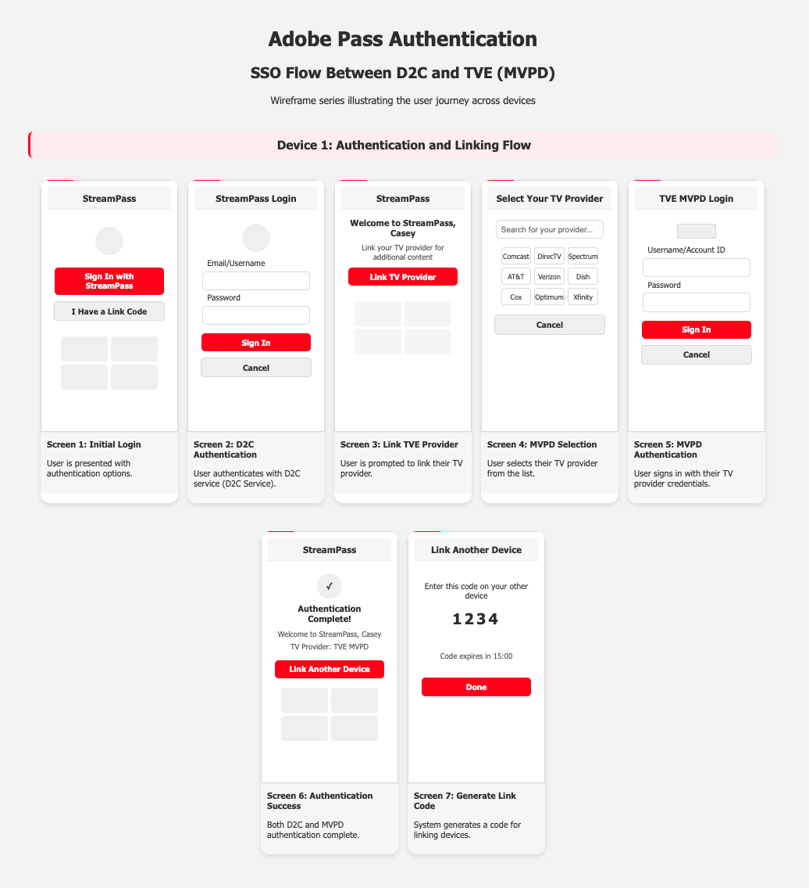
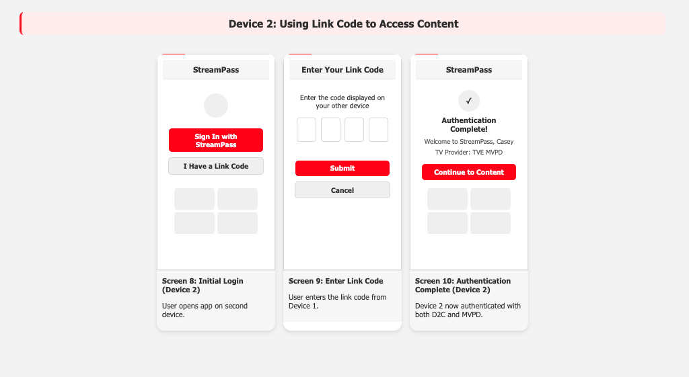

# Adobe單一登入服務 {#sso-service}

本檔案說明Adobe單一登入服務的使用案例、端點和API。

**目前的修訂版本 — 1.0.0**

## 範圍 {#scope}

Adobe Pass SSO服務可跨多部裝置和應用程式進行順暢的驗證，提供統一的使用者體驗，同時維持安全性和合規性標準。 此服務可因應現今多裝置串流環境中日益增加的跨平台驗證需求。

## 概觀 {#overview}

### 內容 {#what-it-is}

完整的單一登入解決方案，可讓使用者驗證一次，並以知情的方式管理將驗證傳輸到其他裝置

### 驗證目前面臨的挑戰 {#current-challenges}

* 使用者必須使用他訂閱的每個串流服務進行驗證
* 使用者必須在每個裝置或應用程式上個別驗證
* 由於難以在某些平台的驗證流程中輸入密碼，這可能會導致丟棄率增加

### Adobe Pass SSO服務的機會 {#opportunity}

* 需要自己驗證的串流服務數量不斷增加
* 對無縫跨裝置體驗的需求日益增加
* 每戶串流裝置的數量不斷增加
* 每戶需要統一的驗證

### 企業優點 {#business-benefits}

#### 內容提供者 {#content-providers}

* **增加使用者參與度** — 順暢的體驗會產生更長的作業時間
* **減少摩擦** — 較低的驗證障礙會增加內容消耗
* **改善的保留率** — 更好的使用者體驗減少流失率
* **成本降低** — 減少與驗證問題相關的支援票證

#### 一般使用者 {#end-users}

* **順暢體驗** — 驗證一次，隨處存取
* **節省時間** — 沒有重複的登入程式
* **裝置彈性** — 在裝置之間切換而不中斷
* **一致的體驗** — 跨所有平台的一致驗證

#### IdPs （MVPD、電信業者等） {#idps}

* 可使用已驗證的SSO通知MVPD其他裝置
* **增強的使用者滿意度** — 改善驗證體驗
* **減少支援負載** — 減少與驗證相關的支援呼叫
* **競爭優勢** — 較其他競爭者更佳的使用者體驗

## 使用案例 {#use-cases}

### 身分對應 {#identity-mapping}

此服務可建立在同一應用程式中連結D2C和TVE帳戶的能力。

更多串流服務正在建立套件組合銷售給第三方(MVPD/虛擬MVPD/Telco等)。 使用者可能最終必須在相同應用程式中處理多個帳戶。 為了建立順暢的驗證體驗，服務需要橋接這些帳戶以簡化登入體驗。

使用者將使用其D2C帳戶進行驗證，然後使用不同的帳戶(例如 MVPD)。 我們的服務會連結這些帳戶，這表示往後不同裝置上的後續驗證只能以D2C帳戶進行。

### 跨裝置SSO {#cross-device-sso}

在電視連線的裝置上進行驗證可能比在行動電話上更麻煩。 良好的使用者體驗是在手機上進行驗證，然後將該驗證傳遞給智慧型電視。

## 主要元件 {#key-components}

* **服務權杖API** — 可安全地管理單一登入機制的金鑰元件
* **清單API** — 應用程式可協助使用者瞭解其生態系統中的裝置清單
* **連結API** — 應用程式可讓使用者在其生態系統中新增其他裝置
* **取消連結API** — 應用程式可讓使用者移除其生態系統中的裝置

## 使用案例詳情 {#use-cases-detailed}

### D2C-TVE SSO {#d2c-tve-sso}

此使用案例可讓您在單一裝置上的D2C與TVE(MVPD)憑證之間建立連結，並在相同應用程式內的其他裝置上利用該連結的設定檔。





### 跨裝置SSO {#cross-device-sso-detailed}

此使用案例可讓已在同一部裝置上進行驗證的使用者，重複使用安裝在其他裝置上的相同D2C或TVE應用程式上的已驗證設定檔(實施Adobe Pass REST V2以進行驗證和授權所需的應用程式)。

## 如何在D2C-TVE應用程式中整合Adobe SSO服務 {#integration}

### 步驟1 — 取得通用識別碼 {#step-1}

若要整合Adobe SSO服務，應用程式實作應建立唯一且永久性的ID，用作X-SSO-ID中的通用識別碼SSO屬性。 這可以透過使用D2C服務驗證使用者來取得，並保留關於此驗證的屬性。

### 步驟2 — 取得服務權杖 {#step-2}

在POST /serviceToken端點的X-SSO-ID中使用通用識別碼將擷取具有以下承載的已簽署JWT：

```json
{
  "iss": "ssoservicetoken",
  "sub": "unique_common_identifier",
  "nbf": 1758093558,
  "exp": 1758097158,
  "iat": 1758093558
}
```

服務權杖具有「iat」 — 在簽發，且「exp」 — 服務權杖有效間隔的到期時間。 如果到期，則可以使用具有過期服務權杖的GET /serviceToken端點來取得新的JWT。

### 步驟3 — 透過TVE MVPD使用Adobe Pass REST API V2進行驗證 {#step-3}

應該使用服務權杖實作Adobe Pass的驗證： [REST API V2 — 單一登入服務權杖流程](https://experienceleague.adobe.com/zh-hant/docs/pass/authentication/integration-guide-programmers/rest-apis/rest-api-v2/rest-api-v2-flows/rest-api-v2-single-sign-on-access-flows/rest-api-v2-single-sign-on-service-token-flows)

### 步驟4 — 連結其他裝置 {#step-4}

從已驗證的應用程式中，可以使用/link API建立要用於不同裝置上的連結

```json
{
    "status": "CREATED",
    "code": "228128",
    "notBefore": 1758094617220,
    "notAfter": 1758098217220
}
```

「代碼」是連結6位數序列的簡短代碼，使用者將在次要裝置上的未經驗證應用程式中將其引入

### 步驟5 — 擷取單一登入驗證 {#step-5}

在不同的裝置上，一旦使用者匯入程式碼後，應用程式就可以：

* 從D2C服務擷取身分
* 使用REST V2 API從Adobe Pass擷取MVPD設定檔

MVPD設定檔在取得初始驗證期間，將透過SSO有效。

萬一MVPD讓設定檔失效，或使用者選擇從MVPD登出，使用Adobe Pass REST API V2的應用程式將不再有設定檔記錄，且應要求使用者透過MVPD再次驗證。

### 步驟6 — 管理其他裝置上的單一登入 {#step-6}

使用/list API，應用程式便可獲得連結相同一般識別碼的所有其他裝置相關資訊。

您隨時都可以使用/unlink API取消連結裝置，將該裝置從「單一登入」中移除。

## API {#apis}

### 服務權杖API {#service-token-api}

#### 說明 {#service-token-description}

服務權杖API可用來請求和管理服務權杖，以啟用多個應用程式或裝置之間的單一登入(SSO)功能。 這些服務權杖會識別已驗證的設定檔（SSO設定檔），對於建立和維護SSO連線至關重要。

>[!WARNING]
>
>服務權杖包含敏感的驗證資訊。 應用程式必須安全地處理這些Token，並且絕對不會向不受信任的團體公開。

服務權杖API提供兩個主要端點：

* **POST /api/{serviceProvider}/serviceToken** — 取得新建立的JWS服務權杖
* **GET /api/{serviceProvider}/serviceToken** — 重新整理現有的JWS服務權杖

如果由於Adobe Pass驗證服務錯誤而無法服務服務服務權杖API要求，其他錯誤資訊將會包含在API回應中。

#### POST - serviceToken {#post-service-token}

##### 請求 {#post-service-token-request}

<table style="table-layout:auto">
   <tr>
      <th style="background-color: #EFF2F7;">HTTP</th>
      <th style="background-color: #EFF2F7;"></th>
      <th style="background-color: #EFF2F7;"></th>
   </tr>
   <tr>
      <td style="background-color: #DEEBFF;">路徑</td>
      <td>/api/{serviceProvider}/serviceToken</td>
      <td></td>
   </tr>
   <tr>
      <td style="background-color: #DEEBFF;">方法</td>
      <td>POST</td>
      <td></td>
   </tr>
   <tr>
      <th style="background-color: #EFF2F7;">路徑引數</th>
      <th style="background-color: #EFF2F7;"></th>
      <th style="background-color: #EFF2F7;"></th>
   </tr>
   <tr>
      <td style="background-color: #DEEBFF;">服務提供者</td>
      <td>正在要求權杖的服務提供者識別碼。</td>
      <td><i>必填</i></td>
   </tr>
   <tr>
      <th style="background-color: #EFF2F7;">標頭</th>
      <th style="background-color: #EFF2F7;"></th>
      <th style="background-color: #EFF2F7;"></th>
   </tr>
   <tr>
      <td style="background-color: #DEEBFF;">Authorization</td>
      <td>在<a href="https://experienceleague.adobe.com/zh-hant/docs/pass/authentication/integration-guide-programmers/rest-apis/rest-api-v2/rest-api-v2-appendix/rest-api-v2-appendix-headers/rest-api-v2-appendix-headers-authorization">授權</a>標標頭檔案中說明了持有人權杖承載的產生。</td>
      <td><i>必填</i></td>
   </tr>
   <tr>
      <td style="background-color: #DEEBFF;">AP-Device-Identifier</td>
      <td>
         在<a href="https://experienceleague.adobe.com/zh-hant/docs/pass/authentication/integration-guide-programmers/rest-apis/rest-api-v2/rest-api-v2-appendix/rest-api-v2-appendix-headers/rest-api-v2-appendix-headers-ap-device-identifier">AP-Device-Identifier</a>標標頭檔案中說明裝置識別碼裝載的產生。
         <br/><br/>
         若未提供X-SSO-ID，此識別碼會作為預設的SSO識別碼使用。
      </td>
      <td><i>必填</i></td>
   </tr>
   <tr>
      <td style="background-color: #DEEBFF;">X-Device-Info</td>
      <td>
         <a href="https://experienceleague.adobe.com/zh-hant/docs/pass/authentication/integration-guide-programmers/rest-apis/rest-api-v2/rest-api-v2-appendix/rest-api-v2-appendix-headers/rest-api-v2-appendix-headers-x-device-info">X-Device-Info</a>標標頭檔案中指定的裝置資訊。
         <br/><br/>
         <b>強烈建議</b>在應用程式的裝置平台允許明確提供有效值時使用。
         <br/><br/>
         Adobe Pass驗證後端會將明確設定的值與隱含擷取的值合併。 若未提供，則會使用預設擷取值。
      </td>
      <td><i>必填</i></td>
   </tr>
   <tr>
      <td style="background-color: #DEEBFF;">X-SSO-LINK</td>
      <td>
         將此要求與現有的已驗證設定檔建立關聯的連結代碼。 提供此屬性時，回應會包含SSO的服務權杖，以及產生連結程式碼的設定檔。
         <br/><br/>
         當次要應用程式或裝置想要從主要應用程式或裝置連線到已驗證的設定檔時，通常會使用此功能。
      </td>
      <td>如果未提供x-sso-id，則必須填寫此項</td>
   </tr>
   <tr>
      <td style="background-color: #DEEBFF;">X-SSO-ID</td>
      <td>
         應用程式要求作為SSO基礎的一般識別碼。
         <br/><br/>
         提供此識別碼時，會用來建立跨裝置及/或應用程式的通用SSO設定檔。
      </td>
      <td>如果未提供x-sso-link，則必須填寫此項</td>
   </tr>
   <tr>
      <td style="background-color: #DEEBFF;">Accept</td>
      <td>
         使用者端應用程式接受的媒體型別。
         <br/><br/>
         若指定，則必須是application/json。
      </td>
      <td>可選</td>
   </tr>
   <tr>
      <td style="background-color: #DEEBFF;">User-Agent</td>
      <td>使用者端應用程式的使用者代理。</td>
      <td>可選</td>
   </tr>
</table>

##### 回應 {#post-service-token-response}

<table style="table-layout:auto">
   <tr>
      <th style="background-color: #EFF2F7;">程式碼</th>
      <th style="background-color: #EFF2F7;">文字</th>
      <th style="background-color: #EFF2F7;">說明</th>
   </tr>
   <tr>
      <td>201</td>
      <td>已建立</td>
      <td>
        已成功產生服務權杖，並在回應本文中傳回。
      </td>
   </tr>
   <tr>
      <td>400</td>
      <td>錯誤請求</td>
      <td>
        請求無效，使用者端需要修正請求，然後再試一次。 回應本文可能包含遵守<a href="https://experienceleague.adobe.com/zh-hant/docs/pass/authentication/integration-guide-programmers/standard-features/error-reporting/enhanced-error-codes">增強錯誤碼</a>檔案的錯誤資訊。
      </td>
   </tr>
   <tr>
      <td>401</td>
      <td>未獲授權</td>
      <td>
        存取權杖無效，使用者端需要取得新的存取權杖並重試。 如需詳細資訊，請參閱<a href="https://experienceleague.adobe.com/zh-hant/docs/pass/authentication/integration-guide-programmers/rest-apis/rest-api-dcr/dynamic-client-registration-overview">動態使用者端註冊概觀</a>檔案。
      </td>
   </tr>
   <tr>
      <td>500</td>
      <td>內部伺服器錯誤</td>
      <td>
        伺服器端發生問題。 回應本文可能包含遵守<a href="https://experienceleague.adobe.com/zh-hant/docs/pass/authentication/integration-guide-programmers/standard-features/error-reporting/enhanced-error-codes">增強錯誤碼</a>檔案的錯誤資訊。
      </td>
   </tr>
</table>

###### 成功 {#success-post-service-token}

<table style="table-layout:auto">
   <tr>
      <th style="background-color: #EFF2F7;">標頭</th>
      <th style="background-color: #EFF2F7"></th>
      <th style="background-color: #EFF2F7;"></th>
   </tr>
   <tr>
      <td style="background-color: #DEEBFF;">狀態</td>
      <td>201</td>
      <td><i>必填</i></td>
   </tr>
   <tr>
      <td style="background-color: #DEEBFF;">Content-Type</td>
      <td>application/json</td>
      <td><i>必填</i></td>
   </tr>
   <tr>
      <th style="background-color: #EFF2F7;">內文</th>
      <th style="background-color: #EFF2F7"></th>
      <th style="background-color: #EFF2F7;"></th>
   </tr>
   <tr>
      <td style="background-color: #DEEBFF;">狀態</td>
      <td>HTTP狀態（例如「已建立」）</td>
      <td><i>必填</i></td>
   </tr>
   <tr>
      <td style="background-color: #DEEBFF;">jws</td>
      <td>包含服務權杖的Base64編碼JSON Web簽名(JWS)。 此權杖可用於後續API呼叫，以識別已驗證的設定檔並啟用SSO功能。</td>
      <td><i>必填</i></td>
   </tr>
   <tr>
      <td style="background-color: #DEEBFF;">notBefore</td>
      <td>Epoch毫秒，或錯誤時為0</td>
      <td><i>必填</i></td>
   </tr>
   <tr>
      <td style="background-color: #DEEBFF;">notAfter</td>
      <td>Epoch毫秒，或錯誤時為0</td>
      <td><i>必填</i></td>
   </tr>
</table>

###### 錯誤 {#error-post-service-token}

<table style="table-layout:auto">
   <tr>
      <th style="background-color: #EFF2F7;">標頭</th>
      <th style="background-color: #EFF2F7;"></th>
      <th style="background-color: #EFF2F7;"></th>
   </tr>
   <tr>
      <td style="background-color: #DEEBFF;">狀態</td>
      <td>400， 401， 500</td>
      <td><i>必填</i></td>
   </tr>
   <tr>
      <td style="background-color: #DEEBFF;">Content-Type</td>
      <td>application/json</td>
      <td><i>必填</i></td>
   </tr>
   <tr>
      <th style="background-color: #EFF2F7;">內文</th>
      <th style="background-color: #EFF2F7;"></th>
      <th style="background-color: #EFF2F7;"></th>
   </tr>
   <tr>
      <td style="background-color: #DEEBFF;"></td>
      <td>回應內文可能會提供其他錯誤資訊，這些資訊會遵守<a href="https://experienceleague.adobe.com/zh-hant/docs/pass/authentication/integration-guide-programmers/standard-features/error-reporting/enhanced-error-codes">增強型錯誤碼</a>檔案。</td>
      <td><i>必填</i></td>
   </tr>
</table>

## 範例 {#samples-post-service-token}

### 1.請求新的服務權杖（具有SSO ID）

>[!BEGINTABS]

>[!TAB 要求]

```HTTPS
POST /api/{serviceProvider}/serviceToken HTTP/1.1

    Authorization: Bearer <access_token>
    X-SSO-ID: <sso_id>
    AP-Device-Identifier: fingerprint <base64_device_id>
    X-Device-Info: <base64_device_info>
    Accept: application/json
```

>[!TAB 回應]

```HTTPS
HTTP/1.1 201 Created

Content-Type: application/json

{
  "status": "CREATED",
  "serviceToken": "eyJhbGciOiJIUzI1NiIsInR5cCI6IkpXVCJ9...",
  "notBefore": 1710000000000,
  "notAfter": 1710003600000
}
```

>[!ENDTABS]

### 2.要求新的服務權杖（具有SSO連結）

>[!BEGINTABS]

>[!TAB 要求]

```HTTPS
POST /api/{serviceProvider}/serviceToken HTTP/1.1

    Authorization: Bearer <access_token>
    X-SSO-LINK: <link_code>
    AP-Device-Identifier: fingerprint <base64_device_id>
    X-Device-Info: <base64_device_info>
    User-Agent: <user_agent>
    Accept: application/json
```

>[!TAB 回應]

```HTTPS
HTTP/1.1 201 Created

Content-Type: application/json

{
  "status": "CREATED",
  "serviceToken": "eyJhbGciOiJIUzI1NiIsInR5cCI6IkpXVCJ9...",
  "notBefore": 1710000000000,
  "notAfter": 1710003600000
}
```

>[!ENDTABS]

#### GET - serviceToken {#get-service-token}

##### 請求 {#get-service-token-request}

<table style="table-layout:auto">
   <tr>
      <th style="background-color: #EFF2F7;">HTTP</th>
      <th style="background-color: #EFF2F7;"></th>
      <th style="background-color: #EFF2F7;"></th>
   </tr>
   <tr>
      <td style="background-color: #DEEBFF;">路徑</td>
      <td>/api/{serviceProvider}/serviceToken</td>
      <td></td>
   </tr>
   <tr>
      <td style="background-color: #DEEBFF;">方法</td>
      <td>GET</td>
      <td></td>
   </tr>
   <tr>
      <th style="background-color: #EFF2F7;">路徑引數</th>
      <th style="background-color: #EFF2F7;"></th>
      <th style="background-color: #EFF2F7;"></th>
   </tr>
   <tr>
      <td style="background-color: #DEEBFF;">服務提供者</td>
      <td>正在要求權杖的服務提供者識別碼。</td>
      <td><i>必填</i></td>
   </tr>
   <tr>
      <th style="background-color: #EFF2F7;">標頭</th>
      <th style="background-color: #EFF2F7;"></th>
      <th style="background-color: #EFF2F7;"></th>
   </tr>
   <tr>
      <td style="background-color: #DEEBFF;">Authorization</td>
      <td>在<a href="https://experienceleague.adobe.com/zh-hant/docs/pass/authentication/integration-guide-programmers/rest-apis/rest-api-v2/rest-api-v2-appendix/rest-api-v2-appendix-headers/rest-api-v2-appendix-headers-authorization">授權</a>標標頭檔案中說明了持有人權杖承載的產生。</td>
      <td><i>必填</i></td>
   </tr>
   <tr>
      <td style="background-color: #DEEBFF;">AD-Service-Token</td>
      <td>
         先前取得的服務權杖需要重新整理。
         <br/><br/>
         此Token必須有效或最近過期，才能重新整理。
      </td>
      <td><i>必填</i></td>
   </tr>
   <tr>
      <td style="background-color: #DEEBFF;">Accept</td>
      <td>
         使用者端應用程式接受的媒體型別。
         <br/><br/>
         若指定，則必須是application/json。
      </td>
      <td>可選</td>
   </tr>
   <tr>
      <td style="background-color: #DEEBFF;">User-Agent</td>
      <td>使用者端應用程式的使用者代理。</td>
      <td>可選</td>
   </tr>
</table>

##### 回應 {#get-service-token-response}

<table style="table-layout:auto">
   <tr>
      <th style="background-color: #EFF2F7;">程式碼</th>
      <th style="background-color: #EFF2F7;">文字</th>
      <th style="background-color: #EFF2F7;">說明</th>
   </tr>
   <tr>
      <td>200</td>
      <td>確定</td>
      <td>
        服務權杖已成功重新整理，並在回應本文中傳回。
      </td>
   </tr>
   <tr>
      <td>400</td>
      <td>錯誤請求</td>
      <td>
        請求無效，使用者端需要修正請求，然後再試一次。 回應本文可能包含遵守<a href="https://experienceleague.adobe.com/zh-hant/docs/pass/authentication/integration-guide-programmers/standard-features/error-reporting/enhanced-error-codes">增強錯誤碼</a>檔案的錯誤資訊。
      </td>
   </tr>
   <tr>
      <td>401</td>
      <td>未獲授權</td>
      <td>
        存取權杖或服務權杖無效，使用者端需要取得新的存取權杖或服務權杖，然後再試一次。 如需詳細資訊，請參閱<a href="https://experienceleague.adobe.com/zh-hant/docs/pass/authentication/integration-guide-programmers/rest-apis/rest-api-dcr/dynamic-client-registration-overview">動態使用者端註冊概觀</a>檔案。
      </td>
   </tr>
   <tr>
      <td>500</td>
      <td>內部伺服器錯誤</td>
      <td>
        伺服器端發生問題。 回應本文可能包含遵守<a href="https://experienceleague.adobe.com/zh-hant/docs/pass/authentication/integration-guide-programmers/standard-features/error-reporting/enhanced-error-codes">增強錯誤碼</a>檔案的錯誤資訊。
      </td>
   </tr>
</table>

###### 成功 {#success-get-service-token}

<table style="table-layout:auto">
   <tr>
      <th style="background-color: #EFF2F7;">標頭</th>
      <th style="background-color: #EFF2F7"></th>
      <th style="background-color: #EFF2F7;"></th>
   </tr>
   <tr>
      <td style="background-color: #DEEBFF;">狀態</td>
      <td>200</td>
      <td><i>必填</i></td>
   </tr>
   <tr>
      <td style="background-color: #DEEBFF;">Content-Type</td>
      <td>application/json</td>
      <td><i>必填</i></td>
   </tr>
   <tr>
      <th style="background-color: #EFF2F7;">內文</th>
      <th style="background-color: #EFF2F7"></th>
      <th style="background-color: #EFF2F7;"></th>
   </tr>
   <tr>
      <td style="background-color: #DEEBFF;">狀態</td>
      <td>HTTP狀態（例如「確定」）</td>
      <td><i>必填</i></td>
   </tr>
   <tr>
      <td style="background-color: #DEEBFF;">jws</td>
      <td>包含重新整理的服務權杖的Base64編碼JSON Web簽名(JWS)。 此權杖可用於後續API呼叫，以識別已驗證的設定檔並啟用SSO功能。</td>
      <td><i>必填</i></td>
   </tr>
   <tr>
      <td style="background-color: #DEEBFF;">notBefore</td>
      <td>Epoch毫秒，或錯誤時為0</td>
      <td><i>必填</i></td>
   </tr>
   <tr>
      <td style="background-color: #DEEBFF;">notAfter</td>
      <td>Epoch毫秒，或錯誤時為0</td>
      <td><i>必填</i></td>
   </tr>
</table>

###### 錯誤 {#error-get-service-token}

<table style="table-layout:auto">
   <tr>
      <th style="background-color: #EFF2F7;">標頭</th>
      <th style="background-color: #EFF2F7;"></th>
      <th style="background-color: #EFF2F7;"></th>
   </tr>
   <tr>
      <td style="background-color: #DEEBFF;">狀態</td>
      <td>400， 401， 500</td>
      <td><i>必填</i></td>
   </tr>
   <tr>
      <td style="background-color: #DEEBFF;">Content-Type</td>
      <td>application/json</td>
      <td><i>必填</i></td>
   </tr>
   <tr>
      <th style="background-color: #EFF2F7;">內文</th>
      <th style="background-color: #EFF2F7;"></th>
      <th style="background-color: #EFF2F7;"></th>
   </tr>
   <tr>
      <td style="background-color: #DEEBFF;"></td>
      <td>回應內文可能會提供其他錯誤資訊，這些資訊會遵守<a href="https://experienceleague.adobe.com/zh-hant/docs/pass/authentication/integration-guide-programmers/standard-features/error-reporting/enhanced-error-codes">增強型錯誤碼</a>檔案。</td>
      <td><i>必填</i></td>
   </tr>
</table>

## 範例 {#samples-get-service-token}

### 1.要求重新整理服務權杖

>[!BEGINTABS]

>[!TAB 要求]

```HTTPS
GET /api/{serviceProvider}/serviceToken HTTP/1.1

    Authorization: Bearer <access_token>
    AD-Service-Token: <service_token>
    Accept: application/json
    User-Agent: <user_agent>
```

>[!TAB 回應]

```HTTPS
HTTP/1.1 200 OK

Content-Type: application/json

{
  "status": "OK",
  "serviceToken": "eyJhbGciOiJIUzI1NiIsInR5cCI6IkpXVCJ9...",
  "notBefore": 1710000000000,
  "notAfter": 1710003600000
}
```

>[!ENDTABS]

### 連結API {#link-api}

#### 說明 {#link-description}

連結API可用來請求可在多個應用程式或裝置之間啟用單一登入(SSO)的連結代碼（或QR代碼）。 此連結程式碼可讓使用者將新的應用程式或裝置連線到現有的已驗證設定檔（SSO設定檔），提供跨應用程式或裝置的順暢的SSO體驗。

連結API需要在AD-Service-Token標頭中提供有效的服務權杖。

產生的連結代碼通常會顯示在主要應用程式或裝置上，並顯示在次要應用程式或裝置上以建立SSO連線。 連結程式碼的有效期有限（通常為5至30分鐘），僅供一次使用。

如果由於Adobe Pass驗證服務錯誤而無法服務連結API請求，其他錯誤資訊將會納入連結API回應結果中。

#### POST — 連結 {#post-link}

##### 請求 {#post-link-request}

<table style="table-layout:auto">
   <tr>
      <th style="background-color: #EFF2F7;">HTTP</th>
      <th style="background-color: #EFF2F7;"></th>
      <th style="background-color: #EFF2F7;"></th>
   </tr>
   <tr>
      <td style="background-color: #DEEBFF;">路徑</td>
      <td>/api/{serviceProvider}/link</td>
      <td></td>
   </tr>
   <tr>
      <td style="background-color: #DEEBFF;">方法</td>
      <td>POST</td>
      <td></td>
   </tr>
   <tr>
      <th style="background-color: #EFF2F7;">路徑引數</th>
      <th style="background-color: #EFF2F7;"></th>
      <th style="background-color: #EFF2F7;"></th>
   </tr>
   <tr>
      <td style="background-color: #DEEBFF;">服務提供者</td>
      <td>正在要求權杖的服務提供者識別碼。</td>
      <td><i>必填</i></td>
   </tr>
   <tr>
      <th style="background-color: #EFF2F7;">標頭</th>
      <th style="background-color: #EFF2F7;"></th>
      <th style="background-color: #EFF2F7;"></th>
   </tr>
   <tr>
      <td style="background-color: #DEEBFF;">Authorization</td>
      <td>在<a href="https://experienceleague.adobe.com/zh-hant/docs/pass/authentication/integration-guide-programmers/rest-apis/rest-api-v2/rest-api-v2-appendix/rest-api-v2-appendix-headers/rest-api-v2-appendix-headers-authorization">授權</a>標標頭檔案中說明了持有人權杖承載的產生。</td>
      <td><i>必填</i></td>
   </tr>
   <tr>
      <td style="background-color: #DEEBFF;">AP-Device-Identifier</td>
      <td>在<a href="https://experienceleague.adobe.com/zh-hant/docs/pass/authentication/integration-guide-programmers/rest-apis/rest-api-v2/rest-api-v2-appendix/rest-api-v2-appendix-headers/rest-api-v2-appendix-headers-ap-device-identifier">AP-Device-Identifier</a>標標頭檔案中說明裝置識別碼裝載的產生。</td>
      <td><i>必填</i></td>
   </tr>
   <tr>
      <td style="background-color: #DEEBFF;">AD-Service-Token</td>
      <td>
         服務權杖API檔案會說明服務權杖的產生方式。
         <br/><br/>
         此服務權杖會識別將為其產生連結代碼的已驗證設定檔。
      </td>
      <td><i>必填</i></td>
   </tr>
   <tr>
      <td style="background-color: #DEEBFF;">Accept</td>
      <td>
         使用者端應用程式接受的媒體型別。
         <br/><br/>
         若指定，則必須是application/json。
      </td>
      <td>可選</td>
   </tr>
   <tr>
      <td style="background-color: #DEEBFF;">User-Agent</td>
      <td>使用者端應用程式的使用者代理。</td>
      <td>可選</td>
   </tr>
</table>

##### 回應 {#post-link-response}

<table style="table-layout:auto">
   <tr>
      <th style="background-color: #EFF2F7;">程式碼</th>
      <th style="background-color: #EFF2F7;">文字</th>
      <th style="background-color: #EFF2F7;">說明</th>
   </tr>
   <tr>
      <td>201</td>
      <td>已建立</td>
      <td>
        已成功產生連結程式碼，並在回應本文中傳回。
      </td>
   </tr>
   <tr>
      <td>400</td>
      <td>錯誤請求</td>
      <td>
        請求無效，使用者端需要修正請求，然後再試一次。 回應本文可能包含遵守<a href="https://experienceleague.adobe.com/zh-hant/docs/pass/authentication/integration-guide-programmers/standard-features/error-reporting/enhanced-error-codes">增強錯誤碼</a>檔案的錯誤資訊。
      </td>
   </tr>
   <tr>
      <td>401</td>
      <td>未獲授權</td>
      <td>
        存取權杖無效，使用者端需要取得新的存取權杖並重試。 如需詳細資訊，請參閱<a href="https://experienceleague.adobe.com/zh-hant/docs/pass/authentication/integration-guide-programmers/rest-apis/rest-api-dcr/dynamic-client-registration-overview">動態使用者端註冊概觀</a>檔案。
      </td>
   </tr>
   <tr>
      <td>500</td>
      <td>內部伺服器錯誤</td>
      <td>
        伺服器端發生問題。 回應本文可能包含遵守<a href="https://experienceleague.adobe.com/zh-hant/docs/pass/authentication/integration-guide-programmers/standard-features/error-reporting/enhanced-error-codes">增強錯誤碼</a>檔案的錯誤資訊。
      </td>
   </tr>
</table>

###### 成功 {#success-post-link}

<table style="table-layout:auto">
   <tr>
      <th style="background-color: #EFF2F7;">標頭</th>
      <th style="background-color: #EFF2F7"></th>
      <th style="background-color: #EFF2F7;"></th>
   </tr>
   <tr>
      <td style="background-color: #DEEBFF;">狀態</td>
      <td>201</td>
      <td><i>必填</i></td>
   </tr>
   <tr>
      <td style="background-color: #DEEBFF;">Content-Type</td>
      <td>application/json</td>
      <td><i>必填</i></td>
   </tr>
   <tr>
      <th style="background-color: #EFF2F7;">內文</th>
      <th style="background-color: #EFF2F7"></th>
      <th style="background-color: #EFF2F7;"></th>
   </tr>
   <tr>
      <td style="background-color: #DEEBFF;">狀態</td>
      <td>HTTP狀態（例如「已建立」）</td>
      <td><i>必填</i></td>
   </tr>
   <tr>
      <td style="background-color: #DEEBFF;">連結</td>
      <td>可用於次要應用程式或裝置上以建立SSO連線的簡短數值或英數字元代碼。</td>
      <td><i>必填</i></td>
   </tr>
   <tr>
      <td style="background-color: #DEEBFF;">notBefore</td>
      <td>連結程式碼生效時的時間戳記（以紀元以來的毫秒為單位）。</td>
      <td><i>必填</i></td>
   </tr>
   <tr>
      <td style="background-color: #DEEBFF;">notAfter</td>
      <td>連結程式碼過期時的時間戳記（以紀元以來的毫秒為單位）。</td>
      <td><i>必填</i></td>
   </tr>
</table>

###### 錯誤 {#error-post-link}

<table style="table-layout:auto">
   <tr>
      <th style="background-color: #EFF2F7;">標頭</th>
      <th style="background-color: #EFF2F7;"></th>
      <th style="background-color: #EFF2F7;"></th>
   </tr>
   <tr>
      <td style="background-color: #DEEBFF;">狀態</td>
      <td>400， 401， 500</td>
      <td><i>必填</i></td>
   </tr>
   <tr>
      <td style="background-color: #DEEBFF;">Content-Type</td>
      <td>application/json</td>
      <td><i>必填</i></td>
   </tr>
   <tr>
      <th style="background-color: #EFF2F7;">內文</th>
      <th style="background-color: #EFF2F7;"></th>
      <th style="background-color: #EFF2F7;"></th>
   </tr>
   <tr>
      <td style="background-color: #DEEBFF;"></td>
      <td>回應內文可能會提供其他錯誤資訊，這些資訊會遵守<a href="https://experienceleague.adobe.com/zh-hant/docs/pass/authentication/integration-guide-programmers/standard-features/error-reporting/enhanced-error-codes">增強型錯誤碼</a>檔案。</td>
      <td><i>必填</i></td>
   </tr>
</table>

## 範例 {#samples-post-link}

### 1.要求現有已驗證設定檔的連結代碼

>[!BEGINTABS]

>[!TAB 要求]

```HTTPS
POST /api/{serviceProvider}/link HTTP/1.1

    Authorization: Bearer <access_token>
    AP-Device-Identifier: fingerprint <base64_device_id>
    AD-Service-Token: <service_token>
    Accept: application/json
    User-Agent: <user_agent>
```

>[!TAB 回應]

```HTTPS
HTTP/1.1 201 Created

Content-Type: application/json

{            
   "status": "CREATED",
   "code": "123456",
   "notBefore": 1623840000000,
   "notAfter": 1623842700000
}
```

>[!ENDTABS]

### 取消連結API {#unlink-api}

#### 說明 {#unlink-description}

取消連結API可用於請求從已驗證的設定檔（SSO設定檔）中移除一個或多個裝置。 此API可讓使用者將裝置從其SSO設定中斷連線，以控制哪些裝置有權存取其已驗證的設定檔。

>[!WARNING]
>
>取消連結API需要在AD-Service-Token標頭中提供有效的服務權杖。

如果因為Adobe Pass驗證服務錯誤而無法服務取消連結API請求，則會納入其他錯誤資訊作為取消連結API回應結果的一部分。

#### POST — 取消連結 {#post-unlink}

##### 請求 {#post-unlink-request}

<table style="table-layout:auto">
   <tr>
      <th style="background-color: #EFF2F7;">HTTP</th>
      <th style="background-color: #EFF2F7;"></th>
      <th style="background-color: #EFF2F7;"></th>
   </tr>
   <tr>
      <td style="background-color: #DEEBFF;">路徑</td>
      <td>/api/{serviceProvider}/unlink</td>
      <td></td>
   </tr>
   <tr>
      <td style="background-color: #DEEBFF;">方法</td>
      <td>POST</td>
      <td></td>
   </tr>
   <tr>
      <th style="background-color: #EFF2F7;">路徑引數</th>
      <th style="background-color: #EFF2F7;"></th>
      <th style="background-color: #EFF2F7;"></th>
   </tr>
   <tr>
      <td style="background-color: #DEEBFF;">服務提供者</td>
      <td>服務提供者識別碼。</td>
      <td><i>必填</i></td>
   </tr>
   <tr>
      <th style="background-color: #EFF2F7;">主體引數</th>
      <th style="background-color: #EFF2F7;"></th>
      <th style="background-color: #EFF2F7;"></th>
   </tr>
   <tr>
      <td style="background-color: #DEEBFF;">裝置</td>
      <td>
         要取消連結的裝置識別碼陣列。
         <br/><br/>
         範例： <br/><code>["deviceid1", "deviceid2", "deviceid3"]</code>
      </td>
      <td><i>必填</i></td>
   </tr>
   <tr>
      <th style="background-color: #EFF2F7;">標頭</th>
      <th style="background-color: #EFF2F7;"></th>
      <th style="background-color: #EFF2F7;"></th>
   </tr>
   <tr>
      <td style="background-color: #DEEBFF;">Authorization</td>
      <td>在<a href="https://experienceleague.adobe.com/zh-hant/docs/pass/authentication/integration-guide-programmers/rest-apis/rest-api-v2/rest-api-v2-appendix/rest-api-v2-appendix-headers/rest-api-v2-appendix-headers-authorization">授權</a>標標頭檔案中說明了持有人權杖承載的產生。</td>
      <td><i>必填</i></td>
   </tr>
   <tr>
      <td style="background-color: #DEEBFF;">Content-Type</td>
      <td>
         所傳送資源的接受媒體型別。
         <br/><br/>
         它必須是application/json。
      </td>
      <td><i>必填</i></td>
   </tr>
   <tr>
      <td style="background-color: #DEEBFF;">AP-Device-Identifier</td>
      <td>在<a href="https://experienceleague.adobe.com/zh-hant/docs/pass/authentication/integration-guide-programmers/rest-apis/rest-api-v2/rest-api-v2-appendix/rest-api-v2-appendix-headers/rest-api-v2-appendix-headers-ap-device-identifier">AP-Device-Identifier</a>標標頭檔案中說明裝置識別碼裝載的產生。</td>
      <td><i>必填</i></td>
   </tr>
   <tr>
      <td style="background-color: #DEEBFF;">AD-Service-Token</td>
      <td>
         服務權杖API檔案會說明服務權杖的產生方式。
         <br/><br/>
         此服務權杖會識別將為其取消連結之裝置的已驗證設定檔。
      </td>
      <td><i>必填</i></td>
   </tr>
   <tr>
      <td style="background-color: #DEEBFF;">Accept</td>
      <td>
         使用者端應用程式接受的媒體型別。
         <br/><br/>
         若指定，則必須是application/json。
      </td>
      <td>可選</td>
   </tr>
   <tr>
      <td style="background-color: #DEEBFF;">User-Agent</td>
      <td>使用者端應用程式的使用者代理。</td>
      <td>可選</td>
   </tr>
</table>

##### 回應 {#post-unlink-response}

<table style="table-layout:auto">
   <tr>
      <th style="background-color: #EFF2F7;">程式碼</th>
      <th style="background-color: #EFF2F7;">文字</th>
      <th style="background-color: #EFF2F7;">說明</th>
   </tr>
   <tr>
      <td>200</td>
      <td>確定</td>
      <td>
        要求的裝置已成功從SSO設定取消連結。
      </td>
   </tr>
   <tr>
      <td>400</td>
      <td>錯誤請求</td>
      <td>
        請求無效，使用者端需要修正請求，然後再試一次。 回應本文可能包含遵守<a href="https://experienceleague.adobe.com/zh-hant/docs/pass/authentication/integration-guide-programmers/standard-features/error-reporting/enhanced-error-codes">增強錯誤碼</a>檔案的錯誤資訊。
      </td>
   </tr>
   <tr>
      <td>401</td>
      <td>未獲授權</td>
      <td>
        存取權杖無效，使用者端需要取得新的存取權杖並重試。 如需詳細資訊，請參閱<a href="https://experienceleague.adobe.com/zh-hant/docs/pass/authentication/integration-guide-programmers/rest-apis/rest-api-dcr/dynamic-client-registration-overview">動態使用者端註冊概觀</a>檔案。
      </td>
   </tr>
   <tr>
      <td>405</td>
      <td>不允許的方法</td>
      <td>
        HTTP方法無效，使用者端需要使用請求資源所允許的HTTP方法，然後再試一次。
      </td>
   </tr>
   <tr>
      <td>500</td>
      <td>內部伺服器錯誤</td>
      <td>
        伺服器端發生問題。 回應本文可能包含遵守<a href="https://experienceleague.adobe.com/zh-hant/docs/pass/authentication/integration-guide-programmers/standard-features/error-reporting/enhanced-error-codes">增強錯誤碼</a>檔案的錯誤資訊。
      </td>
   </tr>
</table>

###### 成功 {#success-post-unlink}

<table style="table-layout:auto">
   <tr>
      <th style="background-color: #EFF2F7;">標頭</th>
      <th style="background-color: #EFF2F7"></th>
      <th style="background-color: #EFF2F7;"></th>
   </tr>
   <tr>
      <td style="background-color: #DEEBFF;">狀態</td>
      <td>200</td>
      <td><i>必填</i></td>
   </tr>
   <tr>
      <td style="background-color: #DEEBFF;">Content-Type</td>
      <td>application/json</td>
      <td><i>必填</i></td>
   </tr>
   <tr>
      <th style="background-color: #EFF2F7;">內文</th>
      <th style="background-color: #EFF2F7"></th>
      <th style="background-color: #EFF2F7;"></th>
   </tr>
   <tr>
      <td style="background-color: #DEEBFF;">狀態</td>
      <td>作業結果的資訊：「確定」</td>
      <td><i>必填</i></td>
   </tr>
   <tr>
      <td style="background-color: #DEEBFF;">unlinkedDevices</td>
      <td>
         已成功取消連結的裝置清單。
         <br/><br/>
         範例： <br/><code>["deviceid1", "deviceid2", "deviceid3"]</code>
      </td>
      <td><i>必填</i></td>
   </tr>
</table>

###### 錯誤 {#error-post-unlink}

<table style="table-layout:auto">
   <tr>
      <th style="background-color: #EFF2F7;">標頭</th>
      <th style="background-color: #EFF2F7;"></th>
      <th style="background-color: #EFF2F7;"></th>
   </tr>
   <tr>
      <td style="background-color: #DEEBFF;">狀態</td>
      <td>400， 401， 405， 500</td>
      <td><i>必填</i></td>
   </tr>
   <tr>
      <td style="background-color: #DEEBFF;">Content-Type</td>
      <td>application/json</td>
      <td><i>必填</i></td>
   </tr>
   <tr>
      <th style="background-color: #EFF2F7;">內文</th>
      <th style="background-color: #EFF2F7;"></th>
      <th style="background-color: #EFF2F7;"></th>
   </tr>
   <tr>
      <td style="background-color: #DEEBFF;"></td>
      <td>回應內文可能會提供其他錯誤資訊，這些資訊會遵守<a href="https://experienceleague.adobe.com/zh-hant/docs/pass/authentication/integration-guide-programmers/standard-features/error-reporting/enhanced-error-codes">增強型錯誤碼</a>檔案。</td>
      <td><i>必填</i></td>
   </tr>
</table>

## 範例 {#samples-post-unlink}

### 1.要求從SSO設定檔取消裝置連結

>[!BEGINTABS]

>[!TAB 要求]

```HTTPS
POST /api/{serviceProvider}/unlink HTTP/1.1

    Authorization: Bearer <access_token>
    Content-Type: application/json
    AP-Device-Identifier: fingerprint <base64_device_id>
    AD-Service-Token: <service_token>
    Accept: application/json
    User-Agent: <user_agent>
    
{
  "devices": [
    "deviceid1",
    "deviceid2",
    "deviceid3"
  ]
}
```

>[!TAB 回應]

```HTTPS
HTTP/1.1 200 OK

Content-Type: application/json

{
  "status": "OK",
  "unlinkedDevices": [
    "deviceid1",
    "deviceid2",
    "deviceid3"
  ]
}
```

>[!ENDTABS]

### 2.要求取消連結裝置並取得部分成功

>[!BEGINTABS]

>[!TAB 要求]

```HTTPS
POST /api/{serviceProvider}/unlink HTTP/1.1

    Authorization: Bearer <access_token>
    Content-Type: application/json
    AP-Device-Identifier: fingerprint <base64_device_id>
    AD-Service-Token: <service_token>
    Accept: application/json
    User-Agent: <user_agent>
    
{
  "devices": [
    "deviceid1",
    "unknowndevice",
    "deviceid3"
  ]
}
```

>[!TAB 回應]

```HTTPS
HTTP/1.1 200 OK

Content-Type: application/json

{
  "status": "OK",
  "unlinkedDevices": [
    "deviceid1",
    "deviceid3"
  ]
}
```

>[!ENDTABS]

### 清單API {#list-api}

#### 說明 {#list-description}

List API可用於取得目前連線至已驗證設定檔（SSO設定檔）的裝置清單。 此API可讓使用者和應用程式檢視哪些裝置屬於其SSO設定的一部分，提供其跨多部裝置驗證體驗的可見度和管理功能。

>[!WARNING]
>
>List API需要在AD-Service-Token標頭中提供有效的服務權杖。

List API會傳回已驗證設定檔（SSO設定檔）中每個裝置的詳細資訊，包括裝置識別碼和中繼資料，以協助使用者識別其裝置。 這些資訊可協助使用者針對應該保留在SSO設定中的裝置做出明智的決策。

如果由於Adobe Pass驗證服務錯誤而無法服務List API請求，則會將其他錯誤資訊納入List API回應結果中。

#### GET — 清單 {#get-list}

##### 請求 {#get-list-request}

<table style="table-layout:auto">
   <tr>
      <th style="background-color: #EFF2F7;">HTTP</th>
      <th style="background-color: #EFF2F7;"></th>
      <th style="background-color: #EFF2F7;"></th>
   </tr>
   <tr>
      <td style="background-color: #DEEBFF;">路徑</td>
      <td>/api/{serviceProvider}/list</td>
      <td></td>
   </tr>
   <tr>
      <td style="background-color: #DEEBFF;">方法</td>
      <td>GET</td>
      <td></td>
   </tr>
   <tr>
      <th style="background-color: #EFF2F7;">路徑引數</th>
      <th style="background-color: #EFF2F7;"></th>
      <th style="background-color: #EFF2F7;"></th>
   </tr>
   <tr>
      <td style="background-color: #DEEBFF;">服務提供者</td>
      <td>服務提供者識別碼。</td>
      <td><i>必填</i></td>
   </tr>
   <tr>
      <th style="background-color: #EFF2F7;">標頭</th>
      <th style="background-color: #EFF2F7;"></th>
      <th style="background-color: #EFF2F7;"></th>
   </tr>
   <tr>
      <td style="background-color: #DEEBFF;">Authorization</td>
      <td>在<a href="https://experienceleague.adobe.com/zh-hant/docs/pass/authentication/integration-guide-programmers/rest-apis/rest-api-v2/rest-api-v2-appendix/rest-api-v2-appendix-headers/rest-api-v2-appendix-headers-authorization">授權</a>標標頭檔案中說明了持有人權杖承載的產生。</td>
      <td><i>必填</i></td>
   </tr>
   <tr>
      <td style="background-color: #DEEBFF;">AP-Device-Identifier</td>
      <td>在<a href="https://experienceleague.adobe.com/zh-hant/docs/pass/authentication/integration-guide-programmers/rest-apis/rest-api-v2/rest-api-v2-appendix/rest-api-v2-appendix-headers/rest-api-v2-appendix-headers-ap-device-identifier">AP-Device-Identifier</a>標標頭檔案中說明裝置識別碼裝載的產生。</td>
      <td><i>必填</i></td>
   </tr>
   <tr>
      <td style="background-color: #DEEBFF;">AD-Service-Token</td>
      <td>
         服務權杖API檔案會說明服務權杖的產生方式。
         <br/><br/>
         此服務權杖會識別將擷取其裝置清單的已驗證設定檔。
      </td>
      <td><i>必填</i></td>
   </tr>
   <tr>
      <td style="background-color: #DEEBFF;">Accept</td>
      <td>
         使用者端應用程式接受的媒體型別。
         <br/><br/>
         若指定，則必須是application/json。
      </td>
      <td>可選</td>
   </tr>
   <tr>
      <td style="background-color: #DEEBFF;">User-Agent</td>
      <td>使用者端應用程式的使用者代理。</td>
      <td>可選</td>
   </tr>
</table>

##### 回應 {#get-list-response}

<table style="table-layout:auto">
   <tr>
      <th style="background-color: #EFF2F7;">程式碼</th>
      <th style="background-color: #EFF2F7;">文字</th>
      <th style="background-color: #EFF2F7;">說明</th>
   </tr>
   <tr>
      <td>200</td>
      <td>確定</td>
      <td>
        已成功擷取SSO設定中的裝置清單，並傳回至回應內文。
      </td>
   </tr>
   <tr>
      <td>400</td>
      <td>錯誤請求</td>
      <td>
        請求無效，使用者端需要修正請求，然後再試一次。 回應本文可能包含遵守<a href="https://experienceleague.adobe.com/zh-hant/docs/pass/authentication/integration-guide-programmers/standard-features/error-reporting/enhanced-error-codes">增強錯誤碼</a>檔案的錯誤資訊。
      </td>
   </tr>
   <tr>
      <td>401</td>
      <td>未獲授權</td>
      <td>
        存取權杖無效，使用者端需要取得新的存取權杖並重試。 如需詳細資訊，請參閱<a href="https://experienceleague.adobe.com/zh-hant/docs/pass/authentication/integration-guide-programmers/rest-apis/rest-api-dcr/dynamic-client-registration-overview">動態使用者端註冊概觀</a>檔案。
      </td>
   </tr>
   <tr>
      <td>405</td>
      <td>不允許的方法</td>
      <td>
        HTTP方法無效，使用者端需要使用請求資源所允許的HTTP方法，然後再試一次。
      </td>
   </tr>
   <tr>
      <td>500</td>
      <td>內部伺服器錯誤</td>
      <td>
        伺服器端發生問題。 回應本文可能包含遵守<a href="https://experienceleague.adobe.com/zh-hant/docs/pass/authentication/integration-guide-programmers/standard-features/error-reporting/enhanced-error-codes">增強錯誤碼</a>檔案的錯誤資訊。
      </td>
   </tr>
</table>

###### 成功 {#success-get-list}

<table style="table-layout:auto">
   <tr>
      <th style="background-color: #EFF2F7;">標頭</th>
      <th style="background-color: #EFF2F7"></th>
      <th style="background-color: #EFF2F7;"></th>
   </tr>
   <tr>
      <td style="background-color: #DEEBFF;">狀態</td>
      <td>200</td>
      <td><i>必填</i></td>
   </tr>
   <tr>
      <td style="background-color: #DEEBFF;">Content-Type</td>
      <td>application/json</td>
      <td><i>必填</i></td>
   </tr>
   <tr>
      <th style="background-color: #EFF2F7;">內文</th>
      <th style="background-color: #EFF2F7"></th>
      <th style="background-color: #EFF2F7;"></th>
   </tr>
   <tr>
      <td style="background-color: #DEEBFF;">裝置</td>
      <td>
         JSON包含索引鍵、值配對的對應。
         <br/><br/>
         <b>索引鍵：</b> deviceId - <a href="https://experienceleague.adobe.com/zh-hant/docs/pass/authentication/integration-guide-programmers/rest-apis/rest-api-v2/rest-api-v2-appendix/rest-api-v2-appendix-headers/rest-api-v2-appendix-headers-ap-device-identifier">AP-Device-Identifier</a>標標頭檔案中所述的裝置識別碼裝載
         <br/><br/>
         <b>值：</b>屬性 — JSON包含裝置中繼資料屬性的對應，包括：
         <ul>
            <li>裝置型別</li>
            <li>平台</li>
            <li>使用者代理</li>
            <li>有助於識別裝置的其他相關中繼資料</li>
         </ul>
         屬性的值可以是簡單的（字串、整數、布林值等）
      </td>
      <td><i>必填</i></td>
   </tr>
</table>

###### 錯誤 {#error-get-list}

<table style="table-layout:auto">
   <tr>
      <th style="background-color: #EFF2F7;">標頭</th>
      <th style="background-color: #EFF2F7;"></th>
      <th style="background-color: #EFF2F7;"></th>
   </tr>
   <tr>
      <td style="background-color: #DEEBFF;">狀態</td>
      <td>400， 401， 405， 500</td>
      <td><i>必填</i></td>
   </tr>
   <tr>
      <td style="background-color: #DEEBFF;">Content-Type</td>
      <td>application/json</td>
      <td><i>必填</i></td>
   </tr>
   <tr>
      <th style="background-color: #EFF2F7;">內文</th>
      <th style="background-color: #EFF2F7;"></th>
      <th style="background-color: #EFF2F7;"></th>
   </tr>
   <tr>
      <td style="background-color: #DEEBFF;"></td>
      <td>回應內文可能會提供其他錯誤資訊，這些資訊會遵守<a href="https://experienceleague.adobe.com/zh-hant/docs/pass/authentication/integration-guide-programmers/standard-features/error-reporting/enhanced-error-codes">增強型錯誤碼</a>檔案。</td>
      <td><i>必填</i></td>
   </tr>
</table>

## 範例 {#samples-get-list}

### 1.要求列出SSO設定檔中的裝置

>[!BEGINTABS]

>[!TAB 要求]

```HTTPS
GET /api/{serviceProvider}/list HTTP/1.1

    Authorization: Bearer <access_token>
    AP-Device-Identifier: fingerprint <base64_device_id>
    AD-Service-Token: <service_token>
    Accept: application/json
    User-Agent: <user_agent>
```

>[!TAB 回應]

```HTTPS
HTTP/1.1 200 OK

Content-Type: application/json

{
  "devices": {
    "deviceid1": {
      "deviceType": "smartTV",
      "model": "Samsung",
      "os": "Tizen",
      "osVersion": "5.0",
      "lastSeen": 1623840000000,
      "type": "regular"
    },
    "deviceid2": {
      "deviceType": "mobile",
      "model": "iPhone",
      "os": "iOS",
      "osVersion": "14.5",
      "lastSeen": 1623830000000,
      "type": "sso"
    },
    "deviceid3": {
      "deviceType": "tablet",
      "model": "iPad",
      "os": "iPadOS",
      "osVersion": "14.5",
      "lastSeen": 1623820000000,
      "type": "sso"
    }
  }
}
```

>[!ENDTABS]

### 2.請求列出沒有連結裝置的裝置

>[!BEGINTABS]

>[!TAB 要求]

```HTTPS
GET /api/{serviceProvider}/list HTTP/1.1

    Authorization: Bearer <access_token>
    AP-Device-Identifier: fingerprint <base64_device_id>
    AD-Service-Token: <service_token>
    Accept: application/json
    User-Agent: <user_agent>
```

>[!TAB 回應]

```HTTPS
HTTP/1.1 200 OK

Content-Type: application/json

{
  "devices": {}
}
```

>[!ENDTABS]

## 錯誤代碼 {#error-codes}

### 錯誤回應結構 {#error-structure}

所有錯誤回應都包含以下欄位：

| 欄位 | 型別 | 說明 |
|:---|:---|:---|
| 狀態 | 整數 | HTTP狀態碼（400、401、500等） |
| 程式碼 | 字串 | 機器可讀的錯誤代碼 |
| message | 字串 | 人類看得懂的說明 |
| 動作 | 字串 | 建議的使用者端動作 |
| helpUrl | 字串 | 檔案連結 |
| trace | 字串 | 相互關聯的不重複請求ID (UUID) |

**錯誤回應範例**

```json
{
  "status": "BAD_REQUEST",
  "error": {
    "status": 400,
    "code": "header_missing",
    "message": "Required header is missing",
    "action": "check_headers",
    "helpUrl": "https://experienceleague.adobe.com/docs/pass/authentication/auth-features/error-reportn/enhanced-error-codes.html?lang=zh-Hant",
    "trace": "a1b2c3d4-e5f6-7890-abcd-ef1234567890"
  }
}
```

**成功回應範例**

```json
{
  "status": "OK",
  "serviceToken": "eyJhbGciOiJIUzI1NiIs...",
  "notBefore": 1697500800000,
  "notAfter": 1697587200000
}
```

>[!NOTE]
>
>成功回應不包含錯誤欄位。 錯誤回應不包含成功欄位。

### 錯誤代碼目錄 {#error-catalog}

#### 一般錯誤

| 程式碼 | 狀態 | message | 動作 |
|:---|:---|:---|:---|
| token_invalid | 400 | 提供的權杖無效 | get_new_token |
| token_expired | 401 | 權杖已過期 | get_new_token |
| header_missing | 400 | 缺少必要的標頭 | check_headers |
| 未獲授權 | 401 | 未經授權的存取 | 無 |
| internal_error | 500 | 發生內部錯誤 | 無 |

#### 驗證錯誤

| 程式碼 | 狀態 | message | 動作 |
|:---|:---|:---|:---|
| request_null | 400 | 要求物件不可為Null | 無 |

#### POST ServiceToken錯誤

| 程式碼 | 狀態 | message | 動作 |
|:---|:---|:---|:---|
| header_missing | 400 | POST要求需要x-sso-id或x-sso-link標頭 | check_headers |
| header_missing | 400 | POST要求需要AP-Device-Identifier標頭 | check_headers |

#### GET ServiceToken錯誤

| 程式碼 | 狀態 | message | 動作 |
|:---|:---|:---|:---|
| header_missing | 400 | GET請求需要AD-Service-Token標頭 | check_headers |
| header_invalid | 401 | AD-Service-Token中的JWT簽名無效 | get_new_token |
| header_invalid | 401 | 驗證JWT簽章時發生錯誤 | get_new_token |
| header_invalid | 401 | AD-Service-Token中的JWT主旨(sub)遺失或空白 | get_new_token |
| header_invalid | 401 | 擷取JWT主題時發生錯誤 | get_new_token |

#### 連結驗證錯誤

| 程式碼 | 狀態 | message | 動作 |
|:---|:---|:---|:---|
| header_missing | 401 | 連結請求需要AD-Service-Token標頭 | check_headers |
| header_invalid | 401 | AD-Service-Token中的JWT簽名無效 | get_new_token |
| header_invalid | 401 | 驗證JWT簽章時發生錯誤 | get_new_token |

#### 取消連結驗證錯誤

| 程式碼 | 狀態 | message | 動作 |
|:---|:---|:---|:---|
| header_missing | 401 | 取消連結請求需要AD-Service-Token標頭 | check_headers |
| header_invalid | 401 | AD-Service-Token中的JWT簽名無效 | get_new_token |
| header_invalid | 401 | 驗證JWT簽章時發生錯誤 | get_new_token |
| header_invalid | 401 | AD-Service-Token中的JWT主旨(sub)遺失或空白 | get_new_token |
| request_invalid | 400 | 裝置清單不可以是Null或空白 | check_request_body |

#### 清單驗證錯誤

| 程式碼 | 狀態 | message | 動作 |
|:---|:---|:---|:---|
| header_missing | 401 | 清單請求需要AD-Service-Token標頭 | check_headers |
| header_invalid | 401 | AD-Service-Token中的JWT簽名無效 | get_new_token |
| header_invalid | 401 | 驗證JWT簽章時發生錯誤 | get_new_token |
| header_invalid | 401 | AD-Service-Token中的JWT主旨(sub)遺失或空白 | get_new_token |
| header_invalid | 401 | 擷取JWT主題時發生錯誤 | get_new_token |

