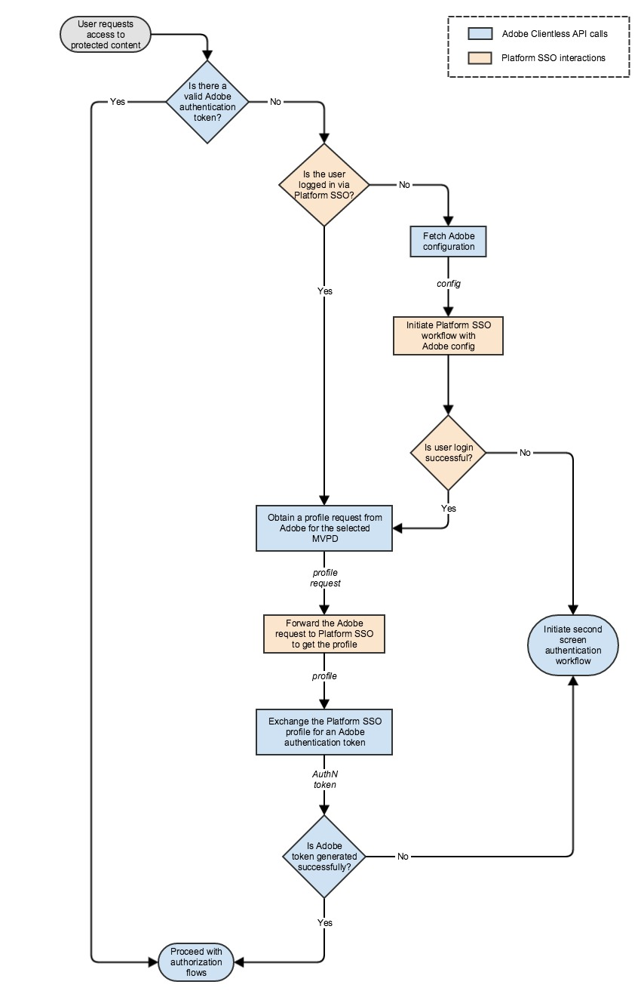

# （舊版） Apple SSO逐步指南(REST API V1) {#apple-sso-cookbook-rest-api-v1}

>[!IMPORTANT]
>
>此頁面上的內容僅供參考。 使用此API需要Adobe的目前授權。 不允許未經授權的使用。

>[!IMPORTANT]
>
> 請務必隨時瞭解彙總在[產品公告](/help/authentication/product-announcements.md)頁面中的最新Adobe Pass驗證產品公告和淘汰時間表。

Adobe Pass Authentication REST API V1支援在iOS、iPadOS或tvOS上執行之使用者端應用程式的一般使用者進行合作夥伴單一登入(SSO)。

此檔案可作為現有REST API V1檔案的擴充功能，可在[此處](/help/authentication/integration-guide-programmers/legacy/rest-api-v1/rest-api-reference.md)找到。

## 逐步指南 {#apple-sso-cookbook-rest-api-v1-cookbook}

為了從Apple SSO使用者體驗中獲益，應用程式需要整合Apple開發的[視訊訂閱者帳戶架構](https://developer.apple.com/documentation/videosubscriberaccount)，而針對Adobe Pass驗證REST API V1通訊，它需要遵循以下顯示的步驟順序。

### 許可權 {#apple-sso-cookbook-rest-api-v1-permission}

>[!TIP]
>
> **<u>專業秘訣：</u>**&#x200B;串流應用程式必須要求存取儲存在裝置層級的使用者訂閱資訊，使用者必須授予應用程式繼續的許可權，類似於提供裝置攝影機或麥克風的存取權。 必須使用Apple的[視訊訂閱者帳戶架構](https://developer.apple.com/documentation/videosubscriberaccount)為每個應用程式要求此許可權，裝置將會儲存使用者的選擇。

>[!TIP]
>
> **<u>專業秘訣：</u>**&#x200B;我們建議您說明Apple單一登入使用者體驗的優點，以鼓勵拒絕授予許可權存取訂閱資訊的使用者，但請注意，使用者可以變更其決定，方法是移至應用程式設定（電視提供者許可權存取）、iOS和iPadOS上的&#x200B;*`Settings -> TV Provider`*，或tvOS上的&#x200B;*`Settings -> Accounts -> TV Provider`*。

>[!TIP]
>
> **<u>專業秘訣：</u>**&#x200B;我們建議在應用程式進入前景狀態時要求使用者的許可權，因為應用程式可以在要求使用者驗證之前，隨時檢查[存取使用者訂閱資訊的許可權](https://developer.apple.com/documentation/videosubscriberaccount/vsaccountmanager/1949763-checkaccessstatus)。

### 驗證 {#apple-sso-cookbook-rest-api-v1-authentication}

* [是否有有效的Adobe驗證Token？](#step1)
* [使用者是否透過合作夥伴SSO登入？](#step2)
* [擷取Adobe設定](#step3)
* [使用Adobe設定啟動合作夥伴SSO工作流程](#step4)
* [使用者登入是否成功？](#step5)
* [從Adobe取得所選MVPD的設定檔請求](#step6)
* [將Adobe要求轉寄給合作夥伴SSO，以取得設定檔](#step7)
* [交換合作夥伴SSO設定檔以取得Adobe驗證權杖](#step8)
* [Adobe代號是否已成功產生？](#step9)
* [啟動一般驗證工作流程](#step10)
* [繼續授權流程](#step11)



#### 步驟：「是否有有效的Adobe驗證Token？」 {#step1}

>[!TIP]
>
> **<u>秘訣：</u>**&#x200B;透過Adobe Pass驗證媒體[檢查驗證權杖](/help/authentication/integration-guide-programmers/legacy/rest-api-v1/apis/check-authentication-token.md) API服務實作此專案。

#### 步驟：「使用者是否透過合作夥伴SSO登入？」 {#step2}

>[!TIP]
>
> **<u>秘訣：</u>**&#x200B;透過[視訊訂閱者帳戶架構](https://developer.apple.com/documentation/videosubscriberaccount)的媒體實作此專案。

* 應用程式必須檢查是否有[許可權才能存取](https://developer.apple.com/documentation/videosubscriberaccount/vsaccountmanager/1949763-checkaccessstatus)使用者的訂閱資訊，而且只有在使用者允許的情況下，才可繼續。
* 應用程式必須提交[要求](https://developer.apple.com/documentation/videosubscriberaccount/vsaccountmetadatarequest)以取得訂閱者帳戶資訊。
* 應用程式必須等候並處理[中繼資料](https://developer.apple.com/documentation/videosubscriberaccount/vsaccountmetadata)資訊。

>[!TIP]
>
> **<u>Pro提示：</u>**&#x200B;請遵循程式碼片段，並特別留意註解。

```swift
...
let videoSubscriberAccountManager: VSAccountManager = VSAccountManager();

videoSubscriberAccountManager.checkAccessStatus(options: [VSCheckAccessOption.prompt: true]) { (accessStatus, error) -> Void in
            switch (accessStatus) {
            // The user allows the application to access subscription information.
            case VSAccountAccessStatus.granted:
                    // Construct the request for subscriber account information.
                    let vsaMetadataRequest: VSAccountMetadataRequest = VSAccountMetadataRequest();

                    // This is actually the SAML Issuer not the channel ID.
                    vsaMetadataRequest.channelIdentifier = "https://saml.sp.auth.adobe.com";
    
                    // This is the subscription account information needed at this step.
                    vsaMetadataRequest.includeAccountProviderIdentifier = true;
                    
                    // This is the subscription account information needed at this step.
                    vsaMetadataRequest.includeAuthenticationExpirationDate = true;
                    
                    // This is going to make the Video Subscriber Account Framework to refrain from prompting the user with the providers picker at this step. 
                    vsaMetadataRequest.isInterruptionAllowed = false;
                    
                    // Submit the request for subscriber account information - accountProviderIdentifier.
                    videoSubscriberAccountManager.enqueue(vsaMetadataRequest) { vsaMetadata, vsaError in        
                        if (vsaMetadata != nil && vsaMetadata!.accountProviderIdentifier != nil) {
                            // The vsaMetadata!.authenticationExpirationDate will contain the expiration date for current authentication session.
                            // The vsaMetadata!.authenticationExpirationDate should be compared against current date.
                            ...
                            // The vsaMetadata!.accountProviderIdentifier will contain the provider identifier as it is known for the platform configuration.
                            // The vsaMetadata!.accountProviderIdentifier represents the platformMappingId in terms of Adobe Pass Authentication configuration.
                            ...
                            // The application must determine the MVPD id property value based on the platformMappingId property value obtained above.
                            // The application must use the MVPD id further in its communication with Adobe Pass Authentication services.
                            ...
                            // Continue with the "Obtain a profile request from Adobe for the selected MVPD" step.
                            ...
                            // Continue with the "Forward the Adobe request to Partner SSO to obtain the profile" step.
                            ...
                        } else {
                            // The user is not authenticated at platform level, continue with the "Fetch Adobe configuration" step.
                            ...
                        }
                    }
        
            // The user has not yet made a choice or does not allow the application to access subscription information.
            default:
                // Continue with the "Initiate regular authentication workflow" step.
                ...
            }
}
...  
```

#### 步驟：「擷取Adobe設定」 {#step3}

>[!TIP]
>
> **<u>秘訣：</u>**&#x200B;透過Adobe Pass驗證媒體實作此專案[提供MVPD清單](/help/authentication/integration-guide-programmers/legacy/rest-api-v1/apis/provide-mvpd-list.md) API服務。

>[!TIP]
>
> **<u>專業秘訣：</u>**&#x200B;請留意MVPD屬性： *`enablePlatformServices`*、*`boardingStatus`*、*`displayInPlatformPicker`*、*`platformMappingId`*、*`requiredMetadataFields`*，並特別注意其他步驟的程式碼片段中顯示的註解。

#### 步驟「使用Adobe設定啟動合作夥伴SSO工作流程」 {#step4}

>[!TIP]
>
> **<u>秘訣：</u>**&#x200B;透過[視訊訂閱者帳戶架構](https://developer.apple.com/documentation/videosubscriberaccount)的媒體實作此專案。

* 應用程式必須檢查是否有[許可權才能存取](https://developer.apple.com/documentation/videosubscriberaccount/vsaccountmanager/1949763-checkaccessstatus)使用者的訂閱資訊，而且只有在使用者允許的情況下，才可繼續。
* 應用程式必須提供VSAccountManager的[委派](https://developer.apple.com/documentation/videosubscriberaccount/vsaccountmanagerdelegate)。
* 應用程式必須提交[要求](https://developer.apple.com/documentation/videosubscriberaccount/vsaccountmetadatarequest)以取得訂閱者帳戶資訊。
* 應用程式必須等候並處理[中繼資料](https://developer.apple.com/documentation/videosubscriberaccount/vsaccountmetadata)資訊。

>[!TIP]
>
> **<u>Pro提示：</u>**&#x200B;請遵循程式碼片段，並特別留意註解。

```swift
    ...
    let videoSubscriberAccountManager: VSAccountManager = VSAccountManager();
    
    // This must be a class implementing the VSAccountManagerDelegate protocol.
    let videoSubscriberAccountManagerDelegate: VideoSubscriberAccountManagerDelegate = VideoSubscriberAccountManagerDelegate();
    
    videoSubscriberAccountManager.delegate = videoSubscriberAccountManagerDelegate;
    
    videoSubscriberAccountManager.checkAccessStatus(options: [VSCheckAccessOption.prompt: true]) { (accessStatus, error) -> Void in
                switch (accessStatus) {
                // The user allows the application to access subscription information.
                case VSAccountAccessStatus.granted:
                        // Construct the request for subscriber account information.
                        let vsaMetadataRequest: VSAccountMetadataRequest = VSAccountMetadataRequest();
    
                        // This is actually the SAML Issuer not the channel ID.
                        vsaMetadataRequest.channelIdentifier = "https://saml.sp.auth.adobe.com";
        
                        // This is the subscription account information needed at this step.
                        vsaMetadataRequest.includeAccountProviderIdentifier = true;
                        
                        // This is the subscription account information needed at this step.
                        vsaMetadataRequest.includeAuthenticationExpirationDate = true;
                        
                        // This is going to make the Video Subscriber Account Framework to prompt the user with the providers picker at this step. 
                        vsaMetadataRequest.isInterruptionAllowed = true;
                        
                        // This can be computed from the [Adobe Pass Authentication](/help/authentication/provide-mvpd-list.md) service response in order to filter the TV providers from the Apple picker.
                        vsaMetadataRequest.supportedAccountProviderIdentifiers = supportedAccountProviderIdentifiers;
    
                        // This can be computed from the [Adobe Pass Authentication](/help/authentication/provide-mvpd-list.md) service response in order to sort the TV providers from the Apple picker.
                        if #available(iOS 11.0, tvOS 11, *) {
                            vsaMetadataRequest.featuredAccountProviderIdentifiers = featuredAccountProviderIdentifiers;
                        }
                        
                        // Submit the request for subscriber account information - accountProviderIdentifier.
                        videoSubscriberAccountManager.enqueue(vsaMetadataRequest) { vsaMetadata, vsaError in                        
                            // This represents the checks for the "Is user login successful?" step.
                            if (vsaMetadata != nil && vsaMetadata!.accountProviderIdentifier != nil) {
                                // The vsaMetadata!.authenticationExpirationDate will contain the expiration date for current authentication session.
                                // The vsaMetadata!.authenticationExpirationDate should be compared against current date.
                                ...
                                // The vsaMetadata!.accountProviderIdentifier will contain the provider identifier as it is known for the platform configuration.
                                // The vsaMetadata!.accountProviderIdentifier represents the platformMappingId in terms of Adobe Pass Authentication configuration.
                                ...
                                // The application must determine the MVPD id property value based on the platformMappingId property value obtained above.
                                // The application must use the MVPD id further in its communication with Adobe Pass Authentication services.
                                ...
                                // Continue with the "Obtain a profile request from Adobe for the selected MVPD" step.
                                ...
                                // Continue with the "Forward the Adobe request to Partner SSO to obtain the profile" step.
                                ...
                            } else {
                                // The user is not authenticated at platform level.
                                if (vsaError != nil) {
                                    // The application can check to see if the user selected a provider which is present in Apple picker, but the provider is not onboarded in platform SSO.
                                    if let error: NSError = (vsaError! as NSError), error.code == 1, let appleMsoId = error.userInfo["VSErrorInfoKeyUnsupportedProviderIdentifier"] as! String? {
                                        var mvpd: Mvpd? = nil;
    
                                        // The requestor.mvpds must be computed during the "Fetch Adobe configuration" step. 
                                        for provider in requestor.mvpds {
                                            if provider.platformMappingId == appleMsoId {
                                                mvpd = provider;
                                                break;
                                            }
                                        }
                                        
                                        if mvpd != nil {
                                            // Continue with the "Initiate regular authentication workflow" step, but you can skip prompting the user with your MVPD picker and use the mvpd selection, therefore creating a better UX.
                                            ...
                                        } else {
                                            // Continue with the "Initiate regular authentication workflow" step.
                                            ...
                                        }
                                    } else {
                                        // Continue with the "Initiate regular authentication workflow" step.
                                        ...
                                    }
                                } else {
                                    // Continue with the "Initiate regular authentication workflow" step.
                                    ...
                                }
                            }
                        }
            
                // The user has not yet made a choice or does not allow the application to access subscription information.
                default:
                    // Continue with the "Initiate regular authentication workflow" step.
                    ...
                }
    }
    ...
```

#### 步驟：「使用者登入是否成功？」 {#step5}

>[!TIP]
>
> **<u>專業秘訣：</u>**&#x200B;請注意[「使用Adobe設定啟動合作夥伴SSO工作流程」](#step4)步驟中的程式碼片段。 如果&#x200B;*`vsaMetadata!.accountProviderIdentifier`*&#x200B;包含有效值且目前日期未超過&#x200B;*`vsaMetadata!.authenticationExpirationDate`*&#x200B;值，則使用者登入成功。

#### 步驟「從Adobe取得所選MVPD的設定檔請求」 {#step6}

>[!TIP]
>
> **<u>秘訣：</u>**&#x200B;透過Adobe Pass驗證[設定檔要求](/help/authentication/integration-guide-programmers/legacy/rest-api-v1/apis/retrieve-profilerequest.md) API服務的媒體實作此專案。

>[!TIP]
>
> **<u>專業秘訣：</u>**&#x200B;請注意，從視訊訂閱者帳戶架構取得的提供者識別碼，在Adobe Pass驗證組態方面代表&#x200B;*`platformMappingId`*。 因此，應用程式必須透過MVPD驗證&#x200B;*`platformMappingId`*&#x200B;提供Adobe Pass清單[&#x200B; API服務，使用](/help/authentication/integration-guide-programmers/legacy/rest-api-v1/apis/provide-mvpd-list.md)值來判斷MVPD ID屬性值。

#### 步驟：「將Adobe要求轉寄給合作夥伴SSO以取得設定檔」 {#step7}

>[!TIP]
>
> **<u>秘訣：</u>**&#x200B;透過[視訊訂閱者帳戶架構](https://developer.apple.com/documentation/videosubscriberaccount)的媒體實作此專案。


* 應用程式必須檢查是否有[許可權才能存取](https://developer.apple.com/documentation/videosubscriberaccount/vsaccountmanager/1949763-checkaccessstatus)使用者的訂閱資訊，而且只有在使用者允許的情況下，才可繼續。
* 應用程式必須提交[要求](https://developer.apple.com/documentation/videosubscriberaccount/vsaccountmetadatarequest)以取得訂閱者帳戶資訊。
* 應用程式必須等候並處理[中繼資料](https://developer.apple.com/documentation/videosubscriberaccount/vsaccountmetadata)資訊。

>[!TIP]
>
> **<u>Pro提示：</u>**&#x200B;請遵循程式碼片段，並特別留意註解。

```swift
    ...
    let videoSubscriberAccountManager: VSAccountManager = VSAccountManager();
    
    videoSubscriberAccountManager.checkAccessStatus(options: [VSCheckAccessOption.prompt: true]) { (accessStatus, error) -> Void in
                switch (accessStatus) {
                // The user allows the application to access subscription information.
                case VSAccountAccessStatus.granted:
                        // Construct the request for subscriber account information.
                        let vsaMetadataRequest: VSAccountMetadataRequest = VSAccountMetadataRequest();
    
                        // This is actually the SAML Issuer not the channel ID.
                        vsaMetadataRequest.channelIdentifier = "https://saml.sp.auth.adobe.com";
        
                        // This is going to include subscription account information which should match the provider determined in a previous step.
                        vsaMetadataRequest.includeAccountProviderIdentifier = true;
                        
                        // This is going to include subscription account information which should match the provider determined in a previous step.
                        vsaMetadataRequest.includeAuthenticationExpirationDate = true;
                        
                        // This is going to make the Video Subscriber Account Framework to refrain from prompting the user with the providers picker at this step. 
                        vsaMetadataRequest.isInterruptionAllowed = false;
    
                        // This are the user metadata fields expected to be available on a successful login and are determined from the [Adobe Pass Authentication](/help/authentication/provide-mvpd-list.md) service. Look for the requiredMetadataFields associated with the provider determined in a previous step.
                        vsaMetadataRequest.attributeNames = requiredMetadataFields;
    
                        // This is the payload from [Adobe Pass Authentication](/help/authentication/retrieve-profilerequest.md) service.
                        vsaMetadataRequest.verificationToken = profileRequestPayload;
                        
                        // Submit the request for subscriber account information.
                        videoSubscriberAccountManager.enqueue(vsaMetadataRequest) { vsaMetadata, vsaError in
                            if (vsaMetadata != nil && vsaMetadata!.samlAttributeQueryResponse != nil) {
                                var samlResponse: String? = vsaMetadata!.samlAttributeQueryResponse!;
                                
                                // Remove new lines, new tabs and spaces.
                                samlResponse = samlResponse?.replacingOccurrences(of: "[ \\t]+", with: " ", options: String.CompareOptions.regularExpression);
                                samlResponse = samlResponse?.components(separatedBy: CharacterSet.newlines).joined(separator: "");
                                samlResponse = samlResponse?.trimmingCharacters(in: CharacterSet.whitespacesAndNewlines);
                                
                                // Base64 encode.
                                samlResponse = samlResponse?.data(using: .utf8)?.base64EncodedString(options: []);
                                
                                // URL encode. Please be aware not to double URL encode it further.
                                samlResponse = samlResponse?.addingPercentEncoding(withAllowedCharacters: CharacterSet.init(charactersIn: "!*'();:@&=+$,/?%#[]").inverted);
                                
                                // Continue with the "Exchange the Partner SSO profile for an Adobe authentication token" step.
                                ...
                            } else {
                                // Continue with the "Initiate regular authentication workflow" step.
                                ...
                            }
                        }
                        
                // The user has not yet made a choice or does not allow the application to access subscription information.
                default:
                    // Continue with the "Initiate regular authentication workflow" step.
                    ...
                }
    }
    ...
```

#### 步驟：「交換合作夥伴SSO設定檔以取得Adobe驗證Token」 {#step8}

>[!TIP]
>
> **<u>秘訣：</u>**&#x200B;透過Adobe Pass驗證[Token Exchange](/help/authentication/integration-guide-programmers/legacy/rest-api-v1/apis/token-exchange.md) API服務的媒體實作此專案。

>[!TIP]
>
> **<u>專業秘訣：</u>**&#x200B;請注意[「將Adobe要求轉寄給合作夥伴SSO以取得設定檔」](#step7)步驟中的程式碼片段。 此&#x200B;*`vsaMetadata!.samlAttributeQueryResponse!`*&#x200B;代表需要在&#x200B;*`SAMLResponse`* Token Exchange[上傳遞的](/help/authentication/integration-guide-programmers/legacy/rest-api-v1/apis/token-exchange.md)，而且需要字串操控和編碼（*Base64*&#x200B;編碼和&#x200B;*URL*&#x200B;編碼後），才能進行呼叫。

#### 步驟：「Adobe Token是否已成功產生？」 {#step9}

>[!TIP]
>
> **<u>提示：</u>**&#x200B;透過Adobe Pass驗證[權杖交換](/help/authentication/integration-guide-programmers/legacy/rest-api-v1/apis/token-exchange.md)成功回應的媒體實作此動作，此回應將為&#x200B;*`204 No Content`*，表示已成功建立權杖，且已準備好用於授權流程。

#### 步驟：「啟動一般驗證工作流程」 {#step10}

>[!TIP]
>
> **<u>秘訣：</u>**&#x200B;透過Adobe Pass驗證[註冊代碼要求](/help/authentication/integration-guide-programmers/legacy/rest-api-v1/apis/registration-code-request.md)、[啟動驗證](/help/authentication/integration-guide-programmers/legacy/rest-api-v1/apis/initiate-authentication.md)和[擷取驗證Token](/help/authentication/integration-guide-programmers/legacy/rest-api-v1/apis/retrieve-authentication-token.md)或[檢查驗證Token](/help/authentication/integration-guide-programmers/legacy/rest-api-v1/apis/check-authentication-token.md) API服務來實作此專案。

>[!TIP]
>
> **<u>專業秘訣：</u>**&#x200B;請依照下列步驟進行tvOS實作。

* 應用程式必須[取得註冊碼](/help/authentication/integration-guide-programmers/legacy/rest-api-v1/apis/registration-code-request.md)，並在第一個裝置（熒幕）上呈現給一般使用者。
* 應用程式必須在取得註冊碼後，啟動[輪詢以認可第一部裝置（熒幕）上的驗證狀態](/help/authentication/integration-guide-programmers/legacy/rest-api-v1/apis/retrieve-authentication-token.md)。
* 使用註冊碼時，另一個應用程式必須在第二部裝置（熒幕）上[起始驗證](/help/authentication/integration-guide-programmers/legacy/rest-api-v1/apis/initiate-authentication.md)。
* 產生驗證Token時，應用程式必須停止[輪詢第1部裝置（熒幕）上的](/help/authentication/integration-guide-programmers/legacy/rest-api-v1/apis/retrieve-authentication-token.md)。

>[!TIP]
>
> **<u>專業秘訣：</u>**&#x200B;請依照下列步驟實作iOS/iPadOS。

* 應用程式必須[取得註冊碼](/help/authentication/integration-guide-programmers/legacy/rest-api-v1/apis/registration-code-request.md)，此註冊碼不應在第一部裝置（熒幕）上呈現給一般使用者。
* 應用程式必須在第一個裝置（熒幕）上[使用登入碼和](/help/authentication/integration-guide-programmers/legacy/rest-api-v1/apis/initiate-authentication.md)WKWebView[或](https://developer.apple.com/documentation/webkit/wkwebview)SFSafariViewController[元件，來啟動驗證](https://developer.apple.com/documentation/safariservices/sfsafariviewcontroller)。
* 在[WKWebView](/help/authentication/integration-guide-programmers/legacy/rest-api-v1/apis/retrieve-authentication-token.md)或[SFSafariViewController](https://developer.apple.com/documentation/webkit/wkwebview)元件關閉後，應用程式必須啟動[輪詢，才能知道第一個裝置（熒幕）上的驗證狀態](https://developer.apple.com/documentation/safariservices/sfsafariviewcontroller)。
* 產生驗證Token時，應用程式必須停止[輪詢第1部裝置（熒幕）上的](/help/authentication/integration-guide-programmers/legacy/rest-api-v1/apis/retrieve-authentication-token.md)。

#### 步驟：「繼續授權流程」 {#step11}

>[!TIP]
>
> **<u>秘訣：</u>**&#x200B;透過Adobe Pass驗證媒體[啟動授權](/help/authentication/integration-guide-programmers/legacy/rest-api-v1/apis/initiate-authorization.md)和[取得短媒體權杖](/help/authentication/integration-guide-programmers/legacy/rest-api-v1/apis/obtain-short-media-token.md) API服務來實作此專案。

### 登出 {#apple-sso-cookbook-rest-api-v1-logout}

[視訊訂閱者帳戶架構](https://developer.apple.com/documentation/videosubscriberaccount)未提供API以程式設計方式登出已在裝置系統層級登入其電視提供者帳戶的人員。 因此，若要讓登出完全生效，使用者必須從iOS/iPadOS上的&#x200B;*`Settings -> TV Provider`*&#x200B;或tvOS上的&#x200B;*`Settings -> Accounts -> TV Provider`*&#x200B;明確登出。 使用者可以選擇從特定應用程式設定區段（電視提供者存取）撤銷存取使用者訂閱資訊的許可權。

>[!TIP]
>
> **<u>秘訣：</u>**&#x200B;透過Adobe Pass驗證[使用者中繼資料呼叫](/help/authentication/integration-guide-programmers/legacy/rest-api-v1/apis/user-metadata.md)和[登出](/help/authentication/integration-guide-programmers/legacy/rest-api-v1/apis/initiate-logout.md) API服務的媒體實作此專案。

>[!TIP]
>
> **<u>專業秘訣：</u>**&#x200B;請依照下列步驟進行tvOS實作。

* 應用程式必須使用Adobe Pass Authentication Service的&quot;*tokenSource&quot;* [使用者中繼資料](/help/authentication/integration-guide-programmers/legacy/rest-api-v1/apis/user-metadata.md)，判斷是否因為透過合作夥伴SSO登入而發生驗證。
* 若&#x200B;*`Settings -> Accounts -> TV Provider`*「tokenSource」**值等於「** Apple」，應用程式必須指示/提示使用者僅在tvOS *上*&#x200B;從&#x200B;*明確登出。*
* 應用程式必須使用直接HTTP呼叫，從Adobe Pass驗證服務[起始登出](/help/authentication/integration-guide-programmers/legacy/rest-api-v1/apis/initiate-logout.md)。 這無助於在MVPD端清理工作階段。

>[!TIP]
>
> **<u>專業秘訣：</u>**&#x200B;請依照下列步驟實作iOS/iPadOS。

* 應用程式必須使用Adobe Pass Authentication Service的&quot;*tokenSource&quot;* [使用者中繼資料](/help/authentication/integration-guide-programmers/legacy/rest-api-v1/apis/user-metadata.md)，判斷是否因為透過合作夥伴SSO登入而發生驗證。
* 若&#x200B;*`Settings -> TV Provider`*「tokenSource」**值等於**「Apple」*，應用程式必須指示/提示使用者僅在iOS/iPadOS*&#x200B;上&#x200B;*從*&#x200B;明確登出。
* 應用程式必須使用[WKWebView](/help/authentication/integration-guide-programmers/legacy/rest-api-v1/apis/initiate-logout.md)或[SFSafariViewController](https://developer.apple.com/documentation/webkit/wkwebview)元件，從Adobe Pass Authentication Service [起始登出](https://developer.apple.com/documentation/safariservices/sfsafariviewcontroller)。 這將有助於MVPD端的工作階段清理。
