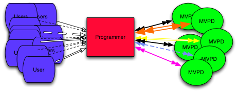

# 程式設計師整合指南 {#programmer-integration-guide}

>[!IMPORTANT]
>
> 此頁面上的內容僅供參考。 使用此API需要Adobe的目前授權。 不允許未經授權的使用。

本整合指南適用於計畫與Adobe® Pass驗證整合的內容提供者（程式設計人員）。

在當今的數位環境中，檢視者可以隨時隨地存取網際網路，並要求存取您的受保護內容。 他們可能想要觀看單次事件，或想要取得您正在播放之整個電視影集的串流權利。

在授與受保護內容的存取權之前，您必須確定檢視者是否有權使用它。 主要問題包括：

* **檢視器是否擁有使用中的多頻道視訊節目經銷商(MVPD)訂閱？**
* **該訂閱是否包含您的程式設計？**

## 適用於所有電視的Adobe Pass驗證 {#adobe-pass-authentication-for-tv-everywhere}

對於程式設計師而言，決定權益並不總是簡單明瞭。 MVPDs是客戶識別資料和存取許可權的託管者。 讓事情進一步複雜化的是，程式設計師的檢視者可能會訂閱各種MVPD，每種都有獨特的作業系統。 這些複雜因素使得驗證權益在技術上既困難又耗用大量資源。

{align="center"}

*由程式設計師直接決定的使用者軟體權利檔案*

Adobe Pass驗證可安全促進程式設計師與MVPD之間的權益交易，讓您快速、輕鬆且安全地向符合資格的檢視者提供受保護的內容。

{align="center"}

*Adobe Pass驗證所中介的使用者軟體權利檔案*

Adobe Pass Authentication作為Proxy，透過為雙方提供安全一致的介面，促進程式設計師和MVPD之間的權利流通。

對於程式設計師而言，Adobe Pass驗證提供API作為&#x200B;**Standard**&#x200B;或&#x200B;**Premium**&#x200B;層級的一部分：

* 標準Adobe Pass驗證API：
   * [REST API DCR](/help/authentication/integration-guide-programmers/rest-apis/rest-api-dcr/dynamic-client-registration-overview.md)
   * [REST API V2](/help/authentication/integration-guide-programmers/rest-apis/rest-api-v2/apis/rest-api-v2-apis-overview.md)

* Premium Adobe Pass驗證API：
   * [重設Temp Pass API](/help/authentication/integration-guide-programmers/features-premium/temporary-access/temp-pass-feature.md#reset-tempass-api-access)
      * [TempPass功能](/help/authentication/integration-guide-programmers/features-premium/temporary-access/temp-pass-feature.md)
   * [降級API](/help/authentication/integration-guide-programmers/features-premium/degraded-access/degradation-feature.md#degradation-api-access)
      * [退化特徵](/help/authentication/integration-guide-programmers/features-premium/degraded-access/degradation-feature.md)
   * [權益服務監控API](/help/authentication/integration-guide-programmers/features-premium/esm/entitlement-service-monitoring-api.md)

### 使用案例 {#use-cases}

本節進一步概述Adobe Pass Authentication支援的程式設計師整合使用案例：

* 具有單一通道網路的程式設計師(TVE)應用程式

  如此一來，程式設計師就能讓檢視者存取TVE應用程式中單一品牌頻道網路的內容。

* 具有多頻道網路的程式設計師(TVE)應用程式

  如此一來，程式設計師就能讓檢視者存取單一TVE應用程式中來自多頻道網路的內容。

* 特別事件的程式設計師(TVE)應用程式

  這可讓程式設計師為檢視者提供特殊事件內容的存取權，這些特殊事件可能不是MVPD軟體權利檔案資料庫中的資源，例如一般管道。

| **階段** | **優先順序** | **使用案例** | **檔案** |
|----------------------|--------------|-------------------------------------------------------------------------|----------------------------------------------------------------------------------------------------------------------------------------------------------------------------------|
| **驗證** | **高** | 驗證 | 如需詳細資訊，請參閱[驗證階段](#authentication-phase)區段下彙總的檔案。 |
|                      | **高** | 家庭式驗證(HBA) | 如需詳細資訊，請參閱[以住家為基礎的驗證](/help/authentication/integration-guide-programmers/features-standard/hba-access/home-based-authentication.md)。 |
|                      | **高** | 單一登入(SSO) | 如需詳細資訊，請參閱[單一登入(SSO)](#sso)區段下彙總的檔案。 |
|                      | **高** | 選取MVPD | 如需詳細資訊，請參閱[組態階段](#configuration-phase)區段下彙總的檔案。 |
|                      | **Medium** | 品牌化MVPD登入頁面 | 可讓MVPD為登入頁面提供程式設計師或服務提供者專屬的品牌，包括支援預設語言偏好設定。 |
|                      | **高** | 為每個平台設定存留時間(TTL)值 | 如需詳細資訊，請參閱[TVE儀表板整合使用手冊](/help/authentication/user-guide-tve-dashboard/tve-dashboard-integrations.md#most-used-flows)。 |
| **預先授權** | **低** | 預先授權（預檢授權） | 如需詳細資訊，請參閱[預先授權階段](#preauthorization-phase)區段下彙總的檔案。 |
|                      | **Medium** | 增強的錯誤碼 | 如需詳細資訊，請參閱[增強錯誤碼](/help/authentication/integration-guide-programmers/features-standard/error-reporting/enhanced-error-codes.md)。 |
| **授權** | **高** | Authorization | 如需詳細資訊，請參閱[授權階段](#authorization-phase)區段下彙總的檔案。 |
|                      | **高** | 不同管道授權 | 可讓使用者從單一TVE應用程式內的多個管道網路存取內容。 程式設計師可以發出通道特定的授權呼叫以驗證權益。 |
|                      | **低** | 資產層級授權 | 啟用MVPD在授權期間收集個別內容資產的詳細分析。 |
|                      | **Medium** | 增強的錯誤碼 | 如需詳細資訊，請參閱[增強錯誤碼](/help/authentication/integration-guide-programmers/features-standard/error-reporting/enhanced-error-codes.md)。 |
|                      | **高** | 程式設計人員Federated Player — 具有頁面層級授權 | 如需詳細資訊，請參閱[媒體代號](/help/authentication/integration-guide-programmers/features-standard/entitlements/media-tokens.md)。 |
|                      | **Medium** | 程式設計師同盟播放器 — 具內部播放器授權 | 如需詳細資訊，請參閱[媒體代號](/help/authentication/integration-guide-programmers/features-standard/entitlements/media-tokens.md)。 |
|                      | **高** | 聯合播放器 — 託管於MVPD入口網站，提供頁面層級授權 | 如需詳細資訊，請參閱[媒體代號](/help/authentication/integration-guide-programmers/features-standard/entitlements/media-tokens.md)。 |
|                      | **低** | 家長監護 — 授權要求中的內容分級 | 讓程式設計師將內容評等納入MVPD授權請求中，這對資產層級的授權很有用。 |
|                      | **低** | 家長監護 — 根據使用者屬性的內容篩選 | 讓程式設計師檢查使用者允許的最大內容分級，並據此篩選可用內容。 |
| **登出** | **Medium** | 登出 | 如需詳細資訊，請參閱[登出階段](#logout-phase)區段下彙總的檔案。 |

## 權益流程 {#entitlement-flow}

權利流程是程式設計人員(TVE)應用程式必須完成的一系列步驟，才能將受保護的內容串流。 此流程包含下列階段：

* [註冊階段](#registration-phase)
* [設定階段](#configuration-phase)
* [驗證階段](#authentication-phase)
* [（選擇性）預先授權階段](#preauthorization-phase)
* [授權階段](#authorization-phase)
* [登出階段](#logout-phase)

使用者初次造訪程式設計人員(TVE)應用程式時，權益流程會依照概述的順序進行。 不過，在後續的造訪中，應用程式可能會根據註冊或驗證的狀態以及適用的檢視原則，略過某些步驟。

如需軟體權利檔案流程及其階段的詳細探索，請繼續閱讀本檔案，並在參閱隨附的逐步指南後，取得其他深入見解：

* [REST API V2逐步指南（使用者端對伺服器）](/help/authentication/integration-guide-programmers/rest-apis/rest-api-v2/cookbooks/rest-api-v2-cookbook-client-server.md)
* [REST API V2逐步指南（伺服器對伺服器）](/help/authentication/integration-guide-programmers/rest-apis/rest-api-v2/cookbooks/rest-api-v2-cookbook-server-server.md)

>[!NOTE]
>
> 本檔案使用程式設計工具(TVE)應用程式，以統稱為Adobe Pass驗證支援之不同平台（瀏覽器、行動裝置、電視連線裝置等）上執行的應用程式型別。

### 註冊階段 {#registration-phase}

註冊階段的目的是透過[動態使用者端註冊(DCR)](/help/authentication/integration-guide-programmers/rest-apis/rest-api-dcr/dynamic-client-registration-overview.md)程式，針對Adobe Pass驗證註冊使用者端應用程式。

動態使用者端註冊(DCR)程式要求使用者端應用程式取得一對使用者端憑證，並擷取存取權杖作為註冊階段的最終目標。

**API**

* [擷取使用者端認證](/help/authentication/integration-guide-programmers/rest-apis/rest-api-dcr/apis/dynamic-client-registration-apis-retrieve-client-credentials.md)
* [擷取存取權杖](/help/authentication/integration-guide-programmers/rest-apis/rest-api-dcr/apis/dynamic-client-registration-apis-retrieve-access-token.md)

**流量**

* [動態使用者端註冊流程](/help/authentication/integration-guide-programmers/rest-apis/rest-api-dcr/flows/dynamic-client-registration-flow.md)

**常見問題集**

* [註冊階段常見問題集](/help/authentication/integration-guide-programmers/rest-apis/rest-api-v2/rest-api-v2-faqs.md#registration-phase-faqs-general)。

### 設定階段 {#configuration-phase}

「設定階段」的目的是提供使用者端應用程式主動整合的MVPD清單，以及Adobe Pass驗證針對每個MVPD儲存的設定詳細資訊。

當使用者端應用程式需要要求使用者選取他們的電視提供者時，「組態階段」會成為「驗證階段」的先決條件步驟。

**API**

* [擷取特定服務提供者的設定](/help/authentication/integration-guide-programmers/rest-apis/rest-api-v2/apis/configuration-apis/rest-api-v2-configuration-apis-retrieve-configuration-for-specific-service-provider.md)

**常見問題集**

* [組態階段常見問答集](/help/authentication/integration-guide-programmers/rest-apis/rest-api-v2/rest-api-v2-faqs.md#configuration-phase-faqs-general)。

>[!TIP]
>
> TVE應用程式應包含MVPD選擇介面，讓使用者可輕鬆識別及選擇電視提供者。

### 驗證階段 {#authentication-phase}

驗證階段的目的是讓使用者端應用程式能夠透過MVPD驗證使用者的身分，並取得使用者中繼資料資訊。

當使用者端應用程式需要播放內容時，「驗證階段」會成為「預先授權階段」或「授權階段」的先決條件步驟。

成功的驗證會產生與應用程式、裝置和服務提供者繫結的設定檔，其中也包含使用者中繼資料資訊。

**高階步驟**

下列步驟概述在SAML整合情況下的高階步驟：

1. **程式設計師的應用程式（網站）載入**\
   使用者導覽至程式設計師的應用程式（網站），其整合了Adobe Pass驗證[REST API V2](/help/authentication/integration-guide-programmers/rest-apis/rest-api-v2/rest-api-v2-overview.md)。

1. **受保護的內容要求**\
   當使用者嘗試存取受保護的內容時，程式設計師的應用程式會顯示可供使用者選取的MVPD清單。

1. **驗證要求初始化**\
   選取MVPD後，系統會將使用者重新導向至Adobe Pass驗證伺服器。 若是SAML整合，此處會產生所選MVPD的加密SAML驗證請求。 此要求會代表程式設計師傳送至MVPD。 根據MVPD的系統，使用者的瀏覽器會重新導向至MVPD的登入頁面，或內嵌於程式設計師應用程式中的登入iFrame。

1. **MVPD登入**\
   MVPD接受請求並顯示其登入介面，可透過重新導向或iFrame進行。

1. **使用者登入及驗證**\
   使用者使用其MVPD憑證登入。 MVPD會驗證使用者的訂閱狀態，並建立自己的HTTP工作階段。

1. **MVPD對Adobe Pass驗證的回應**\
   驗證完成後，MVPD會產生SAML回應（加密）並將其傳回Adobe Pass驗證。

1. **設定檔產生**\
   Adobe Pass驗證會驗證SAML回應、產生快取的使用者設定檔，並將使用者重新導向回程式設計師的應用程式（網站）。

**API**

* [建立驗證工作階段](/help/authentication/integration-guide-programmers/rest-apis/rest-api-v2/apis/sessions-apis/rest-api-v2-sessions-apis-create-authentication-session.md)
* [繼續驗證工作階段](/help/authentication/integration-guide-programmers/rest-apis/rest-api-v2/apis/sessions-apis/rest-api-v2-sessions-apis-resume-authentication-session.md)
* [擷取驗證工作階段](/help/authentication/integration-guide-programmers/rest-apis/rest-api-v2/apis/sessions-apis/rest-api-v2-sessions-apis-retrieve-authentication-session-information-using-code.md)
* [在使用者代理程式中執行驗證](/help/authentication/integration-guide-programmers/rest-apis/rest-api-v2/apis/sessions-apis/rest-api-v2-sessions-apis-perform-authentication-in-user-agent.md)
* [擷取設定檔](/help/authentication/integration-guide-programmers/rest-apis/rest-api-v2/apis/profiles-apis/rest-api-v2-profiles-apis-retrieve-profiles.md)
* [擷取特定mvpd的設定檔](/help/authentication/integration-guide-programmers/rest-apis/rest-api-v2/apis/profiles-apis/rest-api-v2-profiles-apis-retrieve-profile-for-specific-mvpd.md)
* [擷取特定程式碼的設定檔](/help/authentication/integration-guide-programmers/rest-apis/rest-api-v2/apis/profiles-apis/rest-api-v2-profiles-apis-retrieve-profile-for-specific-code.md)

**流量**

* [主要應用程式內執行的基本驗證流程](/help/authentication/integration-guide-programmers/rest-apis/rest-api-v2/flows/basic-access-flows/rest-api-v2-basic-authentication-primary-application-flow.md)
* [在次要應用程式內執行的基本驗證流程](/help/authentication/integration-guide-programmers/rest-apis/rest-api-v2/flows/basic-access-flows/rest-api-v2-basic-authentication-secondary-application-flow.md)
* [主要應用程式內執行的基本設定檔流程](/help/authentication/integration-guide-programmers/rest-apis/rest-api-v2/flows/basic-access-flows/rest-api-v2-basic-profiles-primary-application-flow.md)
* [在次要應用程式內執行的基本設定檔流程](/help/authentication/integration-guide-programmers/rest-apis/rest-api-v2/flows/basic-access-flows/rest-api-v2-basic-profiles-secondary-application-flow.md)

**常見問題集**

* [驗證階段常見問題集](/help/authentication/integration-guide-programmers/rest-apis/rest-api-v2/rest-api-v2-faqs.md#authentication-phase-faqs-general)。

>[!TIP]
>
> TVE應用程式應清楚傳達使用者的驗證狀態，例如在「已鎖定」或「已解鎖」圖示旁邊顯示其MVPD標誌，以指出受保護內容的協助工具。

#### 單一登入(SSO) {#single-sign-on}

**API**

* [擷取合作夥伴驗證請求](/help/authentication/integration-guide-programmers/rest-apis/rest-api-v2/apis/partner-single-sign-on-apis/rest-api-v2-partner-single-sign-on-apis-retrieve-partner-authentication-request.md)
* [使用合作夥伴驗證回應建立和擷取設定檔](/help/authentication/integration-guide-programmers/rest-apis/rest-api-v2/apis/partner-single-sign-on-apis/rest-api-v2-partner-single-sign-on-apis-retrieve-profile-using-partner-authentication-response.md)

**流量**

* [使用合作夥伴流程的單一登入](/help/authentication/integration-guide-programmers/rest-apis/rest-api-v2/flows/single-sign-on-access-flows/rest-api-v2-single-sign-on-partner-flows.md)
* [使用平台身分流程的單一登入](/help/authentication/integration-guide-programmers/rest-apis/rest-api-v2/flows/single-sign-on-access-flows/rest-api-v2-single-sign-on-platform-identity-flows.md)
* [使用服務權杖流程的單一登入](/help/authentication/integration-guide-programmers/rest-apis/rest-api-v2/flows/single-sign-on-access-flows/rest-api-v2-single-sign-on-service-token-flows.md)

### （選擇性）預先授權階段 {#preauthorization-phase}

預先授權階段的目的是讓使用者端應用程式能夠在其目錄中呈現使用者有權存取的資源子集。

當使用者第一次開啟使用者端應用程式或導覽至新區段時，「預先授權階段」可以增強使用者體驗。

**API**

* [擷取預先授權決定](/help/authentication/integration-guide-programmers/rest-apis/rest-api-v2/apis/decisions-apis/rest-api-v2-decisions-apis-retrieve-preauthorization-decisions-using-specific-mvpd.md)

**流量**

* [主要應用程式內執行的基本預先授權流程](/help/authentication/integration-guide-programmers/rest-apis/rest-api-v2/flows/basic-access-flows/rest-api-v2-basic-preauthorization-primary-application-flow.md)

**常見問題集**

* [預先授權階段常見問題集](/help/authentication/integration-guide-programmers/rest-apis/rest-api-v2/rest-api-v2-faqs.md#preauthorization-phase-faqs-general)。

>[!TIP]
>
> TVE應用程式應使用視覺指示器，例如受限制內容的「鎖定」圖示和授權內容的「解除鎖定」圖示，以明確區分受限制內容和授權內容。

### 授權階段 {#authorization-phase}

授權階段的用途是，在使用者端應用程式透過MVPD驗證其許可權後，提供播放使用者要求的資源的功能。

成功的授權會產生一個決定，其中也包含提供給程式設計師(TVE)應用程式以用於安全目的的媒體代號。

**高階步驟**

下列步驟概述高階步驟：

1. **資源識別碼處理**\
   受保護的內容由[資源識別碼](/help/authentication/integration-guide-programmers/features-standard/entitlements/decisions.md#resource-identifier)識別，可能是簡單的字串或較複雜的結構。 此識別碼由程式設計師和MVPD預先定義並同意。 程式設計師的應用程式會將資源識別碼傳送至Adobe Pass驗證[REST API V2](/help/authentication/integration-guide-programmers/rest-apis/rest-api-v2/rest-api-v2-overview.md)。

1. **MVPD授權檢查**\
   Adobe Pass驗證伺服器使用標準化的通訊協定與MVPD的授權端點通訊。

1. **MVPD對Adobe Pass驗證的回應**\
   驗證完成後，MVPD會確認使用者是否有權存取內容，並將回應傳回Adobe Pass驗證。

1. **決定和媒體Token產生**\
   Adobe Pass驗證會驗證回應、產生快取的[決定](/help/authentication/integration-guide-programmers/features-standard/entitlements/decisions.md)，並將包含媒體權杖的決定傳回程式設計師的應用程式（網站）。

1. **內容存取驗證**\
   程式設計師的應用程式使用[媒體權杖驗證器](/help/authentication/integration-guide-programmers/features-standard/entitlements/media-tokens.md#media-token-verifier)來確認存取正確內容的使用者是否正確。 驗證後，該使用者將被授予檢視受保護內容的許可權。

**API**

* [擷取授權決定](/help/authentication/integration-guide-programmers/rest-apis/rest-api-v2/apis/decisions-apis/rest-api-v2-decisions-apis-retrieve-authorization-decisions-using-specific-mvpd.md)

**流量**

* [主要應用程式內執行的基本授權流程](/help/authentication/integration-guide-programmers/rest-apis/rest-api-v2/flows/basic-access-flows/rest-api-v2-basic-authorization-primary-application-flow.md)

**常見問題集**

* [授權階段常見問題集](/help/authentication/integration-guide-programmers/rest-apis/rest-api-v2/rest-api-v2-faqs.md#authorization-phase-faqs-general)。

>[!TIP]
>
> TVE應用程式應使用視覺指示器，例如受限制內容的「鎖定」圖示和授權內容的「解除鎖定」圖示，以明確區分受限制內容和授權內容。

### 登出階段 {#logout-phase}

登出階段的目的是讓使用者端應用程式能夠應使用者要求，在Adobe Pass驗證中終止使用者的已驗證設定檔。

**API**

* [啟動特定mvpd的登出](/help/authentication/integration-guide-programmers/rest-apis/rest-api-v2/apis/logout-apis/rest-api-v2-logout-apis-initiate-logout-for-specific-mvpd.md)

**流量**

* [主要應用程式內執行的基本登出流程](/help/authentication/integration-guide-programmers/rest-apis/rest-api-v2/flows/basic-access-flows/rest-api-v2-basic-logout-primary-application-flow.md)

**常見問題集**

* [登出階段常見問題集](/help/authentication/integration-guide-programmers/rest-apis/rest-api-v2/rest-api-v2-faqs.md#logout-phase-faqs-general)。

#### 單一登出(SLO) {#single-logout}

**流量**

* [單一登出流程](/help/authentication/integration-guide-programmers/rest-apis/rest-api-v2/flows/single-sign-on-access-flows/rest-api-v2-single-sign-on-logout-flow.md)

## 瞭解權益 {#understanding-entitlements}

Adobe Pass驗證解決方案以建立許可權為中心，也就是在成功完成驗證和授權工作流程後產生的特定資料片段。 這些許可權可授予對受保護內容的存取權，但具有有限的生命週期。 權利到期後，必須透過重新起始驗證或授權流程來續約。

如需許可權的詳細資訊，請參閱下列檔案：

* **設定檔**

  在成功驗證後，Adobe Pass驗證會建立與請求應用程式、裝置和服務提供者識別碼（請求者識別碼）相關聯的已驗證設定檔（「長期」）。

* **[使用者中繼資料](/help/authentication/integration-guide-programmers/features-standard/entitlements/user-metadata.md)**

  在成功驗證後（在某些情況下，也會在授權後），Adobe Pass驗證會從MVPD接收使用者中繼資料，這會將其公開給請求的應用程式。

* **[決定](/help/authentication/integration-guide-programmers/features-standard/entitlements/decisions.md)**

  在成功授權後，Adobe Pass驗證會建立與請求應用程式、裝置、服務提供者識別碼（請求者識別碼）和特定受保護資源（資源識別碼）相關聯的授權決定（「長期」）。

* **[媒體代號](/help/authentication/integration-guide-programmers/features-standard/entitlements/media-tokens.md)**

  在成功授權後，Adobe Pass驗證會建立與成功播放請求相關聯的媒體代號（「短期」），並支援減少詐騙（例如串流擷取）的業界最佳實務。

設定檔和決策的存留時間(「TTL」)值是根據程式設計師與付費電視提供者之間的協定所設定，這些提供者就最適合所有相關人員的價值達成共識。
