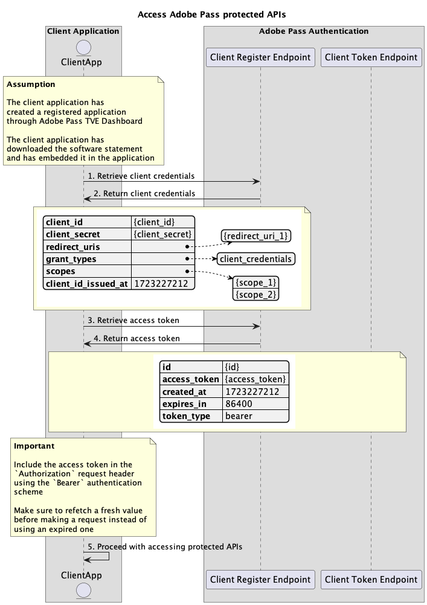

# 動態使用者端註冊流程 {#dynamic-client-registration-flow}

>[!IMPORTANT]
>
> 此頁面上的內容僅供參考。 使用此API需要Adobe的目前授權。 不允許未經授權的使用。

>[!IMPORTANT]
>
> Dynamic Client Registration API實作已由[節流機制](/help/authentication/integration-guide-programmers/throttling-mechanism.md)檔案限制。

## 存取Adobe Pass受保護的API {#access-adobe-pass-protected-apis}

### 先決條件 {#prerequisites-access-adobe-pass-protected-apis}

在存取Adobe Pass保護的API之前，請確定符合下列必要條件：

* 使用者端代表必須建立已註冊的應用程式，如[管理已註冊的應用程式](../dynamic-client-registration-overview.md#manage-registered-applications)區段中所述。
* 使用者端代表必須下載並內嵌軟體陳述式，如[管理軟體陳述式](../dynamic-client-registration-overview.md#manage-software-statements)區段中所述。

>[!IMPORTANT]
>
> Adobe Pass驗證SDK負責代表使用者端應用程式取得及重新整理使用者端憑證和存取權杖。
> 
> 對於所有其他Adobe Pass受保護的API，使用者端應用程式必須遵循以下工作流程。

### 工作流程 {#workflow-access-adobe-pass-protected-apis}

請依照指定的步驟來存取受Adobe Pass保護的API，如下圖所示。

*存取Adobe Pass保護的API*

1. **擷取使用者端認證：**&#x200B;使用者端應用程式會呼叫使用者端登入端點，收集擷取使用者端認證所需的所有資料。

   >[!IMPORTANT]
   >
   > 如需下列詳細資訊，請參閱[擷取使用者端認證](../apis/dynamic-client-registration-apis-retrieve-client-credentials.md#request) API檔案：
   >
   > * 所有&#x200B;_必要的_&#x200B;引數，例如`software_statement`
   > * 所有&#x200B;_必要的_&#x200B;標頭，例如`Content-Type`、`X-Device-Info`
   > * 所有&#x200B;_選用的_&#x200B;引數和標頭

1. **傳回使用者端認證：**&#x200B;使用者端登入端點回應包含與所接收引數和標頭相關聯的使用者端認證的相關資訊。

   >[!IMPORTANT]
   >
   > 請參閱[擷取使用者端認證](../apis/dynamic-client-registration-apis-retrieve-client-credentials.md#success) API檔案，以取得使用者端認證回應中提供的詳細資訊。
   >
   >  
   >
   > Client Register會驗證要求資料，以確保符合基本條件：
   >
   > * _必要_&#x200B;引數和標頭必須有效。
   >
   >  
   >
   > 如果驗證失敗，將會產生錯誤回應，提供遵守[擷取使用者端認證](../apis/dynamic-client-registration-apis-retrieve-client-credentials.md#error) API檔案的額外資訊。

   >[!TIP]
   >
   > 建議：使用者端認證必須快取，並可無限期使用。

1. **擷取存取Token：**&#x200B;使用者端應用程式會呼叫使用者端權杖端點，收集擷取存取Token所需的所有資料。

   >[!IMPORTANT]
   >
   > 請參閱[擷取存取Token](../apis/dynamic-client-registration-apis-retrieve-access-token.md#request) API檔案，以取得下列詳細資訊：
   >
   > * 所有&#x200B;_必要的_&#x200B;引數，例如`client_id`、`client_secret`和`grant_type`
   > * 所有&#x200B;_必要的_&#x200B;標頭，例如`Content-Type`、`X-Device-Info`
   > * 所有&#x200B;_選用的_&#x200B;引數和標頭

1. **傳回存取權杖：**&#x200B;使用者端權杖端點回應包含與收到的引數和標頭關聯的存取權杖相關資訊。

   >[!IMPORTANT]
   >
   > 請參閱[擷取存取Token](../apis/dynamic-client-registration-apis-retrieve-access-token.md#success) API檔案，以取得存取Token回應中提供的詳細資訊。
   >
   >  
   >
   > 使用者端權杖會驗證請求資料，以確保符合基本條件：
   >
   > * _必要_&#x200B;引數和標頭必須有效。
   >
   >  
   >
   > 如果驗證失敗，將會產生錯誤回應，提供遵守[擷取存取Token](../apis/dynamic-client-registration-apis-retrieve-access-token.md#error) API檔案的額外資訊。

   >[!TIP]
   >
   > 建議：存取權杖只能在指定的期間內快取和使用（例如24小時存留時間）。 過期後，使用者端應用程式必須要求新的存取權杖。

1. **繼續存取受保護的API：**&#x200B;使用者端應用程式使用存取權杖來存取其他Adobe Pass受保護的API。 使用者端應用程式必須在使用`Bearer`驗證配置（亦即`Authorization: Bearer <access_token>`）的`Authorization`要求標頭中包含存取權杖。

   >[!IMPORTANT]
   >
   > 受Adobe Pass保護的API會驗證存取Token，以確保符合基本條件：
   >
   > * _access_token_&#x200B;必須有效。
   > * _access_token_&#x200B;必須與有效的&#x200B;_client_id_&#x200B;和&#x200B;_client_secret_&#x200B;相關聯。
   > * _access_token_&#x200B;必須與有效的&#x200B;_software_statement_&#x200B;相關聯。
   >
   >  
   >
   > 如果驗證失敗，將會產生錯誤回應，提供可遵守[增強錯誤碼](../../../features-standard/error-reporting/enhanced-error-codes.md)檔案的額外資訊。
