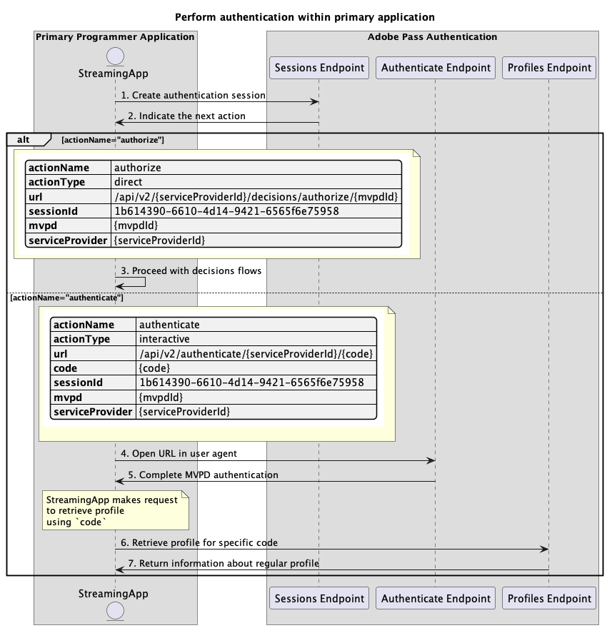

# 主要應用程式內執行的基本驗證流程 {#basic-authentication-flow-performed-within-primary-application}

>[!IMPORTANT]
>
> 此頁面上的內容僅供參考。 使用此API需要Adobe的目前授權。 不允許未經授權的使用。

>[!IMPORTANT]
>
> REST API V2實作受到[節流機制](/help/authentication/integration-guide-programmers/throttling-mechanism.md)檔案的限制。

>[!MORELIKETHIS]
>
> 請確定也造訪[REST API V2常見問題集](/help/authentication/integration-guide-programmers/rest-apis/rest-api-v2/rest-api-v2-faqs.md#authentication-phase-faqs-general)。

Adobe Pass驗證許可權內的&#x200B;**驗證流程**&#x200B;可讓串流應用程式驗證使用者是否擁有有效的MVPD帳戶。 此程式會要求使用者擁有作用中的MVPD帳戶，並在MVPD登入頁面上輸入有效的登入認證。

在下列情況下需要驗證流程：

* 使用者首次開啟應用程式時。
* 當使用者的先前驗證過期時。
* 當使用者從MVPD帳戶登出時。
* 當使用者想要使用其他MVPD進行驗證時。

在所有這些情況下，呼叫任何設定檔端點的應用程式會收到空白回應或一或多個設定檔，但針對不同的MVPD。

**驗證流程**&#x200B;需要使用者代理程式（瀏覽器）來完成從應用程式到Adobe Pass後端，然後到MVPD登入頁面，最後返回應用程式的一系列呼叫。 此流程可能包括重新導向至MVPD系統的數個動作，以及管理針對每個網域儲存的Cookie或工作階段，若沒有使用者代理程式，這些動作很難達成且安全無虞。

根據主要應用程式（串流應用程式）功能，以支援使用者選擇MVPD的互動，以及在使用者代理程式中使用所選的MVPD進行驗證，驗證情況如下：

* [在主要應用程式內執行驗證](./rest-api-v2-basic-authentication-primary-application-flow.md)
* [使用預先選取的mvpd在次要應用程式內執行驗證](rest-api-v2-basic-authentication-secondary-application-flow.md)
* [在次要應用程式內執行驗證，而不預先選取mvpd](rest-api-v2-basic-authentication-secondary-application-flow.md)

## 在主要應用程式內執行驗證 {#perform-authentication-within-primary-application}

### 先決條件 {#prerequisites-perform-authentication-within-primary-application}

在透過主要應用程式內的使用者互動執行驗證之前，請確定符合下列先決條件：

* 串流應用程式必須選取MVPD。
* 串流應用程式必須起始驗證工作階段，才能使用選取的MVPD登入。
* 串流應用程式必須在使用者代理程式中使用選取的MVPD進行驗證。

>[!IMPORTANT]
>
> 假設
>
>  
> 
> * 串流應用程式支援使用者互動以選取MVPD。
> * 串流應用程式支援使用者互動，以在使用者代理程式中使用選取的MVPD進行驗證。

### 工作流程 {#workflow-perform-authentication-completed-on-primary-application}

請依照指定的步驟，實作主要應用程式內執行的基本驗證流程，如下圖所示。

*在主要應用程式內執行驗證*

1. **建立驗證工作階段：**&#x200B;串流應用程式會呼叫工作階段端點，收集所有必要的資料以啟動驗證工作階段。

   >[!IMPORTANT]
   >
   > 如需下列詳細資訊，請參閱[建立驗證工作階段](../../apis/sessions-apis/rest-api-v2-sessions-apis-create-authentication-session.md) API檔案：
   > 
   > * 所有&#x200B;_必要的_&#x200B;引數，例如`serviceProvider`、`mvpd`、`domainName`和`redirectUrl`
   > * 所有&#x200B;_必要的_&#x200B;標頭，例如`Authorization`、`AP-Device-Identifier`
   > * 所有&#x200B;_選用的_&#x200B;引數和標頭
   > 
   >  
   > 
   > 串流應用程式在建立驗證工作階段時，必須在單一呼叫中提供所有必要的引數。

1. **指示下一個動作：**&#x200B;工作階段端點回應包含必要的資料，可引導串流應用程式瞭解下一個動作。

   >[!IMPORTANT]
   >
   > 如需工作階段回應中所提供資訊的詳細資訊，請參閱[建立驗證工作階段](../../apis/sessions-apis/rest-api-v2-sessions-apis-create-authentication-session.md) API檔案。
   > 
   >  
   > 
   > 「工作階段」端點會驗證請求資料，以確保符合基本條件：
   >
   > * _必要_&#x200B;引數和標頭必須有效。
   > * 提供的`serviceProvider`與`mvpd`之間的整合必須是作用中。
   > 
   >  
   > 
   > 如果驗證失敗，將會產生錯誤回應，提供可遵守[增強錯誤碼](../../../../features-standard/error-reporting/enhanced-error-codes.md)檔案的額外資訊。

1. **繼續決策流程：**&#x200B;工作階段端點回應包含下列資料：
   * `actionName`屬性已設定為「授權」。
   * `actionType`屬性設定為「直接」。

   如果Adobe Pass後端識別有效的設定檔，串流應用程式就不需要使用選取的MVPD重新驗證，因為已經有設定檔可用於後續的決策流程。

1. **在使用者代理程式中開啟URL：**&#x200B;工作階段端點回應包含下列資料：
   * `url`可用來在MVPD登入頁面中起始互動式驗證。
   * `actionName`屬性已設定為「驗證」。
   * `actionType`屬性設定為「互動式」。

   如果Adobe Pass後端未識別有效的設定檔，串流應用程式會開啟使用者代理程式，以載入提供的`url`，並向驗證端點提出要求。 此流程可能包含數個重新導向，最終將使用者引導至MVPD登入頁面並提供有效認證。

1. **完成MVPD驗證：**&#x200B;如果驗證流程成功，使用者代理程式互動會在Adobe Pass後端儲存一般設定檔，並到達提供的`redirectUrl`。

1. **擷取特定程式碼的設定檔：**&#x200B;串流應用程式會傳送要求至設定檔端點，以收集擷取設定檔資訊所需的所有資料。

   >[!IMPORTANT]
   >
   > 如需下列詳細資訊，請參閱特定程式碼[ API檔案的](../../apis/profiles-apis/rest-api-v2-profiles-apis-retrieve-profile-for-specific-code.md)擷取設定檔：
   >
   > * 所有&#x200B;_必要的_&#x200B;引數，如`serviceProvider`、`code`
   > * 所有&#x200B;_必要的_&#x200B;標頭，例如`Authorization`、`AP-Device-Identifier`
   > * 所有&#x200B;_選用的_&#x200B;引數和標頭

   >[!TIP]
   >
   > 串流應用程式必須等候使用者代理程式到達提供的`redirectUrl`，以檢查一般設定檔是否已成功產生並儲存。

1. **傳回關於一般設定檔的資訊：**&#x200B;設定檔端點回應包含關於與所接收引數和標題關聯的一般設定檔的資訊。

   >[!IMPORTANT]
   >
   > 請參閱特定程式碼[ API檔案的](../../apis/profiles-apis/rest-api-v2-profiles-apis-retrieve-profile-for-specific-code.md)擷取設定檔，以取得設定檔回應中提供的詳細資訊。
   > 
   >  
   > 
   > 設定檔端點會驗證請求資料，以確保符合基本條件：
   >
   > * _必要_&#x200B;引數和標頭必須有效。
   >
   >  
   > 
   > 如果驗證失敗，將會產生錯誤回應，提供可遵守[增強錯誤碼](../../../../features-standard/error-reporting/enhanced-error-codes.md)檔案的額外資訊。
