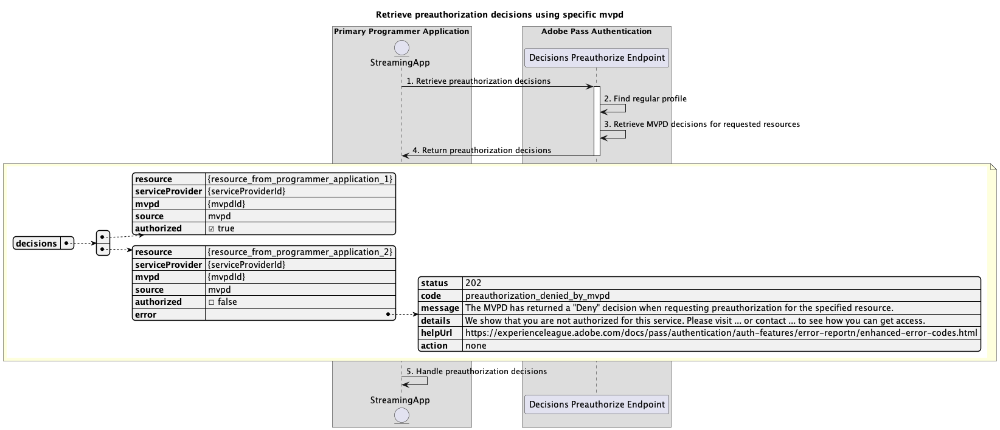

# 主要應用程式內執行的基本預先授權流程 {#basic-preauthorization-flow-performed-within-primary-application}

>[!IMPORTANT]
>
> 此頁面上的內容僅供參考。 使用此API需要Adobe的目前授權。 不允許未經授權的使用。

>[!IMPORTANT]
>
> REST API V2實作受到[節流機制](/help/authentication/integration-guide-programmers/throttling-mechanism.md)檔案的限制。

Adobe Pass驗證許可權內的&#x200B;**預先授權流程**&#x200B;可讓串流應用程式判斷MVPD是否允許或拒絕使用者存取資源清單。 此驗證可確保應用程式可以向使用者呈現有關他們可能有資格檢視的內容的準確資訊。

## 使用特定mvpd擷取預先授權決定 {#retrieve-preauthorization-decisions-using-specific-mvpd}

### 先決條件 {#prerequisites-retrieve-preauthorization-decisions-using-specific-mvpd}

使用特定MVPD擷取預先授權決定之前，請確定符合下列先決條件：

* 串流應用程式必須具備使用其中一個基本驗證流程為MVPD成功建立的有效一般設定檔：
   * [在主要應用程式內執行驗證](rest-api-v2-basic-authentication-primary-application-flow.md)
   * [使用預先選取的mvpd在次要應用程式內執行驗證](rest-api-v2-basic-authentication-secondary-application-flow.md)
   * [在次要應用程式內執行驗證，而不預先選取mvpd](rest-api-v2-basic-authentication-secondary-application-flow.md)
* 串流應用程式想要擷取預先授權決定，以顯示資源清單及其關聯狀態。

### 工作流程 {#workflow-retrieve-preauthorization-decisions-using-specific-mvpd}

請依照指定的步驟，使用在主要應用程式內執行的特定MVPD來實作基本預先授權流程，如下圖所示。

*使用特定mvpd擷取預先授權決定*

1. **擷取預先授權決定：**&#x200B;串流應用程式會呼叫Decisions Preauthorize端點，收集所有必要的資料，以取得資源清單的預先授權決定。

   >[!IMPORTANT]
   >
   > 如需下列詳細資訊，請參閱使用特定mvpd](../../apis/decisions-apis/rest-api-v2-decisions-apis-retrieve-preauthorization-decisions-using-specific-mvpd.md) API檔案擷取預先授權決定：[
   >
   > * 所有&#x200B;_必要的_&#x200B;引數，例如`serviceProvider`、`mvpd`和`resources`
   > * 所有&#x200B;_必要的_&#x200B;標頭，例如`Authorization`和`AP-Device-Identifier`
   > * 所有&#x200B;_選用的_&#x200B;引數和標頭

1. **尋找一般設定檔：** Adobe Pass伺服器會根據收到的引數和標頭識別有效的設定檔。

1. **擷取所要求資源的MVPD決定：** Adobe Pass伺服器會呼叫MVPD預先授權端點，以取得從串流應用程式接收的每個資源的`Permit`或`Deny`決定。

1. **傳回預先授權決定：**&#x200B;決定預先授權端點回應包含每個資源的`Permit`或`Deny`決定：
   * `Permit`決定表示資源可供播放。 回應不包含媒體Token，因為預先授權流程不能用於播放資源。
   * `Deny`決定表示資源無法播放。 回應包含附在[增強錯誤碼](../../../../features-standard/error-reporting/enhanced-error-codes.md)檔案的錯誤承載。

   >[!IMPORTANT]
   >
   > 請參閱使用特定mvpd](../../apis/decisions-apis/rest-api-v2-decisions-apis-retrieve-preauthorization-decisions-using-specific-mvpd.md) API檔案的[擷取預先授權決定，以取得決定回應中提供的詳細資訊。
   > 
   >  
   > 
   > 決定預先授權端點會驗證請求資料，以確保符合基本條件：
   >
   > * _必要_&#x200B;引數和標頭必須有效。
   > * 提供的`serviceProvider`與`mvpd`之間的整合必須是作用中。
   >
   >  
   > 
   > 如果驗證失敗，將會產生錯誤回應，提供可遵守[增強錯誤碼](../../../../features-standard/error-reporting/enhanced-error-codes.md)檔案的額外資訊。

1. **處理預先授權決定：**&#x200B;串流應用程式會處理回應，並可以使用它選擇性地在使用者介面上顯示每個資源的適當狀態。
