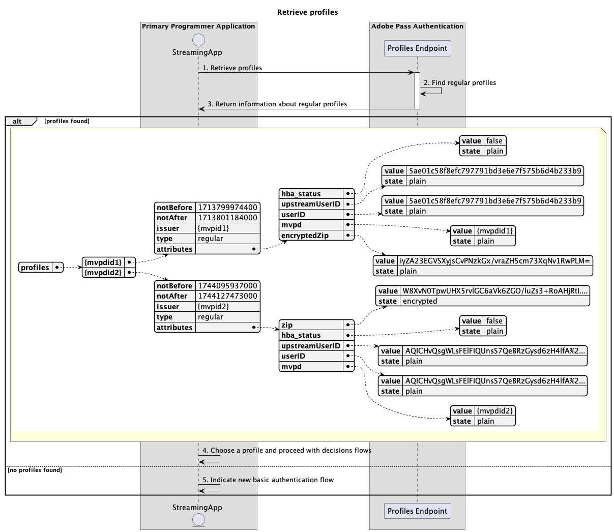
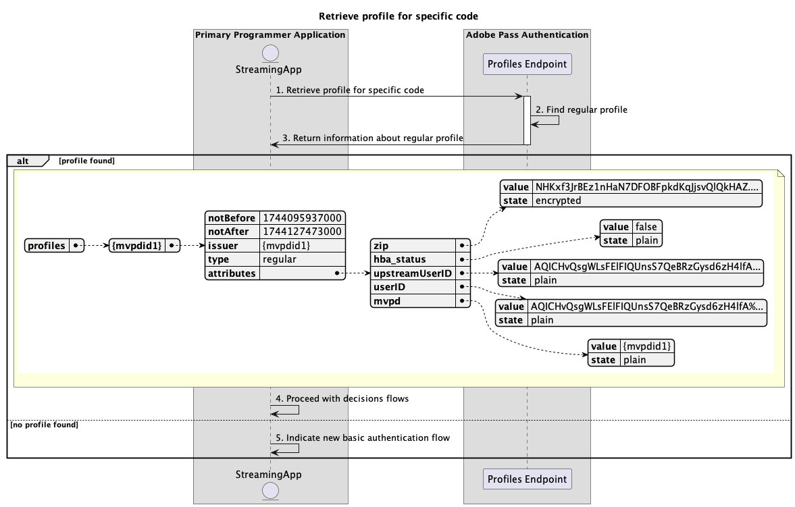

# 主要應用程式內執行的基本設定檔流程 {#basic-profiles-flow-primary-application}

>[!IMPORTANT]
>
> 此頁面上的內容僅供參考。 使用此API需要Adobe的目前授權。 不允許未經授權的使用。

>[!IMPORTANT]
>
> REST API V2實作受到[節流機制](/help/authentication/integration-guide-programmers/throttling-mechanism.md)檔案的限制。

>[!MORELIKETHIS]
>
> 請確定也造訪[REST API V2常見問題集](/help/authentication/integration-guide-programmers/rest-apis/rest-api-v2/rest-api-v2-faqs.md#authentication-phase-faqs-general)。

Adobe Pass驗證許可權內的&#x200B;**設定檔流程**&#x200B;可讓串流應用程式存取作用中使用者登入的相關資訊。

基本設定檔流程可讓您查詢下列案例：

* [擷取設定檔](#retrieve-profiles)
* [擷取特定mvpd的設定檔](#retrieve-profile-for-specific-mvpd)
* [擷取特定程式碼的設定檔](#retrieve-profile-for-specific-code)

## 擷取設定檔 {#retrieve-profiles}

### 先決條件 {#prerequisites-retrieve-profiles}

在擷取設定檔之前，請確定符合下列先決條件：

* 串流應用程式想要擷取所有一般設定檔。

### 工作流程 {#workflow-retrieve-profiles}

請依照指定的步驟，實施主要應用程式內執行的基本設定檔擷取流程，如下圖所示。

*擷取設定檔*

1. **擷取設定檔：**&#x200B;串流應用程式會收集所有必要資料，藉由傳送要求給設定檔端點來擷取所有設定檔資訊。

   >[!IMPORTANT]
   >
   > 如需下列詳細資訊，請參閱[擷取設定檔](../../apis/profiles-apis/rest-api-v2-profiles-apis-retrieve-profiles.md) API檔案：
   >
   > * 所有&#x200B;_必要的_&#x200B;引數，例如`serviceProvider`
   > * 所有&#x200B;_必要的_&#x200B;標頭，例如`Authorization`、`AP-Device-Identifier`
   > * 所有&#x200B;_選用的_&#x200B;引數和標頭

1. **尋找一般設定檔：** Adobe Pass伺服器會根據收到的引數和標頭識別所有有效的設定檔。

1. **傳回關於一般設定檔的資訊：**&#x200B;設定檔端點回應包含關於所找到之設定檔的相關資訊，這些設定檔與收到的引數和標頭相關聯。

   >[!IMPORTANT]
   >
   > 如需設定檔回應中所提供資訊的詳細資訊，請參閱[擷取設定檔](../../apis/profiles-apis/rest-api-v2-profiles-apis-retrieve-profiles.md) API檔案。
   > 
   >  
   > 
   > 設定檔端點會驗證請求資料，以確保符合基本條件：
   >
   > * _必要_&#x200B;引數和標頭必須有效。
   >
   >  
   >
   > 如果驗證失敗，將會產生錯誤回應，提供可遵守[增強錯誤碼](../../../../features-standard/error-reporting/enhanced-error-codes.md)檔案的額外資訊。

1. **選擇設定檔並繼續決策流程：**&#x200B;如果「設定檔」端點回應包含設定檔，串流應用程式會使用其內部邏輯（最終透過與一般使用者互動）來選擇其中一個可用的設定檔，以繼續後續的決策流程。

1. **指示新的基本驗證流程：**&#x200B;如果設定檔端點回應不包含設定檔，串流應用程式會指示使用者啟動新的基本驗證流程。

## 擷取特定mvpd的設定檔 {#retrieve-profile-for-specific-mvpd}

### 先決條件 {#prerequisites-retrieve-profile-for-specific-mvpd}

在擷取特定MVPD的設定檔之前，請確定符合下列先決條件：

* 串流應用程式具有選取或快取的`mvpd`識別碼，想要擷取特定MVPD的一般設定檔。

### 工作流程 {#workflow-retrieve-profile-for-specific-mvpd}

請依照指定的步驟，針對主要應用程式內執行的特定MVPD實作基本設定檔擷取流程，如下圖所示。

*擷取特定mvpd的設定檔*

1. **擷取特定mvpd的設定檔：**&#x200B;串流應用程式會傳送要求至設定檔端點，以收集所有必要的資料，擷取該特定MVPD的設定檔資訊。

   >[!IMPORTANT]
   >
   > 如需下列詳細資訊，請參閱特定mvpd[&#128279;](../../apis/profiles-apis/rest-api-v2-profiles-apis-retrieve-profile-for-specific-mvpd.md) API檔案的擷取設定檔：
   >
   > * 所有&#x200B;_必要的_&#x200B;引數，例如`serviceProvider`和`mvpd`
   > * 所有&#x200B;_必要的_&#x200B;標頭，例如`Authorization`、`AP-Device-Identifier`
   > * 所有&#x200B;_選用的_&#x200B;引數和標頭

1. **尋找一般設定檔：** Adobe Pass伺服器會根據收到的引數和標頭識別有效的設定檔。

1. **傳回關於一般設定檔的資訊：**&#x200B;設定檔端點回應包含關於所找到之設定檔的相關資訊，這些設定檔與收到的引數和標題相關聯。

   >[!IMPORTANT]
   >
   > 請參閱特定mvpd[&#128279;](../../apis/profiles-apis/rest-api-v2-profiles-apis-retrieve-profile-for-specific-mvpd.md) API檔案的擷取設定檔，以取得設定檔回應中提供的詳細資訊。
   > 
   >  
   > 
   > 設定檔端點會驗證請求資料，以確保符合基本條件：
   >
   > * _必要_&#x200B;引數和標頭必須有效。
   > * 提供的`serviceProvider`與`mvpd`之間的整合必須是作用中。
   >
   >  
   > 
   > 如果驗證失敗，將會產生錯誤回應，提供可遵守[增強錯誤碼](../../../../features-standard/error-reporting/enhanced-error-codes.md)檔案的額外資訊。

1. **繼續決策流程：**&#x200B;如果設定檔端點回應包含設定檔，串流應用程式會使用設定檔資訊繼續後續的決策流程。

1. **指示新的基本驗證流程：**&#x200B;如果設定檔端點回應不包含設定檔，串流應用程式會指示使用者啟動新的基本驗證流程。

## 擷取特定程式碼的設定檔 {#retrieve-profile-for-specific-code}

### 先決條件 {#prerequisites-retrieve-profile-for-specific-code}

在擷取特定驗證代碼的設定檔之前，請確定您符合下列必要條件：

* 串流應用程式有一個`code`用來與MVPD執行互動式驗證，它想要擷取特定驗證程式碼的設定檔。

### 工作流程 {#workflow-retrieve-profile-for-specific-code}

請依照指定的步驟，針對主要應用程式內執行的特定驗證程式碼，實作基本設定檔擷取流程，如下圖所示。

*擷取特定程式碼的設定檔*

1. **擷取特定程式碼的設定檔：**&#x200B;串流應用程式會傳送要求至設定檔端點，收集所有必要的資料，以擷取該特定驗證程式碼的設定檔資訊。

   >[!IMPORTANT]
   >
   > 如需下列詳細資訊，請參閱特定程式碼[&#128279;](../../apis/profiles-apis/rest-api-v2-profiles-apis-retrieve-profile-for-specific-code.md) API檔案的擷取設定檔：
   >
   > * 所有&#x200B;_必要的_&#x200B;引數，如`serviceProvider`和`code`
   > * 所有&#x200B;_必要的_&#x200B;標頭，例如`Authorization`
   > * 所有&#x200B;_選用的_&#x200B;引數和標頭

1. **尋找一般設定檔：** Adobe Pass伺服器會根據收到的引數和標頭識別有效的設定檔。

1. **傳回關於一般設定檔的資訊：**&#x200B;設定檔端點回應包含關於所找到之設定檔的相關資訊，這些設定檔與收到的引數和標題相關聯。

   >[!IMPORTANT]
   >
   > 請參閱特定程式碼[&#128279;](../../apis/profiles-apis/rest-api-v2-profiles-apis-retrieve-profile-for-specific-code.md) API檔案的擷取設定檔，以取得設定檔回應中提供的詳細資訊。
   > 
   >  
   > 
   > 設定檔端點會驗證請求資料，以確保符合基本條件：
   >
   > * _必要_&#x200B;引數和標頭必須有效。
   >
   >  
   >
   > 如果驗證失敗，將會產生錯誤回應，提供可遵守[增強錯誤碼](../../../../features-standard/error-reporting/enhanced-error-codes.md)檔案的額外資訊。

1. **繼續決策流程：**&#x200B;如果設定檔端點回應包含設定檔，串流應用程式會使用設定檔資訊繼續後續的決策流程。

1. **指示新的基本驗證流程：**&#x200B;如果設定檔端點回應不包含設定檔，主要應用程式會指示使用者啟動新的基本驗證流程。
