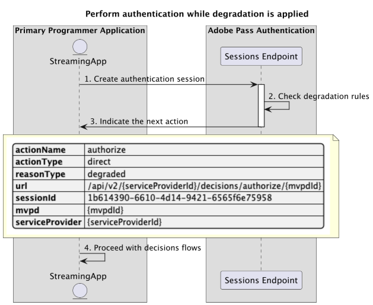
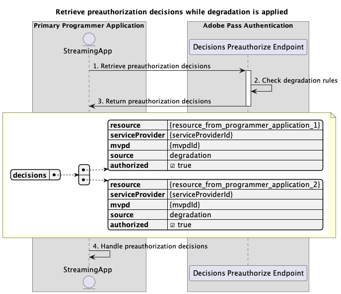
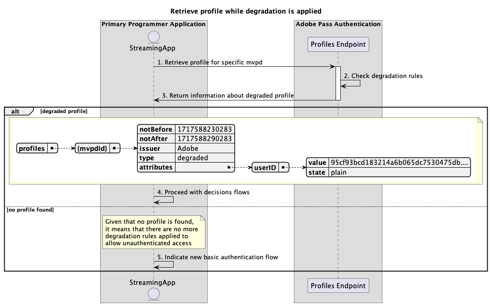

# 存取流程效能降低 {#degraded-access-flows}

>[!IMPORTANT]
>
> 此頁面上的內容僅供參考。 使用此API需要Adobe的目前授權。 不允許未經授權的使用。

>[!IMPORTANT]
>
> REST API V2實作受到[節流機制](/help/authentication/integration-guide-programmers/throttling-mechanism.md)檔案的限制。

降級提供暫時略過特定MVPD驗證和授權端點。 通常，程式設計師會起始此動作，但無論誰觸發降級事件，此動作取決於與受影響MVPD預先作出的安排。

如需有關降級功能的詳細資訊，請參閱[降級](../../../../features-premium/degraded-access/degradation-api-overview.md)檔案。

降級存取流程可讓您查詢下列情況：

* [套用降級時執行驗證](#perform-authentication-while-degradation-is-applied)
* [套用降級時擷取授權決策](#retrieve-authorization-decisions-while-degradation-is-applied)
* [套用降級時擷取預先授權決策](#retrieve-preauthorization-decisions-while-degradation-is-applied)
* [套用降級時擷取設定檔](#retrieve-profile-while-degradation-is-applied)

## 套用降級時執行驗證 {#perform-authentication-while-degradation-is-applied}

### 先決條件 {#prerequisites-perform-authentication-while-degradation-is-applied}

在套用降級狀況時執行驗證流程之前，請確定符合下列必要條件：

* 當串流應用程式需要使用MVPD登入時，必須起始驗證工作階段。

>[!IMPORTANT]
> 
> 假設
> 
>  
> 
> * 串流應用程式沒有該特定MVPD的有效設定檔儲存在Adobe Pass後端。
> * 提供的`serviceProvider`和`mvpd`之間的整合已套用AuthNAll降級規則。

### 工作流程 {#workflow-perform-authentication-while-degradation-is-applied}

遵循指定步驟在套用降級時實施驗證流程，如下圖所示。

*套用降級時執行驗證*

1. **建立驗證工作階段：**&#x200B;串流應用程式會呼叫工作階段端點，收集所有必要的資料以啟動驗證工作階段。

   >[!IMPORTANT]
   >
   > 如需下列詳細資訊，請參閱[建立驗證工作階段](../../apis/sessions-apis/rest-api-v2-sessions-apis-create-authentication-session.md) API檔案：
   > 
   > * 所有&#x200B;_必要的_&#x200B;引數，例如`serviceProvider`、`mvpd`、`domainName`和`redirectUrl`
   > * 所有&#x200B;_必要的_&#x200B;標頭，例如`Authorization`和`AP-Device-Identifier`
   > * 所有&#x200B;_選用的_&#x200B;引數和標頭

1. **檢查降級規則：** Adobe Pass伺服器會驗證是否將AuthNAll降級規則套用到提供的`serviceProvider`與`mvpd`之間的整合。

1. **指示下一個動作：**&#x200B;工作階段端點回應包含必要的資料，可引導串流應用程式進行下一個動作：
   * `actionName`屬性已設定為「授權」。
   * `actionType`屬性設定為「直接」。

   >[!IMPORTANT]
   >
   > 如需工作階段回應中所提供資訊的詳細資訊，請參閱[建立驗證工作階段](../../apis/sessions-apis/rest-api-v2-sessions-apis-create-authentication-session.md) API檔案。
   > 
   >  
   > 
   > 「工作階段」端點會驗證請求資料，以確保符合基本條件：
   >
   > * _必要_&#x200B;引數和標頭必須有效。
   > * 提供的`serviceProvider`與`mvpd`之間的整合必須是作用中。
   >
   >  
   > 
   > 如果基本驗證失敗，將會產生錯誤回應，提供遵守[增強型錯誤碼](../../../../features-standard/error-reporting/enhanced-error-codes.md)檔案的額外資訊。
   >
   >  
   > 
   > 「工作階段」端點會使用要求資料來檢查是否符合降級存取條件：
   >
   > * 提供的`serviceProvider`與`mvpd`之間的整合必須套用AuthNAll降級規則。
   >
   >  
   > 
   > 如果降級存取驗證失敗，回應會預設為基本驗證流程。

1. **繼續決策流程：**&#x200B;串流應用程式可以繼續後續的決策流程。

## 套用降級時擷取授權決策 {#retrieve-authorization-decisions-while-degradation-is-applied}

### 先決條件 {#prerequisites-retrieve-authorization-decisions-while-degradation-is-applied}

在套用降級時擷取授權決定之前，請確保符合以下先決條件：

* 串流應用程式必須先擷取授權決定，才能播放使用者選取的資源。

>[!IMPORTANT]
>
> 假設
> 
>  
> 
> * 串流應用程式沒有該特定MVPD的有效設定檔。
> * 提供的`serviceProvider`和`mvpd`之間的整合已套用AuthZAll或AuthNAll降級規則。

### 工作流程 {#workflow-retrieve-authorization-decisions-while-degradation-is-applied}

遵循指定步驟以在套用降級時實施授權流程，如下圖所示。

*套用降級時擷取授權決定*

1. **擷取授權決定：**&#x200B;串流應用程式會呼叫Decisions Authorized端點，收集所有必要資料以取得特定資源的授權決定。

   >[!IMPORTANT]
   > 
   > 請參考[使用特定mvpd](../../apis/decisions-apis/rest-api-v2-decisions-apis-retrieve-authorization-decisions-using-specific-mvpd.md) API擷取授權決定，以取得以下詳細資訊：
   >
   > * 所有&#x200B;_必要的_&#x200B;引數，例如`serviceProvider`、`mvpd`和`resources`
   > * 所有&#x200B;_必要的_&#x200B;標頭，例如`Authorization`和`AP-Device-Identifier`
   > * 所有&#x200B;_選用的_&#x200B;引數和標頭

1. **檢查降級規則：** Adobe Pass伺服器會驗證提供的`serviceProvider`與`mvpd`之間的整合是否套用了AuthZAll或AuthNAll降級規則。

1. **傳回`Permit`決定，媒體權杖：**&#x200B;決定授權端點回應包含`Permit`決定和媒體權杖。

   >[!IMPORTANT]
   >
   > 請參閱使用特定mvpd](../../apis/decisions-apis/rest-api-v2-decisions-apis-retrieve-authorization-decisions-using-specific-mvpd.md) API檔案的[擷取授權決定，以取得決定回應中提供的詳細資訊。
   >
   >  
   > 
   > Decisions Authorize端點會驗證請求資料，以確保符合基本條件：
   >
   > * _必要_&#x200B;引數和標頭必須有效。
   > * 提供的`serviceProvider`與`mvpd`之間的整合必須是作用中。
   >
   >  
   > 
   > 如果基本驗證失敗，將會產生錯誤回應，提供遵守[增強型錯誤碼](../../../../features-standard/error-reporting/enhanced-error-codes.md)檔案的額外資訊。
   >
   >  
   >
   > 決定授權端點使用請求資料來檢查是否符合降級存取條件：
   >
   > * 提供的`serviceProvider`與`mvpd`之間的整合必須套用AuthZAll或AuthNAll降級規則。
   >
   >  
   > 
   > 如果降級存取驗證失敗，回應將預設為基本授權流程。

1. **使用媒體權杖開始串流：**&#x200B;串流應用程式使用媒體權杖播放內容。

## 套用降級時擷取預先授權決策 {#retrieve-preauthorization-decisions-while-degradation-is-applied}

### 先決條件 {#prerequisites-retrieve-preauthorization-decisions-while-degradation-is-applied}

在套用降級時擷取預先授權決定之前，請確定符合下列先決條件：

* 串流應用程式想要擷取預先授權決定，以顯示資源清單及其關聯狀態。

>[!IMPORTANT]
>
> 假設
>
>  
> 
> * 串流應用程式沒有該特定MVPD的有效設定檔。
> * 提供的`serviceProvider`和`mvpd`之間的整合已套用AuthZAll或AuthNAll降級規則。

### 工作流程 {#workflow-retrieve-preauthorization-decisions-while-degradation-is-applied}

遵循指定步驟以在套用降級時實作預先授權流程，如下圖所示。

*套用降級時擷取預先授權決定*

1. **擷取預先授權決定：**&#x200B;串流應用程式會呼叫Decisions Preauthorize端點，收集所有必要的資料，以取得資源清單的預先授權決定。

   >[!IMPORTANT]
   >
   > 如需下列詳細資訊，請參閱使用特定mvpd](../../apis/decisions-apis/rest-api-v2-decisions-apis-retrieve-preauthorization-decisions-using-specific-mvpd.md) API檔案擷取預先授權決定：[
   >
   > * 所有&#x200B;_必要的_&#x200B;引數，例如`serviceProvider`、`mvpd`和`resources`
   > * 所有&#x200B;_必要的_&#x200B;標頭，例如`Authorization`和`AP-Device-Identifier`
   > * 所有&#x200B;_選用的_&#x200B;引數和標頭

1. **檢查降級規則：** Adobe Pass伺服器會驗證提供的`serviceProvider`與`mvpd`之間的整合是否套用了AuthZAll或AuthNAll降級規則。

1. **傳回預先授權決定：**&#x200B;決定預先授權端點回應包含每個資源的`Permit`決定。

   >[!IMPORTANT]
   >
   > 請參閱使用特定mvpd](../../apis/decisions-apis/rest-api-v2-decisions-apis-retrieve-preauthorization-decisions-using-specific-mvpd.md) API檔案的[擷取預先授權決定，以取得決定回應中提供的詳細資訊。
   >
   >  
   >
   > 決定預先授權端點會驗證請求資料，以確保符合基本條件：
   >
   > * _必要_&#x200B;引數和標頭必須有效。
   > * 提供的`serviceProvider`與`mvpd`之間的整合必須是作用中。
   >
   >  
   > 
   > 如果基本驗證失敗，將會產生錯誤回應，提供遵守[增強型錯誤碼](../../../../features-standard/error-reporting/enhanced-error-codes.md)檔案的額外資訊。
   >
   >  
   >
   > 決定預先授權端點會使用請求資料來檢查是否符合降級存取條件：
   >
   > * 提供的`serviceProvider`與`mvpd`之間的整合必須套用AuthZAll或AuthNAll降級規則。
   >
   >  
   > 
   > 如果降級存取驗證失敗，回應將預設為基本預先授權流程。

1. **處理預先授權決定：**&#x200B;串流應用程式會處理回應，並可以使用它選擇性地在使用者介面上顯示每個資源的適當狀態。

## 套用降級時擷取設定檔 {#retrieve-profile-while-degradation-is-applied}

>[!IMPORTANT]
>
> 當套用降級時，設定檔端點查詢是選用的。
>
>  
> 
> 「工作階段」端點回應會指示應用程式在套用降級時繼續決策流程。 如需詳細資訊，請參閱[套用降級時執行驗證](#perform-authentication-while-degradation-is-applied)區段。

### 先決條件 {#prerequisites-retrieve-profile-while-degradation-is-applied}

在套用降級時擷取特定MVPD的設定檔之前，請確定符合下列先決條件：

* 串流應用程式具有選取或快取的`mvpd`識別碼，想要擷取特定MVPD的設定檔。

>[!IMPORTANT]
>
> 假設
>
>  
> 
> * 串流應用程式沒有該特定MVPD的有效設定檔。
> * 提供的`serviceProvider`和`mvpd`之間的整合已套用AuthNAll降級規則。

### 工作流程 {#workflow-retrieve-profile-while-degradation-is-applied}

遵循指定步驟，在套用降級時為特定MVPD實施設定檔擷取流程，如下圖所示。

*套用降級時擷取設定檔*

1. **擷取特定mvpd的設定檔：**&#x200B;串流應用程式會收集所有必要資料，藉由傳送要求給設定檔端點來擷取該特定MVPD的設定檔資訊。

   >[!IMPORTANT]
   >
   > 如需下列詳細資訊，請參閱特定mvpd](../../apis/profiles-apis/rest-api-v2-profiles-apis-retrieve-profile-for-specific-mvpd.md) API檔案的[擷取設定檔：
   >
   > * 所有&#x200B;_必要的_&#x200B;引數，如`serviceProvider`和`mvpd`
   > * 所有&#x200B;_必要的_&#x200B;標頭，例如`Authorization`和`AP-Device-Identifier`
   > * 所有&#x200B;_選用的_&#x200B;引數和標頭

1. **檢查降級規則：** Adobe Pass伺服器會驗證是否將AuthNAll降級規則套用到提供的`serviceProvider`與`mvpd`之間的整合。

1. **傳回降級設定檔的相關資訊：**&#x200B;設定檔端點回應包含降級設定檔的相關資訊，包括設定為「降級」的屬性`type`。

   >[!IMPORTANT]
   >
   > 請參閱特定mvpd](../../apis/profiles-apis/rest-api-v2-profiles-apis-retrieve-profile-for-specific-mvpd.md) API檔案的[擷取設定檔，以取得設定檔回應中提供的詳細資訊。
   >
   >  
   >
   > 設定檔端點會驗證請求資料，以確保符合基本條件：
   >
   > * _必要_&#x200B;引數和標頭必須有效。
   > * 提供的`serviceProvider`與`mvpd`之間的整合必須是作用中。
   >
   >  
   > 
   > 如果基本驗證失敗，將會產生錯誤回應，提供遵守[增強型錯誤碼](../../../../features-standard/error-reporting/enhanced-error-codes.md)檔案的額外資訊。
   >
   >  
   > 
   > 設定檔端點會使用請求資料來檢查是否符合降低的存取條件：
   >
   > * 提供的`serviceProvider`與`mvpd`之間的整合必須套用AuthNAll降級規則。
   >
   >  
   > 
   > 如果降級存取驗證失敗，回應將預設為基本設定檔擷取流程。

1. **繼續決策流程：**&#x200B;如果設定檔端點回應包含設定檔，串流應用程式會使用降級設定檔資訊，繼續後續決策流程。

1. **指示新的基本驗證流程：**&#x200B;如果設定檔端點回應不包含設定檔，串流應用程式會指示使用者啟動新的基本驗證流程。

>[!NOTE]
>
> 特定驗證程式碼的設定檔擷取流程步驟與上述相同，但所使用的端點是[擷取特定程式碼設定檔](../../apis/profiles-apis/rest-api-v2-profiles-apis-retrieve-profile-for-specific-code.md)檔案中描述的端點。
