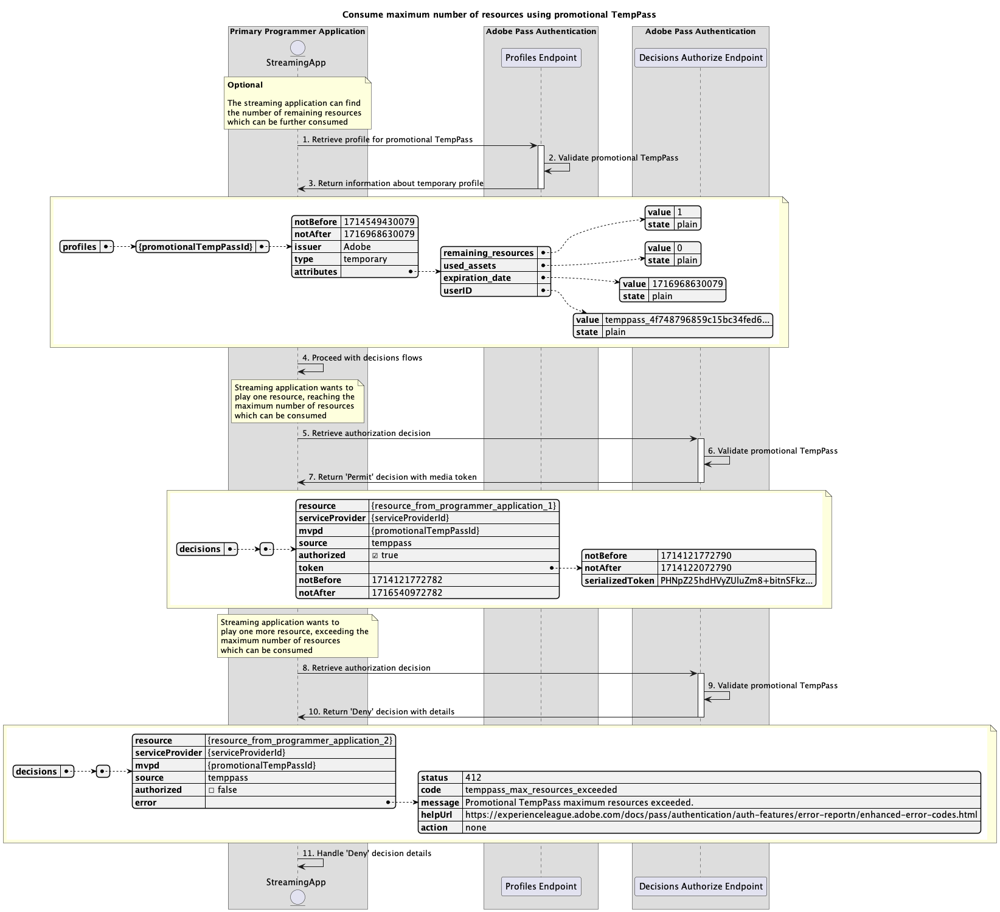
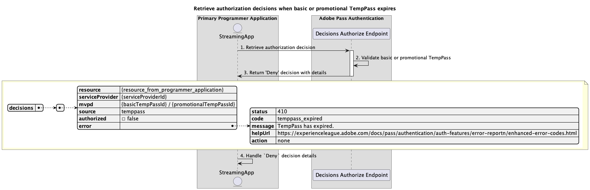
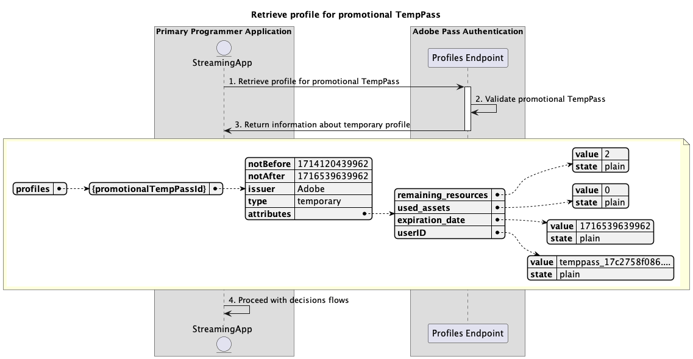

# 暫時存取流程 {#temporary-access-flows}

>[!IMPORTANT]
>
> 此頁面上的內容僅供參考。 使用此API需要Adobe的目前授權。 不允許未經授權的使用。

>[!IMPORTANT]
>
> REST API V2實作受到[節流機制](/help/authentication/integration-guide-programmers/throttling-mechanism.md)檔案的限制。

>[!MORELIKETHIS]
>
> 請確定也造訪[REST API V2常見問題集](/help/authentication/integration-guide-programmers/rest-apis/rest-api-v2/rest-api-v2-faqs.md#authentication-phase-faqs-general)。

TempPass可讓程式設計師暫時存取其受保護的內容，而不需要要求使用者使用有效的MVPD帳戶進行驗證。

如需TempPass功能的詳細資訊，請參閱[TempPass](../../../../features-premium/temporary-access/temp-pass-feature.md)檔案。

臨時存取流程可讓您查詢下列案例：

* [使用基本TempPass擷取授權決定](#retrieve-authorization-decisions-using-basic-temppass)
* [使用促銷TempPass擷取授權決定](#retrieve-authorization-decisions-using-promotional-temppass)
* [使用促銷臨時傳遞消耗資源的最大數量](#consume-maximum-number-of-resources-using-promotional-temppass)
* [當基本或促銷的TempPass過期時，擷取授權決定](#retrieve-authorization-decisions-when-basic-or-promotional-temppass-expires)
* [擷取基本TempPass設定檔](#retrieve-profile-for-basic-temppass)
* [擷取促銷臨時傳遞的設定檔](#retrieve-profile-for-promotional-temppass)

## 使用基本TempPass擷取授權決定 {#retrieve-authorization-decisions-using-basic-temppass}

### 先決條件 {#prerequisites-retrieve-authorization-decisions-using-basic-temppass}

使用基本TempPass擷取授權決定之前，請確定符合下列先決條件：

* 串流應用程式想要提供暫時的存取權來播放內容，而不要求使用者進行驗證。
* 串流應用程式必須先擷取授權決定，才能播放使用者選取的資源。

>[!IMPORTANT]
>
> 假設
> 
>  
> 
> * 必須套用基本TempPass的有效組態設定至提供的`serviceProvider`與`mvpd`之間的整合。
> * 為基本TempPass設定的存留時間(TTL)尚未過期。

### 工作流程 {#workflow-retrieve-authorization-decisions-using-basic-temppass}

請依照指定的步驟，使用基本的TempPass實作授權流程，如下圖所示。

*使用基本TempPass擷取授權決定*

1. **擷取授權決定：**&#x200B;串流應用程式會呼叫Decisions Authorized端點，收集所有必要資料以取得特定資源的授權決定。

   >[!IMPORTANT]
   >
   > 請參考[使用特定mvpd](../../apis/decisions-apis/rest-api-v2-decisions-apis-retrieve-authorization-decisions-using-specific-mvpd.md) API擷取授權決定，以取得以下詳細資訊：
   > 
   > * 所有&#x200B;_必要的_&#x200B;引數，例如`serviceProvider`、`mvpd`和`resources`
   > * 所有&#x200B;_必要的_&#x200B;標頭，例如`Authorization`和`AP-Device-Identifier`
   > * 所有&#x200B;_選用的_&#x200B;引數和標頭

1. **驗證基本TempPass：** Adobe Pass伺服器會驗證是否已將基本TempPass的有效組態設定套用到提供的`serviceProvider`與`mvpd`之間的整合。

1. **傳回`Permit`決定，媒體權杖：**&#x200B;決定授權端點回應包含`Permit`決定和媒體權杖。

   >[!IMPORTANT]
   >
   > 請參閱使用特定mvpd[&#x200B; API檔案的](../../apis/decisions-apis/rest-api-v2-decisions-apis-retrieve-authorization-decisions-using-specific-mvpd.md)擷取授權決定，以取得決定回應中提供的詳細資訊。
   >
   >  
   > 
   > Decisions Authorize端點會驗證請求資料，以確保符合基本條件：
   >
   > * _必要_&#x200B;引數和標頭必須有效。
   > * 提供的`serviceProvider`與`mvpd`之間的整合必須是作用中。
   >
   >  
   > 
   > 如果基本驗證失敗，將會產生錯誤回應，提供遵守[增強型錯誤碼](../../../../features-standard/error-reporting/enhanced-error-codes.md)檔案的額外資訊。
   >
   >  
   > 
   > 決定授權端點使用請求資料來檢查是否滿足臨時存取條件：
   >
   > * 為基本TempPass設定的存留時間(TTL)不得過期。
   >
   >  
   > 
   > 如果暫時存取驗證失敗，將會產生錯誤回應，提供遵守[增強式錯誤碼](../../../../features-standard/error-reporting/enhanced-error-codes.md)檔案的額外資訊。

1. **使用媒體權杖開始串流：**&#x200B;串流應用程式使用媒體權杖播放內容。

## 使用促銷TempPass擷取授權決定 {#retrieve-authorization-decisions-using-promotional-temppass}

### 先決條件 {#prerequisites-retrieve-authorization-decisions-using-promotional-temppass}

使用提升TempPass擷取授權決定之前，請確定符合下列先決條件：

* 串流應用程式想要提供暫時的存取權，以便播放最大數量的資源，而不要求使用者進行驗證。
* 串流應用程式在擷取授權決定時，必須包含有關使用者身分的唯一資訊。
* 串流應用程式必須先擷取授權決定，才能播放使用者選取的資源。

>[!IMPORTANT]
>
> 假設
>
>  
> 
> * 提供的與`serviceProvider`之間的整合，必須套用促銷暫時Pass的有效組態設定。`mvpd`
> * 為促銷TempPass設定的存留時間(TTL)尚未過期。
> * 尚未使用針對促銷TempPass設定的最大資源數量。

### 工作流程 {#workflow-retrieve-authorization-decisions-using-promotional-temppass}

請依照指定的步驟，使用提升TempPass來實作授權流程，如下圖所示。

*使用促銷臨時傳遞擷取授權決定*

1. **擷取授權決定：**&#x200B;串流應用程式會呼叫Decisions Authorized端點，收集所有必要資料以取得特定資源的授權決定。

   >[!IMPORTANT]
   >
   > 請參考[使用特定mvpd](../../apis/decisions-apis/rest-api-v2-decisions-apis-retrieve-authorization-decisions-using-specific-mvpd.md) API擷取授權決定，以取得以下詳細資訊：
   >
   > * 所有&#x200B;_必要的_&#x200B;引數，例如`serviceProvider`、`mvpd`和`resources`
   > * 所有&#x200B;_必要的_&#x200B;標頭，例如`Authorization`和`AP-Device-Identifier`
   > * 所有&#x200B;_選用的_&#x200B;引數和標頭
   >
   >  
   >
   > 使用促銷TempPass時，Decisions Authorize端點需要有`AP-TempPass-Identity`標頭存在。 標頭包括關於存取內容之使用者身分的唯一資訊。
   > 
   >  
   > 
   > 如需`AP-TempPass-Identity`標頭的詳細資訊，請參閱[AP-TempPass-Identity](../../appendix/headers/rest-api-v2-appendix-headers-ap-temppass-identity.md)檔案。

1. **驗證提升TempPass：** Adobe Pass伺服器會驗證是否已將提升TempPass的有效組態設定套用到提供的`serviceProvider`與`mvpd`之間的整合。

1. **傳回`Permit`決定，媒體權杖：**&#x200B;決定授權端點回應包含`Permit`決定和媒體權杖。

   >[!IMPORTANT]
   >
   > 請參閱使用特定mvpd[&#x200B; API檔案的](../../apis/decisions-apis/rest-api-v2-decisions-apis-retrieve-authorization-decisions-using-specific-mvpd.md)擷取授權決定，以取得決定回應中提供的詳細資訊。
   > 
   >  
   > 
   > Decisions Authorize端點會驗證請求資料，以確保符合基本條件：
   >
   > * _必要_&#x200B;引數和標頭必須有效。
   > * 提供的`serviceProvider`與`mvpd`之間的整合必須是作用中。
   >
   >  
   > 
   > 如果基本驗證失敗，將會產生錯誤回應，提供遵守[增強型錯誤碼](../../../../features-standard/error-reporting/enhanced-error-codes.md)檔案的額外資訊。
   >
   >  
   > 
   > 決定授權端點使用請求資料來檢查是否滿足臨時存取條件：
   >
   > * 為促銷TempPass設定的存留時間(TTL)不得過期。
   > * 不得使用為促銷TempPass設定的最大資源數量。
   >
   >  
   > 
   > 如果暫時存取驗證失敗，將會產生錯誤回應，提供遵守[增強式錯誤碼](../../../../features-standard/error-reporting/enhanced-error-codes.md)檔案的額外資訊。

1. **使用媒體權杖開始串流：**&#x200B;串流應用程式使用媒體權杖播放內容。

## 使用促銷臨時傳遞消耗資源的最大數量 {#consume-maximum-number-of-resources-using-promotional-temppass}

### 先決條件 {#prerequisites-consume-maximum-number-of-resources-using-promotional-temppass}

在使用促銷TempPass使用最大數量的資源之前，請確定符合下列先決條件：

* 串流應用程式想要提供暫時的存取權，以便播放最大數量的資源，而不要求使用者進行驗證。
* 串流應用程式在擷取授權決定時，必須包含有關使用者身分的唯一資訊。
* 串流應用程式必須先擷取授權決定，才能播放使用者選取的資源。

>[!IMPORTANT]
>
> 假設
>
>  
> 
> * 提供的與`serviceProvider`之間的整合，必須套用促銷暫時Pass的有效組態設定。`mvpd`
> * 為促銷TempPass設定的存留時間(TTL)尚未過期。
> * 為促銷臨時傳遞設定的資源數上限為1。

### 工作流程 {#workflow-consume-maximum-number-of-resources-using-promotional-temppass}

使用促銷暫時傳遞時，請遵循指定的步驟，以實施授權流程，如下圖所示。

*使用促銷暫存密碼消耗資源的最大數量*

1. **擷取促銷TempPass的設定檔：**&#x200B;串流應用程式會傳送要求給Profiles端點，以收集所有必要的資料，擷取促銷TempPass的設定檔資訊。

   >[!IMPORTANT]
   >
   > 如需下列詳細資訊，請參閱特定mvpd[&#x200B; API檔案的](../../apis/profiles-apis/rest-api-v2-profiles-apis-retrieve-profile-for-specific-mvpd.md)擷取設定檔：
   >
   > * 所有&#x200B;_必要的_&#x200B;引數，如`serviceProvider`和`mvpd`
   > * 所有&#x200B;_必要的_&#x200B;標頭，例如`Authorization`和`AP-Device-Identifier`
   > * 所有&#x200B;_選用的_&#x200B;引數和標頭
   >
   >  
   > 
   > 設定檔端點查詢為選用，可用來決定有多少資源仍可使用提升TempPass播放。

1. **驗證提升TempPass：** Adobe Pass伺服器會驗證是否已將提升TempPass的有效組態設定套用到提供的`serviceProvider`與`mvpd`之間的整合。

1. **傳回關於暫存設定檔的資訊：**&#x200B;設定檔端點回應包含關於暫存設定檔的資訊，包括設定為「暫存」的屬性`type`。

   >[!IMPORTANT]
   >
   > 請參閱特定mvpd[&#x200B; API檔案的](../../apis/profiles-apis/rest-api-v2-profiles-apis-retrieve-profile-for-specific-mvpd.md)擷取設定檔，以取得設定檔回應中提供的詳細資訊。
   > 
   >  
   > 
   > 設定檔端點會驗證請求資料，以確保符合基本條件：
   >
   > * _必要_&#x200B;引數和標頭必須有效。
   > * 提供的`serviceProvider`與`mvpd`之間的整合必須是作用中。
   > 
   >  
   >
   > 如果基本驗證失敗，將會產生錯誤回應，提供遵守[增強型錯誤碼](../../../../features-standard/error-reporting/enhanced-error-codes.md)檔案的額外資訊。
   >
   >  
   > 
   > 設定檔端點會使用請求資料來檢查是否符合臨時存取條件：
   >
   > * 為促銷TempPass設定的存留時間(TTL)不得過期。
   > * 不得使用為促銷TempPass設定的最大資源數量。
   >
   >  
   > 
   > 如果暫時存取驗證失敗，將會產生錯誤回應，提供遵守[增強式錯誤碼](../../../../features-standard/error-reporting/enhanced-error-codes.md)檔案的額外資訊。

1. **繼續決策流程：**&#x200B;如果設定檔端點回應包含設定檔，串流應用程式會使用暫時的設定檔資訊，繼續後續的決策流程。

1. **擷取授權決定：**&#x200B;串流應用程式會呼叫Decisions Authorized端點，收集所有必要資料以取得特定資源的授權決定。

   >[!IMPORTANT]
   > 
   > 請參考[使用特定mvpd](../../apis/decisions-apis/rest-api-v2-decisions-apis-retrieve-authorization-decisions-using-specific-mvpd.md) API擷取授權決定，以取得以下詳細資訊：
   >
   > * 所有&#x200B;_必要的_&#x200B;引數，例如`serviceProvider`、`mvpd`和`resources`
   > * 所有&#x200B;_必要的_&#x200B;標頭，例如`Authorization`和`AP-Device-Identifier`
   > * 所有&#x200B;_選用的_&#x200B;引數和標頭
   >
   >  
   > 
   > 使用促銷TempPass時，Decisions Authorize端點需要有`AP-TempPass-Identity`標頭存在。 標頭包括關於存取內容之使用者身分的唯一資訊。
   > 
   >  
   > 
   > 如需`AP-TempPass-Identity`標頭的詳細資訊，請參閱[AP-TempPass-Identity](../../appendix/headers/rest-api-v2-appendix-headers-ap-temppass-identity.md)檔案。

1. **驗證提升TempPass：** Adobe Pass伺服器會驗證是否已將提升TempPass的有效組態設定套用到提供的`serviceProvider`與`mvpd`之間的整合。

1. **傳回`Permit`決定，媒體權杖：**&#x200B;決定授權端點回應包含`Permit`決定和媒體權杖。

   >[!IMPORTANT]
   >
   > 請參閱使用特定mvpd[&#x200B; API檔案的](../../apis/decisions-apis/rest-api-v2-decisions-apis-retrieve-authorization-decisions-using-specific-mvpd.md)擷取授權決定，以取得決定回應中提供的詳細資訊。
   > 
   >  
   > 
   > Decisions Authorize端點會驗證請求資料，以確保符合基本條件：
   >
   > * _必要_&#x200B;引數和標頭必須有效。
   > * 提供的`serviceProvider`與`mvpd`之間的整合必須是作用中。
   >
   >  
   > 
   > 如果基本驗證失敗，將會產生錯誤回應，提供遵守[增強型錯誤碼](../../../../features-standard/error-reporting/enhanced-error-codes.md)檔案的額外資訊。
   > 
   >  
   > 
   > 決定授權端點使用請求資料來檢查是否滿足臨時存取條件：
   >
   > * 為促銷TempPass設定的存留時間(TTL)不得過期。
   > * 不得使用為促銷TempPass設定的最大資源數量。
   >
   >  
   > 
   > 如果暫時存取驗證失敗，將會產生錯誤回應，提供遵守[增強式錯誤碼](../../../../features-standard/error-reporting/enhanced-error-codes.md)檔案的額外資訊。

1. **擷取授權決定：**&#x200B;串流應用程式會呼叫Decisions Authorized端點，收集所有必要資料以取得特定資源的授權決定。

   >[!IMPORTANT]
   >
   > 請參考[使用特定mvpd](../../apis/decisions-apis/rest-api-v2-decisions-apis-retrieve-authorization-decisions-using-specific-mvpd.md) API擷取授權決定，以取得以下詳細資訊：
   >
   > * 所有&#x200B;_必要的_&#x200B;引數，例如`serviceProvider`、`mvpd`和`resources`
   > * 所有&#x200B;_必要的_&#x200B;標頭，例如`Authorization`和`AP-Device-Identifier`
   > * 所有&#x200B;_選用的_&#x200B;引數和標頭
   >
   >  
   > 
   > 使用促銷TempPass時，Decisions Authorize端點需要有`AP-TempPass-Identity`標頭存在。 標頭包括關於存取內容之使用者身分的唯一資訊。
   >
   >  
   > 
   > 如需`AP-TempPass-Identity`標頭的詳細資訊，請參閱[AP-TempPass-Identity](../../appendix/headers/rest-api-v2-appendix-headers-ap-temppass-identity.md)檔案。

1. **驗證提升TempPass：** Adobe Pass伺服器會驗證是否已將提升TempPass的有效組態設定套用到提供的`serviceProvider`與`mvpd`之間的整合。

1. **傳回`Deny`決定，詳細資料：** Decisions Authorize端點回應包含`Deny`決定和依循[增強式錯誤碼](../../../../features-standard/error-reporting/enhanced-error-codes.md)檔案的錯誤承載。

   >[!IMPORTANT]
   >
   > 請參閱使用特定mvpd[&#x200B; API檔案的](../../apis/decisions-apis/rest-api-v2-decisions-apis-retrieve-authorization-decisions-using-specific-mvpd.md)擷取授權決定，以取得決定回應中提供的詳細資訊。
   > 
   >  
   > 
   > Decisions Authorize端點會驗證請求資料，以確保符合基本條件：
   >
   > * _必要_&#x200B;引數和標頭必須有效。
   > * 提供的`serviceProvider`與`mvpd`之間的整合必須是作用中。
   >
   >  
   > 
   > 如果基本驗證失敗，將會產生錯誤回應，提供遵守[增強型錯誤碼](../../../../features-standard/error-reporting/enhanced-error-codes.md)檔案的額外資訊。
   >
   >  
   > 
   > 決定授權端點使用請求資料來檢查是否滿足臨時存取條件：
   >
   > * 為促銷TempPass設定的存留時間(TTL)不得過期。
   > * 不得使用為促銷TempPass設定的最大資源數量。
   >
   >  
   > 
   > 如果暫時存取驗證失敗，將會產生錯誤回應，提供遵守[增強式錯誤碼](../../../../features-standard/error-reporting/enhanced-error-codes.md)檔案的額外資訊。

1. **處理`Deny`決定詳細資料：**&#x200B;串流應用程式會處理回應中的錯誤資訊，並可使用它選擇性地在使用者介面上顯示特定訊息。

   >[!TIP]
   >
   > 串流應用程式可通知使用者已超過資源的最大數量，並建議他們使用一般MVPD來啟動基本驗證流程，以繼續觀看。

## 當基本或促銷的TempPass過期時，擷取授權決定 {#retrieve-authorization-decisions-when-basic-or-promotional-temppass-expires}

### 先決條件 {#prerequisites-retrieve-authorization-decisions-when-basic-or-promotional-temppass-expires}

在擷取基本或促銷TempPass過期時的授權決定之前，請確定符合下列先決條件：

* 使用基本TempPass[擷取授權決定之前的先決條件](#prerequisites-retrieve-authorization-decisions-using-basic-temppass)。
* 使用提升TempPass[擷取授權決定之前的先決條件](#prerequisites-retrieve-authorization-decisions-using-promotional-temppass)。

>[!IMPORTANT]
>
> 假設
> 
>  
> 
> * 在提供的`serviceProvider`與`mvpd`之間，必須套用基本或促銷性TempPass的有效組態設定。
> * 為基本或促銷設定的存留時間(TTL)已超過暫時存取持續時間限制。

### 工作流程 {#workflow-retrieve-authorization-decisions-when-basic-or-promotional-temppass-expires}

當基本或促銷的TempPass過期時，請依照指定的步驟來實作授權流程，如下圖所示。

*當基本或促銷的TempPass過期時，擷取授權決定*

1. **擷取授權決定：**&#x200B;串流應用程式會呼叫Decisions Authorized端點，收集所有必要資料以取得特定資源的授權決定。

   >[!IMPORTANT]
   >
   > 請參考[使用特定mvpd](../../apis/decisions-apis/rest-api-v2-decisions-apis-retrieve-authorization-decisions-using-specific-mvpd.md) API擷取授權決定，以取得以下詳細資訊：
   > 
   > * 所有&#x200B;_必要的_&#x200B;引數，例如`serviceProvider`、`mvpd`和`resources`
   > * 所有&#x200B;_必要的_&#x200B;標頭，例如`Authorization`和`AP-Device-Identifier`
   > * 所有&#x200B;_選用的_&#x200B;引數和標頭
   >
   >  
   > 
   > 使用促銷TempPass時，Decisions Authorize端點需要有`AP-TempPass-Identity`標頭存在。 標頭包括關於存取內容之使用者身分的唯一資訊。
   > 
   >  
   > 
   > 如需`AP-TempPass-Identity`標頭的詳細資訊，請參閱[AP-TempPass-Identity](../../appendix/headers/rest-api-v2-appendix-headers-ap-temppass-identity.md)檔案。

1. **驗證基本或促銷暫時Pass：** Adobe Pass伺服器會驗證在提供的`serviceProvider`與`mvpd`之間的整合中，是否套用了基本或促銷暫時Pass的有效組態設定。

1. **傳回`Deny`決定，詳細資料：** Decisions Authorize端點回應包含`Deny`決定和依循[增強式錯誤碼](../../../../features-standard/error-reporting/enhanced-error-codes.md)檔案的錯誤承載。

   >[!IMPORTANT]
   >
   > 請參閱使用特定mvpd[&#x200B; API檔案的](../../apis/decisions-apis/rest-api-v2-decisions-apis-retrieve-authorization-decisions-using-specific-mvpd.md)擷取授權決定，以取得決定回應中提供的詳細資訊。
   > 
   >  
   > 
   > Decisions Authorize端點會驗證請求資料，以確保符合基本條件：
   >
   > * _必要_&#x200B;引數和標頭必須有效。
   > * 提供的`serviceProvider`與`mvpd`之間的整合必須是作用中。
   >
   >  
   > 
   > 如果基本驗證失敗，將會產生錯誤回應，提供遵守[增強型錯誤碼](../../../../features-standard/error-reporting/enhanced-error-codes.md)檔案的額外資訊。
   >
   >  
   > 
   > 決定授權端點使用請求資料來檢查是否滿足臨時存取條件：
   >
   > * 為基本或促銷TempPass設定的存留時間(TTL)不得過期。
   > * 不得使用為促銷TempPass設定的最大資源數量。
   >
   >  
   > 
   > 如果暫時存取驗證失敗，將會產生錯誤回應，提供遵守[增強式錯誤碼](../../../../features-standard/error-reporting/enhanced-error-codes.md)檔案的額外資訊。

1. **處理`Deny`決定詳細資料：**&#x200B;串流應用程式會處理回應中的錯誤資訊，並可使用它選擇性地在使用者介面上顯示特定訊息。

   >[!TIP]
   >
   > 串流應用程式可通知使用者臨時存取已過期，並建議使用者使用一般MVPD來啟動基本驗證流程，以便繼續觀看。

## 擷取基本TempPass設定檔 {#retrieve-profile-for-basic-temppass}

>[!IMPORTANT]
>
> 基本的TempPass可選擇設定檔端點查詢。

### 先決條件 {#prerequisites-retrieve-profile-for-basic-temppass}

在擷取基本TempPass的設定檔之前，請確定符合下列必要條件：

* 串流應用程式想要擷取暫時設定檔，以確保暫時存取尚未過期。

>[!IMPORTANT]
>
> 假設
> 
>  
> 
> * 必須套用基本TempPass的有效組態設定至提供的`serviceProvider`與`mvpd`之間的整合。
> * 為基本TempPass設定的存留時間(TTL)不得過期。

### 工作流程 {#workflow-retrieve-profile-information-for-basic-temppass}

請依照指定的步驟，實作基本TempPass的設定檔擷取流程，如下圖所示。

的設定檔

*擷取基本TempPass*&#x200B;的設定檔

1. **擷取基本TempPass的設定檔：**&#x200B;串流應用程式會傳送要求至設定檔端點，以收集所有必要的資料，擷取基本TempPass的設定檔資訊。

   >[!IMPORTANT]
   >
   > 如需下列詳細資訊，請參閱特定mvpd[&#x200B; API檔案的](../../apis/profiles-apis/rest-api-v2-profiles-apis-retrieve-profile-for-specific-mvpd.md)擷取設定檔：
   > 
   > * 所有&#x200B;_必要的_&#x200B;引數，如`serviceProvider`和`mvpd`
   > * 所有&#x200B;_必要的_&#x200B;標頭，例如`Authorization`和`AP-Device-Identifier`
   > * 所有&#x200B;_選用的_&#x200B;引數和標頭

1. **驗證基本TempPass：** Adobe Pass伺服器會驗證是否已將基本TempPass的有效組態設定套用到提供的`serviceProvider`與`mvpd`之間的整合。

1. **傳回關於暫存設定檔的資訊：**&#x200B;設定檔端點回應包含關於暫存設定檔的資訊，包括設定為「暫存」的屬性`type`。

   >[!IMPORTANT]
   >
   > 請參閱特定mvpd[&#x200B; API檔案的](../../apis/profiles-apis/rest-api-v2-profiles-apis-retrieve-profile-for-specific-mvpd.md)擷取設定檔，以取得設定檔回應中提供的詳細資訊。
   > 
   >  
   > 
   > 設定檔端點會驗證請求資料，以確保符合基本條件：
   >
   > * _必要_&#x200B;引數和標頭必須有效。
   > * 提供的`serviceProvider`與`mvpd`之間的整合必須是作用中。
   >
   >  
   > 
   > 如果基本驗證失敗，將會產生錯誤回應，提供遵守[增強型錯誤碼](../../../../features-standard/error-reporting/enhanced-error-codes.md)檔案的額外資訊。
   >
   >  
   > 
   > 設定檔端點會使用請求資料來檢查是否符合臨時存取條件：
   >
   > * 為基本TempPass設定的存留時間(TTL)不得過期。
   >
   >  
   > 
   > 如果暫時存取驗證失敗，將會產生錯誤回應，提供遵守[增強式錯誤碼](../../../../features-standard/error-reporting/enhanced-error-codes.md)檔案的額外資訊。

1. **繼續決策流程：**&#x200B;如果設定檔端點回應包含設定檔，串流應用程式會使用暫時的設定檔資訊，繼續後續的決策流程。

## 擷取促銷臨時傳遞的設定檔 {#retrieve-profile-for-promotional-temppass}

>[!IMPORTANT]
>
> 促銷臨時傳遞的設定檔端點查詢為選用。

### 先決條件 {#prerequisites-retrieve-profile-for-promotional-temppass}

在擷取提升TempPass的設定檔之前，請先確認是否符合下列必要條件：

* 串流應用程式想要擷取暫存設定檔，以確保暫存存取尚未過期，或決定仍可播放多少資源。

>[!IMPORTANT]
>
> 假設
>
>  
> 
> * 提供的與`serviceProvider`之間的整合，必須套用促銷暫時Pass的有效組態設定。`mvpd`
> * 為促銷TempPass設定的存留時間(TTL)尚未過期。
> * 尚未使用針對促銷TempPass設定的最大資源數量。

### 工作流程 {#workflow-retrieve-profile-information-for-promotional-temppass}

請依照指定的步驟，針對促銷TempPass實作設定檔擷取流程，如下圖所示。

*擷取促銷臨時傳遞的設定檔*

1. **擷取促銷TempPass的設定檔：**&#x200B;串流應用程式會傳送要求給Profiles端點，以收集所有必要的資料，擷取促銷TempPass的設定檔資訊。

   >[!IMPORTANT]
   >
   > 如需下列詳細資訊，請參閱特定mvpd[&#x200B; API檔案的](../../apis/profiles-apis/rest-api-v2-profiles-apis-retrieve-profile-for-specific-mvpd.md)擷取設定檔：
   > 
   > * 所有&#x200B;_必要的_&#x200B;引數，如`serviceProvider`和`mvpd`
   > * 所有&#x200B;_必要的_&#x200B;標頭，例如`Authorization`和`AP-Device-Identifier`
   > * 所有&#x200B;_選用的_&#x200B;引數和標頭

1. **驗證提升TempPass：** Adobe Pass伺服器會驗證是否已將提升TempPass的有效組態設定套用到提供的`serviceProvider`與`mvpd`之間的整合。

1. **傳回關於暫存設定檔的資訊：**&#x200B;設定檔端點回應包含關於暫存設定檔的資訊，包括設定為「暫存」的屬性`type`。

   >[!IMPORTANT]
   >
   > 請參閱特定mvpd[&#x200B; API檔案的](../../apis/profiles-apis/rest-api-v2-profiles-apis-retrieve-profile-for-specific-mvpd.md)擷取設定檔，以取得設定檔回應中提供的詳細資訊。
   > 
   >  
   > 
   > 設定檔端點會驗證請求資料，以確保符合基本條件：
   >
   > * _必要_&#x200B;引數和標頭必須有效。
   > * 提供的`serviceProvider`與`mvpd`之間的整合必須是作用中。
   >
   >  
   > 
   > 如果基本驗證失敗，將會產生錯誤回應，提供遵守[增強型錯誤碼](../../../../features-standard/error-reporting/enhanced-error-codes.md)檔案的額外資訊。
   >
   >  
   > 
   > 設定檔端點會使用請求資料來檢查是否符合臨時存取條件：
   >
   > * 為促銷TempPass設定的存留時間(TTL)不得過期。
   > * 不得使用為促銷TempPass設定的最大資源數量。
   >
   >  
   > 
   > 如果暫時存取驗證失敗，將會產生錯誤回應，提供遵守[增強式錯誤碼](../../../../features-standard/error-reporting/enhanced-error-codes.md)檔案的額外資訊。

1. **繼續決策流程：**&#x200B;如果設定檔端點回應包含設定檔，串流應用程式會使用暫時的設定檔資訊，繼續後續的決策流程。
