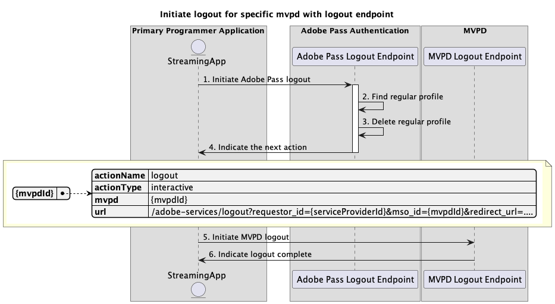
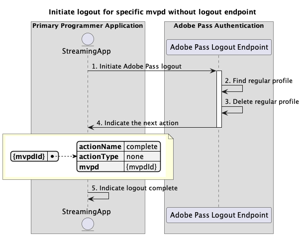

# 主要應用程式內執行的基本登出流程 {#basic-logout-flow-performed-within-primary-application}

>[!IMPORTANT]
>
> 此頁面上的內容僅供參考。 使用此API需要Adobe的目前授權。 不允許未經授權的使用。

>[!IMPORTANT]
>
> REST API V2實作受到[節流機制](/help/authentication/throttling-mechanism.md)檔案的限制。

Adobe Pass驗證許可權內的&#x200B;**登出流程**&#x200B;可讓串流應用程式執行兩個主要步驟：

* 刪除儲存在Adobe Pass後端的一般設定檔。
* 使用使用者代理程式（瀏覽器）導覽至MVPD登出端點，觸發MVPD後端上的清除。

基本登出流程可讓您查詢下列案例：

* [使用登出端點為特定mvpd起始登出](#initiate-logout-for-specific-mvpd-with-logout-endpoint)
* [在不登出端點的情況下起始特定mvpd的登出](#initiate-logout-for-specific-mvpd-without-logout-endpoint)

## 為具有登出端點的特定mvpd起始登出 {#initiate-logout-for-specific-mvpd-with-logout-endpoint}

### 必要條件 {#prerequisites-initiate-logout-for-specific-mvpd-with-logout-endpoint}

在具有登出端點的特定MVPD起始登出之前，請確定符合下列先決條件：

* 串流應用程式必須具備使用其中一個基本驗證流程為MVPD成功建立的有效一般設定檔：
   * [在主要應用程式內執行驗證](./rest-api-v2-basic-authentication-primary-application-flow.md)
   * [使用預先選取的mvpd在次要應用程式內執行驗證](./rest-api-v2-basic-authentication-secondary-application-flow.md)
   * [在次要應用程式內執行驗證，而不預先選取mvpd](./rest-api-v2-basic-authentication-secondary-application-flow.md)
* 當串流應用程式需要登出MVPD時，必須起始登出流程。

>[!IMPORTANT]
>
> 假設
>
>  
> 
> * MVPD支援登出流程並具有登出端點。

### 工作流程 {#workflow-initiate-logout-for-specific-mvpd-with-logout-endpoint}

請依照指定的步驟，針對在主要應用程式內執行登出端點的特定MVPD實作基本登出流程，如下圖所示。

*使用登出端點為特定mvpd啟動登出*

1. **啟動Adobe Pass登出：**&#x200B;串流應用程式會呼叫Adobe Pass登出端點，收集所有必要的資料以啟動登出流程。

   >[!IMPORTANT]
   >
   > 如需下列詳細資訊，請參閱特定mvpd](../../apis/logout-apis/rest-api-v2-logout-apis-initiate-logout-for-specific-mvpd.md) API的[起始登出：
   >
   > * 所有&#x200B;_必要的_&#x200B;引數，例如`serviceProvider`、`mvpd`和`redirectUrl`
   > * 所有&#x200B;_必要的_&#x200B;標頭，例如`Authorization`、`AP-Device-Identifier`
   > * 所有&#x200B;_選用的_&#x200B;引數和標頭

1. **尋找一般設定檔：** Adobe Pass伺服器會根據收到的引數和標頭識別有效的設定檔。

1. **刪除一般設定檔：** Adobe Pass伺服器會從Adobe Pass後端刪除已識別的一般設定檔。

1. **指示下一個動作：** Adobe Pass登出端點回應包含必要的資料，可引導串流應用程式執行下一個動作：
   * `url`屬性存在，因為MVPD支援登出流程。
   * `actionName`屬性設定為「登出」。
   * `actionType`屬性設定為「互動式」。

   >[!IMPORTANT]
   >
   > 如需登出回應中提供的詳細資訊，請參閱特定mvpd](../../apis/logout-apis/rest-api-v2-logout-apis-initiate-logout-for-specific-mvpd.md) API的[Initiate登出。
   > 
   >  
   > 
   > Adobe Pass登出端點會驗證請求資料，以確保符合基本條件：
   >
   > * _必要_&#x200B;引數和標頭必須有效。
   > * 提供的`serviceProvider`與`mvpd`之間的整合必須是作用中。
   >
   >  
   > 
   > 如果驗證失敗，將會產生錯誤回應，提供可遵守[增強錯誤碼](../../../enhanced-error-codes.md)檔案的額外資訊。

1. **啟動MVPD登出：**&#x200B;串流應用程式會讀取`url`，並使用使用者代理程式來啟動MVPD的登出流程。 此流程可能包括數個重新導向至MVPD系統。 不過，結果是MVPD會執行其內部清理，並將最終登出確認傳送回Adobe Pass後端。

1. **表示登出完成：**&#x200B;串流應用程式可以等待使用者代理程式到達提供的`redirectUrl`，並且可以使用它作為訊號，以選擇在使用者介面上顯示特定訊息。

## 在不登出端點的情況下起始特定mvpd的登出 {#initiate-logout-for-specific-mvpd-without-logout-endpoint}

### 必要條件 {#prerequisites-initiate-logout-for-specific-mvpd-without-logout-endpoint}

在沒有登出端點的狀況下，為特定MVPD起始登出之前，請確定符合下列先決條件：

* 串流應用程式必須具備使用其中一個基本驗證流程為MVPD成功建立的有效一般設定檔：
   * [在主要應用程式內執行驗證](./rest-api-v2-basic-authentication-primary-application-flow.md)
   * [使用預先選取的mvpd在次要應用程式內執行驗證](./rest-api-v2-basic-authentication-secondary-application-flow.md)
   * [在次要應用程式內執行驗證，而不預先選取mvpd](./rest-api-v2-basic-authentication-secondary-application-flow.md)
* 當串流應用程式需要登出MVPD時，必須起始登出流程。

>[!IMPORTANT]
>
> 假設
>
>  
> 
> * MVPD不支援登出流程，而且沒有登出端點。

### 工作流程 {#workflow-initiate-logout-for-specific-mvpd-without-logout-endpoint}

請依照指定的步驟來實作特定MVPD的基本登出流程，而不需在主要應用程式內執行登出端點，如下圖所示。

*啟動特定mvpd的登出，但不具有登出端點*

1. **啟動Adobe Pass登出：**&#x200B;串流應用程式會呼叫Adobe Pass登出端點，收集所有必要的資料以啟動登出流程。

   >[!IMPORTANT]
   >
   > 如需下列詳細資訊，請參閱特定mvpd](../../apis/logout-apis/rest-api-v2-logout-apis-initiate-logout-for-specific-mvpd.md) API的[起始登出：
   >
   > * 所有&#x200B;_必要的_&#x200B;引數，例如`serviceProvider`、`mvpd`和`redirectUrl`
   > * 所有&#x200B;_必要的_&#x200B;標頭，例如`Authorization`、`AP-Device-Identifier`
   > * 所有&#x200B;_選用的_&#x200B;引數和標頭

1. **尋找一般設定檔：** Adobe Pass伺服器會根據收到的引數和標頭識別有效的設定檔。

1. **刪除一般設定檔：** Adobe Pass伺服器會刪除已識別的一般設定檔。

1. **指示下一個動作：** Adobe Pass登出端點回應包含必要的資料，可引導串流應用程式執行下一個動作：
   * 缺少`url`屬性，因為MVPD不支援登出流程。
   * `actionName`屬性設定為「complete」。
   * `actionType`屬性設為「none」。

   >[!IMPORTANT]
   >
   > 如需登出回應中提供的詳細資訊，請參閱特定mvpd](../../apis/logout-apis/rest-api-v2-logout-apis-initiate-logout-for-specific-mvpd.md) API的[Initiate登出。
   > 
   >  
   > 
   > Adobe Pass登出端點會驗證請求資料，以確保符合基本條件：
   >
   > * _必要_&#x200B;引數和標頭必須有效。
   > * 提供的`serviceProvider`與`mvpd`之間的整合必須是作用中。
   >
   >  
   > 
   > 如果驗證失敗，將會產生錯誤回應，提供可遵守[增強錯誤碼](../../../enhanced-error-codes.md)檔案的額外資訊。

1. **表示登出完成：**&#x200B;串流應用程式會處理回應，並可以使用它選擇性地在使用者介面上顯示特定訊息。
