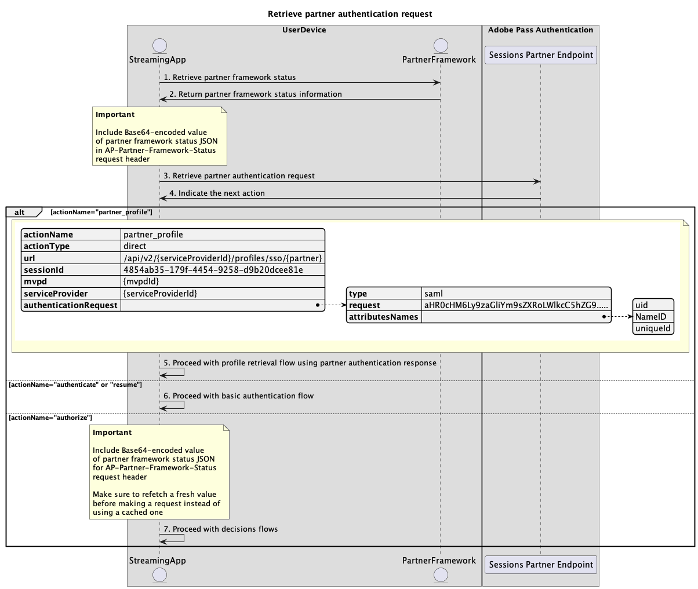

# 使用合作夥伴流程的單一登入 {#single-sign-on-partner-flows}

>[!IMPORTANT]
>
> 此頁面上的內容僅供參考。 使用此API需要Adobe的目前授權。 不允許未經授權的使用。

>[!IMPORTANT]
>
> REST API V2實作受到[節流機制](/help/authentication/throttling-mechanism.md)檔案的限制。

Partner方法可讓多個應用程式使用合作夥伴架構狀態裝載，以便在使用Adobe Pass服務時在裝置層級實現單一登入(SSO)。

應用程式負責使用Adobe Pass系統外部的合作夥伴特定架構或程式庫來擷取合作夥伴架構狀態裝載。

應用程式負責將此合作夥伴架構狀態裝載納入指定它的所有請求的`AP-Partner-Framework-Status`標頭中。

如需`AP-Partner-Framework-Status`標頭的詳細資訊，請參閱[AP-Partner-Framework-Status](../../appendix/headers/rest-api-v2-appendix-headers-ap-partner-framework-status.md)檔案。

Adobe Pass Authentication REST API V2支援在iOS、iPadOS或tvOS上執行之使用者端應用程式的一般使用者進行合作夥伴單一登入(SSO)。

如需Apple平台單一登入(SSO)的詳細資訊，請參閱[Apple SSO逐步指南(REST API V2)](/help/authentication/single-sign-on/partner-single-sign-on/apple-single-sign-on/apple-sso-cookbook-rest-api-v2.md)檔案。

## 擷取合作夥伴驗證請求 {#retrieve-partner-authentication-request}

### 先決條件 {#prerequisites-retrieve-partner-authentication-request}

擷取合作夥伴驗證請求之前，請先確定符合下列先決條件：

* 夥伴架構必須選取MVPD。
* 串流應用程式必須從合作夥伴架構取得合作夥伴架構狀態資訊，並將其傳遞至Adobe Pass伺服器。
* 串流應用程式必須從Adobe Pass伺服器取得合作夥伴驗證請求，並將其傳遞至合作夥伴架構。

>[!IMPORTANT]
>
> 假設
> 
>  
> 
> * 夥伴架構支援使用者互動以選取MVPD。
> * 夥伴架構支援使用者互動，以驗證選取的MVPD。
> * 合作夥伴架構提供使用者許可權與提供者資訊。

### 工作流程 {#workflow-retrieve-partner-authentication-request}

執行指定的步驟來擷取合作夥伴驗證請求，如下圖所示。

*擷取夥伴驗證要求*

1. **擷取合作夥伴架構狀態：**&#x200B;串流應用程式會呼叫Adobe Pass系統外部的合作夥伴架構，以取得使用者許可權和提供者資訊。

1. **傳回夥伴架構狀態資訊：**&#x200B;串流應用程式會驗證回應資料，以確保符合基本條件：
   * 已授予使用者許可權存取狀態。
   * 使用者提供者對應識別碼存在且有效。
   * 使用者提供者設定檔的到期日（如果有的話）有效。

1. **擷取合作夥伴驗證要求：**&#x200B;串流應用程式會收集所有必要的資料，藉由呼叫工作階段合作夥伴端點來啟動驗證工作階段。

   >[!IMPORTANT]
   >
   > 如需下列詳細資訊，請參閱[擷取合作夥伴驗證要求](../../apis/partner-single-sign-on-apis/rest-api-v2-partner-single-sign-on-apis-retrieve-partner-authentication-request.md) API檔案：
   >
   > * 所有&#x200B;_必要的_&#x200B;引數，例如`serviceProvider`和`partner`
   > * 所有&#x200B;_必要的_&#x200B;標頭，例如`Authorization`、`AP-Device-Identifier`、`Content-Type`、`X-Device-Info`和`AP-Partner-Framework-Status`
   > * 所有&#x200B;_選用的_&#x200B;標頭和引數
   >
   >  
   >
   > 串流應用程式在提出要求之前，必須先確定其中包含合作夥伴架構狀態的有效值。
   >
   >  
   > 
   > 如需`AP-Partner-Framework-Status`標頭的詳細資訊，請參閱[AP-Partner-Framework-Status](../../appendix/headers/rest-api-v2-appendix-headers-ap-partner-framework-status.md)檔案。

1. **指示下一個動作：**&#x200B;工作階段合作夥伴端點回應包含必要的資料，可引導串流應用程式瞭解下一個動作。

   >[!IMPORTANT]
   >
   > 請參閱[擷取合作夥伴驗證要求](../../apis/partner-single-sign-on-apis/rest-api-v2-partner-single-sign-on-apis-retrieve-partner-authentication-request.md) API檔案，以取得工作階段回應中提供的詳細資訊。
   > 
   >  
   > 
   > 工作階段合作夥伴端點會驗證請求資料，以確保符合基本條件：
   >
   > * _必要_&#x200B;引數和標頭必須有效。
   > * 提供的`serviceProvider`與`mvpd`之間的整合必須是作用中。
   >
   >  
   > 
   > 如果基本驗證失敗，將會產生錯誤回應，提供遵守[增強型錯誤碼](../../../enhanced-error-codes.md)檔案的額外資訊。
   >
   >  
   >
   > 「工作階段」合作夥伴端點會驗證請求資料，以確保符合合作夥伴單一登入條件：
   >
   >  * Adobe Pass伺服器中的合作夥伴單一登入設定必須有效且已啟用。
   >  * 透過[AP-Partner-Framework-Status](../../appendix/headers/rest-api-v2-appendix-headers-ap-partner-framework-status.md)標頭收到的合作夥伴架構狀態承載必須有效。
   >
   >  
   >
   > 如果合作夥伴單一登入驗證失敗，回應將預設為基本驗證流程。

1. **使用合作夥伴驗證回應繼續設定檔擷取流程：**&#x200B;工作階段合作夥伴端點回應包含下列資料：
   * `actionName`屬性設定為&quot;partner_profile&quot;。
   * `actionType`屬性設定為「直接」。
   * `authenticationRequest - type`屬性包含合作夥伴架構用於MVPD登入的安全性通訊協定（目前僅設定為SAML）。
   * `authenticationRequest - request`屬性包含傳遞至合作夥伴架構的SAML要求。
   * `authenticationRequest - attributesNames`屬性包含傳遞至合作夥伴架構的SAML屬性。

   如果Adobe Pass後端未識別有效的設定檔，且合作夥伴單一登入驗證通過時，串流應用程式會收到包含動作和資料的回應，並傳遞至合作夥伴架構，以使用MVPD啟動驗證流程。

   如需有關使用合作夥伴驗證回應的設定檔擷取流程的詳細資訊，請參閱[使用合作夥伴驗證回應擷取設定檔](#retrieve-profile-using-partner-authentication-response)區段。

1. **繼續基本驗證流程：**&#x200B;工作階段夥伴端點回應包含下列資料：
   * `actionName`屬性已設定為「驗證」或「繼續」。
   * `actionType`屬性設定為「互動」或「直接」。

   如果Adobe Pass後端未識別有效的設定檔，且合作夥伴單一登入驗證失敗，則Adobe Pass伺服器會回覆為基本驗證流程。

   如需基本驗證流程的詳細資訊，請參閱以下檔案：
   * [在主要應用程式內執行驗證](../basic-access-flows/rest-api-v2-basic-authentication-primary-application-flow.md)
   * [使用預先選取的mvpd在次要應用程式內執行驗證](../basic-access-flows/rest-api-v2-basic-authentication-secondary-application-flow.md)
   * [在次要應用程式內執行驗證，而不預先選取mvpd](../basic-access-flows/rest-api-v2-basic-authentication-secondary-application-flow.md)

1. **繼續決策流程：**&#x200B;工作階段夥伴端點回應包含下列資料：
   * `actionName`屬性已設定為「授權」。
   * `actionType`屬性設定為「直接」。

   如果Adobe Pass後端識別有效的設定檔，串流應用程式就不需要使用選取的MVPD重新驗證，因為已經有設定檔可用於後續的決策流程。

   >[!IMPORTANT]
   >
   > 串流應用程式在提出要求之前，必須先確定其中包含合作夥伴架構狀態的有效值。
   >
   >  
   > 
   > 如需`AP-Partner-Framework-Status`標頭的詳細資訊，請參閱[AP-Partner-Framework-Status](../../appendix/headers/rest-api-v2-appendix-headers-ap-partner-framework-status.md)檔案。

## 使用合作夥伴驗證回應擷取設定檔 {#retrieve-profile-using-partner-authentication-response}

### 先決條件 {#prerequisites-retrieve-profile-using-partner-authentication-response}

使用合作夥伴驗證回應擷取設定檔之前，請確定符合下列先決條件：

* 夥伴架構必須使用選取的MVPD執行驗證。
* 串流應用程式必須從合作夥伴架構取得合作夥伴驗證回應以及合作夥伴架構狀態資訊，並將其傳遞至Adobe Pass伺服器。

>[!IMPORTANT]
>
> 假設
>
> * 夥伴架構支援使用者互動以選取MVPD。
> * 夥伴架構支援使用者互動，以驗證選取的MVPD。
> * 合作夥伴架構提供使用者許可權與提供者資訊。

### 工作流程 {#workflow-retrieve-profile-using-partner-authentication-response}

執行指定的步驟，使用合作夥伴驗證回應來實施設定檔擷取流程，如下圖所示。

*使用合作夥伴驗證回應擷取已驗證的設定檔*

1. **合作夥伴架構完成MVPD驗證：**&#x200B;如果驗證流程成功，合作夥伴架構與MVPD的互動會產生合作夥伴驗證回應（SAML回應），此回應會連同合作夥伴架構狀態資訊一併傳回。

1. **傳回夥伴驗證回應：**&#x200B;串流應用程式會驗證回應資料，以確保符合基本條件：
   * 已授予使用者許可權存取狀態。
   * 使用者提供者對應識別碼存在且有效。
   * 使用者提供者設定檔的到期日（如果有的話）有效。

1. **使用合作夥伴驗證回應擷取設定檔：**&#x200B;串流應用程式會收集所有必要的資料，藉由呼叫Profiles合作夥伴端點來建立和擷取設定檔。

   >[!IMPORTANT]
   >
   > 如需下列詳細資訊，請參閱[使用合作夥伴驗證回應](../../apis/partner-single-sign-on-apis/rest-api-v2-partner-single-sign-on-apis-retrieve-profile-using-partner-authentication-response.md) API檔案：
   >
   > * 所有&#x200B;_必要的_&#x200B;引數，例如`serviceProvider`、`partner`和`SAMLResponse`
   > * 所有&#x200B;_必要的_&#x200B;標頭，例如`Authorization`、`AP-Device-Identifier`、`Content-Type`、`X-Device-Info`和`AP-Partner-Framework-Status`
   > * 所有&#x200B;_選用的_&#x200B;標頭和引數
   >
   >  
   > 
   > 串流應用程式在提出要求之前，必須先確定其中包含合作夥伴架構狀態的有效值。
   >
   >  
   > 
   > 如需`AP-Partner-Framework-Status`標頭的詳細資訊，請參閱[AP-Partner-Framework-Status](../../appendix/headers/rest-api-v2-appendix-headers-ap-partner-framework-status.md)檔案。

1. **建立並儲存合作夥伴設定檔：**&#x200B;在確認所有條件都符合之後，Adobe Pass伺服器會建立並儲存合作夥伴設定檔。

1. **傳回夥伴設定檔的相關資訊：**&#x200B;設定檔端點回應包含夥伴設定檔的相關資訊，包括設定為「appleSSO」的屬性`type`。

   >[!IMPORTANT]
   >
   > 請參閱[使用合作夥伴驗證回應](../../apis/partner-single-sign-on-apis/rest-api-v2-partner-single-sign-on-apis-retrieve-profile-using-partner-authentication-response.md) API檔案，以取得有關設定檔回應中所提供資訊的詳細資訊。
   > 
   >  
   > 
   > 設定檔合作夥伴端點會驗證請求資料，以確保符合基本條件：
   >
   > * _必要_&#x200B;引數和標頭必須有效。
   > * 提供的`serviceProvider`與`mvpd`之間的整合必須是作用中。
   >
   >  
   > 
   > 如果驗證失敗，將會產生錯誤回應，提供可遵守[增強錯誤碼](../../../enhanced-error-codes.md)檔案的額外資訊。
   >
   >  
   >
   > 設定檔合作夥伴端點會驗證請求資料，以確保符合合作夥伴單一登入條件：
   >
   >  * Adobe Pass伺服器中的合作夥伴單一登入設定必須有效且已啟用。
   >  * 透過[AP-Partner-Framework-Status](../../appendix/headers/rest-api-v2-appendix-headers-ap-partner-framework-status.md)標頭收到的合作夥伴架構狀態承載必須有效。
   >
   >  
   >
   > 如果合作夥伴單一登入驗證失敗，回應將預設為基本設定檔擷取流程。

1. **繼續決策流程：**&#x200B;串流應用程式可以繼續後續的決策流程。

   >[!IMPORTANT]
   >
   > 串流應用程式在提出要求之前，必須先確定其中包含合作夥伴架構狀態的有效值。
   >
   >  
   > 
   > 如需`AP-Partner-Framework-Status`標頭的詳細資訊，請參閱[AP-Partner-Framework-Status](../../appendix/headers/rest-api-v2-appendix-headers-ap-partner-framework-status.md)檔案。
