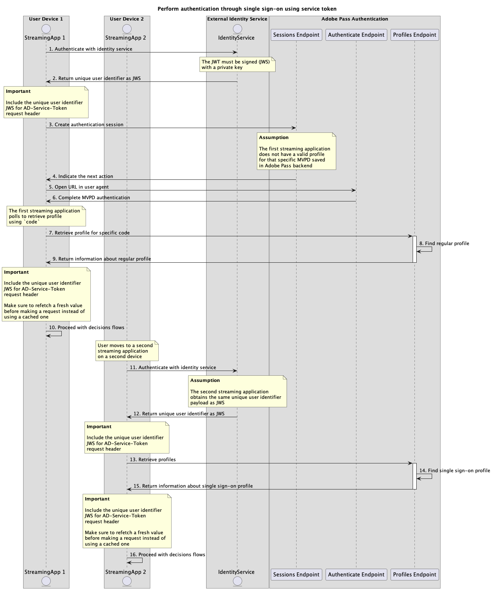

# 使用服務權杖流程的單一登入{#single-sign-on-service-token-full-flows}

>[!IMPORTANT]
>
> 此頁面上的內容僅供參考。 使用此API需要Adobe的目前授權。 不允許未經授權的使用。

>[!IMPORTANT]
>
> REST API V2實作受到[節流機制](/help/authentication/throttling-mechanism.md)檔案的限制。

Service Token方法可讓多個應用程式使用唯一的使用者識別碼，在使用Adobe Pass服務時跨多個裝置和平台達成單一登入(SSO)。

這些應用程式負責在Adobe Pass系統之外，使用外部身分服務來擷取唯一使用者識別碼裝載，例如：

* 直接對消費者(DTC)服務，使用者使用相同的憑證登入每個裝置，並與相同的使用者ID或使用者帳戶名稱相關聯。
* 第三方驗證服務，例如Google或Facebook，其使用者使用相同的憑證登入每個裝置，並與相同的電子郵件地址建立關聯。

應用程式負責將此不重複使用者識別碼裝載納入指定該裝載的所有要求的`AD-Service-Token`標題中。

如需`AD-Service-Token`標頭的詳細資訊，請參閱[AD-Service-Token](../../appendix/headers/rest-api-v2-appendix-headers-ad-service-token.md)檔案。

## 使用服務權杖，透過單一登入執行驗證 {#performing-authentication-flow-using-service-token-single-sign-on-method}

### 必要條件 {#prerequisites-scenario-performing-authentication-flow-using-service-token-single-sign-on-method}

在使用服務權杖透過單一登入執行驗證流程之前，請確保符合以下先決條件：

* 外部身分服務必須傳回一致資訊，做為多個裝置和平台上所有應用程式的`JWS`裝載。
* 第一個串流應用程式必須擷取唯一的使用者識別碼，並包含`JWS`裝載，做為所有指定該識別碼的要求之[AD-Service-Token](../../appendix/headers/rest-api-v2-appendix-headers-ad-service-token.md)標頭的一部分。
* 第一個串流應用程式必須選取MVPD。
* 第一個串流應用程式必須起始驗證工作階段，才能使用選取的MVPD登入。
* 第一個串流應用程式必須在使用者代理程式中使用選取的MVPD進行驗證。
* 第二個串流應用程式必須擷取唯一的使用者識別碼，並包含`JWS`裝載，做為所有指定此識別碼的要求之[AD-Service-Token](../../appendix/headers/rest-api-v2-appendix-headers-ad-service-token.md)標頭的一部分。

>[!IMPORTANT]
>
> 假設
> 
>  
> 
> * 第一個串流應用程式支援使用者互動以選取MVPD。
> * 第一個串流應用程式支援使用者互動，以在使用者代理程式中使用選取的MVPD進行驗證。

### 工作流程 {#workflow-steps-scenario-performing-authentication-flow-using-service-token-single-sign-on-method}

執行指定的步驟，使用服務權杖透過單一登入實作驗證流程，如下圖所示。

*使用服務權杖透過單一登入執行驗證*

1. **使用身分服務進行驗證：**&#x200B;第一個串流應用程式在Adobe Pass系統外部呼叫身分服務，以取得與唯一使用者識別碼相關聯的`JWS`裝載。

1. **傳回唯一使用者識別碼為JWS：**&#x200B;第一個串流應用程式會驗證回應資料，以確保符合基本安全性條件：
   * 承載未過期。
   * 承載已簽署。

1. **建立驗證工作階段：**&#x200B;第一個串流應用程式會收集所有必要的資料，藉由呼叫「工作階段」端點來啟動驗證工作階段。

   >[!IMPORTANT]
   >
   > 如需下列詳細資訊，請參閱[建立驗證工作階段](../../apis/sessions-apis/rest-api-v2-sessions-apis-create-authentication-session.md) API檔案：
   >
   > * 所有&#x200B;_必要的_&#x200B;引數，例如`serviceProvider`、`mvpd`、`domainName`和`redirectUrl`
   > * 所有&#x200B;_必要的_&#x200B;標頭，例如`Authorization`、`AP-Device-Identifier`
   > * 所有&#x200B;_選用的_&#x200B;引數和標頭
   >
   >  
   > 
   > 串流應用程式在提出請求之前，必須確定其中包含唯一使用者識別碼的有效值。
   >
   >  
   > 
   > 如需`AD-Service-Token`標頭的詳細資訊，請參閱[AD-Service-Token](../../appendix/headers/rest-api-v2-appendix-headers-ad-service-token.md)檔案。

1. **指示下一個動作：**&#x200B;工作階段端點回應包含必要的資料，可引導第一個串流應用程式瞭解下一個動作。

   >[!IMPORTANT]
   >
   > 如需工作階段回應中所提供資訊的詳細資訊，請參閱[建立驗證工作階段](../../apis/sessions-apis/rest-api-v2-sessions-apis-create-authentication-session.md) API檔案。
   >
   >  
   > 
   > 「工作階段」端點會驗證請求資料，以確保符合基本條件：
   >
   > * _必要_&#x200B;引數和標頭必須有效。
   > * 提供的`serviceProvider`與`mvpd`之間的整合必須是作用中。
   >
   >  
   > 
   > 如果驗證失敗，將會產生錯誤回應，提供可遵守[增強錯誤碼](../../../enhanced-error-codes.md)檔案的額外資訊。

1. **在使用者代理程式中開啟URL：**&#x200B;工作階段端點回應包含下列資料：
   * `url`可用來在MVPD登入頁面中起始互動式驗證。
   * `actionName`屬性已設定為「驗證」。
   * `actionType`屬性設定為「互動式」。

   如果Adobe Pass後端未識別有效的設定檔，第一個串流應用程式會開啟使用者代理程式，以載入提供的`url`，並向驗證端點提出要求。 此流程可能包含數個重新導向，最終將使用者帶往MVPD登入頁面並提供有效認證。

1. **完成MVPD驗證：**&#x200B;如果驗證流程成功，使用者代理程式互動會在Adobe Pass後端儲存一般設定檔，並到達提供的`redirectUrl`。

1. **擷取特定程式碼的設定檔：**&#x200B;第一個串流應用程式會傳送要求至設定檔端點，以收集擷取設定檔資訊所需的所有資料。

   >[!IMPORTANT]
   >
   > 如需下列詳細資訊，請參閱特定程式碼](../../apis/profiles-apis/rest-api-v2-profiles-apis-retrieve-profile-for-specific-code.md) API檔案的[擷取設定檔：
   > 
   > * 所有&#x200B;_必要的_&#x200B;引數，如`serviceProvider`、`code`
   > * 所有&#x200B;_必要的_&#x200B;標頭，例如`Authorization`、`AP-Device-Identifier`
   > * 所有&#x200B;_選用的_&#x200B;引數和標頭

   >[!NOTE]
   >
   > 建議：串流應用程式可以等待使用者代理程式到達提供的`redirectUrl`，以檢查一般設定檔是否已成功產生並儲存。

1. **尋找一般設定檔：** Adobe Pass伺服器會根據收到的引數和標頭識別有效的設定檔。

1. **傳回關於一般設定檔的資訊：**&#x200B;設定檔端點回應包含關於所找到之設定檔的相關資訊，這些設定檔與收到的引數和標題相關聯。

   >[!IMPORTANT]
   >
   > 請參閱特定程式碼](../../apis/profiles-apis/rest-api-v2-profiles-apis-retrieve-profile-for-specific-code.md) API檔案的[擷取設定檔，以取得設定檔回應中提供的詳細資訊。
   >
   >  
   > 
   > 設定檔端點會驗證請求資料，以確保符合基本條件：
   >
   > * _必要_&#x200B;引數和標頭必須有效。
   >
   >  
   > 
   > 如果驗證失敗，將會產生錯誤回應，提供可遵守[增強錯誤碼](../../../enhanced-error-codes.md)檔案的額外資訊。

1. **繼續決策流程：**&#x200B;第一個串流應用程式可以繼續後續的決策流程。

   >[!IMPORTANT]
   >
   > 串流應用程式在提出請求之前，必須確定其中包含唯一使用者識別碼的有效值。
   >
   >  
   > 
   > 如需`AD-Service-Token`標頭的詳細資訊，請參閱[AD-Service-Token](../../appendix/headers/rest-api-v2-appendix-headers-ad-service-token.md)檔案。

1. **使用身分服務進行驗證：**&#x200B;第二個串流應用程式會在Adobe Pass系統外部呼叫身分服務，以取得與唯一使用者識別碼相關聯的`JWS`裝載。

1. **傳回唯一使用者識別碼為JWS：**&#x200B;第二個串流應用程式會驗證回應資料，以確保符合基本安全性條件：
   * 承載未過期。
   * 承載已簽署。

1. **擷取設定檔：**&#x200B;第二個串流應用程式會收集所有必要資料，藉由傳送要求給設定檔端點來擷取所有設定檔資訊。

   >[!IMPORTANT]
   >
   > 如需下列詳細資訊，請參閱[擷取設定檔](../../apis/profiles-apis/rest-api-v2-profiles-apis-retrieve-profiles.md) API檔案：
   >
   > * 所有&#x200B;_必要的_&#x200B;引數，例如`serviceProvider`
   > * 所有&#x200B;_必要的_&#x200B;標頭，例如`Authorization`、`AP-Device-Identifier`
   > * 所有&#x200B;_選用的_&#x200B;引數和標頭
   >
   >  
   > 
   > 串流應用程式在提出請求之前，必須確定其中包含唯一使用者識別碼的有效值。
   >
   >  
   > 
   > 如需`AD-Service-Token`標頭的詳細資訊，請參閱[AD-Service-Token](../../appendix/headers/rest-api-v2-appendix-headers-ad-service-token.md)檔案。

1. **尋找單一登入設定檔：** Adobe Pass伺服器會根據收到的引數和標題，識別有效的單一登入設定檔。

1. **傳回有關單一登入設定檔的資訊：**&#x200B;設定檔端點回應包含有關所找到之設定檔的資訊，此設定檔與收到的引數和標題相關聯。

   >[!IMPORTANT]
   >
   > 如需設定檔回應中所提供資訊的詳細資訊，請參閱[擷取設定檔](../../apis/profiles-apis/rest-api-v2-profiles-apis-retrieve-profiles.md) API檔案。
   > 
   >  
   > 
   > 設定檔端點會驗證請求資料，以確保符合基本條件：
   >
   > * _必要_&#x200B;引數和標頭必須有效。
   >
   >  
   > 
   > 如果驗證失敗，將會產生錯誤回應，提供可遵守[增強錯誤碼](../../../enhanced-error-codes.md)檔案的額外資訊。

1. **繼續決策流程：**&#x200B;第二個串流應用程式可以繼續後續的決策流程。

   >[!IMPORTANT]
   >
   > 串流應用程式在提出請求之前，必須確定其中包含唯一使用者識別碼的有效值。
   >
   >  
   > 
   > 如需`AD-Service-Token`標頭的詳細資訊，請參閱[AD-Service-Token](../../appendix/headers/rest-api-v2-appendix-headers-ad-service-token.md)檔案。

## 使用服務權杖透過單一登入擷取授權決策 {#performing-authorization-flow-using-service-token-single-sign-on-method}

### 必要條件 {#prerequisites-scenario-performing-authorization-flow-using-service-token-single-sign-on-method}

在使用服務權杖透過單一登入執行授權流程之前，請確保符合以下先決條件：

* 外部身分服務必須傳回一致資訊，做為多個裝置和平台上所有應用程式的`JWS`裝載。
* 第一個串流應用程式必須擷取唯一的使用者識別碼，並包含`JWS`裝載，做為所有指定該識別碼的要求之[AD-Service-Token](../../appendix/headers/rest-api-v2-appendix-headers-ad-service-token.md)標頭的一部分。
* 第二個串流應用程式必須先擷取授權決定，才能播放使用者選取的資源。

>[!IMPORTANT]
>
> 假設
>
>  
> 
> * 第一個串流應用程式已執行驗證，並包含[AD-Service-Token](../../appendix/headers/rest-api-v2-appendix-headers-ad-service-token.md)要求標頭的有效值。

### 工作流程 {#workflow-steps-scenario-performing-authorization-flow-using-service-token-single-sign-on-method}

執行指定的步驟，使用服務權杖透過單一登入實作授權流程，如下圖所示。

*使用服務權杖透過單一登入擷取授權決定*

1. **使用身分服務進行驗證：**&#x200B;第二個串流應用程式會在Adobe Pass系統外部呼叫身分服務，以取得與唯一使用者識別碼相關聯的`JWS`裝載。

1. **傳回唯一使用者識別碼為JWS：**&#x200B;第二個串流應用程式會驗證回應資料，以確保符合基本安全性條件：
   * 承載未過期。
   * 承載已簽署。

1. **擷取授權決定：**&#x200B;第二個串流應用程式會呼叫Decisions Authorized端點，收集所有必要資料以取得特定資源的授權決定。

   >[!IMPORTANT]
   >
   > 請參考[使用特定mvpd](../../apis/decisions-apis/rest-api-v2-decisions-apis-retrieve-authorization-decisions-using-specific-mvpd.md) API擷取授權決定，以取得以下詳細資訊：
   >
   > * 所有&#x200B;_必要的_&#x200B;引數，例如`serviceProvider`、`mvpd`和`resources`
   > * 所有&#x200B;_必要的_&#x200B;標頭，例如`Authorization`和`AP-Device-Identifier`
   > * 所有&#x200B;_選用的_&#x200B;引數和標頭
   >
   >  
   > 
   > 串流應用程式在提出請求之前，必須確定其中包含唯一使用者識別碼的有效值。
   >
   >  
   > 
   > 如需`AD-Service-Token`標頭的詳細資訊，請參閱[AD-Service-Token](../../appendix/headers/rest-api-v2-appendix-headers-ad-service-token.md)檔案。

1. **尋找單一登入設定檔：** Adobe Pass伺服器會根據收到的引數和標題，識別有效的單一登入設定檔。

1. **擷取所要求資源的MVPD決定：** Adobe Pass伺服器會呼叫MVPD授權端點，以取得從串流應用程式接收之特定資源的`Permit`或`Deny`決定。

1. **傳回`Permit`決定，媒體權杖：**&#x200B;決定授權端點回應包含`Permit`決定和媒體權杖。

   >[!IMPORTANT]
   >
   > 請參閱使用特定mvpd](../../apis/decisions-apis/rest-api-v2-decisions-apis-retrieve-authorization-decisions-using-specific-mvpd.md) API檔案的[擷取授權決定，以取得決定回應中提供的詳細資訊。
   > 
   >  
   > 
   > Decisions Authorize端點會驗證請求資料，以確保符合基本條件：
   >
   > * _必要_&#x200B;引數和標頭必須有效。
   > * 提供的`serviceProvider`與`mvpd`之間的整合必須是作用中。
   >
   >  
   > 
   > 如果驗證失敗，將會產生錯誤回應，提供可遵守[增強錯誤碼](../../../enhanced-error-codes.md)檔案的額外資訊。

1. **使用媒體權杖開始串流：**&#x200B;第二個串流應用程式使用媒體權杖播放內容。

1. **傳回`Deny`決定，詳細資料：** Decisions Authorize端點回應包含`Deny`決定和依循[增強式錯誤碼](../../../enhanced-error-codes.md)檔案的錯誤承載。

   >[!IMPORTANT]
   >
   > 請參閱使用特定mvpd](../../apis/decisions-apis/rest-api-v2-decisions-apis-retrieve-authorization-decisions-using-specific-mvpd.md) API檔案的[擷取授權決定，以取得決定回應中提供的詳細資訊。
   > 
   >  
   > 
   > Decisions Authorize端點會驗證請求資料，以確保符合基本條件：
   >
   > * _必要_&#x200B;引數和標頭必須有效。
   > * 提供的`serviceProvider`與`mvpd`之間的整合必須是作用中。
   >
   >  
   > 
   > 如果驗證失敗，將會產生錯誤回應，提供可遵守[增強錯誤碼](../../../enhanced-error-codes.md)檔案的額外資訊。

1. **處理`Deny`決定詳細資料：**&#x200B;第二個串流應用程式會處理回應中的錯誤資訊，並可使用它來選擇性地在使用者介面上顯示特定訊息。

>[!NOTE]
>
> 預先授權流程的步驟與授權流程的步驟相同，但使用的端點是[使用特定mvpd](../../apis/decisions-apis/rest-api-v2-decisions-apis-retrieve-preauthorization-decisions-using-specific-mvpd.md)檔案擷取預先授權決定中描述的端點。
