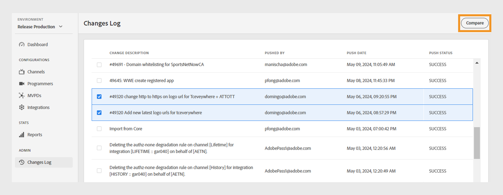
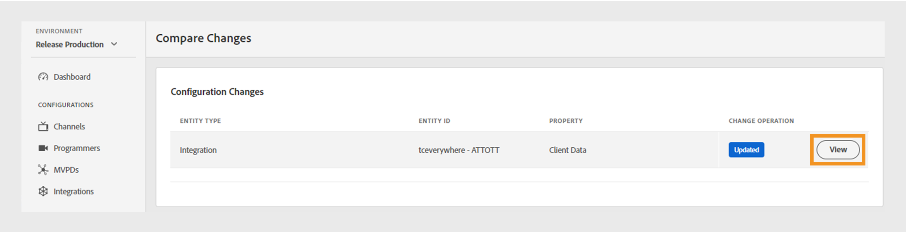
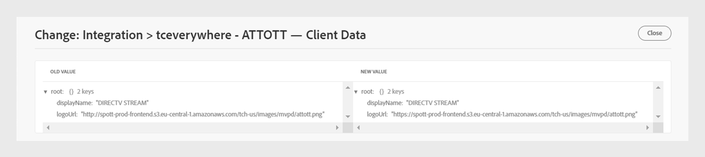

# 變更記錄 {#changes-log}

>[!NOTE]
>
>此頁面上的內容僅供參考。 使用此API需要Adobe的目前授權。 不允許未經授權的使用。

TVE儀表板的&#x200B;**變更記錄**&#x200B;區段可讓您檢視透過TVE儀表板推送到Adobe Pass驗證環境的設定變更。 您也可以比較兩種不同的組態變更。

左側面板中的&#x200B;**變更記錄**&#x200B;索引標籤會顯示透過TVE儀表板的特定帳戶所做的所有設定變更清單。 此變更清單包含下列詳細資訊：

* **變更描述**：組態變更範圍的簡短描述。
* **推播者**：負責進行變更之使用者的電子郵件識別碼。
* **推播日期**：組態變更的日期。
* **推播狀態**：指出推播作業是成功、擱置還是失敗。

## 比較變更 {#compare-changes}

若要比較變更，請遵循下列步驟：

1. 從清單中選取兩個要比較的組態變更。

   

   *比較組態變更*

1. 選取畫面右上角的&#x200B;**比較**。

   **組態變更**&#x200B;區段會顯示每個變更的實體型別、實體ID、屬性以及變更作業的狀態。

1. 暫留在您要檢視的組態變更上。
1. 選取&#x200B;**檢視**&#x200B;以存取變更的值。

   

   *檢視組態變更*

以下是在所選組態中所做變更的範例。 您可以在變更中檢視新舊值之間的差異。

*新舊值*
