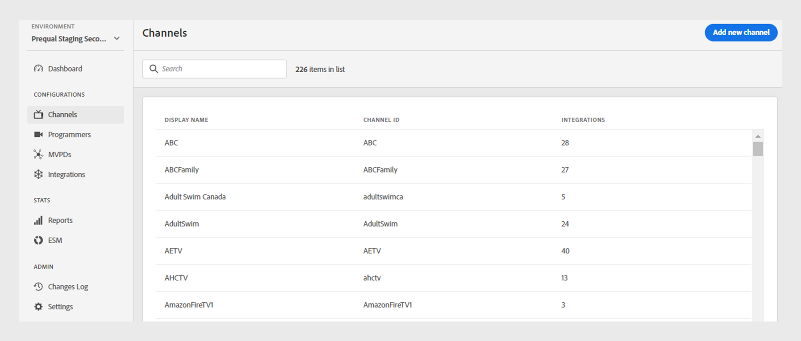
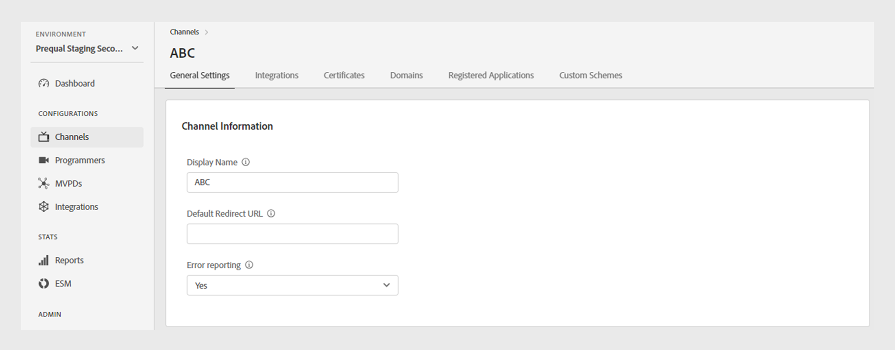
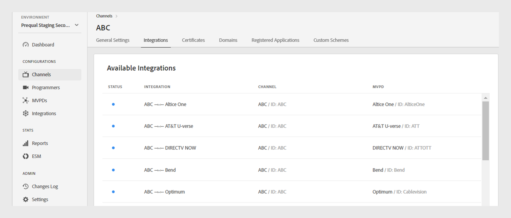
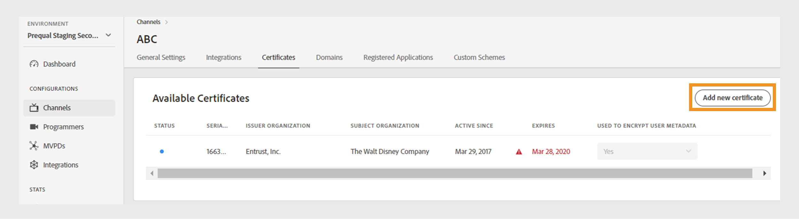
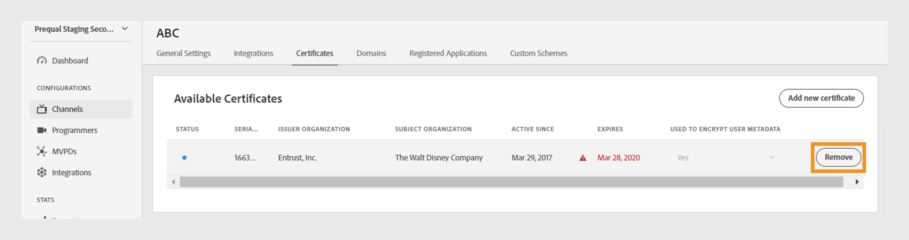
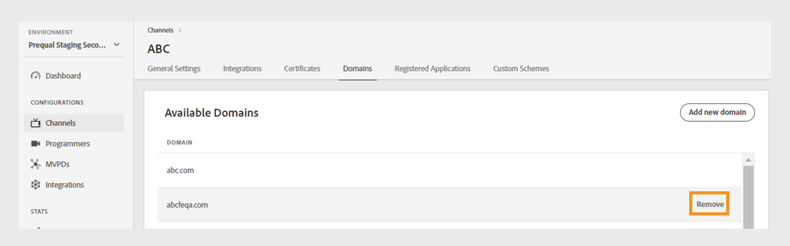
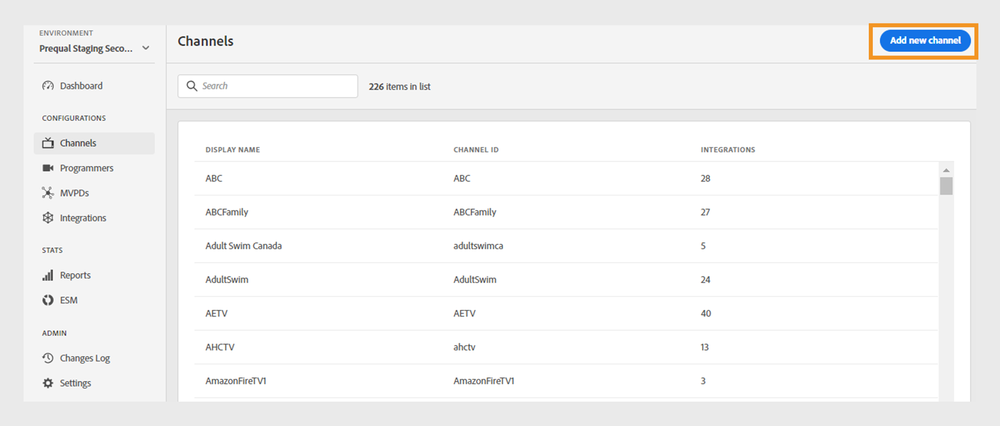

# 頻道 {#channels}

>[!NOTE]
>
>此頁面上的內容僅供參考。 使用此API需要Adobe的目前授權。 不允許未經授權的使用。

此 **頻道** 「TVE控制面板」的區段可讓您檢視及管理與特定程式設計師相關之頻道的設定。 您也可以 [新增頻道](#add-new-channel) 根據您的需求。

此 **頻道** 索引標籤在左側面板中顯示連結頻道的清單，其詳細資訊如下：

* **顯示名稱**：用於商業目的的管道品牌名稱。
* **管道ID**：唯一識別碼，也稱為請求者ID。
* **整合**：與建立的連線數 [MVPDs](/help/authentication/glossary.md#mvpd).

*現有管道的清單*

在中輸入管道名稱 **搜尋** 列在清單上方，以進一步瞭解頻道。

## 管理頻道設定 {#manage-channel-conf}

請依照步驟管理特定管道的各種設定。

1. 選取 **頻道** 標籤。
1. 從可用清單中選取頻道。
1. 選取下列其中一個標籤，以檢視及編輯所選色版的對應設定：

   * [一般設定](#general-settings)
   * [整合](#integrations)
   * [憑證](#certificates)
   * [網域](#domains)
   * [註冊的應用程式](#registered-applications)
   * [自訂配置](#custom-schemes)

   

   *頻道設定*

>[!IMPORTANT]
>
> 檢視 [檢閱和推送變更](/help/authentication/tve-dashboard-review-push-changes.md) 以取得啟用設定變更的詳細資訊。

### 一般設定 {#general-settings}

此標籤會出現 **頻道資訊** 和 **Analytics設定**.

#### 頻道資訊 {#channel-information}

您可以在此段落中編輯下列詳細資訊：

* **顯示名稱**：用於商業目的的管道品牌名稱。

* **預設重新導向URL**：用於驗證和登出的備份重新導向URL。

* **錯誤報告**：選取時 **是**，Adobe Pass SDK會傳送錯誤報告至Adobe Pass後端以進行分析。

*編輯頻道資訊*

#### Analytics設定 {#analytics-configuration}

本節可讓您設定將Adobe Pass驗證事件轉送至Adobe Analytics。

若要啟用 **Analytics設定**，請聯絡您的技術客戶經理(TAM)，以取得設定報表套裝ID (RSID)的詳細資訊。

*啟用Analytics設定*

選取 **新增分析設定** 以新增多個組態。

已建立新的組態變更，且已準備好進行伺服器更新。 若要使用的全新分析設定，請 **Analytics設定** 區段，繼續進行 [檢閱和推送變更](/help/authentication/tve-dashboard-review-push-changes.md) 流量。

### 整合 {#integrations}

此標籤會顯示目前所選管道與MVPD之間的可用整合清單。 清單會顯示每項整合及其狀態，指出其是否已啟用。 從此清單中選取特定整合，以存取 [整合](tve-dashboard-integrations.md) 區段。

*可用整合的清單*

### 憑證 {#certificates}

此索引標籤顯示以下清單 [可用的憑證](#available-certificates) 和 [繼承的可用憑證](#inherited-avail-certificates) 用於使用者中繼資料加密流程。 它會顯示每個憑證的詳細資訊，包括：

* 狀態(不論是否已啟用 **使用者中繼資料加密** 是否使用)
* 序號
* 簽發者組織的名稱
* 主體組織的名稱
* 發行日期
* 到期日
* 用於加密使用者中繼資料的下拉式功能表(如果您選取 **是**，憑證會加密敏感的使用者資訊，例如郵遞區號值)。

#### 可用的憑證 {#available-certificates}

這些憑證可作為私密金鑰或公開金鑰，並用於使用者中繼資料加密。
您可以在「可用憑證」區段下進行下列變更：

* [新增憑證](#add-new-certificate)
* [刪除憑證](#delete-certificate)

##### 新增憑證 {#add-new-certificate}

若要新增憑證，請執行下列步驟：

1. 選取 **新增憑證** 在頂端 **可用的憑證** 區段。

   

   *新增憑證*

1. 將憑證的公開金鑰貼到 **新憑證** 對話方塊。
1. 選取 **新增憑證**.

   已建立新的組態變更，且已準備好進行伺服器更新。 若要使用 **可用的憑證** 區段，繼續進行 [檢閱和推送變更](/help/authentication/tve-dashboard-review-push-changes.md) 流量。

1. 在清單中找到新憑證 **可用的憑證**.

   >[!IMPORTANT]
   >
   > 請確定您的系統為最新狀態，且已準備好使用新憑證。

1. 選取 **是** 從 **用於加密的使用者中繼資料** 下拉式功能表以啟動新憑證。

##### 刪除憑證 {#delete-certificate}

請依照下列步驟刪除憑證。

1. 暫留在您要從清單中刪除的憑證上 **可用的憑證**.
1. 選取 **移除**.

   

   *移除選取的憑證*

1. 選取 **刪除** 從 **刪除使用中的憑證** 對話方塊。

已建立新的組態變更，且已準備好進行伺服器更新。 憑證將會從 **可用的憑證** 區段僅晚於 [檢閱和推送變更](/help/authentication/tve-dashboard-review-push-changes.md).

#### 繼承的可用憑證 {#inherited-avail-certificates}

媒體公司會在其自己的層級定義這些憑證。 所有與相同媒體公司相關的管道都可以使用這些憑證。

*繼承的可用憑證*

### 網域 {#domains}

此索引標籤會顯示可用網域清單，各個通道可透過這些網域與Adobe Pass驗證通訊。

您可以對網域進行下列變更：

* [新增網域](#add-domains)
* [刪除網域](#delete-domain)

>[!TIP]
>
> 如果清單中存在較一般的網域，請避免新增子網域。

#### 新增網域 {#add-domains}

請依照下列步驟新增網域。

1. 選取 **新增網域** 位於的右上角 **可用的網域** 區段。

   

   *新增網域*

1. 在「 」中輸入網域名稱 **新網域** 對話方塊。

1. 選取 **新增網域** ，為選取的管道新增網域。

已建立新的組態變更，且已準備好進行伺服器更新。 若要使用 **可用的網域** 區段，繼續進行 [檢閱和推送變更](/help/authentication/tve-dashboard-review-push-changes.md) 流量。

#### 刪除網域 {#delete-domain}

請依照下列步驟刪除網域。

1. 暫留在您要從清單中刪除的網域上 **可用的網域**.
1. 選取 **移除**.

   

   *移除選取的網域*

1. 選取 **刪除** 於 **刪除網域** 對話方塊。

已建立新的組態變更，且已準備好進行伺服器更新。 網域將會從 **可用的網域** 區段僅晚於 [檢閱和推送變更](/help/authentication/tve-dashboard-review-push-changes.md).

選取的網域已無法使用。 因此，與此網域相關聯的應用程式會失去對Adobe Pass驗證服務的存取權。

### 註冊的應用程式 {#registered-applications}

此標籤提供應用程式註冊的清單。 檢視 [動態使用者端註冊管理](/help/authentication/dynamic-client-registration-management.md) 以取得詳細資訊。

### 自訂配置 {#custom-schemes}

此索引標籤會顯示自訂配置清單。 檢視 [iOS/tvOS應用程式註冊](/help/authentication/iostvos-application-registration.md) 和 [動態使用者端註冊管理](/help/authentication/dynamic-client-registration-management.md) 以取得詳細資訊。

## 新增頻道 {#add-new-channel}

請依照以下步驟新增管道。

1. 選取 **頻道** 標籤。
1. 選取 **新增頻道** 位於的右上角 **頻道** 區段。

   

   *新增頻道*

1. 選取 **程式設計師ID** 從「 」的下拉式功能表 **新管道** 對話方塊。

1. 在中輸入唯一識別碼 **管道ID**.
1. 在「 」中輸入用於商業目的的管道品牌名稱 **顯示名稱**.
1. 選取 **新增頻道**.

已建立新的組態變更，且已準備好進行伺服器更新。 若要使用列於 **頻道** 區段，繼續進行 [檢閱和推送變更](/help/authentication/tve-dashboard-review-push-changes.md) 流量。

