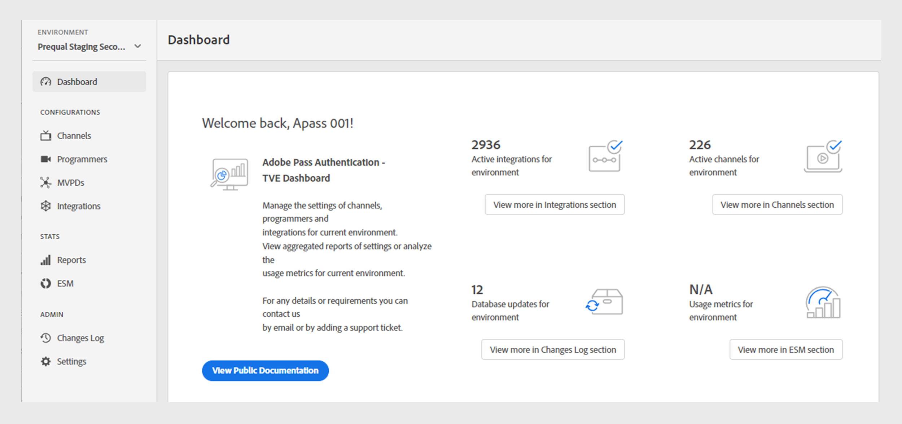

# 儀表板 {#dashboard}

>[!NOTE]
>
>此頁面上的內容僅供參考。 使用此API需要Adobe的目前授權。 不允許未經授權的使用。

此 **儀表板** 區段在左側面板中可作為Adobe Pass Authentication TVE Dashboard的首頁。

首頁上提供兩個區段：

* [歡迎畫面](#welcome-screen)
* [設定狀態](#configuration-status)

## 歡迎畫面 {#welcome}

在此區段中，您可以直接從歡迎訊息存取公開檔案，並檢視目前設定的快照。

* **使用中的整合**：目前環境中的作用中整合數量。 選取 **在整合區段中檢視更多資訊** 若要存取 [整合](tve-dashboard-integrations.md) 區段。
* **作用中頻道**：目前環境中的作用中管道數。 選取 **在色版區段中檢視更多** 若要存取 [頻道](tve-dashboard-channels.md) 區段。
* **資料庫更新**：對目前環境進行的設定變更數量。 選取 **在「變更記錄」段落中檢視更多資訊** 若要存取 [變更記錄](tve-dashboard-changes-log.md) 區段。
* **ESM儀表板**：密切注意即將推出的ESM控制面板，提供目前環境中屬性使用的深入量度。 未來的更新將可存取此功能。

*歡迎畫面*

## 設定狀態 {#conf-status}

本節提供10項最新的組態變更，包括：

* **變更說明**：使用者選取之變更的簡短說明。
* **推送者**：負責變更的帳戶。
* **推播日期**：進行變更的日期。

*變更記錄的組態狀態*

若要檢視完整的變更清單，請選取 **在變更記錄檔中檢視更多資訊** 在右下角檢視 [變更記錄](tve-dashboard-changes-log.md) 區段。
