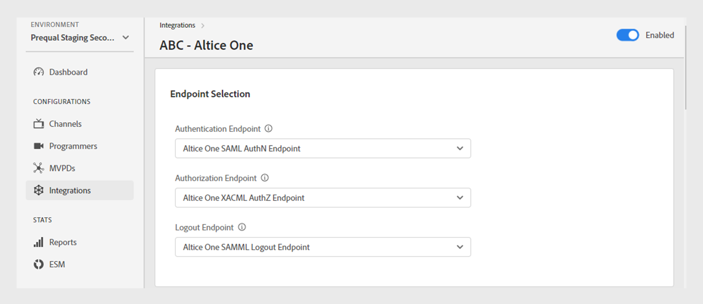
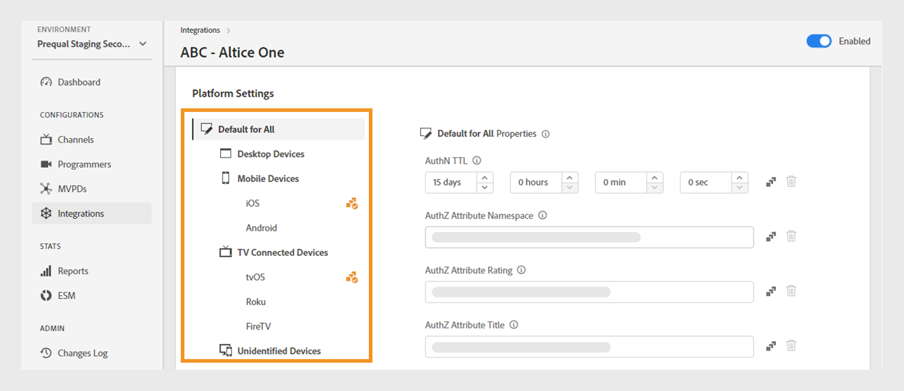
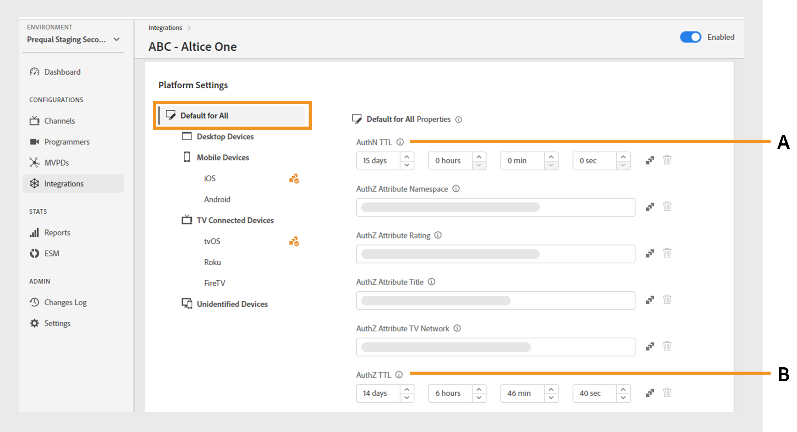
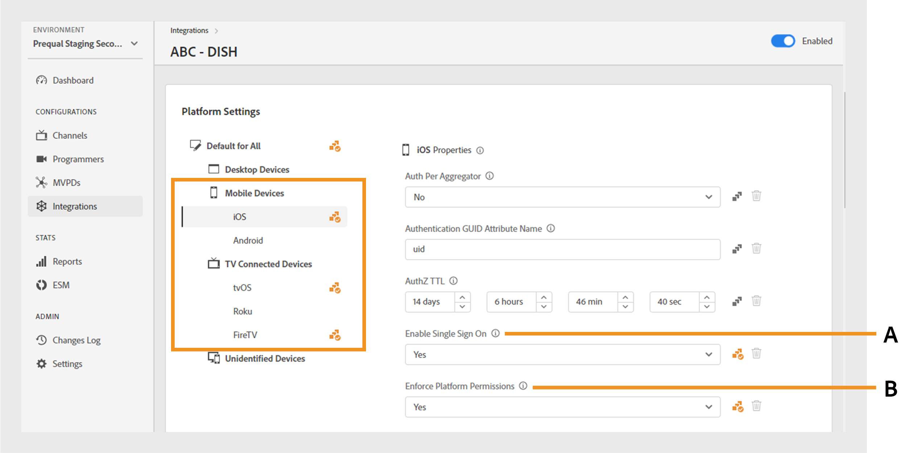
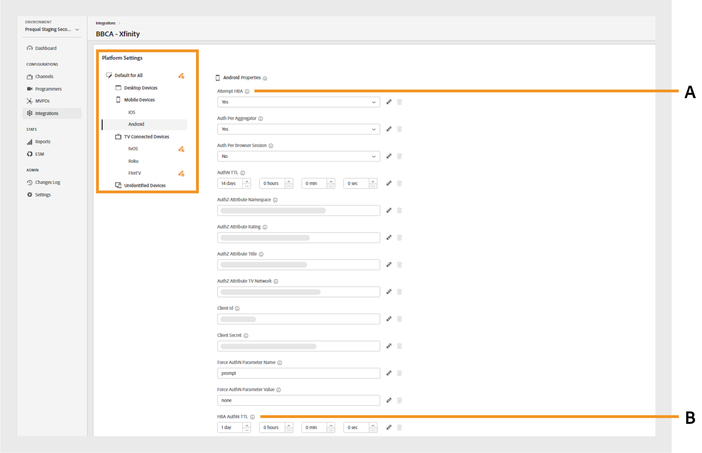
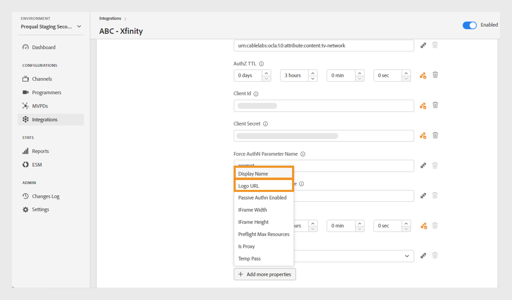
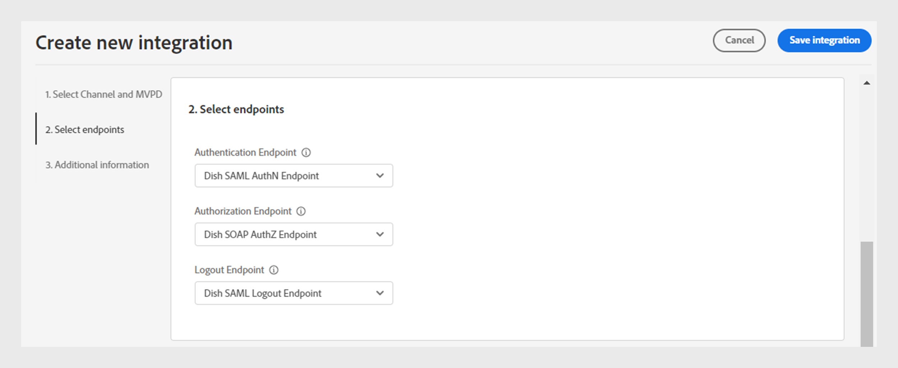
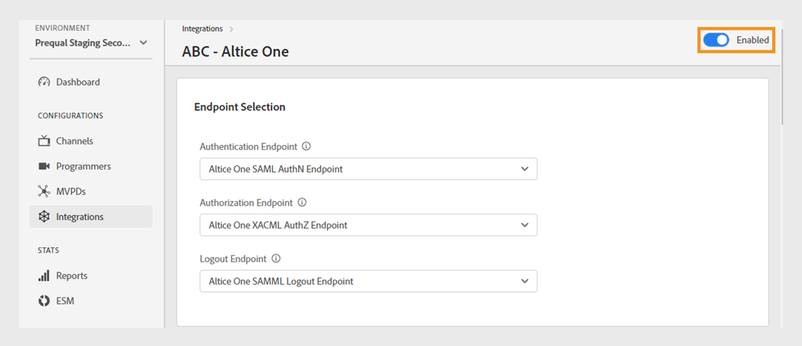

# 整合

>[!NOTE]
>
>此頁面上的內容僅供參考。 使用此API需要Adobe的目前授權。 不允許未經授權的使用。

此 **整合** 「TVE控制面板」的區段可讓您檢視及管理頻道與MVPD之間整合的設定。 您也可以 [建立新的整合](#create-new-integration) 根據您的需求。

此 **整合** 索引標籤在左側面板中顯示現有整合的清單，其中包含下列詳細資訊：

* 表示整合目前作用中或非作用中的狀態
* 整合將特定管道與個別MVPD連結
* 具有管道ID的管道名稱
* MVPD顯示名稱和MVPD ID

*現有整合的清單*

在「 」中輸入通道或MVPD的名稱 **搜尋** 列於清單上方，以進一步瞭解整合。

## 管理整合設定 {#manage-integration-conf}

請依照下列步驟管理特定整合。

1. 選取 **整合** 標籤。
1. 從提供的清單中選取整合，以檢視及編輯下列區段中的各種設定：

   * [端點選取](#endpoint-selection)
   * [平台設定](#platform-settings)
   * [使用者中繼資料](#user-metadata)

>[!IMPORTANT]
>
> 檢視 [檢閱和推送變更](/help/authentication/tve-dashboard-review-push-changes.md) 以取得啟用設定變更的詳細資訊。

### 端點選取 {#endpoint-selection}

此段落可讓您從各自的下拉式功能表中選擇用於驗證、授權和登出流程的MVPD端點。

*驗證、授權和登出流程的端點*

>[!NOTE]
>
>MVPD可以為每個流程提供一個或多個端點。 整合新管道時，MVPD必須為每個流程指定其慣用的端點。

>[!IMPORTANT]
>
>端點的任何變更都會影響整合的整體行為。 這些變更只應在收到MVPD的確認後實施。

### 平台設定 {#platform-settings}

本節可讓您檢視及編輯所有整合設定 [平台](/help/authentication/tve-dashboard-reports.md#platforms). 您可以根據個別平台變更這些設定。 例如，您可以調整Android上的授權TTL持續時間，同時維護另一個平台的預設值。

平台設定中的每個屬性都會繼承由MVPD設定的預設值，但可視需要調整。

>[!IMPORTANT]
>
>您必須與MVPD達成協定，才能決定為平台設定中的每個屬性設定的值。

>[!IMPORTANT]
>
> 設定繼承會依循一個鏈結，從MVPD設定（最一般）開始，然後是MVPD端點、整合、平台類別和平台（包含最特定的值）。

**平台設定** 可用來覆寫繼承鏈中每個層級的設定。 鏈中的可用層次分組如下：

* **全部預設**：如果未定義特定平台值，無論程式設計師的實施為何，請設定適用於所有平台的通用屬性值。

* **案頭裝置**：設定適用於所有桌上型電腦和筆記型電腦的屬性值，不考慮程式設計方法（JS SDK或REST API）。

* **行動裝置**：設定適用於所有行動裝置的屬性值，包括 **iOS**， **Android**&#x200B;和其他應用程式，無論程式設計方式（SDK或REST API）為何。

* **電視連線裝置**：設定適用於所有電視連線裝置的屬性值，包括 **tvOS**， **Roku**， **FireTV**&#x200B;和其他專案，不考慮程式設計方法（SDK或REST API）。

* **無法識別的裝置**：設定適用於目前機制無法準確識別平台的所有裝置的屬性值。 在這種情況下，請套用MVPD所定義的最嚴格的規則。

  

  *平台及其裝置的類別*

選取  圖示可瀏覽用於上述每個繼承層級的屬性。

#### 最常使用的業務流程 {#most-used-flows}

此 **平台設定** 區段提供用於不同業務流程中的一系列屬性。 實際屬性可能會因特定整合中所選的MVPD而有所不同。 最常用的流程如下：

**所有平台上的AuthN TTL和AuthZ TTL**

>[!IMPORTANT]
>
>驗證(AuthN) TTL和授權(AuthZ) TTL值必須一致符合MVPD設定。

請依照下列步驟，針對特定整合變更所有平台的驗證和授權TTL。

1. 選取 **整合** 標籤。
1. 選取您要變更AuthN TTL與AuthZ TTL值的整合。
1. 導覽至 **平台設定** 區段。

1. 選取 **全部預設** 標籤下的 **平台設定**.

   >[!NOTE]
   >
   >如果您想要變更的持續時間 **驗證TTL** 和 **AuthZ TTL** 若為平台類別或特定平台，請選取相應的平台。

   

   *變更所有平台的AuthN TTL AuthZ TTL期間*

   **答：** AuthN TTL屬性 **B.** AuthZ TTL屬性

1. 選取向上和向下箭頭，調整此專案中的天數、小時數、分鐘數和秒數。 **驗證TTL** 和 **AuthZ TTL** 屬性。

「 」的持續時間 **驗證TTL** 和 **AuthZ TTL** 只有在 [檢閱和推送變更](/help/authentication/tve-dashboard-review-push-changes.md).

**啟用平台SSO**

>[!IMPORTANT]
>
>**啟用單一登入** 屬性僅支援於 *iOS、tvOS、Roku和FireTV* 平台。 此變數僅適用於與支援這些平台之單一登入的MVPD整合。

請依照下列步驟，為特定整合和平台啟用或停用SSO。

1. 選取 **整合** 標籤。
1. 選取您要啟用或停用單一登入的整合。

1. 導覽至 **平台設定** 區段。

1. 選取您要為其啟用單一登入的特定平台或平台類別 **平台設定**.

   

   *為特定平台啟用單一登入*

   **答：** 單一登入屬性 **B.** 強制執行平台許可權屬性

1. 選取 **是** 以啟用或 **否** 以從停用 **啟用單一登入** 下拉式功能表。

1. 選取 **是** 以啟用或 **否** 以從停用 **強制執行平台許可權** 下拉式功能表。

   **強制執行平台許可權** 屬性控制使用者是否 **允許** 或 **拒絕** 平台對其電視提供者訂閱的存取權已受到尊重。

   例如，如果兩者 **啟用單一登入** 和 **強制執行平台許可權** 已啟用，且使用者選擇拒絕平台存取其電視提供者訂閱，則個別應用程式（頻道）將無法使用其他應用程式（頻道）所取得的Adobe Pass驗證權杖。

此 **單一登入** 所選平台的屬性僅會在以下時間後啟用或停用 [檢閱和推送變更](/help/authentication/tve-dashboard-review-push-changes.md).

**啟用以住家為基礎的驗證**

請依照下列步驟，啟用或停用以OAuth2為基礎的MVPD之家用驗證。

1. 選取 **整合** 標籤。
1. 選取您要啟用或停用以住家為基礎的驗證的整合。
1. 導覽至 **平台設定** 區段。
1. 選取您要為其啟用家用驗證的特定平台或平台類別，在 **平台設定**.

   

   *為特定平台啟用以住家為基礎的驗證*

   **答：** 嘗試HBA屬性 **B.** HBA AuthN TTL屬性

1. 選取 **是** 啟用和 **否** 以從停用 **嘗試HBA** 下拉式功能表。

>[!IMPORTANT]
>
>變更的持續時間 **HBA驗證TTL** 屬性應該避免。 這可能會導致授權程式中發生未預期的失敗。

此 **嘗試HBA** 特定MVPD的屬性只有在 [檢閱和推送變更](/help/authentication/tve-dashboard-review-push-changes.md).

#### 新增更多屬性 {#add-more-properties}

此 **新增更多屬性** 可靈活地納入其他特定屬性以進行整合，尤其是針對不太常見的流程。

您可以新增這些屬性：

* 針對所有平台，選取 **全部預設** 索引標籤在左側。
* 若為平台的類別，請選取 **案頭裝置**， **行動裝置**，或 **電視連線裝置** 索引標籤在左側。
* 針對特定裝置，選取 **iOS**， **Android**， **tvOS**， **Roku**，或 **FireTV** 索引標籤在左側。

以下是透過新增這些屬性可以啟用的不同流程範例：

**變更預先授權資源的數量**

根據預設，大部分的MVPD支援最多使用5個資源ID的預檢authZ呼叫。
不過，如果MVPD同意提高此限制，您可以導覽至 **新增更多屬性** 並選取 **預檢最大資源** 從「選項」功能表。

**預檢最大資源** 將新增屬性，以便指定與MVPD議定的限制。

*新增預檢最大資源屬性*

此 **預檢最大資源** 屬性僅會新增於 [檢閱和推送變更](/help/authentication/tve-dashboard-review-push-changes.md).

**變更MVPD顯示名稱或標誌URL**

對於不想建置其MVPD選擇器而是依賴提供的設定的程式設計人員應用程式，您可以導覽至 **新增更多屬性** 並選取 **顯示名稱** 或 **標誌URL** 從「選項」功能表為每個MVPD新增必要的顯示名稱或標誌URL。

這些屬性的不同值可用於相同的MVPD，具體取決於裝置平台和所需的使用者體驗。

*新增顯示名稱或標誌URL屬性*

此 **顯示名稱** 或 **標誌URL** 屬性僅會新增於 [檢閱和推送變更](/help/authentication/tve-dashboard-review-push-changes.md).

**應用程式（頻道）切換時要求新的驗證流程**

如果您想要在使用者切換應用程式時強制進行新驗證。 在此情況下，您可以導覽至 **新增更多屬性**，選取 **依據彙總的驗證** 屬性。

新增 **依據彙總的驗證** 有效地中斷個別頻道的單一登入。

*新增每個彙總屬性的驗證*

此 **依據彙總的驗證** 屬性僅會新增於 [檢閱和推送變更](/help/authentication/tve-dashboard-review-push-changes.md).

新增後，選取 **是** 以啟用 **依據彙總的驗證** 所選整合的屬性。

#### 刪除屬性 {#delete-properties}

選取  圖示來刪除不再需要的屬性。

>[!NOTE]
>
>無法移除某些屬性，因為它們是所選MVPD的必要需求。

屬性將會從 **平台設定** 區段僅晚於 [檢閱和推送變更](/help/authentication/tve-dashboard-review-push-changes.md).

### 使用者中繼資料 {#user-metadata}

此區段可讓您更新MVPD共用的每個使用者中繼資料引數的設定。

>[!NOTE]
>
>每個MVPD可以共用不同的引數。 如需特定MVPD可共用引數的詳細資訊，請洽詢您的Adobe代表。

使用者中繼資料段落會顯示下列資料欄：

**索引鍵**：代表要在API中用於擷取值的實際使用者中繼資料引數。

**說明**：提供每個使用者中繼資料引數的簡短說明。

**已加密**：此欄可讓您透過選取「 」，啟用或停用API中的引數 **是** 或 **否** （分別從下拉式功能表中）。 選擇加入 **是** 表示會在API中加密引數值。 加密使用由定義的憑證來執行 **使用者中繼資料** 範圍。

>[!TIP]
>
>
> 務必確認 **ZIP** 引數已加密。

進一步瞭解中的可用憑證 [程式設計師](/help/authentication/tve-dashboard-programmers.md#available-certificates) 和 [頻道](/help/authentication/tve-dashboard-channels.md#available-certificates) 區段。

**已啟用**：此欄可讓您透過選取「 」，啟用或停用API中的引數 **是** 或 **否** 分別從下拉式功能表中選取。

*可用於使用者中繼資料的引數*

## 建立新整合 {#create-new-integration}

若要在目前的設定中建立與新MVPD的新整合，請遵循下列步驟：

1. 選取 **整合** 標籤。
1. 選取 **建立新整合** 位於的右上方 **整合** 區段。

   

   *建立新的整合*

   下列區段隨即顯示：

   **選取頻道和MVPD**

   選取 **頻道** 從 **選取頻道** 下拉式功能表以新增整合。 選取管道後，選取所需的 **MVPD** 從 **選取MVPD** 要與所選頻道整合的下拉式選單。

   

   *選取頻道和MVPD*

   **選取端點**

   選取必要的MVPD之後， **選取端點**  區段將會預先填入為該特定MVPD設定的預設端點。

   >[!IMPORTANT]
   >
   >除非MVPD特別指示，否則請勿變更任何流程中的預設端點。

   

   *選取端點*

   **其他資訊**

   本節包含需要在下列欄位中為選取的MVPD設定的各種特性： **選取頻道和MVPD** 區段。

   >[!NOTE]
   >
   > 實際屬性可能會因在「 」中選取的MVPD而有所不同 **選取頻道和MVPD** 區段。

   例如，您可以編輯 **驗證TTL** 或 **合作夥伴ID** （管道ID），以用於下圖中MVPD登入頁面的品牌結合用途。

   

   *編輯其他資訊*

   選取 **儲存整合** 位於的右上方 **建立新整合** 區段。

之後才會建立新整合 [檢閱和推送變更](/help/authentication/tve-dashboard-review-push-changes.md).

## 停用整合 {#disable-integratgion}

若要停用整合，請執行下列步驟：

1. 選取 **整合** 標籤。
1. 選取要停用的整合。
1. 停用所選整合右上角的切換。

   

   *停用整合*

整合僅會在以下時間後停用 [檢閱和推送變更](/help/authentication/tve-dashboard-review-push-changes.md).

整合停用後，一般使用者將無法使用特定MVPD進行驗證或授權。

