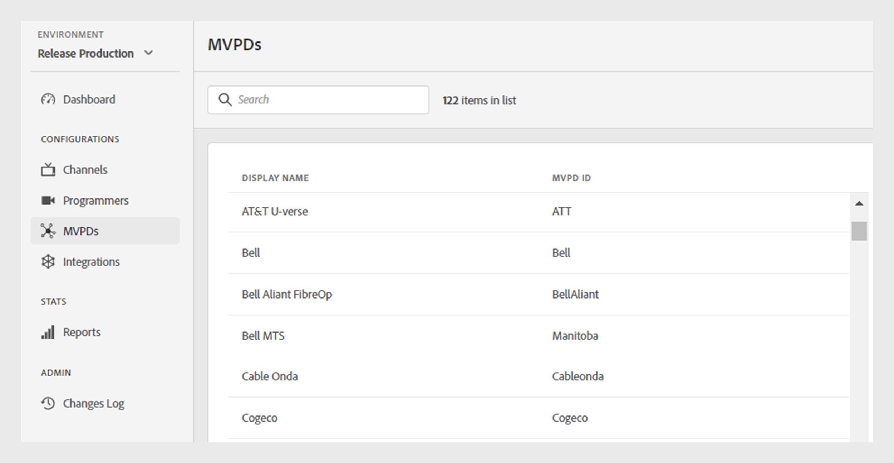

# MVPDs

>[!NOTE]
>
>此頁面上的內容僅供參考。 使用此API需要Adobe的目前授權。 不允許未經授權的使用。

此 **MVPDs** TVE控制面板的區段可讓您檢視Adobe Pass驗證生態系統中的整合MVPD清單。

此 **MVPDs** 索引標籤在左側面板中會顯示MVPD清單，其中包含下列詳細資訊：

* **顯示名稱**：選取器中每個MVPD的顯示名稱。

* **MVPD ID**：用來在系統中設定新整合的MVPD的唯一ID。

*整合的MVPD清單*

在「 」中輸入MVPD的名稱 **搜尋** 列於清單上方，以尋找特定的MVPD。

