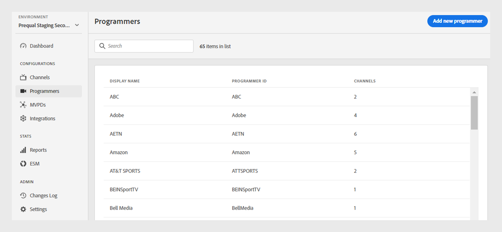
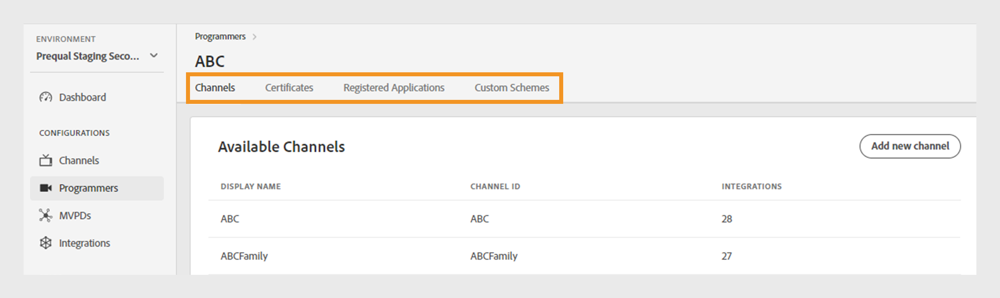
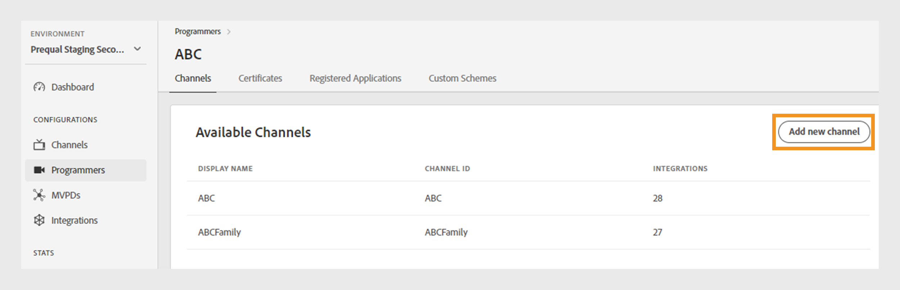
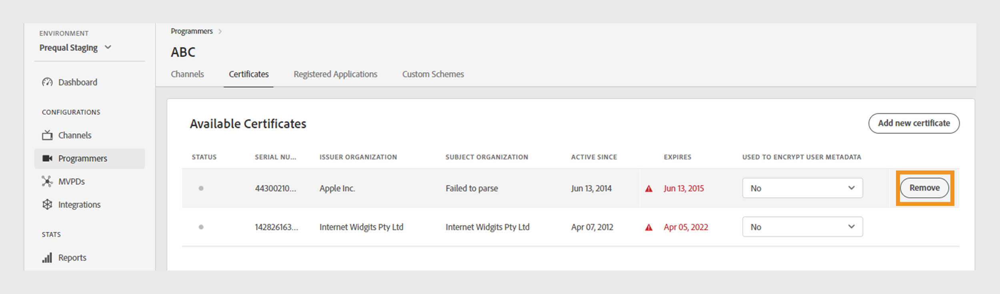
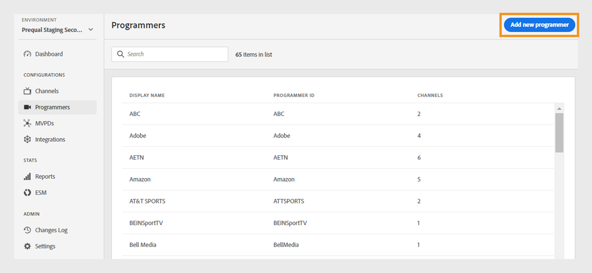

# 程式設計師 {#programmers}

>[!NOTE]
>
>此頁面上的內容僅供參考。 使用此API需要Adobe的目前授權。 不允許未經授權的使用。

此 **程式設計師** 部分，可讓您檢視和管理 [程式設計師](/help/authentication/glossary.md#programmer) 連結至您的帳戶權益。 您也可以 [新增程式設計師](#add-new-programmer) 根據您的需求。

此 **程式設計師** 索引標籤在左側面板中顯示現有程式設計人員的清單，其詳細資料如下：

* **程式設計師ID**：系統內的媒體公司識別碼。
* **頻道**：連結至程式設計人員的相關管道數。

*現有程式設計師清單*

在「 」中輸入程式設計師的名稱 **搜尋** 列在清單上方，以進一步瞭解程式設計師。

## 管理程式設計師設定 {#manage-programmer-conf}

請依照這些步驟管理特定程式設計師的各種設定。

1. 選取 **程式設計師** 標籤。
1. 從清單中選取程式設計師。
1. 選取下列其中一個標籤，以檢視及編輯所選程式設計師的對應設定：

   * [頻道](#channels)
   * [憑證](#certificates)
   * [註冊的應用程式](#registered-applications)
   * [自訂配置](#custom-schemes)

   

   *程式設計師設定*

>[!IMPORTANT]
>
> 檢視 [檢閱和推送變更](/help/authentication/tve-dashboard-review-push-changes.md) 以取得啟用設定變更的詳細資訊。

### 頻道 {#channels}

此索引標籤會顯示與目前程式設計師連結的管道清單。 從此清單中選取特定管道，以存取 [頻道](/help/authentication/tve-dashboard-channels.md) 區段。

若要為選取的程式設計師新增管道，請選取 **新增頻道** 從的右上角 **可用通道** 區段。 瞭解 [如何新增管道](/help/authentication/tve-dashboard-channels.md#add-new-channel).

*新增頻道*

### 憑證 {#certificates}

此索引標籤顯示以下清單 [可用的憑證](#available-certificates) 用於使用者中繼資料加密流程。 它會顯示每個憑證的詳細資訊，包括：

* 狀態(不論是否已啟用 **使用者中繼資料加密** 是否使用)
* 序號
* 簽發者組織的名稱
* 主體組織的名稱
* 發行日期
* 到期日
* 用於加密使用者中繼資料的下拉式功能表(如果您選取 **是**，憑證將會加密敏感的使用者資訊，例如郵遞區號值。

#### 可用的憑證 {#available-certificates}

這些憑證可作為私密金鑰或公開金鑰，並用於使用者中繼資料加密。 所有與相同媒體公司相關的管道都可以使用這些憑證。

您可以對可用憑證進行下列變更：

* [新增憑證](#add-new-certificate)
* [刪除憑證](#delete-certificate)

##### 新增憑證 {#add-new-certificate}

按照以下步驟新增憑證。

1. 選取 **新增憑證** 位於的右上角 **可用的憑證** 區段。

   

   *新增憑證*

1. 將憑證的公開金鑰貼到 **新憑證** 對話方塊。
1. 選取 **新增憑證**.

   已建立新的組態變更，且已準備好進行伺服器更新。 若要使用 **可用的憑證** 區段，繼續進行 [檢閱和推送變更](/help/authentication/tve-dashboard-review-push-changes.md) 流量。

1. 在清單中找到新憑證 **可用的憑證**.

   >[!IMPORTANT]
   >
   > 請確定您的系統為最新狀態，且已準備好使用新憑證。

1. 選取 **是** 從 **用於加密的使用者中繼資料** 下拉式功能表以啟動新憑證。

##### 刪除憑證 {#delete-certificate}

請依照下列步驟刪除憑證。

1. 暫留在您要從清單中刪除的憑證上 **可用的憑證**.
1. 選取 **移除**.

   

   *移除選取的憑證*

1. 選取 **刪除** 於 **刪除憑證** 對話方塊。

已建立新的組態變更，且已準備好進行伺服器更新。 憑證將會從 **可用的憑證** 區段僅晚於 [檢閱和推送變更](/help/authentication/tve-dashboard-review-push-changes.md).

### 註冊的應用程式 {#registered-applications}

此標籤提供應用程式註冊的清單。 檢視 [動態使用者端註冊管理](/help/authentication/dynamic-client-registration-management.md)，以取得詳細資訊。

### 自訂配置 {#custom-schemes}

此索引標籤會顯示自訂配置清單。 檢視 [iOS/tvOS應用程式註冊](/help/authentication/iostvos-application-registration.md) 和 [動態使用者端註冊管理](/help/authentication/dynamic-client-registration-management.md)，以取得詳細資訊。

## 新增程式設計師 {#add-new-programmer}

按照以下步驟新增程式設計人員實體。

1. 選取 **程式設計師** 標籤。
1. 選取 **新增程式設計師** 位於的右上角 **程式設計師** 區段。

   

   *新增程式設計師*

1. 在中輸入媒體公司識別碼 **程式設計師ID** 在 **新程式設計師** 對話方塊。
1. 輸入您要顯示在主控台底下的商業品牌名稱 **顯示名稱**.
1. 選取 **新增程式設計師**.

已建立新的組態變更，且已準備好進行伺服器更新。 若要使用 **程式設計師** 區段，繼續進行 [檢閱和推送變更](/help/authentication/tve-dashboard-review-push-changes.md) 流量。

