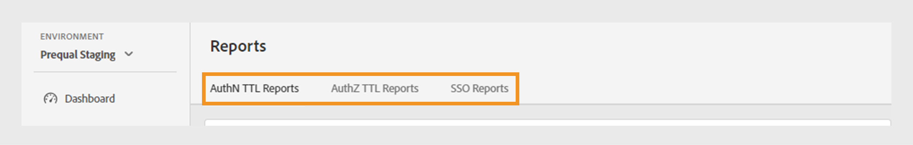
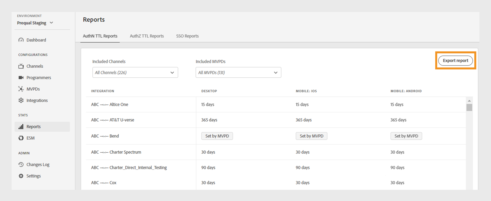
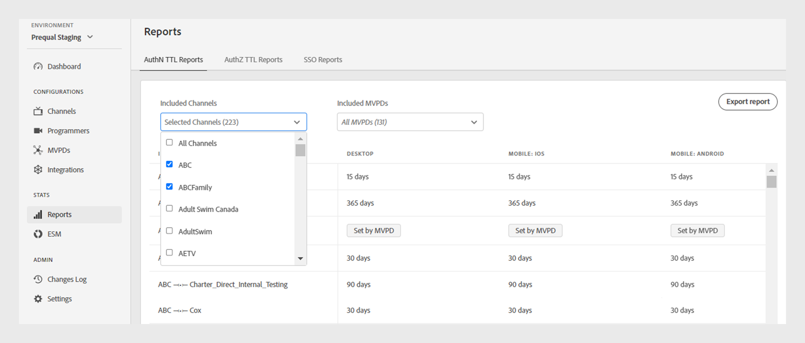
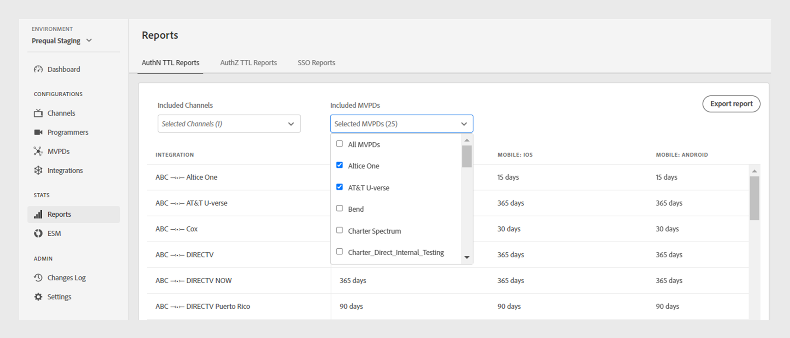

# 報表 {#Reports}

>[!NOTE]
>
>此頁面上的內容僅供參考。 使用此API需要Adobe的目前授權。 不允許未經授權的使用。

此 **報表** 「TVE控制面板」的區段可讓您存取AuthN TTL、AuthZ TTL和SSO報表的彙總資料。 這些報表包含您的管道與所有不同MVPD的整合 [平台](#platforms).

報表可讓您篩選資料並收集各方面的深入分析 [特定通道或MVPD](#selecting-specific-channels-mvpds). 您也可以將報表匯出為CSV檔案，以供進一步分析。

## 檢視報表 {#view-reports}

請依照下列步驟檢視特定報告。

1. 選取 **報表** 標籤。
1. 選取下列其中一個索引標籤，以檢視及匯出包含之管道和MVPD的彙總資料：
   * [驗證TTL報表](#authn-ttl-reports)
   * [AuthZ TTL報表](#authz-ttl-reports)
   * [SSO報告](#sso-reports)

   

   *報告型別*

### 驗證TTL報表 {#authn-ttl-reports}

AuthN TTL報表(也稱為驗證存留時間(TTL))會顯示為您的「管道」與所有各種MVPD的整合設定驗證權杖的持續時間 [平台](#platforms). 這些報表可讓您檢查使用者針對特定MVPD和平台保持驗證的時間長度。 持續時間值會以方便使用的格式顯示，例如 **天**， **小時**， **分鐘**、和 **秒**. AuthN TTL報表表格具有水平與垂直捲動功能，以因應不同的熒幕大小。

您也可以檢視及下載以下專案的資料： [特定通道或MVPD](#selecting-specific-channels-mvpds).

*匯出AuthN TTL報告*

>[!IMPORTANT]
>
> 此 **由MVPD設定** 當MVPD強制執行AuthN TTL值(而非Adobe Pass驗證設定)時，會使用預留位置。

選取 **匯出報告** 將資料儲存為本機電腦上的CSV檔案。

### AuthZ TTL報表 {#authz-ttl-reports}

AuthZ TTL報告(也稱為「授權存留時間」(TTL))會顯示為您的「管道」與所有各種MVPD整合所設定的授權權杖持續時間。 [平台](#platforms). 這些報表可讓您檢查使用者保持獲授權觀看特定MVPD和平台內容的時間長度。 持續時間值會以方便使用的格式顯示，例如 **天**， **小時**， **分鐘**、和 **秒**. AuthZ TTL報表表格具有水平與垂直捲動功能，以因應不同的熒幕大小。

您也可以檢視及下載以下專案的資料： [特定通道或MVPD](#selecting-specific-channels-mvpds).

*匯出AuthZ TTL報表*

>[!IMPORTANT]
>
> 此 **由MVPD設定** 當MVPD強制執行AuthZ TTL值(而非Adobe Pass驗證設定)時，會使用預留位置。

選取 **匯出報告** 將資料儲存為本機電腦上的CSV檔案。

### SSO報告 {#sso-reports}

SSO報表（也稱為單一登入）會顯示針對您的管道與所有管道中的各種MVPD整合所設定的單一登入狀態。 [平台](#platforms). 這些報告可讓您檢查特定MVPD和平台的預期使用者驗證SSO體驗。 這些值會以方便使用的格式顯示，例如 **SSO已停用**， **SSO已啟用**、和 **SSO不確定**. 「SSO報告」表格具有水平與垂直捲動功能，以因應不同的熒幕大小。

您也可以檢視及下載以下專案的資料： [特定通道或MVPD](#selecting-specific-channels-mvpds).

*匯出SSO報告*

>[!IMPORTANT]
>
> 此 **SSO不確定** 預留位置指出單一登入(SSO)已啟用，且可能運作中。 但是，下列設定可能會禁止SSO驗證，如下列範例所述：
>
> * 使用者平台設定：封鎖第三方Cookie的選項。
> * 使用者決策：使用者拒絕平台存取其電視提供者訂閱。
> * MVPD設定： MVPD要求每個通道的驗證。

選取 **匯出報告** 將資料儲存為本機電腦上的CSV檔案。

## 平台 {#platforms}

此 [驗證TTL報表](#authn-ttl-reports)， [AuthZ TTL報表](#authz-ttl-reports)、和 [SSO報告](#sso-reports) 會跨不同平台呈現資料，例如：

* **案頭**：顯示透過Adobe Pass Authentication JavaScript SDK套用至程式設計師實作的值。

* **行動**

  **iOS**：顯示使用Adobe Pass驗證iOS SDK套用的值。

  **Android**：顯示透過Adobe Pass驗證Android SDK套用的值。

  **其他**：顯示使用為行動裝置開發的Adobe Pass Authentication REST API套用的值。

* **TVCD**

  **Roku**：顯示透過Adobe Pass驗證REST API套用的值，將Roku識別為裝置型別。

  **FireTV**：顯示透過Adobe Pass Authentication FireTV SDK套用的值。

  **AppleTV**：顯示透過Adobe Pass Authentication tvOS SDK套用的值。

  **其他**：顯示針對電視連線裝置使用Adobe Pass Authentication REST API套用的值。

* **平台未識別**：當Adobe Pass驗證服務偵測到未知的裝置型別時，顯示套用至程式設計人員實作的值。

若要進一步瞭解如何共用所需的裝置型別，例如 **Roku** 使用Adobe Pass驗證REST API或SDK，檢視以下機制： [傳遞使用者端資訊](/help/authentication/passing-client-information-device-connection-and-application.md).

>[!IMPORTANT]
>
> 彙總的資料會根據每個Adobe Pass驗證環境的特定設定。 在不同的TVE控制面板環境之間切換時，報表中的資料會發生差異。 請參閱 [Adobe Pass驗證環境](/help/authentication/tve-dashboard-environments.md) 以進一步瞭解。

## 選取特定通道和MVPD {#selecting-specific-channels-mvpds}

此 [驗證TTL報表](#authn-ttl-reports)， [AuthZ TTL報表](#authz-ttl-reports)、和 [SSO報告](#sso-reports) 呈現資料 **所有管道** 與整合 **所有MVPD** 依預設。

>[!NOTE]
>
> 如果您取消選取 **所有管道** 或 **所有MVPD** 在個別的下拉式功能表中，會顯示訊息，供您選取以檢視有意義的報表。

若要產生特定管道的報告：

1. 選取 **包含的管道** 所選報表頂端的下拉式功能表。

   

   *已包含管道下拉式功能表*

1. 取消選取 **所有管道**.
1. 從中選擇所需的通道 **包含的管道** 您要產生資料的下拉式功能表。

>[!NOTE]
>
> 若要在中取得可用選項 **包含的MVPD** 下拉式功能表，您必須在 **包含的管道** 下拉式功能表。

若要產生特定MVPD的報告：

1. 選取 **包含的MVPD** 所選報表頂端的下拉式功能表。

   

   *內含MVPDs下拉式功能表*

1. 取消選取 **所有MVPD**.
1. 從中選擇所需的MVPD **包含的MVPD** 您要產生資料的下拉式功能表。
