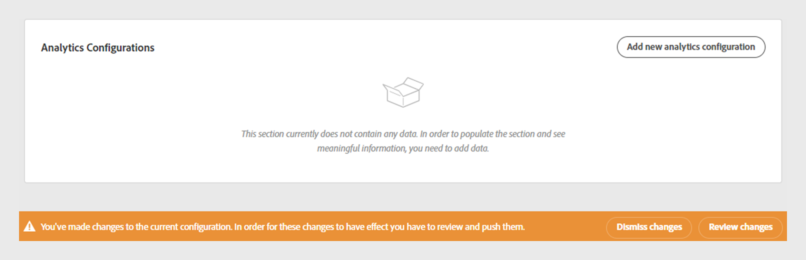
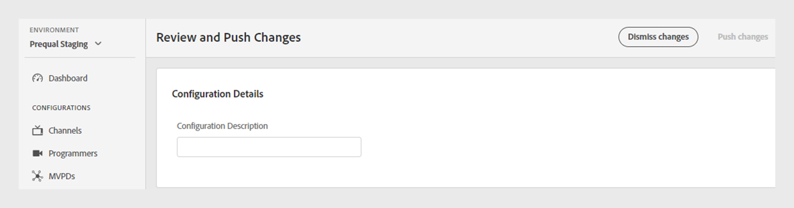
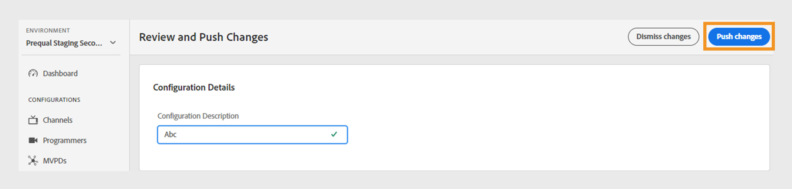

# 檢閱和推送變更

>[!NOTE]
>
>此頁面上的內容僅供參考。 使用此API需要Adobe的目前授權。 不允許未經授權的使用。

TVE儀表板可讓您檢閱目前組態的變更，然後將它們部署至伺服器。 每當您修改目前的組態時，畫面上都會顯示通知，提示您檢閱並推播這些變更。

請依照下列步驟檢閱並推送變更。

1. 在畫面底部找到檢閱和推播變更通知。

   

   *檢閱和推播變更通知方塊*

1. 選取 **檢閱變更** 從 **檢閱和推送變更** 通知方塊。

1. 輸入變更的簡短說明 **設定說明** 以有效追蹤及瞭解每個變更的用途。

   

   *新增設定說明*

1. 導覽至 **設定變更** 區段來檢視變更的摘要。

1. 將游標暫留在您要檢閱的變更上。

1. 選取 **檢視** 以檢閱與組態變更相關的先前值和新值。

   

   *檢視設定變更*

1. 檢閱所有變更且一切看起來正確後，選取「 」 **推送變更** 將更新的設定套用至伺服器。

   >[!NOTE]
   >
   >此 **推送變更** 按鈕在新增之後才會變成使用中 **設定說明**.

   

   *推送變更*

   或者，您可以選取 **關閉變更** 如果要還原列出的所有組態變更。

