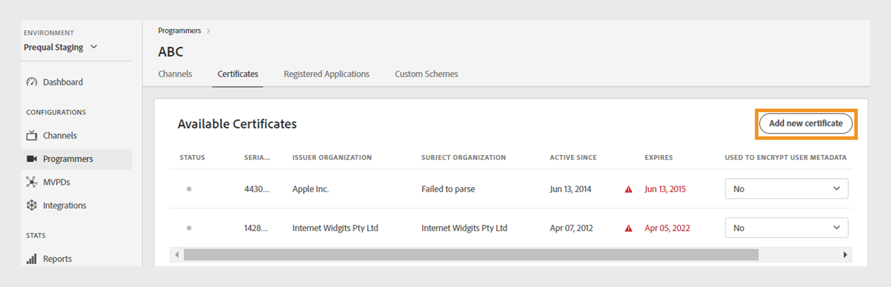
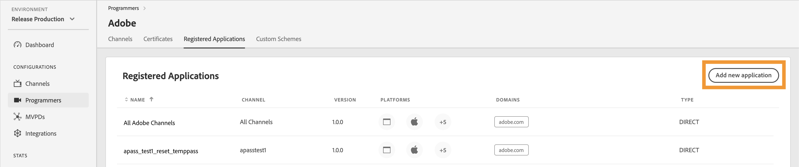
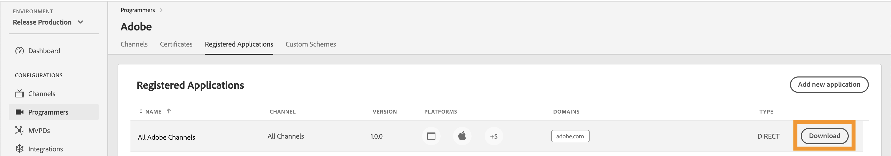

# 程式設計師 {#programmers}

>[!NOTE]
>
>此頁面上的內容僅供參考。 使用此API需要Adobe的目前授權。 不允許未經授權的使用。

TVE儀表板的&#x200B;**程式設計人員**&#x200B;區段可讓您檢視和管理連結至您帳戶權益的[程式設計人員](/help/authentication/glossary.md#programmer)的設定。 您也可以根據您的需求[新增程式設計師](#add-new-programmer)。

左側面板中的&#x200B;**程式設計人員**&#x200B;索引標籤會顯示現有程式設計人員的清單，其詳細資料如下：

* **程式設計師識別碼**：系統內的媒體公司識別碼。
* **管道**：連結至程式設計師的相關管道數。

*現有程式設計師清單*

在清單上方的&#x200B;**搜尋**&#x200B;列中鍵入程式設計師的姓名，以進一步瞭解程式設計師。

## 管理程式設計師設定 {#manage-programmer-conf}

請依照這些步驟管理特定程式設計師的各種設定。

1. 在左側面板中選取&#x200B;**程式設計師**&#x200B;索引標籤。
1. 從清單中選取程式設計師。
1. 選取下列其中一個標籤，以檢視及編輯所選程式設計師的對應設定：

   * [頻道](#channels)
   * [憑證](#certificates)
   * [註冊的應用程式](#registered-applications)
   * [自訂配置](#custom-schemes)

   

   *程式設計師設定*

>[!IMPORTANT]
>
> 檢視[檢閱並推播變更](/help/authentication/tve-dashboard/new-tve-dashboard/tve-dashboard-review-push-changes.md)，以取得啟用組態變更的詳細資訊。

### 頻道 {#channels}

此索引標籤會顯示與目前程式設計師連結的管道清單。 從此清單中選取特定通道，以存取[通道](/help/authentication/tve-dashboard/new-tve-dashboard/tve-dashboard-channels.md)區段中的詳細資訊。

若要為選取的程式設計師新增頻道，請從&#x200B;**可用的頻道**&#x200B;區段的右上角選取&#x200B;**新增頻道**。 瞭解[如何新增頻道](/help/authentication/tve-dashboard/new-tve-dashboard/tve-dashboard-channels.md#add-new-channel)。

*新增頻道*

### 憑證 {#certificates}

此索引標籤顯示使用者中繼資料加密流程中使用的[可用憑證](#available-certificates)清單。 它會顯示每個憑證的詳細資訊，包括：

* 狀態（是否啟用&#x200B;**使用者中繼資料加密**&#x200B;使用方式）
* 序號
* 簽發者組織的名稱
* 主體組織的名稱
* 發行日期
* 到期日
* 用來加密使用者中繼資料的下拉式功能表（如果您選取&#x200B;**是**，憑證將會加密機密的使用者資訊，例如郵遞區號值）。

#### 可用的憑證 {#available-certificates}

這些憑證可作為私密金鑰或公開金鑰，並用於使用者中繼資料加密。 所有與相同媒體公司相關的管道都可以使用這些憑證。

您可以對可用憑證進行下列變更：

* [新增憑證](#add-new-certificate)
* [刪除憑證](#delete-certificate)

##### 新增憑證 {#add-new-certificate}

按照以下步驟新增憑證。

1. 在&#x200B;**可用的憑證**&#x200B;區段的右上角選取&#x200B;**新增憑證**。

   

   *新增憑證*

1. 在&#x200B;**新憑證**&#x200B;對話方塊中貼上憑證的公開金鑰。

1. 選取&#x200B;**新增憑證**。

1. 在&#x200B;**可用憑證**&#x200B;的清單中找到新憑證。

   >[!IMPORTANT]
   >
   > 請確定您的系統為最新狀態，且已準備好使用新憑證。

1. 從&#x200B;**用於加密的使用者中繼資料**&#x200B;下拉式選單中選取&#x200B;**是**&#x200B;以啟用新憑證。

已建立新的組態變更，且已準備好進行伺服器更新。 若要使用&#x200B;**可用的憑證**&#x200B;區段中列出的新憑證，請繼續進行[檢閱及推播變更](/help/authentication/tve-dashboard/new-tve-dashboard/tve-dashboard-review-push-changes.md)流程。

##### 刪除憑證 {#delete-certificate}

請依照下列步驟刪除憑證。

1. 暫留在您要從&#x200B;**可用憑證**&#x200B;清單中刪除的憑證上。

1. 選取&#x200B;**移除**。

   

   *移除選取的憑證*

1. 在&#x200B;**刪除憑證**&#x200B;對話方塊上選取&#x200B;**刪除**。

已建立新的組態變更，且已準備好進行伺服器更新。 只有在[檢閱並推播變更](/help/authentication/tve-dashboard/new-tve-dashboard/tve-dashboard-review-push-changes.md)之後，憑證才會從&#x200B;**可用的憑證**&#x200B;區段中刪除。

### 註冊的應用程式 {#registered-applications}

此標籤會顯示已註冊的應用程式清單。 如需有關註冊應用程式使用方式的詳細資訊，請參閱[動態使用者端註冊概觀](../../dcr-api/dynamic-client-registration-overview.md)檔案。

您可以對已註冊的應用程式執行下列動作：

* [新增已註冊的應用程式](#add-registered-applications)
* [下載軟體宣告](#download-software-statement)

#### 新增已註冊的應用程式 {#add-registered-applications}

請依照下列步驟新增註冊的應用程式。

1. 選取&#x200B;**已註冊的應用程式**&#x200B;區段右上角的&#x200B;**新增應用程式**。

   

   *新增應用程式*

1. 在&#x200B;**新增應用程式**&#x200B;對話方塊的下拉式功能表中，選取&#x200B;**指派給頻道**。

   >[!IMPORTANT]
   >
   > 建議您建立具有更明確且有限許可權的註冊應用程式，以增強安全性並防止未經授權的存取。 因此，在建立已註冊的應用程式時，請考慮針對指派的`channel`使用較窄的選項。

1. 從下拉式功能表中選取&#x200B;**平台**。

   >[!IMPORTANT]
   >
   > 建議您建立具有更明確且有限許可權的註冊應用程式，以增強安全性並防止未經授權的存取。 因此，在建立已註冊的應用程式時，請考慮針對指派的`platforms`使用較窄的選項。

1. 從下拉式功能表中選取&#x200B;**網域**。

   >[!IMPORTANT]
   >
   > 在使用者端註冊程式中，使用者端應用程式可請求允許使用重新導向URL來結束驗證流程。 使用者端應用程式使用特定的重新導向URL時，會針對此選取專案中所挑選的`domains`進行驗證。

1. 輸入應用程式的&#x200B;**名稱**。

1. 輸入應用程式的&#x200B;**版本**。

   >[!IMPORTANT]
   >
   > 建議您針對使用者端應用程式的每次重大更新建立新的註冊應用程式，以管理其生命週期和使用狀況。 如有必要，請透過我們的[Zendesk](https://adobeprimetime.zendesk.com)建立票證，並要求您的技術客戶經理(TAM)撤銷註冊的應用程式，以封鎖特定使用者端應用程式版本的功能。

1. 從下拉式選單中選取&#x200B;**Type**&#x200B;值「直接」。

1. 選取&#x200B;**新增應用程式**。

已建立新的組態變更，且已準備好進行伺服器更新。 若要使用&#x200B;**已註冊的應用程式**&#x200B;區段中列出的新註冊應用程式，請繼續進行[檢閱及推播變更](/help/authentication/tve-dashboard/new-tve-dashboard/tve-dashboard-review-push-changes.md)流程。

#### 下載軟體宣告 {#download-software-statement}

請依照下列步驟下載軟體陳述式。

1. 暫留在您要從&#x200B;**已註冊的應用程式**&#x200B;清單下載軟體陳述式的已註冊應用程式上。

1. 選取&#x200B;**下載**。

   

   *下載軟體陳述式*

### 自訂配置 {#custom-schemes}

此索引標籤會顯示自訂配置清單。 如需自訂配置使用方式的詳細資訊，請參閱[iOS/tvOS應用程式註冊](/help/authentication/iostvos-application-registration.md)。

您可以對自訂配置進行下列變更：

* [產生新的自訂配置](#generate-custom-schemes)

#### 產生新的自訂配置 {#generate-custom-schemes}

請依照下列步驟產生新的自訂配置。

1. 選取&#x200B;**產生新的自訂配置**。

   

   *產生新的自訂配置*

已建立新的組態變更，且已準備好進行伺服器更新。 若要使用&#x200B;**自訂配置**&#x200B;區段中列出的新自訂配置，請繼續進行[檢閱並推播變更](/help/authentication/tve-dashboard/new-tve-dashboard/tve-dashboard-review-push-changes.md)流程。

## 新增程式設計師 {#add-new-programmer}

按照以下步驟新增程式設計人員實體。

1. 在左側面板中選取&#x200B;**程式設計師**&#x200B;索引標籤。

1. 選取&#x200B;**程式設計員**&#x200B;區段右上角的&#x200B;**新增程式設計員**。

   

   *新增程式設計師*

1. 在&#x200B;**新程式設計工具**&#x200B;對話方塊中的&#x200B;**程式設計工具識別碼**&#x200B;中輸入媒體公司識別碼。

1. 輸入您要顯示在主控台中&#x200B;**顯示名稱**&#x200B;下的商業品牌名稱。

1. 選取&#x200B;**新增程式設計師**。

已建立新的組態變更，且已準備好進行伺服器更新。 若要使用&#x200B;**程式設計人員**&#x200B;區段中列出的新程式設計人員，請繼續進行[檢閱及推送變更](/help/authentication/tve-dashboard/new-tve-dashboard/tve-dashboard-review-push-changes.md)流程。
