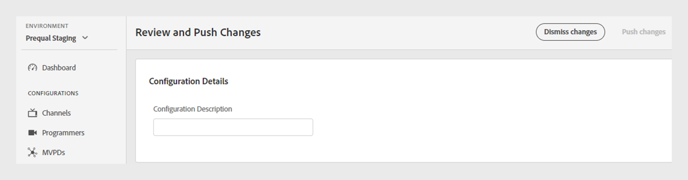

# 檢閱和推送變更

>[!NOTE]
>
>此頁面上的內容僅供參考。 使用此API需要Adobe的目前授權。 不允許未經授權的使用。

TVE儀表板可讓您檢閱目前組態的變更，然後將它們部署至伺服器。 每當您修改目前的組態時，畫面上都會顯示通知，提示您檢閱並推播這些變更。

請依照下列步驟檢閱並推送變更。

1. 在畫面底部找到檢閱和推播變更通知。

   

   *檢閱和推播變更通知方塊*

1. 從&#x200B;**檢閱與推播變更**&#x200B;通知方塊中選取&#x200B;**檢閱變更**。

1. 在&#x200B;**組態描述**&#x200B;中輸入變更的簡短描述，以便有效地追蹤並瞭解每個變更的用途。

   

   *新增組態描述*

1. 瀏覽至&#x200B;**組態變更**&#x200B;區段以檢視變更摘要。

1. 將游標暫留在您要檢閱的變更上。

1. 選取&#x200B;**檢視**&#x200B;以檢閱與組態變更相關的舊值與新值。

   

   *檢視組態變更*

1. 檢閱所有變更且一切看起來正確後，請選取&#x200B;**推送變更**&#x200B;以將更新的設定套用至伺服器。

   >[!NOTE]
   >
   >新增&#x200B;**組態描述**&#x200B;後，**推播變更**&#x200B;按鈕才會變成使用中。

   

   *推送變更*

   或者，如果您要回覆列出的所有組態變更，可以選取&#x200B;**解除變更**。
