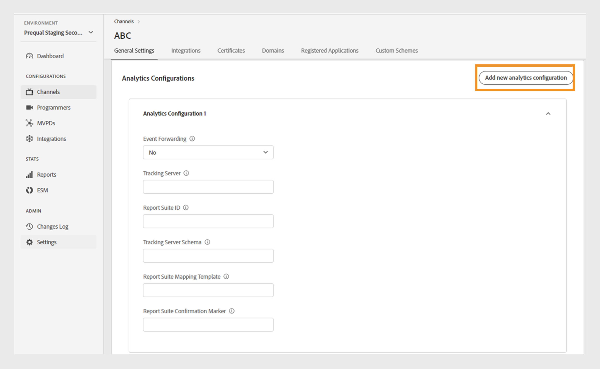
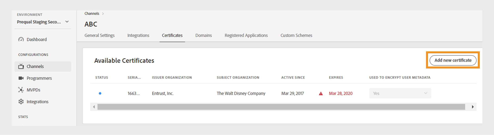
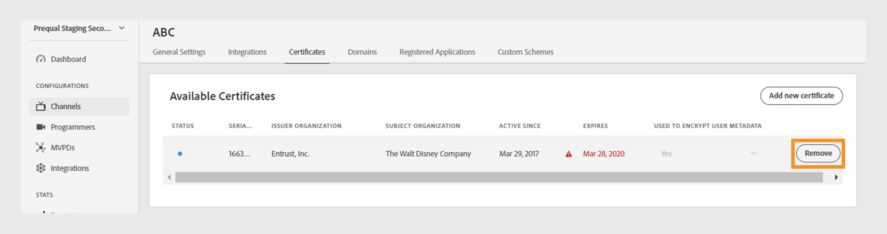
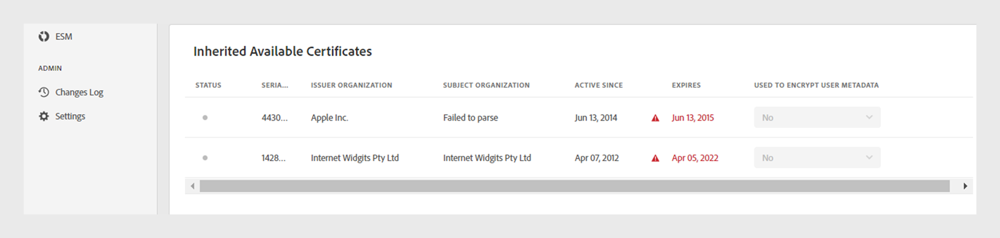
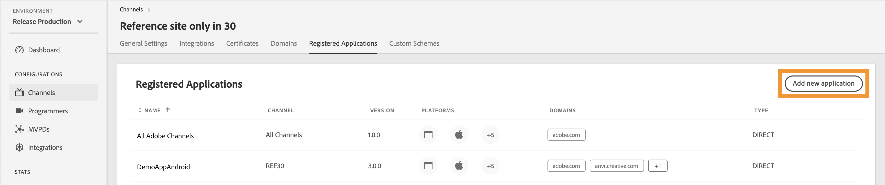
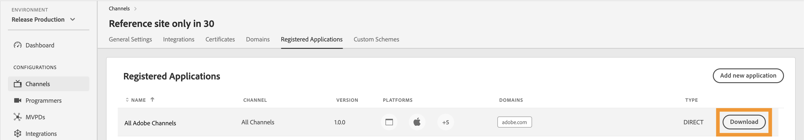
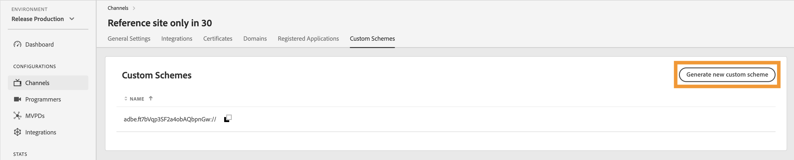
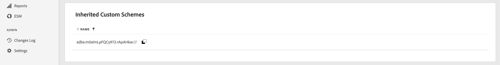

# 頻道 {#channels}

>[!NOTE]
>
>此頁面上的內容僅供參考。 使用此API需要Adobe的目前授權。 不允許未經授權的使用。

TVE儀表板的&#x200B;**管道**&#x200B;區段可讓您檢視和管理與特定程式設計師相關管道的設定。 您也可以根據您的需求[新增頻道](#add-new-channel)。

左側面板中的&#x200B;**管道**&#x200B;索引標籤會顯示連結管道的清單，內含下列詳細資料：

* **顯示名稱**：用於商業目的的管道品牌名稱。
* **管道識別碼**：唯一識別碼，也稱為要求者識別碼。
* **整合**：與[MVPD](/help/authentication/integration-guide-programmers/rest-apis/rest-api-v2/rest-api-v2-glossary.md#mvpd)建立的連線數目。


*現有管道的清單*

在清單上方的&#x200B;**搜尋**&#x200B;列中鍵入頻道名稱，以進一步瞭解該頻道。

## 管理頻道設定 {#manage-channel-conf}

請依照步驟管理特定管道的各種設定。

1. 選取左側面板中的&#x200B;**管道**&#x200B;索引標籤。

1. 從可用清單中選取頻道。

1. 選取下列其中一個標籤，以檢視及編輯所選色版的對應設定：

   * [一般設定](#general-settings)
   * [整合](#integrations)
   * [憑證](#certificates)
   * [網域](#domains)
   * [註冊的應用程式](#registered-applications)
   * [自訂配置](#custom-schemes)

   

   *頻道設定*

>[!IMPORTANT]
>
> 檢視[檢閱並推播變更](/help/authentication/user-guide-tve-dashboard/tve-dashboard-review-push-changes.md)，以取得啟用組態變更的詳細資訊。

### 一般設定 {#general-settings}

此索引標籤顯示&#x200B;**頻道資訊**&#x200B;和&#x200B;**分析組態**。

#### 頻道資訊 {#channel-information}

您可以在此段落中編輯下列詳細資訊：

* **顯示名稱**：用於商業目的的管道品牌名稱。

* **預設重新導向URL**：用於驗證和登出的備份重新導向URL。

* **錯誤報告**：選取&#x200B;**是**&#x200B;時，Adobe Pass SDK會將錯誤報告傳送至Adobe Pass後端以進行分析。


*編輯頻道資訊*

#### Analytics設定 {#analytics-configuration}

本節可讓您設定將Adobe Pass驗證事件轉送至Adobe Analytics。

若要啟用&#x200B;**Analytics設定**，請連絡您的技術帳戶管理員(TAM)，以取得設定報表套裝ID (RSID)的詳細資訊。



*啟用Analytics設定*

選取&#x200B;**新增分析組態**&#x200B;以新增多個組態。

已建立新的組態變更，且已準備好進行伺服器更新。 若要使用&#x200B;**Analytics設定**&#x200B;區段的新分析設定，請繼續[檢閱並推送變更](/help/authentication/user-guide-tve-dashboard/tve-dashboard-review-push-changes.md)流程。

### 整合 {#integrations}

此標籤會顯示目前所選管道與MVPD之間的可用整合清單。 清單會顯示每項整合及其狀態，指出其是否已啟用。 從此清單中選取特定整合，以存取[整合](tve-dashboard-integrations.md)區段中的詳細資訊。


*可用整合的清單*

### 憑證 {#certificates}

此索引標籤顯示使用者中繼資料加密流程中使用的[可用憑證](#available-certificates)和[繼承的可用憑證](#inherited-avail-certificates)清單。 它會顯示每個憑證的詳細資訊，包括：

* 狀態（是否啟用&#x200B;**使用者中繼資料加密**&#x200B;使用方式）
* 序號
* 簽發者組織的名稱
* 主體組織的名稱
* 發行日期
* 到期日
* 用於加密使用者中繼資料的下拉式功能表（如果您選取&#x200B;**是**，憑證會加密敏感的使用者資訊，例如郵遞區號值）。

#### 可用的憑證 {#available-certificates}

這些憑證可作為私密金鑰或公開金鑰，並用於使用者中繼資料加密。
您可以在「可用憑證」區段下進行下列變更：

* [新增憑證](#add-new-certificate)
* [刪除憑證](#delete-certificate)

##### 新增憑證 {#add-new-certificate}

若要新增憑證，請執行下列步驟：

1. 在&#x200B;**可用的憑證**&#x200B;區段頂端選取&#x200B;**新增憑證**。

   

   *新增憑證*

1. 在&#x200B;**新憑證**&#x200B;對話方塊中貼上憑證的公開金鑰。

1. 選取&#x200B;**新增憑證**。

1. 在&#x200B;**可用憑證**&#x200B;的清單中找到新憑證。

   >[!IMPORTANT]
   >
   > 請確定您的系統為最新狀態，且已準備好使用新憑證。

1. 從&#x200B;**用於加密的使用者中繼資料**&#x200B;下拉式選單中選取&#x200B;**是**&#x200B;以啟用新憑證。

已建立新的組態變更，且已準備好進行伺服器更新。 若要使用&#x200B;**可用的憑證**&#x200B;區段中列出的新憑證，請繼續進行[檢閱及推播變更](/help/authentication/user-guide-tve-dashboard/tve-dashboard-review-push-changes.md)流程。

##### 刪除憑證 {#delete-certificate}

請依照下列步驟刪除憑證。

1. 暫留在您要從&#x200B;**可用憑證**&#x200B;清單中刪除的憑證上。

1. 選取&#x200B;**移除**。

   

   *移除選取的憑證*

1. 從&#x200B;**刪除使用中憑證**&#x200B;對話方塊中選取&#x200B;**刪除**。

已建立新的組態變更，且已準備好進行伺服器更新。 只有在&#x200B;**檢閱並推播變更**&#x200B;之後，憑證才會從[可用的憑證](/help/authentication/user-guide-tve-dashboard/tve-dashboard-review-push-changes.md)區段中刪除。

#### 繼承的可用憑證 {#inherited-avail-certificates}

媒體公司會在其自己的層級定義這些憑證。 所有與相同媒體公司相關的管道都可以使用這些憑證。



*繼承可用的憑證*

### 網域 {#domains}

此索引標籤會顯示可用網域清單，各個通道可透過這些網域與Adobe Pass驗證通訊。

您可以對網域進行下列變更：

* [新增網域](#add-domains)
* [刪除網域](#delete-domain)

>[!TIP]
>
> 如果清單中存在較一般的網域，請避免新增子網域。

#### 新增網域 {#add-domains}

請依照下列步驟新增網域。

1. 選取&#x200B;**可用網域**&#x200B;區段右上角的&#x200B;**新增網域**。

   

   *新增網域*

1. 在&#x200B;**新增網域**&#x200B;對話方塊中輸入您的網域名稱。

1. 選取&#x200B;**新增網域**&#x200B;以新增所選頻道的網域。

已建立新的組態變更，且已準備好進行伺服器更新。 若要使用&#x200B;**可用網域**&#x200B;區段中列出的新網域，請繼續進行[檢閱及推送變更](/help/authentication/user-guide-tve-dashboard/tve-dashboard-review-push-changes.md)流程。

#### 刪除網域 {#delete-domain}

請依照下列步驟刪除網域。

1. 暫留在您要從&#x200B;**可用網域**&#x200B;清單中刪除的網域上。

1. 選取&#x200B;**移除**。

   

   *移除選取的網域*

1. 在&#x200B;**刪除網域**&#x200B;對話方塊上選取&#x200B;**刪除**。

已建立新的組態變更，且已準備好進行伺服器更新。 只有在&#x200B;**檢閱並推播變更**&#x200B;之後，才會從[可用的網域](/help/authentication/user-guide-tve-dashboard/tve-dashboard-review-push-changes.md)區段中刪除網域。

選取的網域已無法使用。 因此，與此網域相關聯的應用程式會失去對Adobe Pass驗證服務的存取權。

### 註冊的應用程式 {#registered-applications}

此標籤會顯示已註冊的應用程式清單。 如需有關註冊應用程式使用方式的詳細資訊，請參閱[動態使用者端註冊概觀](../integration-guide-programmers/rest-apis/rest-api-dcr/dynamic-client-registration-overview.md)檔案。

您可以對已註冊的應用程式執行下列動作：

* [新增已註冊的應用程式](#add-registered-applications)
* [下載軟體宣告](#download-software-statement)

#### 新增已註冊的應用程式 {#add-registered-applications}

請依照下列步驟新增註冊的應用程式。

1. 選取&#x200B;**已註冊的應用程式**&#x200B;區段右上角的&#x200B;**新增應用程式**。

   

   *新增應用程式*

1. 從&#x200B;**新增應用程式**&#x200B;對話方塊的下拉式功能表中選取&#x200B;**平台**。

   >[!IMPORTANT]
   >
   > 建議您建立具有更明確且有限許可權的註冊應用程式，以增強安全性並防止未經授權的存取。 因此，在建立已註冊的應用程式時，請考慮針對指派的`platforms`使用較窄的選項。

1. 從下拉式功能表中選取&#x200B;**網域**。

   >[!IMPORTANT]
   >
   > 在使用者端註冊程式中，使用者端應用程式可請求允許使用重新導向URL來結束驗證流程。 使用者端應用程式使用特定的重新導向URL時，會針對此選取專案中所挑選的`domains`進行驗證。

1. 輸入應用程式的&#x200B;**名稱**。

1. 輸入應用程式的&#x200B;**版本**。

   >[!IMPORTANT]
   >
   > 建議您針對使用者端應用程式的每次重大更新建立新的註冊應用程式，以管理其生命週期和使用狀況。 如有必要，請透過我們的[Zendesk](https://adobeprimetime.zendesk.com)建立票證，並要求您的技術客戶經理(TAM)撤銷註冊的應用程式，以封鎖特定使用者端應用程式版本的功能。

1. 從下拉式選單中選取&#x200B;**Type**&#x200B;值「直接」。

1. 選取&#x200B;**新增應用程式**。

已建立新的組態變更，且已準備好進行伺服器更新。 若要使用&#x200B;**已註冊的應用程式**&#x200B;區段中列出的新註冊應用程式，請繼續進行[檢閱及推播變更](/help/authentication/user-guide-tve-dashboard/tve-dashboard-review-push-changes.md)流程。

#### 下載軟體宣告 {#download-software-statement}

請依照下列步驟下載軟體陳述式。

1. 暫留在您要從&#x200B;**已註冊的應用程式**&#x200B;清單下載軟體陳述式的已註冊應用程式上。

1. 選取&#x200B;**下載**。

   

   *下載軟體陳述式*

### 自訂配置 {#custom-schemes}

此索引標籤會顯示自訂配置清單。
自訂配置可用於Android和iOS裝置。

您可以對自訂配置進行下列變更：

* [產生新的自訂配置](#generate-custom-schemes)

#### 產生新的自訂配置 {#generate-custom-schemes}

請依照下列步驟產生新的自訂配置。

1. 選取&#x200B;**產生新的自訂配置**。

   

   *產生新的自訂配置*

已建立新的組態變更，且已準備好進行伺服器更新。 若要使用&#x200B;**自訂配置**&#x200B;區段中列出的新自訂配置，請繼續進行[檢閱並推播變更](/help/authentication/user-guide-tve-dashboard/tve-dashboard-review-push-changes.md)流程。

#### 如果您沒有Adobe TVE儀表板的存取權：

將票證提交至<tve-support@adobe.com>。 請包含管道ID，我們的支援團隊會有人為您建立自訂配置。

#### Android {#Android}

1. 自訂配置 — 在TVE儀表板中建立的自訂配置可用於Android裝置應用程式。

1. 在應用程式的資源檔`strings.xml`中新增下列程式碼：

```XML
       <string name="software_statement">softwarestatement value</string>
       <string name="redirect_uri">adbe.TTIFAaWuR-CmxXv1Di8PlQ://</string>
```

#### iOS {#iOS}

自訂配置可以在應用程式的`info.plist`檔案中使用。 請尋找以下範例，您需要在其中新增在TVE儀表板中產生的URL：

```plist
    <key>CFBundleURLTypes</key>
    <array>
        <dict>
            <key>CFBundleURLSchemes</key>
            <array>
                <string>adbe.u-XFXJeTSDuJiIQs0HVRAg</string> // replace this with your custom scheme
            </array>
        </dict>
    </array>
```

### 繼承的自訂配置 {#inherited-custom-schemes}

媒體公司會根據自己的層級定義這些自訂配置。 所有與相同媒體公司相關的管道都可以使用這些自訂配置。



*繼承的自訂配置*

## 新增頻道 {#add-new-channel}

請依照以下步驟新增管道。

1. 選取左側面板中的&#x200B;**管道**&#x200B;索引標籤。

1. 選取&#x200B;**管道**&#x200B;區段右上角的&#x200B;**新增管道**。

   

   *新增頻道*

1. 在&#x200B;**新頻道**&#x200B;對話方塊的下拉式功能表中，選取&#x200B;**程式設計師識別碼**。

1. 在&#x200B;**管道識別碼**&#x200B;中輸入唯一識別碼。

1. 在&#x200B;**顯示名稱**&#x200B;中輸入用於商業目的的管道品牌名稱。

1. 選取&#x200B;**新增頻道**。

已建立新的組態變更，且已準備好進行伺服器更新。 若要使用&#x200B;**管道**&#x200B;區段中列出的新管道，請繼續進行[檢閱和推播變更](/help/authentication/user-guide-tve-dashboard/tve-dashboard-review-push-changes.md)流程。