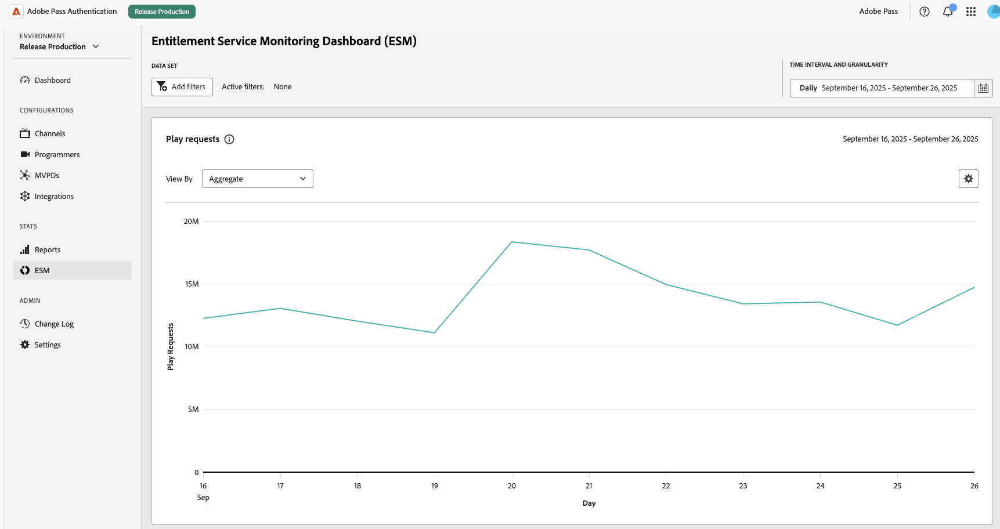
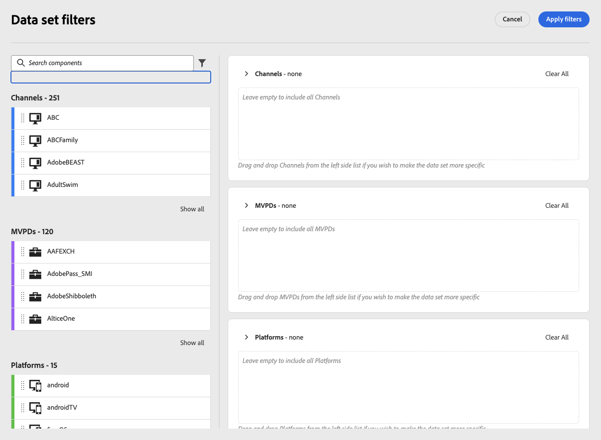
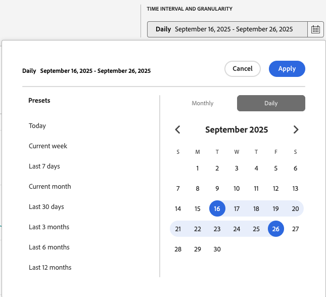

# ESM儀表板 {#esm-dashboard}

>[!NOTE]
>
>此頁面上的內容僅供參考。 使用此API需要Adobe的目前授權。 不允許未經授權的使用。

ESM Dashboard提供許可權和事件資料的統一檢視，以協助您監控效能、識別異常並瞭解MVPD合作夥伴的使用者存取模式。 本指南說明如何使用控制面板的篩選器、解譯報表，並瞭解可設定時間間隔內的關鍵量度。

## 使用案例 {#use-cases}

- 以視覺效果呈現每個平台或MVPD的趨勢
- 比較MVPD效能
- 瞭解每個應用程式的客戶使用情況

如需有關ESM資料和事件的詳細資訊，請參閱[軟體權利檔案服務監視總覽](https://experienceleague.adobe.com/zh-hant/docs/pass/authentication/integration-guide-programmers/features-premium/esm/entitlement-service-monitoring-overview)。

## 報表 {#reports}

可使用下列報表：

### 播放請求 {#play-requests}

顯示所選時間間隔內的播放要求數目。

**圖表樣式** — 折線。

### 驗證轉換 {#authentication-conversion}

顯示成功的驗證事件與驗證嘗試總次數之間的比率。

**圖表樣式** — 水準條

### 授權轉換 {#authorization-conversion}

顯示成功的驗證事件與驗證嘗試總次數之間的比率。

**圖表樣式** — 水準條

### 授權延遲 {#authorization-latency}

顯示MVPD回應的平均延遲（毫秒）。

**圖表樣式** — 折線。

### MVPD使用情況 {#mvpd-usage}

顯示每個MVPD不重複使用者人數的比較。

**圖表樣式** — 棧疊區域圖。

### 成功的驗證 {#successful-authentications}

顯示所選時間間隔內的成功驗證總數。

**圖表樣式** — 折線。

### 成功的授權 {#successful-authorizations}

顯示所選時間間隔內的成功授權(MVPD的「允許」回應)總數。

**圖表樣式** — 折線。

## 動作 {#actions}

### 檢視方式 {#view-by}

每個圖表都有一個「檢視依據」下拉式清單，可讓您精確選取要顯示的資料。

- **彙總** — 顯示整體資料
- **MVPD /頻道/平台** — 概述所選的特定篩選器

### 下載 {#download}

您可以下載原始資料：

- **將圖表資料下載為CSV** — 下載特定圖表的資料
- **將所有資料下載為CSV** — 下載所有圖表中的所有ESM資料

## 篩選器 {#filters}

使用篩選器縮小資料集範圍並聚焦分析。 下列為可使用的篩選：

- **管道**：包含所有可用的管道（品牌）
- **MVPD**：專注於一或多個提供者
- **平台**：網頁、行動裝置、連線電視或裝置系列

若要新增篩選器，請選取「新增篩選器」按鈕。

在「資料集篩選器」頁面中，您可以拖放所需的篩選器。

對於每個區段，您可以個別移除篩選器或清除整個選取範圍。

### 篩選器提示 {#filter-tips}

- 合併多個篩選器以隔離一個同類群組(例如，行動平台上的一個頻道MVPD)。
- 切入之前，請勿新增篩選器來縮小並建立基準線。

## 時間間隔 {#time-intervals}

控制分析視窗和粒度。

### 日期範圍 {#date-range}

**預設集**：今天、本週、過去7天、本月、過去30天、過去3個月、過去6個月、過去12個月

**自訂**：選取想要的時間間隔

### 詳細程度 {#granularity}

每日/每月
