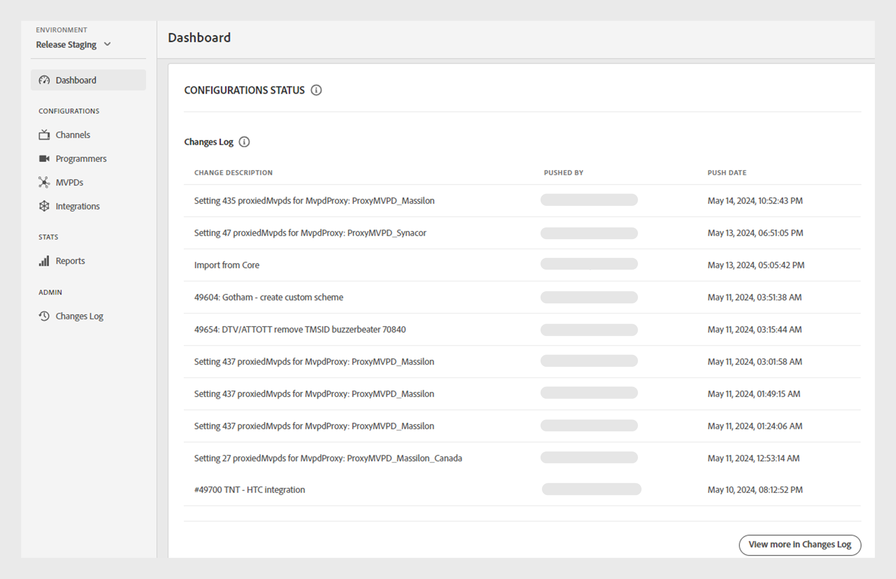

# 儀表板 {#dashboard}

>[!NOTE]
>
>此頁面上的內容僅供參考。 使用此API需要Adobe的目前授權。 不允許未經授權的使用。

左側面板中的&#x200B;**儀表板**&#x200B;區段用作Adobe Pass驗證TVE儀表板的首頁。

首頁上提供兩個區段：

* [歡迎畫面](#welcome-screen)
* [設定狀態](#configuration-status)

## 歡迎畫面 {#welcome}

在此區段中，您可以直接從歡迎訊息存取公開檔案，並檢視目前設定的快照。

* **使用中的整合**：目前環境中使用中的整合數目。 選取&#x200B;**在整合區段**&#x200B;中檢視更多資訊，以存取[整合](tve-dashboard-integrations.md)區段中的詳細資訊。
* **作用中管道**：目前環境中的作用中管道數。 選取&#x200B;**在管道區段**&#x200B;中檢視更多資訊，以存取[管道](tve-dashboard-channels.md)區段中的詳細資訊。
* **資料庫更新**：對目前環境進行的組態變更數目。 選取「變更記錄檔」區段&#x200B;**中的**&#x200B;檢視更多資訊，以存取[變更記錄檔](tve-dashboard-changes-log.md)區段中的詳細資訊。
* **ESM儀表板**：留意即將推出的ESM儀表板，提供目前環境中屬性使用情況的深入量度。 未來的更新將可存取此功能。

*歡迎畫面*

## 設定狀態 {#conf-status}

本節提供10項最新的組態變更，包括：

* **變更說明**：使用者所選取變更的簡短說明。
* **由**&#x200B;推送：負責變更的帳戶。
* **推播日期**：進行變更的日期。

*變更記錄的組態狀態*

若要檢視完整的變更清單，請在右下方的變更記錄檔中選取&#x200B;**檢視更多**&#x200B;以檢視[變更記錄檔](tve-dashboard-changes-log.md)區段。
