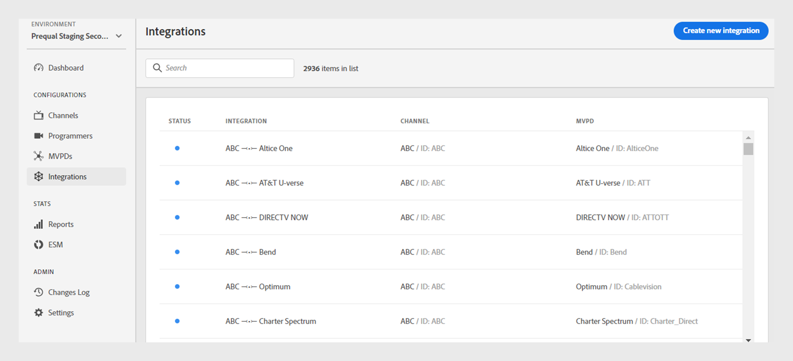
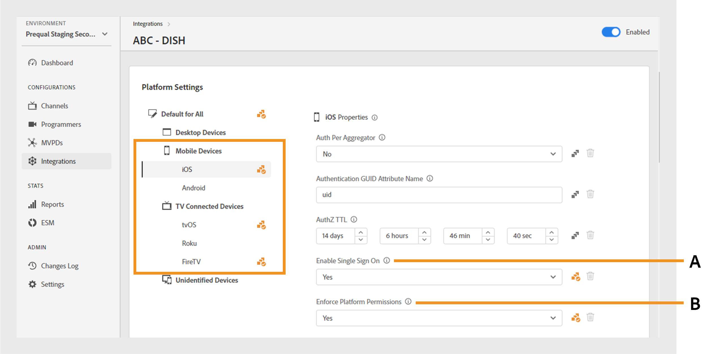
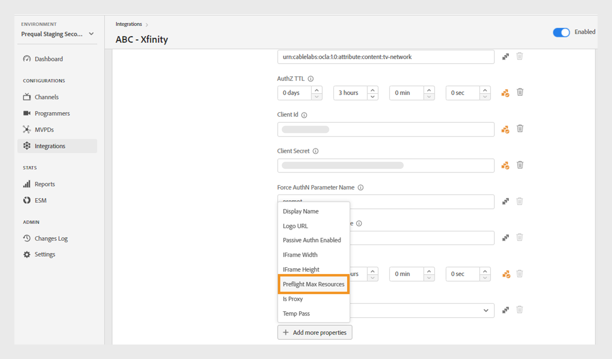
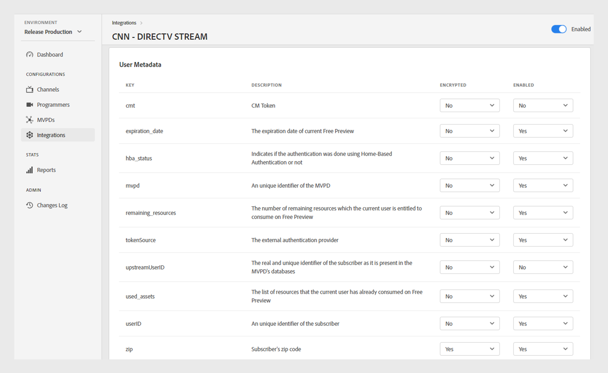
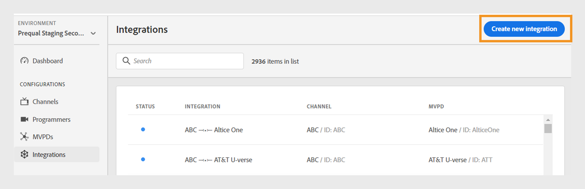
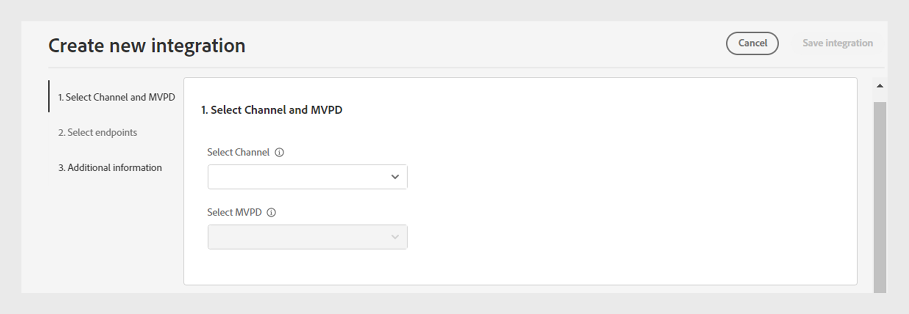
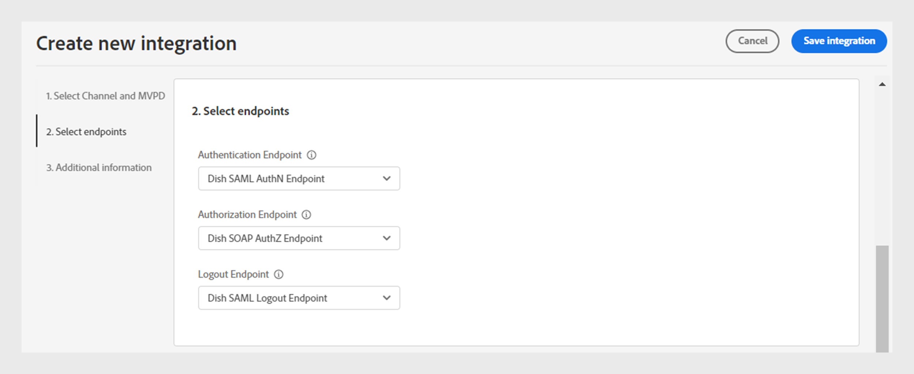
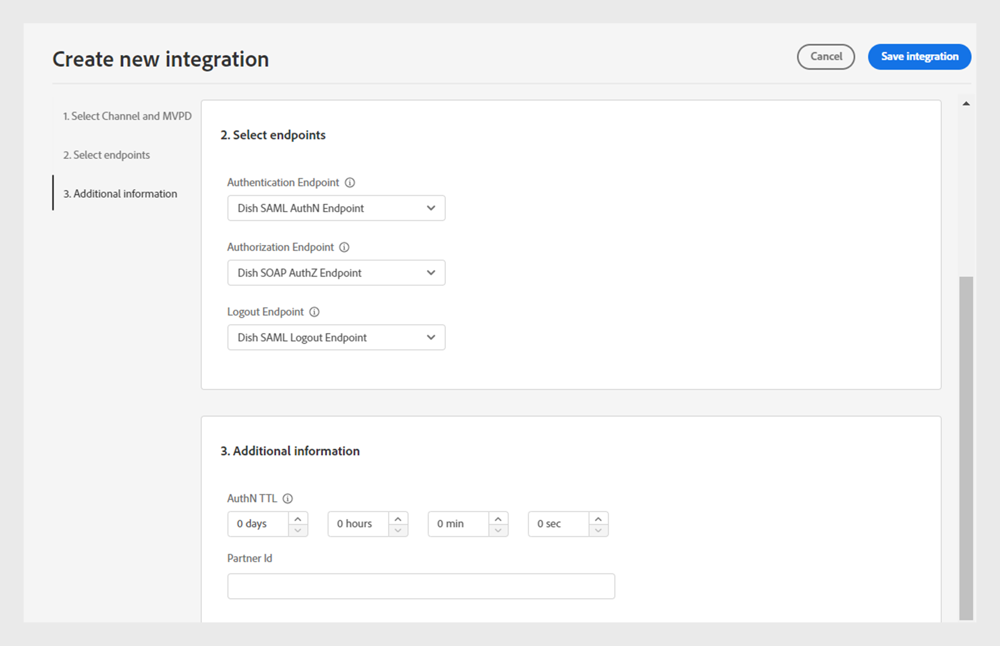

# 整合

>[!NOTE]
>
>此頁面上的內容僅供參考。 使用此API需要Adobe的目前授權。 不允許未經授權的使用。

TVE儀表板的&#x200B;**整合**&#x200B;區段可讓您檢視和管理頻道與MVPD之間整合的設定。 您也可以根據您的需求[建立新的整合](#create-new-integration)。

左側面板中的「**整合**」索引標籤會顯示現有整合的清單，以及下列詳細資料：

* 表示整合目前作用中或非作用中的狀態
* 整合將特定管道與個別MVPD連結
* 具有管道ID的管道名稱
* MVPD顯示名稱和MVPD ID

*現有整合的清單*

在清單上方的&#x200B;**搜尋**&#x200B;列中鍵入頻道或MVPD的名稱，以進一步瞭解整合。

## 管理整合設定 {#manage-integration-conf}

請依照下列步驟管理特定整合。

1. 選取左側面板中的&#x200B;**整合**&#x200B;索引標籤。
1. 從提供的清單中選取整合，以檢視及編輯下列區段中的各種設定：

   * [端點選取](#endpoint-selection)
   * [平台設定](#platform-settings)
   * [使用者中繼資料](#user-metadata)

>[!IMPORTANT]
>
> 檢視[檢閱並推播變更](/help/authentication/user-guide-tve-dashboard/tve-dashboard-review-push-changes.md)，以取得啟用組態變更的詳細資訊。

### 端點選取 {#endpoint-selection}

此段落可讓您從各自的下拉式功能表中選擇用於驗證、授權和登出流程的MVPD端點。

*驗證、授權和登出流程的端點*

>[!NOTE]
>
>MVPD可以為每個流程提供一個或多個端點。 整合新管道時，MVPD必須為每個流程指定其慣用的端點。

>[!IMPORTANT]
>
>端點的任何變更都會影響整合的整體行為。 這些變更只應在收到MVPD的確認後實施。

### 平台設定 {#platform-settings}

此區段可讓您檢視和編輯所有[平台](/help/authentication/user-guide-tve-dashboard/tve-dashboard-reports.md#platforms)的整合設定。 您可以根據個別平台變更這些設定。 例如，您可以調整Android上的授權TTL持續時間，同時維護另一個平台的預設值。

平台設定中的每個屬性都會繼承由MVPD設定的預設值，但可視需要調整。

>[!IMPORTANT]
>
>您必須與MVPD達成協定，才能決定為平台設定中的每個屬性設定的值。

>[!IMPORTANT]
>
> 設定繼承會依循一個鏈結，從MVPD設定（最一般）開始，然後是MVPD端點、整合、平台類別和平台（包含最特定的值）。

**平台設定**&#x200B;可用來覆寫繼承鏈結中每個層級的設定。 鏈中的可用層次分組如下：

* **全部預設**：若未定義特定平台值，則設定適用於所有平台的通用屬性值，無論程式設計師的實施為何。

* **桌上型電腦**：設定適用於所有桌上型電腦和筆記型電腦的屬性值，不論程式設計方式（JS SDK或REST API）為何。

* **行動裝置**：設定適用於所有行動裝置的屬性值，包括&#x200B;**iOS**、**Android**&#x200B;和其他裝置，無論程式設計方式為何（SDK或REST API）。

* **電視連線裝置**：設定適用於所有電視連線裝置的屬性值，包括&#x200B;**tvOS**、**Roku**、**FireTV**&#x200B;和其他裝置，不論其程式設計方式為何（SDK或REST API）。

* **無法識別的裝置**：設定適用於目前機制無法正確識別平台的所有裝置的屬性值。 在這種情況下，請套用MVPD所定義的最嚴格的規則。

  

  *平台及其裝置的類別*

選取 位於每個屬性右側的圖示可探索用於上述每個繼承層級的屬性。

#### 最常使用的業務流程 {#most-used-flows}

**平台設定**&#x200B;區段提供用於不同業務流程中的一系列屬性。 實際屬性可能會因特定整合中所選的MVPD而有所不同。 最常用的流程如下：

跨所有平台的&#x200B;**AuthN TTL和AuthZ TTL**

>[!IMPORTANT]
>
>驗證(AuthN) TTL和授權(AuthZ) TTL值必須一致符合MVPD設定。

請依照下列步驟，針對特定整合變更所有平台的驗證和授權TTL。

1. 選取左側面板中的&#x200B;**整合**&#x200B;索引標籤。

1. 選取您要變更AuthN TTL與AuthZ TTL值的整合。

1. 瀏覽至&#x200B;**平台設定**&#x200B;區段。

1. 在&#x200B;**平台設定**&#x200B;下選取&#x200B;**全部**&#x200B;標籤的預設值。

   >[!NOTE]
   >
   >如果您想要變更平台類別或特定平台的&#x200B;**AuthN TTL**&#x200B;和&#x200B;**AuthZ TTL**&#x200B;持續時間，請選取適當的平台。

   

   *變更所有平台的AuthN TTL AuthZ TTL期間*

   **A.** AuthN TTL屬性&#x200B;**B.** AuthZ TTL屬性

1. 在&#x200B;**AuthN TTL**&#x200B;和&#x200B;**AuthZ TTL**&#x200B;屬性中，選取向上和向下箭頭以調整天數、小時數、分鐘數和秒數的持續時間。

所有平台上的&#x200B;**AuthN TTL**&#x200B;和&#x200B;**AuthZ TTL**&#x200B;的期間僅會在[檢閱和推送變更](/help/authentication/user-guide-tve-dashboard/tve-dashboard-review-push-changes.md)之後更新。

**啟用平台SSO**

>[!IMPORTANT]
>
>**在&#x200B;*iOS、tvOS、Roku和FireTV*平台上僅支援**&#x200B;啟用單一登入。 此變數僅適用於與支援這些平台之單一登入的MVPD整合。

請依照下列步驟，為特定整合和平台啟用或停用SSO。

1. 選取左側面板中的&#x200B;**整合**&#x200B;索引標籤。

1. 選取您要啟用或停用單一登入的整合。

1. 瀏覽至&#x200B;**平台設定**&#x200B;區段。

1. 選取您要在&#x200B;**平台設定**&#x200B;下啟用單一登入的特定平台或平台類別。

   

   *啟用特定平台的單一登入*

   **A.**&#x200B;單一登入屬性&#x200B;**B.**&#x200B;強制平台許可權屬性

1. 從&#x200B;**啟用單一登入**&#x200B;下拉式功能表中選取&#x200B;**是**&#x200B;以啟用，或選取&#x200B;**否**&#x200B;以停用。

1. 從&#x200B;**強制平台許可權**&#x200B;下拉式功能表中選取&#x200B;**是**&#x200B;以啟用，或選取&#x200B;**否**&#x200B;以停用。

   **強制平台許可權**&#x200B;屬性控制是否遵循使用者對其電視提供者訂閱的&#x200B;**允許**&#x200B;或&#x200B;**拒絕**&#x200B;平台存取的決定。

   例如，如果同時啟用&#x200B;**啟用單一登入**&#x200B;和&#x200B;**強制平台許可權**，且使用者選擇拒絕平台存取其電視提供者訂閱，則個別應用程式（頻道）將無法使用其他應用程式（頻道）所取得的Adobe Pass驗證權杖。

選取平台的&#x200B;**單一登入**&#x200B;屬性只有在[檢閱並推播變更](/help/authentication/user-guide-tve-dashboard/tve-dashboard-review-push-changes.md)之後才會啟用或停用。

**啟用以住家為基礎的驗證**

請依照下列步驟，啟用或停用以OAuth2為基礎的MVPD之家用驗證。

1. 選取左側面板中的&#x200B;**整合**&#x200B;索引標籤。

1. 選取您要啟用或停用以住家為基礎的驗證的整合。

1. 瀏覽至&#x200B;**平台設定**&#x200B;區段。

1. 選取您要在&#x200B;**平台設定**&#x200B;下啟用家用驗證的特定平台或平台類別。

   

   *啟用特定平台的家用驗證*

   **A.**&#x200B;嘗試HBA屬性&#x200B;**B.** HBA AuthN TTL屬性

1. 從&#x200B;**嘗試HBA**&#x200B;下拉式功能表中選取&#x200B;**是**&#x200B;以啟用，並選取&#x200B;**否**&#x200B;以停用。

>[!IMPORTANT]
>
>應避免變更&#x200B;**HBA AuthN TTL**&#x200B;屬性的持續時間。 這可能會導致授權程式中發生未預期的失敗。

只有在[檢閱和推送變更](/help/authentication/user-guide-tve-dashboard/tve-dashboard-review-push-changes.md)之後，才會啟用或停用特定MVPD的&#x200B;**嘗試HBA**&#x200B;屬性。

#### 新增更多屬性 {#add-more-properties}

**新增更多屬性**&#x200B;可讓彈性包含其他整合的特定屬性，尤其是較不常見的流程。

您可以新增這些屬性：

* 針對所有平台，選取左側全部&#x200B;**標籤的**&#x200B;預設。
* 若為平台的類別，請選取左側的&#x200B;**案頭裝置**、**行動裝置**&#x200B;或&#x200B;**電視連線裝置**&#x200B;索引標籤。
* 針對特定裝置，選取左側的&#x200B;**iOS**、**Android**、**tvOS**、**Roku**&#x200B;或&#x200B;**FireTV**&#x200B;索引標籤。

以下是透過新增這些屬性可以啟用的不同流程範例：

**變更預先授權資源的數量**

根據預設，大部分的MVPD支援最多使用5個資源ID的預檢authZ呼叫。
不過，如果MVPD同意提高此限制，您可以瀏覽至&#x200B;**新增更多屬性**，並從選項功能表中選取&#x200B;**預檢最大資源**。

**預檢最大資源**&#x200B;將新增一個屬性，可以指定與MVPD的議定限制。

*新增預檢最大資源屬性*

**預檢最大資源**&#x200B;屬性只有在[檢閱並推播變更](/help/authentication/user-guide-tve-dashboard/tve-dashboard-review-push-changes.md)之後才會新增。

**變更MVPD顯示名稱或標誌URL**

對於不想建置其MVPD選擇器而依賴提供的設定的程式設計師應用程式，您可以瀏覽至&#x200B;**新增更多屬性**，並選取&#x200B;**顯示名稱**&#x200B;或&#x200B;**標誌URL**，以從選項功能表為每個MVPD新增必要的顯示名稱或標誌URL。

這些屬性的不同值可用於相同的MVPD，具體取決於裝置平台和所需的使用者體驗。

*新增顯示名稱或標誌URL屬性*

**顯示名稱**&#x200B;或&#x200B;**標誌URL**&#x200B;屬性只有在[檢閱和推播變更](/help/authentication/user-guide-tve-dashboard/tve-dashboard-review-push-changes.md)之後才會新增。

**在應用程式（頻道）切換時要求新的驗證流程**

如果您想要在使用者切換應用程式時強制進行新驗證。 在這種情況下，您可以導覽至&#x200B;**新增更多屬性**，選取&#x200B;**每個彙總器的驗證**&#x200B;屬性。

為每個彙總器&#x200B;**新增**&#x200B;驗證，有效地中斷個別頻道的單一登入。

*為每個彙總屬性新增驗證*

[檢閱並推播變更](/help/authentication/user-guide-tve-dashboard/tve-dashboard-review-push-changes.md)之後，才會新增每個彙總的&#x200B;**驗證**&#x200B;屬性。

新增後，選取&#x200B;**是**&#x200B;以啟用選取之整合的每個彙總器&#x200B;**的**&#x200B;驗證。

#### 刪除屬性 {#delete-properties}

選取 位於每個屬性右側的圖示可刪除不再需要的屬性。

>[!NOTE]
>
>無法移除某些屬性，因為它們是所選MVPD的必要需求。

只有在[檢閱並推播變更](/help/authentication/user-guide-tve-dashboard/tve-dashboard-review-push-changes.md)之後，屬性才會從&#x200B;**平台設定**&#x200B;區段中刪除。

### 使用者中繼資料 {#user-metadata}

此區段可讓您更新MVPD共用的每個使用者中繼資料引數的設定。

>[!NOTE]
>
>每個MVPD可以共用不同的引數。 如需特定MVPD可共用引數的詳細資訊，請洽詢您的Adobe代表。

使用者中繼資料段落會顯示下列資料欄：

**Key**：代表要在API中用於擷取值的實際使用者中繼資料引數。

**描述**：提供每個使用者中繼資料引數的簡短描述。

**Encrypted**：此資料行可讓您分別從下拉式功能表中選取&#x200B;**是**&#x200B;或&#x200B;**否**，來啟用或停用API中的引數。 選擇&#x200B;**是**&#x200B;表示引數值將在API中加密。 使用&#x200B;**使用者中繼資料**&#x200B;範圍所定義的憑證來執行加密。

>[!TIP]
>
>
> 請一律確定&#x200B;**ZIP**&#x200B;引數已加密。

深入瞭解[程式設計人員](/help/authentication/user-guide-tve-dashboard/tve-dashboard-programmers.md#available-certificates)和[管道](/help/authentication/user-guide-tve-dashboard/tve-dashboard-channels.md#available-certificates)區段中可用的憑證。

**已啟用**：此資料行可讓您從下拉式功能表中分別選取&#x200B;**是**&#x200B;或&#x200B;**否**，來啟用或停用API中的引數。

*可用於使用者中繼資料的引數*

## 建立新整合 {#create-new-integration}

若要在目前的設定中建立與新MVPD的新整合，請遵循下列步驟：

1. 選取左側面板中的&#x200B;**整合**&#x200B;索引標籤。

1. 選取&#x200B;**整合**&#x200B;區段右上角的&#x200B;**建立新整合**。

   

   *建立新的整合*

   下列區段隨即顯示：

   **選取頻道和MVPD**

   從&#x200B;**選取頻道**&#x200B;下拉式選單中選取&#x200B;**頻道**&#x200B;以新增整合。 選取頻道之後，從&#x200B;**選取MVPD**&#x200B;下拉式選單中選取所需的&#x200B;**MVPD**，以便與選取的頻道整合。

   

   *選取頻道和MVPD*

   **選取端點**

   選取必要的MVPD之後，**選取端點**&#x200B;區段將會預先填入為該特定MVPD設定的預設端點。

   >[!IMPORTANT]
   >
   >除非MVPD特別指示，否則請勿變更任何流程中的預設端點。

   

   *選取端點*

   **其他資訊**

   此區段包含需要在&#x200B;**選取通道和MVPD**&#x200B;區段中針對所選MVPD設定的各種屬性。

   >[!NOTE]
   >
   > 實際內容可能會因&#x200B;**選取通道和MVPD**&#x200B;區段中選取的MVPD而有所不同。

   例如，您可以在下列影像的MVPD登入頁面上編輯&#x200B;**AuthN TTL**&#x200B;或&#x200B;**合作夥伴ID** （管道ID）以用於品牌結合用途。

   

   *編輯其他資訊*

   選取&#x200B;**建立新整合**&#x200B;區段右上角的&#x200B;**儲存整合**。

[檢閱並推播變更](/help/authentication/user-guide-tve-dashboard/tve-dashboard-review-push-changes.md)後，才會建立新的整合。

## 停用整合 {#disable-integration}

若要停用整合，請執行下列步驟：

1. 選取左側面板中的&#x200B;**整合**&#x200B;索引標籤。

1. 選取要停用的整合。

1. 停用所選整合右上角的切換。

   

   *停用整合*

整合只有在[檢閱並推送變更](/help/authentication/user-guide-tve-dashboard/tve-dashboard-review-push-changes.md)之後才會停用。

整合停用後，一般使用者將無法使用特定MVPD進行驗證或授權。
