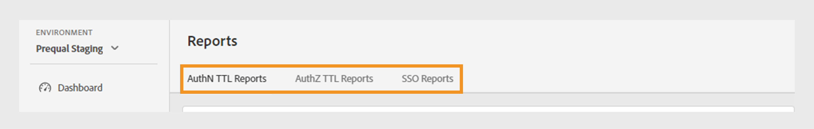
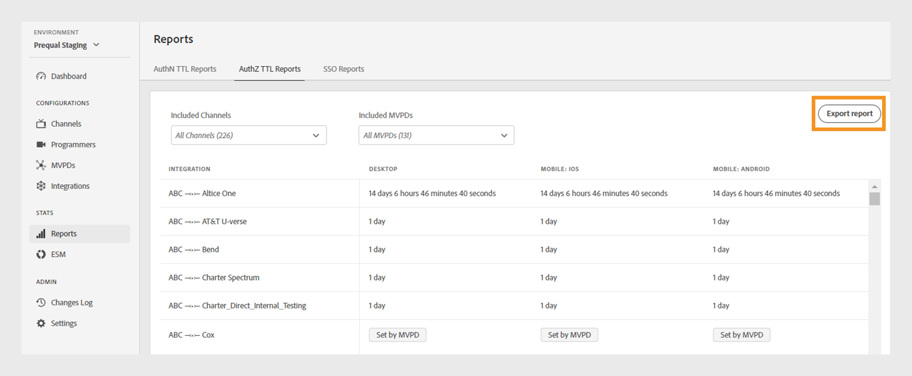
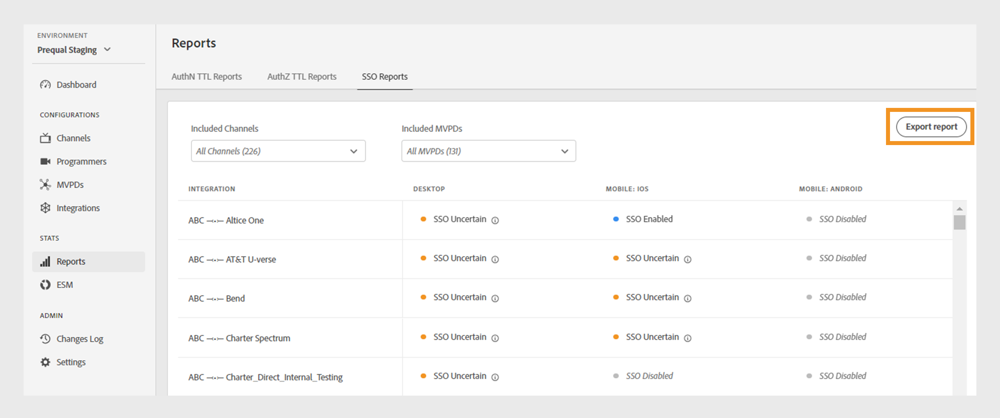

# 報表 {#Reports}

>[!NOTE]
>
>此頁面上的內容僅供參考。 使用此API需要Adobe的目前授權。 不允許未經授權的使用。

TVE儀表板的&#x200B;**報表**&#x200B;區段可讓您存取AuthN TTL、AuthZ TTL和SSO報表的彙總資料。 這些報告包含所有[平台](#platforms)上不同MVPD的頻道整合。

報表可讓您篩選資料，以及收集[特定管道或MVPD](#selecting-specific-channels-mvpds)的深入分析。 您也可以將報表匯出為CSV檔案，以供進一步分析。

## 檢視報表 {#view-reports}

請依照下列步驟檢視特定報告。

1. 選取左側面板中的&#x200B;**報表**&#x200B;索引標籤。
1. 選取下列其中一個索引標籤，以檢視及匯出包含之管道和MVPD的彙總資料：
   * [驗證TTL報表](#authn-ttl-reports)
   * [AuthZ TTL報表](#authz-ttl-reports)
   * [SSO報告](#sso-reports)

   

   *報告型別*

### 驗證TTL報表 {#authn-ttl-reports}

AuthN TTL報告(也稱為驗證存留時間(TTL))會顯示您的管道與所有[平台](#platforms)上各種MVPD的整合所設定的驗證權杖持續時間。 這些報表可讓您檢查使用者針對特定MVPD和平台保持驗證的時間長度。 持續時間值以方便使用的格式顯示，例如&#x200B;**天**、**小時**、**分鐘**&#x200B;和&#x200B;**秒**。 AuthN TTL報表表格具有水平與垂直捲動功能，以因應不同的熒幕大小。

您也可以檢視及下載[特定頻道或MVPD](#selecting-specific-channels-mvpds)的資料。

*匯出AuthN TTL報告*

>[!IMPORTANT]
>
> 當MVPD強制使用AuthN TTL值(而非Adobe Pass驗證設定)時，會使用MVPD設定的&#x200B;**預留位置**。

選取「**匯出報表**」，將資料儲存為本機電腦上的CSV檔案。

### AuthZ TTL報表 {#authz-ttl-reports}

AuthZ TTL報告(也稱為「授權存留時間(TTL)」)會顯示針對所有[平台](#platforms)上各種MVPD與您的管道整合所設定的授權權杖持續時間。 這些報表可讓您檢查使用者保持獲授權觀看特定MVPD和平台內容的時間長度。 持續時間值以方便使用的格式顯示，例如&#x200B;**天**、**小時**、**分鐘**&#x200B;和&#x200B;**秒**。 AuthZ TTL報表表格具有水平與垂直捲動功能，以因應不同的熒幕大小。

您也可以檢視及下載[特定頻道或MVPD](#selecting-specific-channels-mvpds)的資料。

*匯出AuthZ TTL報告*

>[!IMPORTANT]
>
> 當MVPD強制執行AuthZ TTL值(而非Adobe Pass驗證設定)時，會使用MVPD設定的&#x200B;**預留位置**。

選取「**匯出報表**」，將資料儲存為本機電腦上的CSV檔案。

### SSO報告 {#sso-reports}

SSO報表（也稱為單一登入）會顯示針對所有[平台](#platforms)上各種MVPD與通路整合所設定的單一登入狀態。 這些報告可讓您檢查特定MVPD和平台的預期使用者驗證SSO體驗。 值以使用者易記的格式顯示，例如&#x200B;**SSO已停用**、**SSO已啟用**&#x200B;和&#x200B;**SSO不確定**。 「SSO報告」表格具有水平與垂直捲動功能，以因應不同的熒幕大小。

您也可以檢視及下載[特定頻道或MVPD](#selecting-specific-channels-mvpds)的資料。

*匯出SSO報告*

>[!IMPORTANT]
>
> **SSO不確定**&#x200B;預留位置指出單一登入(SSO)已啟用，而且可能運作中。 但是，下列設定可能會禁止SSO驗證，如下列範例所述：
>
> * 使用者平台設定：封鎖第三方Cookie的選項。
> * 使用者決策：使用者拒絕平台存取其電視提供者訂閱。
> * MVPD設定： MVPD要求每個通道的驗證。

選取「**匯出報表**」，將資料儲存為本機電腦上的CSV檔案。

## 平台 {#platforms}

[AuthN TTL報告](#authn-ttl-reports)、[AuthZ TTL報告](#authz-ttl-reports)和[SSO報告](#sso-reports)呈現各種平台的資料，例如：

* **案頭**：顯示透過Adobe Pass Authentication JavaScript SDK套用至程式設計師實作的值。

* **行動裝置**

  **iOS**：顯示使用Adobe Pass驗證iOS SDK套用的值。

  **Android**：顯示透過Adobe Pass驗證Android SDK套用的值。

  **其他**：顯示使用為行動裝置開發的Adobe Pass Authentication REST API套用的值。

* **TVCD**

  **Roku**：顯示透過Adobe Pass Authentication REST API套用的值，將Roku識別為裝置型別。

  **FireTV**：顯示透過Adobe Pass Authentication FireTV SDK套用的值。

  **AppleTV**：顯示透過Adobe Pass Authentication tvOS SDK套用的值。

  **其他**：顯示電視連線裝置使用Adobe Pass Authentication REST API套用的值。

* **平台未識別**：當Adobe Pass驗證服務偵測到未知的裝置型別時，顯示套用至程式設計工具實作的值。

若要進一步瞭解如何與Adobe Pass Authentication REST API或SDK共用所需的裝置型別（例如&#x200B;**Roku**），請檢視[傳遞使用者端資訊](/help/authentication/integration-guide-programmers/passing-client-information-device-connection-and-application.md)的機制。

>[!IMPORTANT]
>
> 彙總的資料會根據每個Adobe Pass驗證環境的特定設定。 在不同的TVE控制面板環境之間切換時，報表中的資料會發生差異。 如需詳細資訊，請參閱[Adobe Pass驗證環境](/help/authentication/user-guide-tve-dashboard/tve-dashboard-environments.md)。

## 選取特定通道和MVPD {#selecting-specific-channels-mvpds}

[AuthN TTL報告](#authn-ttl-reports)、[AuthZ TTL報告](#authz-ttl-reports)和[SSO報告](#sso-reports)預設會提供&#x200B;**所有管道**&#x200B;與&#x200B;**所有MVPD**&#x200B;整合的資料。

>[!NOTE]
>
> 如果您取消選取個別下拉式功能表中的&#x200B;**所有頻道**&#x200B;或&#x200B;**所有MVPD**，系統會顯示訊息，讓您選擇檢視有意義的報告。

若要產生特定管道的報告：

1. 選取所選報告頂端的&#x200B;**包含的管道**&#x200B;下拉式功能表。

   

   *包含管道下拉式功能表*

1. 取消選取&#x200B;**所有頻道**。

1. 從您要產生資料的&#x200B;**包含管道**&#x200B;下拉式功能表中選取必要的管道。

>[!NOTE]
>
> 若要在&#x200B;**包含的MVPD**&#x200B;下拉式功能表中取得可用選項，您必須在&#x200B;**包含的管道**&#x200B;下拉式功能表中至少選取一個管道。

若要產生特定MVPD的報告：

1. 選取所選報告頂端的&#x200B;**包含的MVPD**&#x200B;下拉式功能表。

   

   *包含的MVPD下拉式功能表*

1. 取消選取&#x200B;**所有MVPD**。

1. 從您要產生資料的&#x200B;**包含的MVPD**&#x200B;下拉式功能表中選取必要的MVPD。
