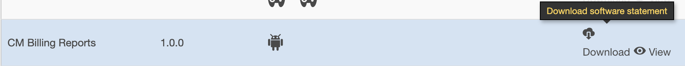
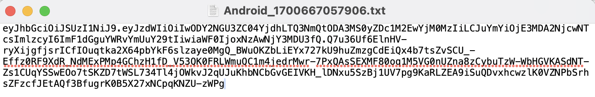
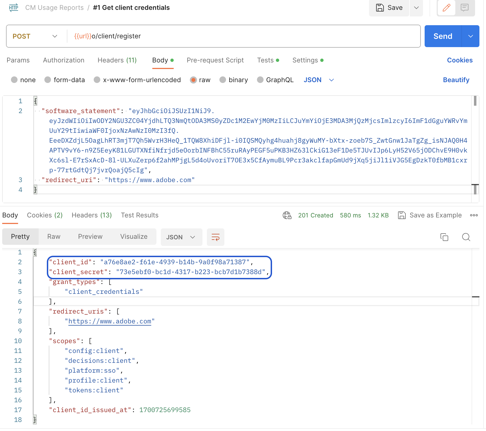
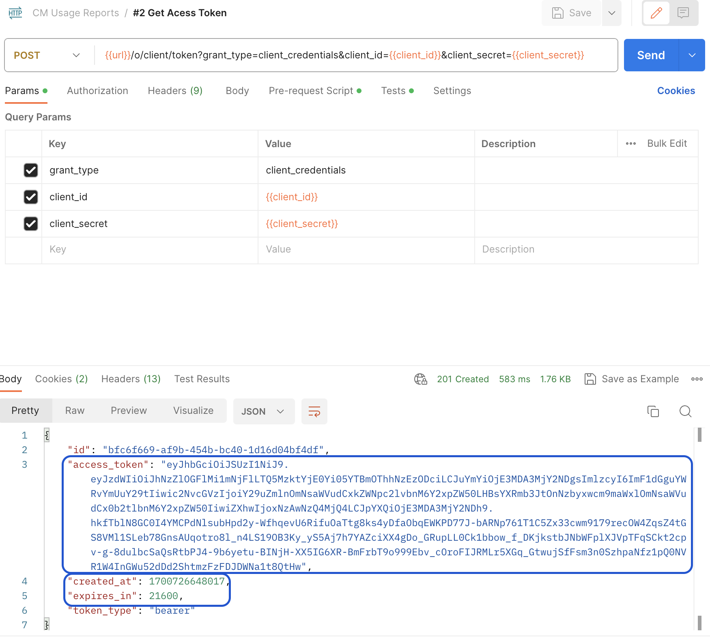
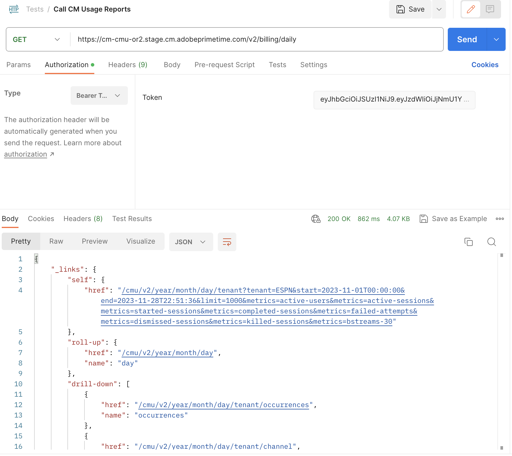

# 並行監視使用情況API存取 {#cmu-api-usage-access}

>[!NOTE]
>
>此頁面上的內容僅供參考。 使用此API需要Adobe的目前授權。 不允許未經授權的使用。 如需瞭解可用性問題，請聯絡您的Adobe代表。

## 存取程式概觀 {#api-access-procedure-overview}

我們已更新CMU報表存取權，使其與OAuth 2.0動態使用者端註冊通訊協定相容。 自訂OAuth 2.0授權伺服器已部署，以因應並行監視應用程式的需求。 \
為了讓使用者端應用程式能夠利用OAuth 2.0授權，伺服器必須動態註冊以取得特定資訊（使用者端憑證），才能與其互動。 在註冊程式中，使用者端必須向使用者端註冊端點提供一組內建的中繼資料。
此中繼資料以軟體陳述式傳達，其中包含「software_id」，可讓我們的授權伺服器使用相同的軟體陳述式來關聯應用程式的不同執行個體。
軟體陳述式是JSON Web權杖(JWT)，會以套件形式宣告有關使用者端軟體的中繼資料值。 當作為使用者端註冊請求的一部分呈報給授權伺服器時，軟體陳述式必須使用JSON Web簽名(JWS)進行數位簽署或MAC編輯。 \
您可以在官方檔案<a href="https://datatracker.ietf.org/doc/html/rfc7591" target="_blank">[RFC7591]</a>中找到軟體陳述式及其運作方式的詳細說明。
請依照下列各節中的步驟操作以取得存取權。

## 存取程式步驟 {#access-procedure-steps}

1. 在Adobe Pass DCR伺服器中擁有註冊的應用程式。 如需此步驟，請連絡我們的[支援團隊](mailto:tve-support@adobe.com)。
2. 取得軟體宣告
   1. 前往TVE儀表板<a href="https://console-preprod.auth.adobe.com/#!/" target="_blank">生產前</a>或<a href="https://console.auth.adobe.com/" target="_blank">生產</a>
   2. 選取程式設計師
   3. 前往應用程式標籤
   4. 選取應用程式
   5. 按一下DownLoad Software Statement以取得與下列擷取類似的檔案
      <figure>
          
       </figure>
      <figure>
          
       </figure>

3. 取得存取權杖
   1. 使用上述軟體陳述式並執行以下呼叫，取得使用者端憑證。 如此將可取得client_id - client_secret配對，藉以取得存取權杖。
      *不應每次都執行此步驟。 應該只在認證過期時再執行一次。*
      <figure>
          
       </figure>

   2. 使用以下呼叫取得存取Token。 使用此存取Token來呼叫任何CMU API，直到Token過期。
      *只有在最後產生的Token過期時，才應執行此步驟。*
      <figure>
          
       </figure>

4. 呼叫CMU API — 請參閱以下相關資訊。
   <figure>
          
       </figure>

## 相關資訊 {#related-information}

* [CMU概述](/help/concurrency-monitoring/cm-usage-reports.md)
* [CMU API](/help/concurrency-monitoring/cmu-api.md)
