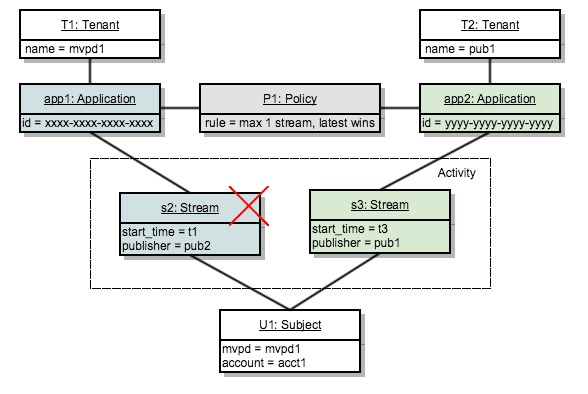

# 原則決定點 {#policy-desc-pt}

## 網域模型 {#domain-model}

本頁旨在作為不同使用案例和原則實施的參考。 我們建議您也參閱檔案中的[字彙表](/help/concurrency-monitoring/cm-glossary.md)部分以取得字詞定義。

**租使用者**&#x200B;擁有它想要強制執行&#x200B;**原則**&#x200B;的&#x200B;**應用程式**。 **使用者端應用程式**&#x200B;必須設定為&#x200B;**應用程式識別碼** (由Adobe提供)。

租使用者接著會將每個應用程式與一個或多個原則建立關聯，這些原則可能是由他建立或由其他人建立和共用。 原則可以在多個租使用者之間連結。

**主旨活動**&#x200B;包含向特定主旨的並行監視報告的所有資料流（無論應用程式為何）。

當要針對特定主題授權資料流時，系統將首先檢查為建立資料流的應用程式定義的所有原則。

然後，我們需要針對每個適用原則，收集所有將傳遞至規則的&#x200B;**相關活動**。 原則P的&#x200B;**相關活動**&#x200B;只有在符合下列條件時，才會包含資料流S：

**資料流「S」是由包含原則「P」的應用程式啟動。**

## 試執行使用案例 {#dry-run-use-cases}

以下逐步說明旨在根據某些使用案例來驗證模型。 我們將從基本設定開始，以各種方式增加複雜性，逐步做到這一點。

### 1.一個租使用者。 一個應用程式。 一個原則。 一個資料流 {#onetenant-oneapp-onepolicy-onestream}

我們將從單一租使用者開始，透過單一應用程式和單一關聯原則。 我們假設原則宣告，任何使用者最多只能有一個使用中資料流（允許播放最新資料流）。

串流開始後，活動將僅包含該串流且允許播放。

### 2.一個租使用者。 一個應用程式。 一個原則。 兩個串流。 {#onetenant-oneapp-onepolicy-twostreams}

啟動第二個資料流後（由相同主體使用相同應用程式），用於驗證的活動將同時包含&#x200B;**s1**&#x200B;和&#x200B;**s2**。

超過限制，因為原則指出只允許播放一個資料流，所以我們將只允許播放最新的資料流(**s2**)。

>[!NOTE]
>
>這些圖表代表使用者活動的系統檢視。 對於串流初始化嘗試，存取決定將包含在回應中。 對於作用中資料流，將會在心率回應上傳回決定。

### 3.兩個租戶。 兩個應用程式。 一個原則。 兩個串流。 {#twotenant-twoapp-onepolicy-twostreams}

現在，假設新租使用者想要在其應用程式中強制實施相同原則：

由於兩個租使用者由相同原則連結，因此使用案例2中說明的情況適用於此處，並且允許&#x200B;**s3**&#x200B;播放，因為它是最新的資料流。

### 4.兩個租戶。 三個應用程式。 兩個原則。 兩個串流。 {#twotenants-threeapps-twopolicies-twostreams}

現在，假設第二個租使用者部署新的應用程式，並且想要定義將在&#x200B;**app2**&#x200B;和&#x200B;**app3**&#x200B;之間共用的新原則。

此時，允許使用中的資料流&#x200B;**s3**&#x200B;和&#x200B;**s4**。 針對&#x200B;**s3**，評估原則&#x200B;**P1**&#x200B;時，系統只會將&#x200B;**s3**&#x200B;計為&#x200B;**相關活動** （**s4**&#x200B;與原則&#x200B;**P1**&#x200B;沒有任何關係），因此沒有違規。

原則&#x200B;**P2**&#x200B;已套用至兩個資料流，而且它將同時包含&#x200B;**s3**&#x200B;和&#x200B;**s4**&#x200B;做為相關活動。 由於此活動在兩個資料流的界限內，因此允許兩個資料流。

### 5.兩個租戶。 三個應用程式。 兩個原則。 三個串流。 {#twotenants-threeapps-twopolicies-threestreams}

假設使用&#x200B;**app2**&#x200B;執行新的資料流初始化嘗試：

**s5**&#x200B;可由&#x200B;**P1**&#x200B;啟動（允許較新的資料流接管），但遭到&#x200B;**P2**&#x200B;拒絕，因此不會啟動。

如果嘗試使用app3初始化資料流，也會發生相同情況：相同原則P2會拒絕其存取。

現在，讓我們看看如果使用者嘗試使用app1建立新串流會發生什麼情況：

應用程式app1與原則&#x200B;**P2**&#x200B;沒有任何關係，所以它只會套用原則&#x200B;**P1**：允許新資料流啟動並拒絕舊資料流（在此案例中為&#x200B;**s3**）。
