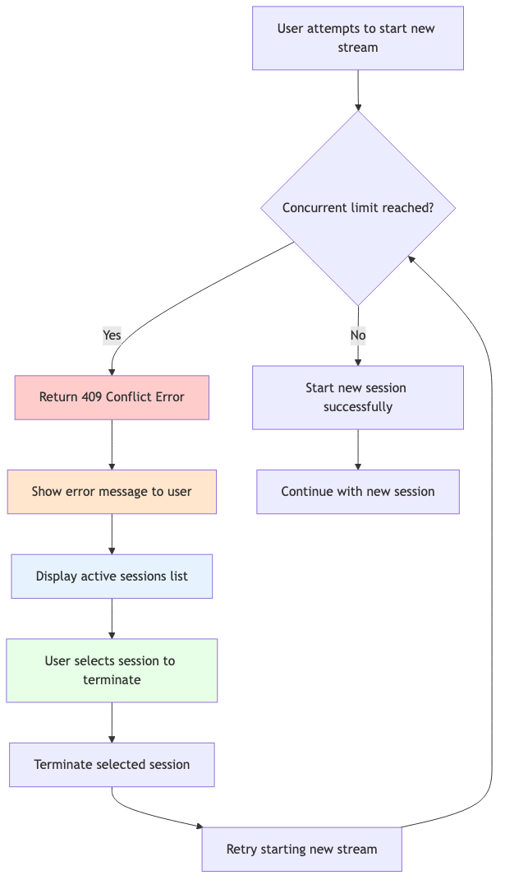
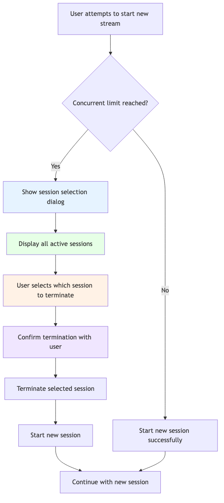

# LIFO與FIFO策略 {#lifo-fifo-strategies}

實作並行監視時，當達到使用量限制時，您必須選擇兩種處理衝突的基本策略： **LIFO (Last In， First Out)**&#x200B;或&#x200B;**FIFO (First In， First Out)**。 瞭解這些策略對於設計正確的使用者體驗和實施適當的錯誤處理至關重要。

## 並行監視工作階段策略 {#concurrency-monitoring-session-strategies}

LIFO和FIFO都是以電腦科學的&#x200B;**棧疊理論**&#x200B;為基礎：

### 後進先出 — 棧疊行為

在並行監視中：
- **較舊的工作階段受到較新工作階段的保護**
- **達到限制時封鎖新工作階段**
- **使用者必須手動終止現有工作階段，才能啟動新工作階段**

### FIFO （先進先出） — 佇列行為

在並行監視中：
- 當達到限制時，**新工作階段可以終止舊的工作階段**
- **最近的資料流可以「啟動」較舊的資料流**
- **使用者可以透過取代正在觀看的內容來開始新內容**

## 後進位策略 {#lifo-strategy}

### LIFO的運作方式

在後進位模式中，當使用者嘗試啟動新串流並點選並行限制時：

1. **新工作階段已封鎖**，回應為409衝突
2. **現有工作階段保持未接觸狀態**
3. **使用者必須手動終止**&#x200B;現有工作階段才能繼續

### 後進位流程圖

*圖：後進先出(LIFO，Last In， First Out)策略流程 — 達到限制時會封鎖新的工作階段，需要手動終止現有工作階段。*

### 何時使用LIFO

**使用LIFO，時間：**
- **使用者希望他們目前的內容受到保護**&#x200B;不受干擾
- **您想要鼓勵有關內容轉換的明智決策**
- **您的應用程式解決衝突的UI複雜度有限**
- **使用者通常會觀看延長時間的內容**

**範例：**
- 使用者觀看完整內容的電影串流服務
- 中斷造成中斷的教育內容平台
- 具有簡單UI的應用程式無法處理複雜的工作階段選擇

## 先進先出策略 {#fifo-strategy}

### FIFO的運作方式

在FIFO模式中，當使用者嘗試啟動新串流並點選並行限制時：

1. **新工作階段已允許**&#x200B;開始
2. **最舊的工作階段會自動終止** （或使用者選擇要終止的工作階段）
3. **使用者繼續新內容**

### FIFO流程圖

*圖： FIFO （先進、先出）策略流程 — 新工作階段可以透過使用者選擇終止現有工作階段來開始。*

### 何時使用FIFO

**使用FIFO，時間：**
- **使用者經常在內容之間切換** （頻道衝浪、瀏覽）
- **您想要將使用者目前的意圖**&#x200B;優先於過去的活動
- **當衝突發生時，您的UI可以處理工作階段選擇**
- **即使達到限制，使用者仍希望能夠啟動新內容**

**範例：**
- 使用者經常切換頻道的即時電視應用程式
- 使用者瀏覽和預覽內容的內容探索應用程式
- 使用者希望立即回應的行動應用程式

### FIFO使用者體驗

在FIFO模式中發生衝突時：

1. **顯示所有使用中工作階段的對話方塊**
2. **允許使用者選取要終止的工作階段**
3. **提供工作階段詳細資料** （裝置、內容、持續時間）
4. **繼續之前，請先確認動作**
5. **終止後開始新的工作階段**

## 主要差異摘要 {#key-differences-summary}

| 外觀 | FIFO | 後進先出 |
|-------------------------------|-----------------------------------------|-------------------------------|
| **衝突解決** | 自動終止最舊的工作階段 | 需要手動終止 |
| **錯誤處理** | 不需要處理409回應 | 必須處理409個回應 |
| **使用者體驗** | UI較複雜，但流程較順暢 | 更簡單的UI，但更多摩擦 |
| **實作複雜性** | 較高（工作階段選擇UI） | 下限（簡單錯誤訊息） |
| **使用案例** | 內容切換、探索 | 延伸檢視、保護 |

## 最佳實務 {#best-practices}

### 針對LIFO實施

1. **顯示清楚的錯誤訊息**&#x200B;說明限制
2. **提供工作階段管理的簡易存取權**
3. **顯示作用中工作階段**&#x200B;以供使用者參考
4. **在您的應用程式設定中實作工作階段終止**
5. **請考慮在衝突發生之前顯示使用量指示器**

### 針對FIFO實作

1. 發生衝突時，**一律提供工作階段選擇UI**
2. **顯示有意義的工作階段詳細資料** （裝置、內容、持續時間）
3. **實作確認對話方塊**&#x200B;以防止意外終止
4. **處理終止失敗的邊緣案例**
5. **提供清楚的意見反應**

## 選擇策略 {#choosing-your-strategy}

在後進先出與先進先出之間進行選擇時，請考量下列因素：

1. **使用者行為模式** — 使用者通常如何與您的內容互動？
2. **內容型別** — 直播電視與電影vs.教育內容
3. **UI複雜性** — 您的應用程式可以處理複雜的工作階段選擇嗎？
4. **使用者期望** — 使用者希望能夠輕鬆切換內容嗎？
5. **業務需求** — 您是否需要保護某些檢視型別？
